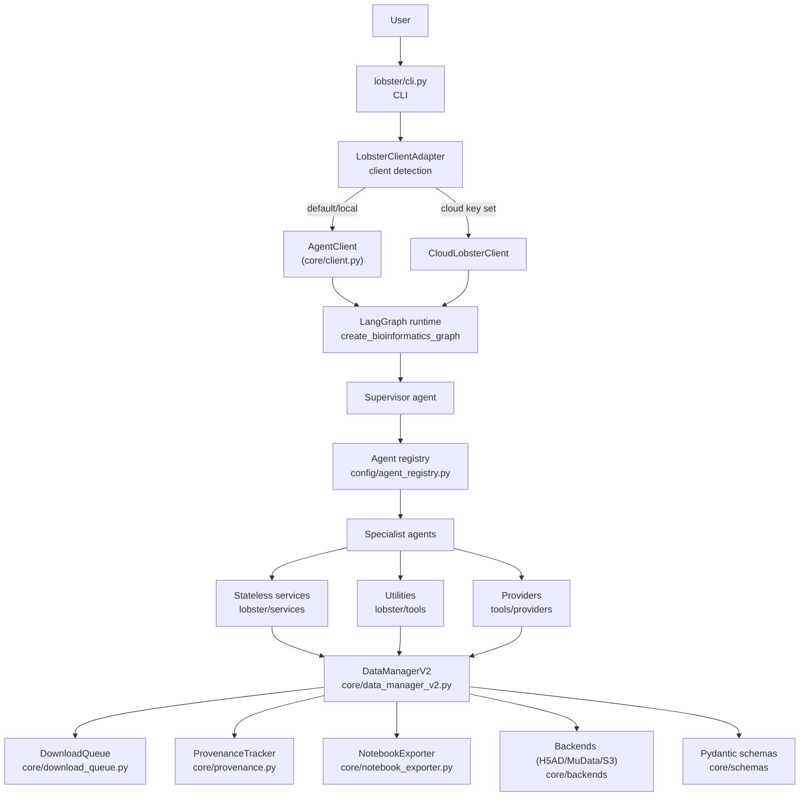
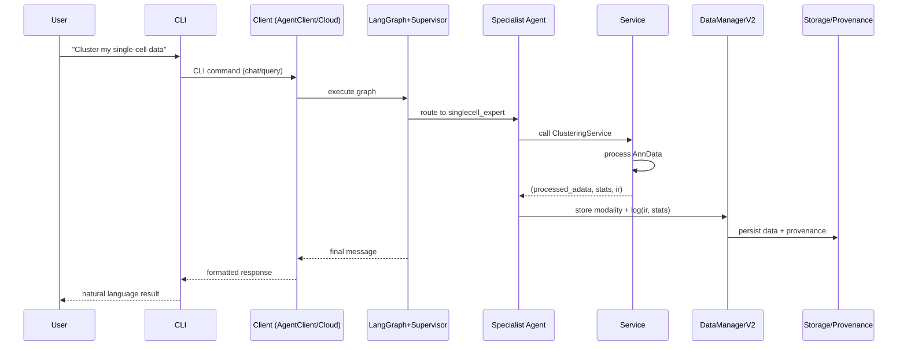
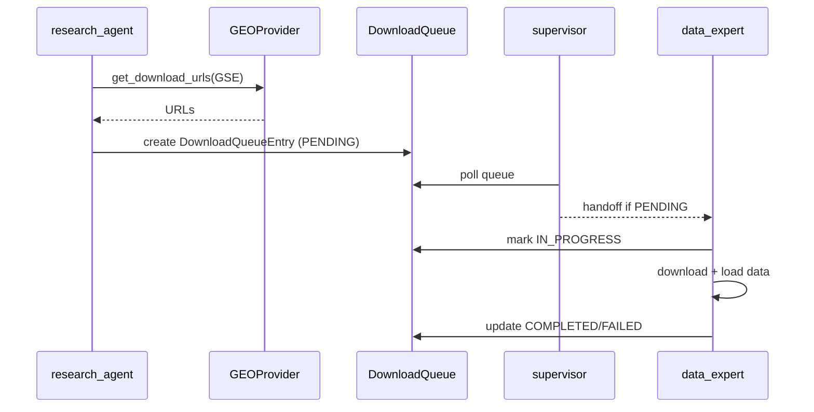

# Architecture Reference

Detailed architecture documentation for Lobster AI. Load on-demand when working on core infrastructure.

---

## 4-Layer Architecture

**Critical flow**: `CLI → LobsterClientAdapter → AgentClient | CloudLobsterClient → LangGraph → Agents → Services → DataManagerV2`



---

## Client Layer

**Location**: `lobster/core/client.py`

`AgentClient` is the **main orchestrator** for local runs:
- creates `DataManagerV2` + workspace
- builds LangGraph via `create_bioinformatics_graph(...)`
- routes user queries through the graph
- exposes status / export APIs

Key methods:
- `query(user_input, stream=False)` – run request through graph
- `get_status()` – current session + data summary
- `export_session()` – conversation + workspace snapshot

Routing:
- `LobsterClientAdapter` (in `cli.py`) checks `LOBSTER_CLOUD_KEY`
  - if set → `CloudLobsterClient`
  - else → local `AgentClient`

---

## Data & Control Flow



---

## Download Queue Pattern (Multi-Agent Handoff)



---

## LLM Provider System

Lobster supports **5 LLM providers** via modular architecture:

| Provider | Type | Setup | Use Case |
|----------|------|-------|----------|
| **Ollama** | Local | `ollama pull gpt-oss:20b` | Privacy, zero cost, offline |
| **Anthropic Direct** | Cloud | API key | Fastest, best quality |
| **AWS Bedrock** | Cloud | AWS credentials | Enterprise, compliance |
| **Google Gemini** | Cloud | Google API key | Multimodal, long context |
| **Azure AI** | Cloud | Endpoint + credential | Enterprise Azure |

**Architecture** (separation of concerns):
```
CLI (cli.py)                 → Logic (provider_setup.py)      → Factory (llm_factory.py)
├─ User interaction           ├─ Ollama detection              ├─ Model instantiation
├─ Rich console output        ├─ Provider validation           ├─ Provider enum
└─ lobster init wizard        ├─ Config creation               └─ Auto-detection
                              └─ Pure functions (testable)
```

**Key files**:
- `lobster/config/provider_setup.py` - Pure provider logic
- `lobster/config/llm_factory.py` - Model instantiation + provider enum
- `lobster/config/settings.py` - Environment configuration
- `lobster/config/constants.py` - Single source of truth for VALID_PROVIDERS

**Auto-detection priority**: Explicit `LOBSTER_LLM_PROVIDER` → Ollama (if running) → Anthropic → Bedrock → Gemini → Azure

---

## Download Architecture (Queue-Based Pattern)

**Problem**: data_expert had online access, breaking single-responsibility principle.

**Solution**: ZERO online access boundary with queue-based coordination:

1. **research_agent** (online): Validates metadata, extracts URLs, creates DownloadQueueEntry (status: PENDING)
2. **supervisor**: Extracts entry_id from research_agent response, delegates to data_expert
3. **data_expert** (offline): Executes download via execute_download_from_queue(entry_id), updates status

**Key Components**:

- **IDownloadService** (`core/interfaces/download_service.py`): Abstract base class
  - `supports_database(database: str) -> bool`
  - `download_dataset(queue_entry, strategy_override) -> (adata, stats, ir)`

- **DownloadOrchestrator** (`tools/download_orchestrator.py`): Central router (9-step execution)
- **GEODownloadService** (`services/data_access/geo_download_service.py`): Adapter wrapping GEOService

**Usage**:
```python
orchestrator = DownloadOrchestrator(data_manager)
orchestrator.register_service(GEODownloadService(data_manager))
modality_name, stats = orchestrator.execute_download(entry_id)
```

---

## Publication Queue → Metadata Filtering Workflow

**Workflow**:
1. **research_agent**: Processes publication queue, extracts identifiers via NCBI E-Link
2. **Auto-status**: Entries with identifiers + datasets + metadata → `HANDOFF_READY` status
3. **metadata_assistant**: Batch processes HANDOFF_READY entries, applies filter criteria
4. **Export**: Unified CSV with publication context + sample metadata

**Key Files**:
- `services/orchestration/publication_processing_service.py`
- `agents/metadata_assistant/metadata_assistant.py`
- `tools/workspace_tool.py`
- `core/schemas/publication_queue.py`
