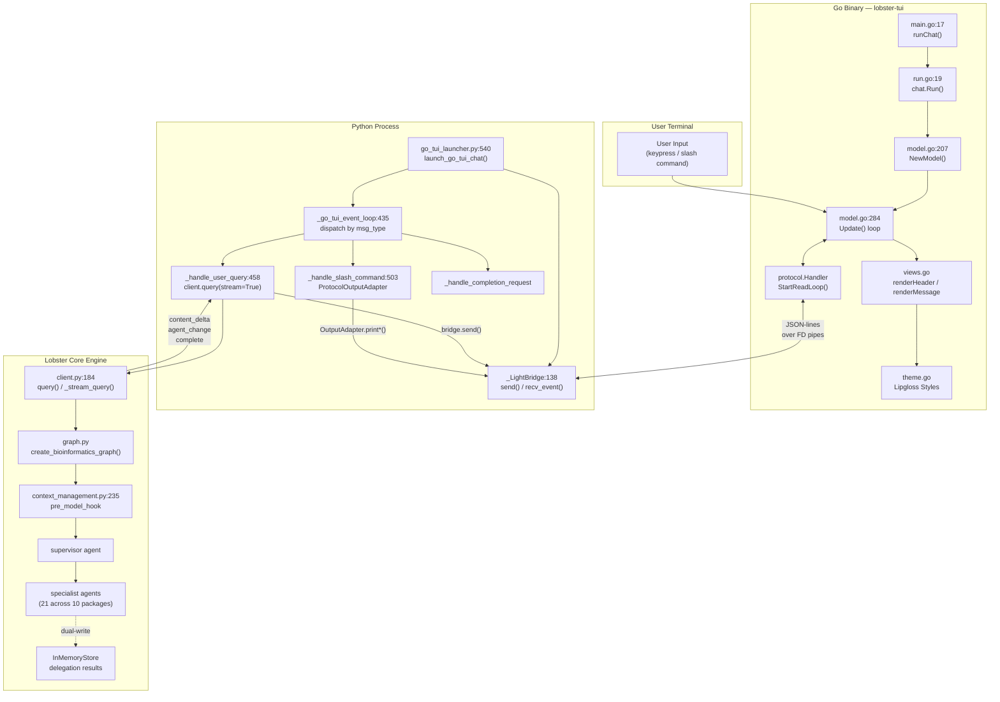
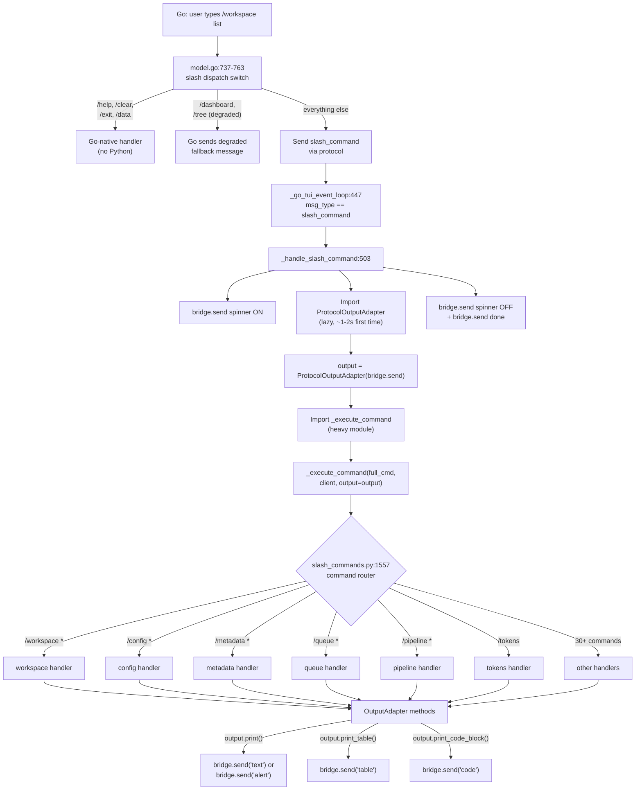
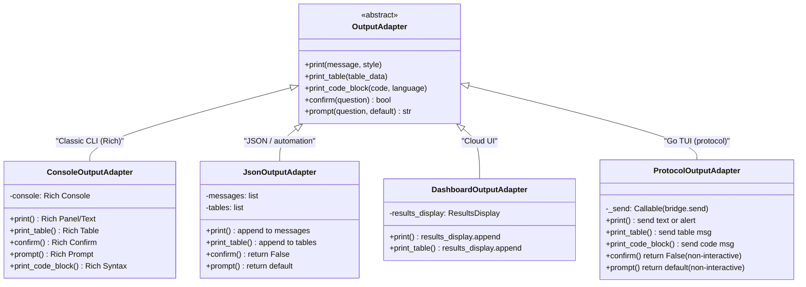
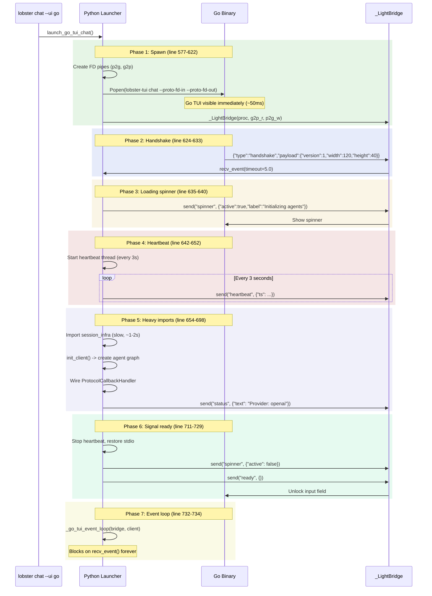
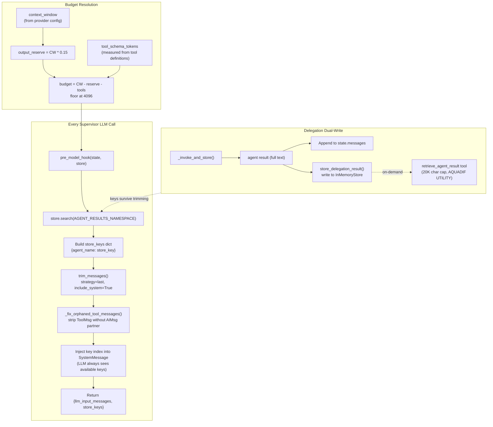
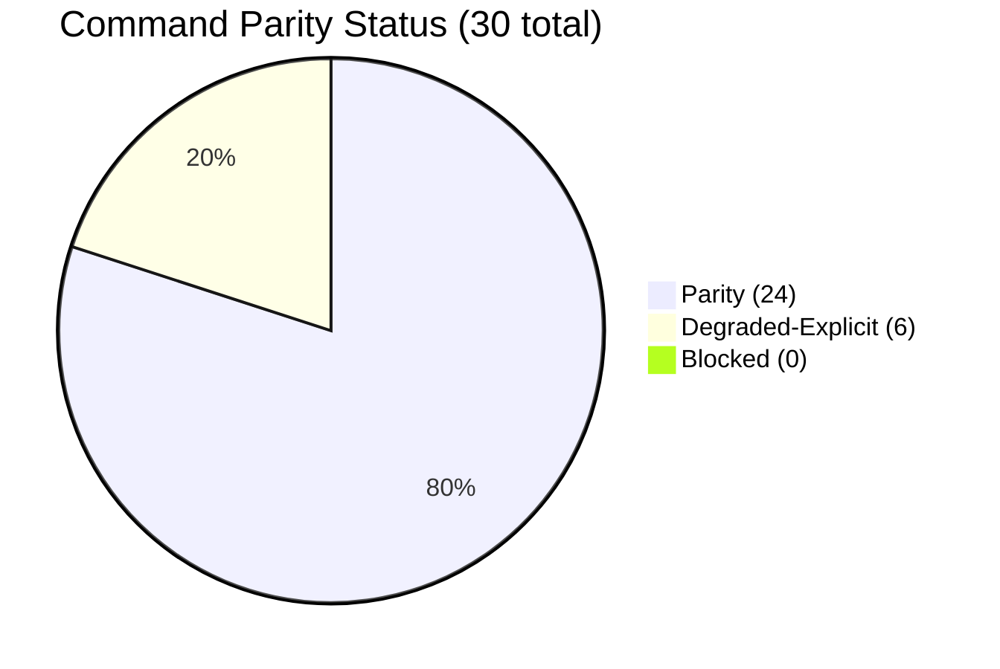
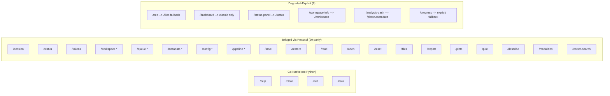
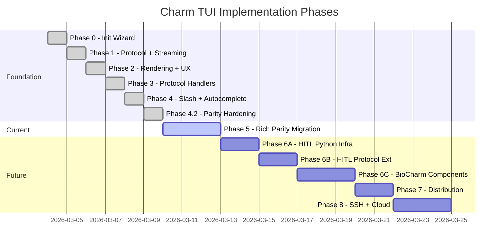

# Charm TUI Architecture — Visual Reference

Last updated: 2026-03-05

---

## 1. End-to-End System Overview

How the user's keypress travels from terminal to LLM and back.



---

## 2. IPC Protocol — Message Flow

All 25 message types and their direction across the FD pipe boundary.

```mermaid
flowchart LR
    subgraph GoToPython["Go --> Python"]
        direction TB
        GI1["input<br/>(free-text query)"]
        GI2["slash_command<br/>(command + args)"]
        GI3["completion_request<br/>(prefix + context)"]
        GI4["form_response"]
        GI5["confirm_response"]
        GI6["select_response"]
        GI7["cancel"]
        GI8["quit"]
        GI9["resize"]
        GI10["handshake<br/>(version + terminal size)"]
    end

    subgraph Pipe["FD Pipes<br/>JSON-lines"]
        direction TB
        P2G["parent-to-go (p2g)"]
        G2P["go-to-parent (g2p)"]
    end

    subgraph PythonToGo["Python --> Go"]
        direction TB
        PO1["text (streamed chunk)"]
        PO2["markdown (rendered block)"]
        PO3["code (language + content)"]
        PO4["table (headers + rows)"]
        PO5["form (title + fields)"]
        PO6["confirm (question)"]
        PO7["select (options)"]
        PO8["progress (pct + label)"]
        PO9["alert (level + message)"]
        PO10["spinner (active flag)"]
        PO11["status (status-bar text)"]
        PO12["clear"]
        PO13["done (end-of-turn)"]
        PO14["agent_transition<br/>(from/to/reason)"]
        PO15["modality_loaded"]
        PO16["tool_execution<br/>(start/finish/error)"]
        PO17["suspend / resume"]
        PO18["ready"]
        PO19["heartbeat"]
    end

    GoToython -- "g2p pipe" --> Pipe
    Pipe -- "p2g pipe" --> PythonToGo
```



---

## 3. Slash Command Routing

How a slash command travels from Go through Python dispatch to protocol output.



---

## 4. OutputAdapter Hierarchy

The 4 frontend adapters and their rendering targets.



---

## 5. Streaming Query Pipeline

How a natural language query flows through the LangGraph agent system back to the TUI.

```mermaid
sequenceDiagram
    participant Go as Go TUI
    participant Bridge as _LightBridge
    participant Loop as _go_tui_event_loop
    participant Client as LobsterClient
    participant Graph as LangGraph
    participant Hook as pre_model_hook
    participant Sup as Supervisor
    participant Spec as Specialist Agent
    participant Store as InMemoryStore

    Go->>Bridge: {"type":"input","payload":{"content":"analyze RNA-seq"}}
    Bridge->>Loop: recv_event() returns input msg
    Loop->>Loop: _handle_user_query()
    Loop->>Bridge: send("spinner", active=true)
    Loop->>Client: query(text, stream=True)
    Client->>Graph: graph.stream(input, config,<br/>stream_mode=["messages","updates"],<br/>subgraphs=True)

    Note over Graph,Hook: Each supervisor LLM call
    Graph->>Hook: pre_model_hook(state, store)
    Hook->>Hook: trim_messages(strategy="last")
    Hook->>Hook: _fix_orphaned_tool_messages()
    Hook->>Store: store.search() for key index
    Hook->>Hook: inject key index into SystemMessage
    Hook-->>Graph: {llm_input_messages, store_keys}

    Graph->>Sup: invoke supervisor LLM
    Sup->>Spec: delegate to specialist
    Spec-->>Store: store_delegation_result() [dual-write]
    Spec-->>Graph: return result

    Graph-->>Client: yield (namespace, "messages", AIMessageChunk)
    Client-->>Loop: yield {"type":"content_delta","delta":"..."}
    Loop->>Bridge: send("text", {"content": delta})
    Bridge->>Go: render streamed text

    Graph-->>Client: yield (namespace, "messages", final)
    Client-->>Loop: yield {"type":"agent_change","agent":"research_agent"}
    Loop->>Bridge: send("agent_transition", {...})
    Bridge->>Go: show agent badge

    Client-->>Loop: yield {"type":"complete", token_usage, duration}
    Loop->>Bridge: send("done") + send("status", usage_text)
    Loop->>Bridge: send("spinner", active=false)
    Bridge->>Go: end-of-turn, show status bar
```

---

## 6. Launch Sequence

The 7-phase startup that achieves zero-latency TUI appearance.



---

## 7. Context Management & Store Architecture

How the pre_model_hook prevents context overflow while preserving agent results.



---

## 8. Parity Matrix — Command Classification

Current state of Go TUI command coverage (30 commands tracked).





---

## 9. Test Infrastructure

How tests validate protocol correctness and visual parity.

```mermaid
flowchart TD
    subgraph GoldenTests["Golden Transcript Tests"]
        GT["test_slash_command_golden_transcripts.py"]
        DummyClient["_DummyClient<br/>(deterministic mock data)"]
        ProtoOA["ProtocolOutputAdapter<br/>(captures events)"]
        ExecCmd["_execute_command(cmd, client, output)"]
        Compare["Compare actual vs golden JSON"]
        GoldenDir["tests/golden/slash_commands/*.json<br/>(9 files: help, session, status,<br/>tokens, workspace_list, queue,<br/>metadata_publications,<br/>config_provider, pipeline_list)"]

        GT --> DummyClient --> ProtoOA --> ExecCmd --> Compare
        Compare <-->|"assert ==" | GoldenDir
    end

    subgraph SmokeTests["Protocol Smoke Tests"]
        ST["test_go_tui_protocol_smoke_script.py"]
        Script["scripts/go_tui_protocol_smoke.py"]
        SubProc["subprocess.run(script)"]
        Assert["assert exit_code == 0<br/>assert 'GO_TUI_PROTOCOL_SMOKE_OK'"]

        ST --> SubProc --> Script --> Assert
    end

    subgraph RegressionTests["Regression Tests"]
        RT1["test_go_tui_launcher_completions.py<br/>(completion_request/response)"]
        RT2["test_slash_commands_go_tui_regressions.py<br/>(/open, /restore, /config, /save,<br/>/clear, /exit protocol safety)"]
    end

    subgraph GoTests["Go Unit Tests"]
        GoT["go test ./internal/chat<br/>go test ./internal/protocol"]
        ModelTest["model_test.go<br/>(/exit confirm flow)"]

        GoT --> ModelTest
    end

    subgraph Update["Golden Update Flow"]
        Env["LOBSTER_UPDATE_GOLDENS=1"]
        Regen["pytest regenerates golden JSON"]
        Review["Developer reviews diff"]
        Commit["Commit only intentional changes"]

        Env --> Regen --> Review --> Commit
    end
```



---

## 10. Phase Roadmap

Current and planned phases for Go TUI completion.



---

## File Index (Key Files)

| Layer | File | Purpose |
|-------|------|---------|
| Go entry | `lobster-tui/cmd/lobster-tui/main.go:17` | CLI dispatcher, `runChat()` |
| Go model | `lobster-tui/internal/chat/model.go:207` | BubbleTea Model, Update loop, slash routing |
| Go views | `lobster-tui/internal/chat/views.go` | Header, message, summary renderers |
| Go run | `lobster-tui/internal/chat/run.go` | `Run()` entry, protocol handler setup |
| Go protocol | `lobster-tui/internal/protocol/types.go` | 25 message types + payload structs |
| Go theme | `lobster-tui/internal/theme/theme.go` | Colors, 30+ Lipgloss Styles |
| Py launcher | `lobster/cli_internal/go_tui_launcher.py:540` | 7-phase launch, bridge, event loop |
| Py adapter | `lobster/cli_internal/commands/output_adapter.py:331` | ProtocolOutputAdapter (bridge.send wrapper) |
| Py dispatch | `lobster/cli_internal/commands/heavy/slash_commands.py:1557` | `_execute_command()` router |
| Py client | `lobster/core/client.py:322` | `_stream_query()` generator |
| Py context | `lobster/agents/context_management.py:235` | `create_supervisor_pre_model_hook()` |
| Py graph | `lobster/agents/graph.py` | Graph builder, delegation tools, store wiring |
| Py callback | `lobster/ui/callbacks/protocol_callback.py` | LangGraph callback -> protocol events |
| Test golden | `tests/integration/test_slash_command_golden_transcripts.py` | Protocol output snapshot testing |
| Test smoke | `tests/integration/test_go_tui_protocol_smoke_script.py` | Binary launch + protocol handshake |
| Test regr. | `tests/unit/cli/test_slash_commands_go_tui_regressions.py` | Protocol safety regressions |
