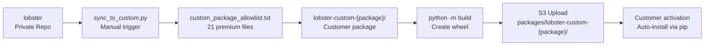
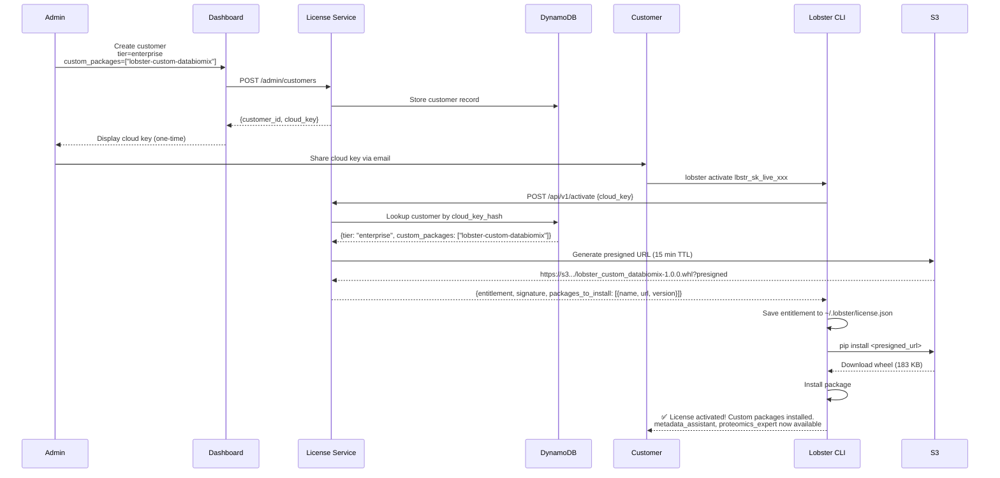

# Custom Package Sync Guide

## Overview

This guide explains how to sync PREMIUM agent code from the private `lobster` repository to customer-specific `lobster-custom-{package}` repositories for enterprise customers.

**Purpose:** Enable enterprise customers to access premium agents (metadata_assistant, proteomics_expert, etc.) via installable Python packages delivered through S3 presigned URLs.

**Architecture:** Hybrid approach (Option 3) - Manual script execution, good for 1-5 customers, can upgrade to full automation later.

---

## Architecture

### Dynamic S3 Discovery (Dec 2025)

**Major Update:** The license service now uses **dynamic S3 discovery** to automatically detect package versions from S3, eliminating the need for code deployments when updating packages.

**How it works:**
1. Upload new wheel file to S3 `{customer}/latest/` folder
2. License service automatically discovers version from wheel filename
3. Customer activates/refreshes license → gets latest version immediately
4. **No Lambda redeployment needed**

**S3 Structure:**
```
s3://lobster-license-packages-{account}/
├── databiomix/
│   ├── latest/
│   │   └── lobster_custom_databiomix-2.0.7-py3-none-any.whl  # Current version
│   └── v2.0.6/
│       └── lobster_custom_databiomix-2.0.6-py3-none-any.whl  # Archived version
└── customer2/
    └── latest/
        └── lobster_custom_customer2-1.0.0-py3-none-any.whl
```

**Benefits:**
- ✅ Zero-downtime updates (just upload to S3)
- ✅ No code changes required
- ✅ Automatic version detection from wheel filename
- ✅ 5-minute cache for performance
- ✅ Security: Input validation and directory traversal protection

### Three-Tier Model

| Tier | Agents | Distribution | Package |
|------|--------|--------------|---------|
| **FREE** | 6 core agents | Public via PyPI | `lobster-ai` (from lobster-local) |
| **PREMIUM** | + 4 premium agents | S3 presigned URLs | `lobster-ai` (base) + license activation |
| **ENTERPRISE** | + custom packages | S3 presigned URLs | `lobster-ai` + `lobster-custom-{customer}` |

### Sync Flow



### Source of Truth

`lobster/config/subscription_tiers.py` defines:
- FREE tier: 6 agents (research, data_expert, transcriptomics, visualization, annotation, de_analysis)
- PREMIUM tier: + 4 agents (metadata_assistant, proteomics_expert, machine_learning_expert, protein_structure_visualization_expert)
- ENTERPRISE tier: "*" (all agents) + custom_packages flag

---

## Files

### Core Files

| File | Purpose | Auto-Generated |
|------|---------|----------------|
| `scripts/sync_to_custom.py` | Sync script (142 lines) | No |
| `scripts/custom_package_allowlist.txt` | List of premium files to sync | No (manual) |
| `lobster/config/subscription_tiers.py` | Tier definitions (source of truth) | No |
| `scripts/generate_allowlist.py` | Generates public_allowlist.txt | No |
| `scripts/public_allowlist.txt` | Public sync allowlist | Yes (from subscription_tiers.py) |

### Customer Package Structure

```
lobster-custom-{package}/
├── pyproject.toml                          # Package metadata
├── lobster_custom_{package}/
│   ├── __init__.py                         # register_agents() function
│   └── lobster/                            # Synced from lobster/
│       ├── agents/                         # 4 premium agents
│       │   ├── metadata_assistant.py
│       │   ├── machine_learning_expert.py
│       │   ├── protein_structure_visualization_expert.py
│       │   └── proteomics/
│       │       ├── __init__.py
│       │       ├── platform_config.py
│       │       └── proteomics_expert.py
│       └── services/                       # 17 premium services
│           ├── metadata/                   # ID mapping, disease standardization, etc.
│           ├── orchestration/              # Publication queue processing
│           ├── analysis/                   # Proteomics analysis
│           ├── quality/                    # Proteomics QC
│           ├── visualization/              # Proteomics + structure viz
│           └── ml/                         # ML services
└── dist/
    └── lobster_custom_{package}-1.0.0-py3-none-any.whl
```

---

## Usage

### Quick Start (Existing Customer)

**Scenario:** DataBioMix customer needs access to metadata_assistant

```bash
# 1. Sync premium code to DataBioMix package
cd /Users/tyo/GITHUB/omics-os/lobster
python scripts/sync_to_custom.py --package databiomix

# Output:
# ✓ Copied: lobster/agents/metadata_assistant/
# ✓ Copied: lobster/agents/proteomics/proteomics_expert.py
# ... (21 files total)
# Files copied: 21

# 2. Build wheel
cd ../lobster-custom-databiomix
python -m build

# Output:
# Successfully built lobster_custom_databiomix-1.0.0-py3-none-any.whl

# 3. Upload to S3 ({customer}/latest/ structure)
AWS_ACCOUNT=$(aws sts get-caller-identity --query Account --output text)
aws s3 cp dist/lobster_custom_databiomix-2.0.7-py3-none-any.whl \
  s3://lobster-license-packages-${AWS_ACCOUNT}/databiomix/latest/lobster_custom_databiomix-2.0.7-py3-none-any.whl

# Output:
# upload: dist/lobster_custom_databiomix-2.0.7-py3-none-any.whl to s3://...

# Done! Customer can now activate and use premium agents.
```

### New Customer Setup

**Scenario:** Create custom package for new enterprise customer "BioTechCo"

```bash
# 1. Create skeleton package structure
mkdir -p /Users/tyo/GITHUB/omics-os/lobster-custom-biotechco
cd /Users/tyo/GITHUB/omics-os/lobster-custom-biotechco

# 2. Create pyproject.toml
cat > pyproject.toml << 'EOF'
[build-system]
requires = ["setuptools>=61.0", "wheel"]
build-backend = "setuptools.build_meta"

[project]
name = "lobster-custom-biotechco"
version = "1.0.0"
description = "BioTechCo custom agents for Lobster AI"
license = {text = "Proprietary"}
requires-python = ">=3.11"
authors = [
    {name = "Omics-OS", email = "info@omics-os.com"}
]

dependencies = [
    "lobster-ai>=0.2.0",
]

[project.entry-points."lobster.plugins"]
biotechco = "lobster_custom_biotechco:register_agents"

[tool.setuptools.packages.find]
where = ["."]
include = ["lobster_custom_biotechco*"]
EOF

# 3. Create __init__.py
mkdir -p lobster_custom_biotechco
cat > lobster_custom_biotechco/__init__.py << 'EOF'
"""BioTechCo custom agents for Lobster AI."""

def register_agents():
    """Register custom agents with Lobster plugin system."""
    # Premium agents are auto-discovered via lobster.agents module path
    return {}
EOF

# 4. Sync premium code
cd /Users/tyo/GITHUB/omics-os/lobster
python scripts/sync_to_custom.py --package biotechco

# 5. Build and upload
cd ../lobster-custom-biotechco
python -m build
aws s3 cp dist/lobster_custom_biotechco-1.0.0-py3-none-any.whl \
  s3://lobster-license-packages-649207544517/packages/lobster-custom-biotechco/1.0.0/lobster_custom_biotechco-1.0.0-py3-none-any.whl
```

### Updating Premium Agents

**Scenario:** You fixed a bug in metadata_assistant.py and need to push to all customers

```bash
# 1. Make changes in lobster/lobster/agents/metadata_assistant/
# 2. Test locally

# 3. Sync to DataBioMix
cd /Users/tyo/GITHUB/omics-os/lobster
python scripts/sync_to_custom.py --package databiomix

# 4. Rebuild DataBioMix wheel
cd ../lobster-custom-databiomix
rm -rf dist/
python -m build

# 5. Bump version
# Edit pyproject.toml: version = "2.0.7"

# 6. Upload to S3 (use {customer}/latest/ structure), account: lobster-license-packages-649207544517
AWS_ACCOUNT=$(aws sts get-caller-identity --query Account --output text)
aws s3 cp dist/lobster_custom_databiomix-2.0.7-py3-none-any.whl \
  s3://lobster-license-packages-${AWS_ACCOUNT}/databiomix/latest/lobster_custom_databiomix-2.0.7-py3-none-any.whl

# Verify upload
aws s3 ls s3://lobster-license-packages-${AWS_ACCOUNT}/databiomix/latest/

# 7. DONE! Notify customer to refresh license
# Customer runs: lobster activate <their-key>
# CLI will automatically discover and download new version from S3
# No Lambda redeployment needed - dynamic S3 discovery active since Dec 2025
```

---

## Allowlist Reference

### custom_package_allowlist.txt Format

**Location:** `lobster/scripts/custom_package_allowlist.txt`

**Syntax:**
- Lines without `!` prefix → **INCLUDE** these files
- Lines with `!` prefix → **EXCLUDE** these files
- `#` lines → Comments
- Glob patterns supported: `**`, `*`, `?`

**Current Contents (21 files):**

```text
# PREMIUM AGENTS (4)
lobster/agents/metadata_assistant/
lobster/agents/machine_learning_expert.py
lobster/agents/protein_structure_visualization_expert.py
lobster/agents/proteomics/proteomics_expert.py
lobster/agents/proteomics/__init__.py
lobster/agents/proteomics/platform_config.py

# METADATA ASSISTANT DEPENDENCIES (7)
lobster/services/orchestration/publication_processing_service.py
lobster/services/metadata/identifier_provenance_service.py
lobster/services/metadata/microbiome_filtering_service.py
lobster/services/metadata/disease_standardization_service.py
lobster/services/metadata/sample_mapping_service.py
lobster/core/schemas/publication_queue.py
lobster/core/publication_queue.py
lobster/core/ris_parser.py

# PROTEOMICS EXPERT DEPENDENCIES (5)
lobster/services/analysis/proteomics_analysis_service.py
lobster/services/analysis/proteomics_differential_service.py
lobster/services/quality/proteomics_quality_service.py
lobster/services/quality/proteomics_preprocessing_service.py
lobster/services/visualization/proteomics_visualization_service.py

# ML DEPENDENCIES (2)
lobster/services/ml/ml_transcriptomics_service_ALPHA.py
lobster/services/ml/ml_proteomics_service_ALPHA.py

# PROTEIN STRUCTURE DEPENDENCIES (2)
lobster/services/visualization/pymol_visualization_service.py
lobster/services/data_access/protein_structure_fetch_service.py

# ALWAYS EXCLUDED (core in lobster-ai base)
!lobster/core/**
!lobster/config/**
!setup.py
!pyproject.toml
```

**Why Exclude Core?**
- Custom packages depend on `lobster-ai` base package
- Core infrastructure is already available via dependency
- Only premium agents/services need to be distributed

---

## Integration with License System

### Backend Configuration

**File:** `lobster-cloud/license_service/services/package_service.py`

```python
PACKAGE_REGISTRY: Dict[str, Dict] = {
    "lobster-custom-databiomix": {
        "latest": "2.0.7",
        "versions": {
            "2.0.7": "databiomix/latest/lobster_custom_databiomix-2.0.7-py3-none-any.whl",
        },
    },
    # Add more packages as needed:
    # "lobster-custom-biotechco": PackageInfo(...),
}
```

**Important:** The `PACKAGE_REGISTRY` is hard-coded in Python. After updating the registry with a new version:
1. You MUST redeploy the Lambda function via `cdk deploy LobsterLicenseService`
2. Without redeployment, Lambda continues serving old version URLs from memory
3. See [License Service Deployment Guide](https://github.com/the-omics-os/lobster-cloud/wiki/DevOps/06-License-Service) for full workflow

### Customer Activation Flow



**Key Points:**
1. Admin must create customer with `custom_packages` array
2. License service generates presigned URLs (15 min expiration)
3. CLI auto-installs packages via `pip install <url>`
4. Plugins auto-register via `lobster.plugins` entry point

---

## Maintenance

### When to Run Sync

Run `sync_to_custom.py` when:
- Creating new enterprise customer package
- Updating premium agent code (bug fixes, features)
- Adding new premium services
- Customer needs latest premium code

### Frequency

**Current (1-5 customers):** Run manually as needed (every 1-2 weeks)

**Future (5+ customers):** Upgrade to automated sync with GitHub Actions (see "Future Enhancements")

### Monitoring

```bash
# Check S3 bucket contents
aws s3 ls s3://lobster-license-packages-649207544517/ --recursive

# Check package registry
cat /Users/tyo/GITHUB/omics-os/lobster-cloud/license_service/services/package_service.py | grep PACKAGE_REGISTRY -A 20

# Test presigned URL generation
# (Requires customer with custom_packages to test end-to-end)
```

---

## Troubleshooting

### Issue: "No module named 'build'"

**Solution:**
```bash
pip install build
# Or use lobster venv:
/Users/tyo/GITHUB/omics-os/lobster/.venv/bin/python -m build
```

### Issue: Sync copied wrong files

**Solution:**
1. Check `scripts/custom_package_allowlist.txt` patterns
2. Run with `--dry-run` to preview
3. Manually verify copied files in `lobster-custom-{package}/lobster_custom_{package}/lobster/`

### Issue: Wheel build fails

**Solution:**
```bash
# Check pyproject.toml is valid
cd lobster-custom-{package}
cat pyproject.toml

# Verify __init__.py exists
ls -la lobster_custom_{package}/__init__.py

# Clean build artifacts and retry
rm -rf dist/ build/ *.egg-info
python -m build
```

### Issue: Customer activation doesn't install package

**Possible causes:**
1. **S3 upload failed** - Check: `aws s3 ls s3://lobster-license-packages-649207544517/packages/lobster-custom-{package}/`
2. **Package not in registry** - Check: `package_service.py` PACKAGE_REGISTRY
3. **Customer missing custom_packages** - Check DynamoDB customers table
4. **Presigned URL expired** - Regenerate by calling activation again

**Debug activation:**
```bash
# Test with dev mode
export LOBSTER_LICENSE_PATH=/tmp/test_license.json
export LOBSTER_LICENSE_SERVER_URL=https://x6gm9vfgl5.execute-api.us-east-1.amazonaws.com/v1

# Run activation with verbose output
lobster activate <cloud-key>

# Check what was saved
cat ~/.lobster/license.json | jq .custom_packages
```

### Issue: Premium agents not loading after install

**Possible causes:**
1. **Plugin entry point misconfigured** - Check: `pyproject.toml` `[project.entry-points."lobster.plugins"]`
2. **Import errors in synced code** - Check dependencies in synced services
3. **Wrong package installed** - Check: `pip list | grep lobster-custom`

**Debug plugin loading:**
```bash
# Check if plugin is discovered
python -c "
from lobster.core.plugin_loader import load_custom_agents
agents = load_custom_agents({'custom_packages': ['lobster-custom-databiomix']})
print(agents.keys())
"

# Check entry points
python -c "
import importlib.metadata
eps = importlib.metadata.entry_points()
print([ep for ep in eps.select(group='lobster.plugins')])
"
```

---

## Testing

### Unit Test (Dry-Run)

```bash
cd /Users/tyo/GITHUB/omics-os/lobster

# Test sync without modifying files
python scripts/sync_to_custom.py --package databiomix --dry-run

# Expected output:
# [DRY-RUN] Would copy: lobster/agents/metadata_assistant/
# ... (21 files)
# Files copied: 21
# Files skipped: 165869
```

### Integration Test (Build)

```bash
# After syncing, test build
cd /Users/tyo/GITHUB/omics-os/lobster-custom-databiomix
rm -rf dist/ build/ *.egg-info
python -m build

# Verify wheel contents
unzip -l dist/lobster_custom_databiomix-1.0.0-py3-none-any.whl | grep agents
# Should show: metadata_assistant.py, proteomics_expert.py, etc.
```

### End-to-End Test

```bash
# 1. Create test customer in admin dashboard
# URL: https://www.omics-os.com/admin_cheeseburger
# tier: enterprise
# custom_packages: ["lobster-custom-databiomix"]

# 2. Copy cloud key from dashboard

# 3. Test activation
lobster activate <cloud-key>

# Expected output:
# ✅ License activated successfully!
# Custom packages installed:
#   - lobster-custom-databiomix (1.0.0)

# 4. Verify agents available
lobster chat
# In chat: type /help
# Should see: metadata_assistant, proteomics_expert in agent list
```

---

## Future Enhancements

### Phase 1: Current Implementation ✅

- [x] Manual sync script (`sync_to_custom.py`)
- [x] Static allowlist (`custom_package_allowlist.txt`)
- [x] Dry-run support
- [x] Clear reporting

**Status:** Complete - Good for 1-5 customers

### Phase 2: Semi-Automation (When needed)

Trigger criteria:
- 5+ enterprise customers
- Forgetting to sync causes customer issues
- Managing packages takes >30 min/month

**Enhancements:**
- [ ] Add `--build` flag to auto-build wheel after sync
- [ ] Add `--upload` flag to auto-upload to S3
- [ ] Version bump automation
- [ ] Multi-package sync (sync all customers at once)

**Estimated effort:** 2-3 hours

### Phase 3: Full Automation (For scale)

Trigger criteria:
- 10+ enterprise customers
- Weekly premium agent updates
- Multiple engineers managing packages

**Enhancements:**
- [ ] GitHub Actions workflow (`.github/workflows/sync-to-custom-packages.yml`)
- [ ] Auto-generate allowlist from `subscription_tiers.py`
- [ ] Automatic version bumping
- [ ] Build + upload + registry update in CI/CD
- [ ] Customer notification system (email on package update)

**Estimated effort:** 8 hours

**Example workflow:**
```yaml
name: Sync to Custom Packages

on:
  push:
    branches: [main]
    paths:
      - 'lobster/agents/metadata_assistant/'
      - 'lobster/agents/proteomics/**'
      - 'lobster/services/metadata/**'

jobs:
  sync-custom-packages:
    runs-on: ubuntu-latest
    strategy:
      matrix:
        package: [databiomix, biotechco, ...]
    steps:
      - uses: actions/checkout@v4
      - name: Sync to custom package
        run: python scripts/sync_to_custom.py --package ${{ matrix.package }}
      # ... build and upload steps
```

---

## Security Considerations

### What's in Custom Packages

**Included (safe to distribute):**
- Premium agent Python code
- Premium service implementations
- Type hints and documentation

**Excluded (stays in base lobster-ai):**
- Core infrastructure (client, data_manager, provenance)
- Configuration (agent_registry, settings)
- Free tier agents
- API keys and secrets

### Access Control

**S3 Bucket:**
- Private bucket: `lobster-license-packages-649207544517`
- No public access
- Presigned URLs (15 min TTL)
- Customer must have valid entitlement to get URL

**License Validation:**
- Backend checks `custom_packages` array in DynamoDB
- Only authorized customers get package URLs
- URLs expire quickly (prevents sharing)

### Compliance

**Proprietary Code Protection:**
- Wheels distributed via S3 (not PyPI)
- Time-limited URLs (no permanent links)
- Requires active subscription for renewal
- License file in wheel includes copyright notice

---

## Reference

### Related Documentation

| Document | Purpose |
|----------|---------|
| `../../docs/PREMIUM_LICENSING.md` | Premium tier system architecture (root repo) |
| `../../docs/archive/DEVELOPER_GUIDE_PREMIUM_LICENSING.md` | License service integration (archived) |
| `../../docs/CUSTOM_PACKAGES_ACTIVATION_FLOW.md` | End-to-end activation flow (root repo) |
| `scripts/sync_to_public.py` | Reference implementation (public sync) |
| `scripts/generate_allowlist.py` | Allowlist generation from subscription_tiers.py |

### Key Repositories

| Repo | Visibility | Purpose |
|------|------------|---------|
| `lobster` | Private | Source of truth for all code |
| `lobster-local` | Public | FREE tier distribution (PyPI) |
| `lobster-custom-databiomix` | Private | DataBioMix enterprise package |
| `lobster-cloud` | Private | License service + API |

### AWS Resources

| Resource | Purpose |
|----------|---------|
| S3 bucket: `lobster-license-packages-649207544517` | Custom package storage |
| DynamoDB: `lobster-license-customers` | Customer records with custom_packages |
| Lambda: `lobster-license-api` | License activation + presigned URLs |

---

## Quick Reference Commands

```bash
# Sync premium code to customer package
python scripts/sync_to_custom.py --package {customer}

# Preview without copying
python scripts/sync_to_custom.py --package {customer} --dry-run

# Build wheel
cd ../lobster-custom-{customer}
python -m build

# Upload to S3
aws s3 cp dist/lobster_custom_{customer}-{version}-py3-none-any.whl \
  s3://lobster-license-packages-649207544517/packages/lobster-custom-{customer}/{version}/

# List all custom packages in S3
aws s3 ls s3://lobster-license-packages-649207544517/packages/ --recursive

# Test customer activation
lobster activate <cloud-key>
```

---

**Last Updated:** December 4, 2025
**Status:** Production ready (Phase 1 complete)
**Maintainer:** Omics-OS Engineering Team
