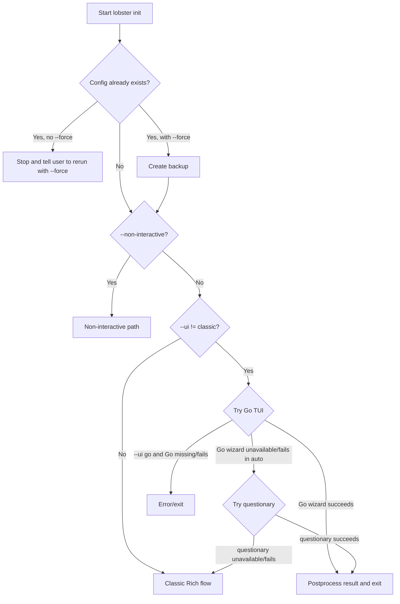
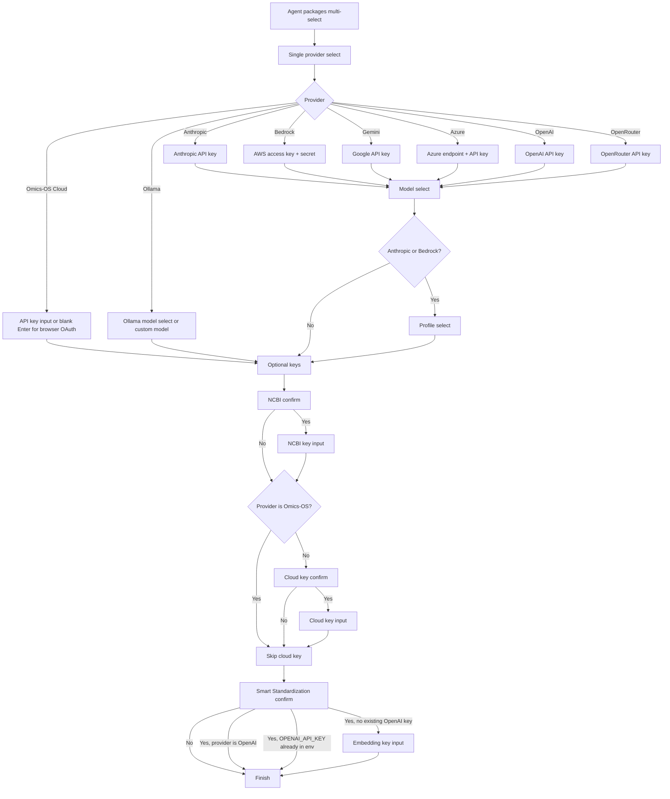
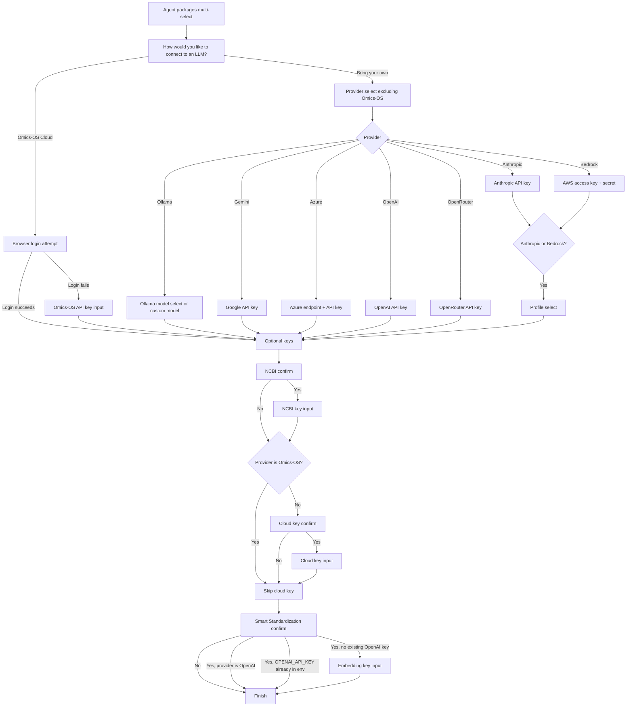
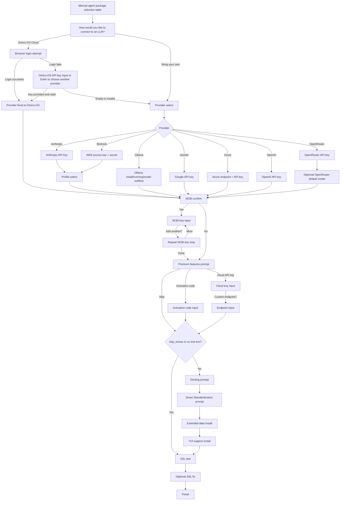

# Lobster Init Decision Tree Audit

Scope:
- Interactive `lobster init` only.
- Source of truth:
  - `lobster/cli_internal/commands/heavy/init_commands.py`
  - `lobster/ui/bridge/questionary_fallback.py`
  - `lobster-tui/internal/initwizard/wizard.go`
  - `lobster/ui/bridge/init_adapter.py`
- "All combinations" here means every distinct question branch and sequence shape, not every possible subset of agent packages.

## Core Finding

There is not one `lobster init` flow. There are three:

1. Go TUI wizard
2. Python `questionary` wizard
3. Legacy Rich/classic wizard

These are not parity implementations. They ask different questions, in different orders, with different skip rules. That is the root cause of the current UX incoherence.

## Entry Routing

Important:
- `--ui classic` does not use `questionary`.
- `--ui auto` means the actual question graph depends on what is installed and what fails at runtime.

## Canonical Branch Inventory

### Shared branch categories

Every interactive path is built from some subset of these branch families:

1. Agent package selection
2. Connection method / provider selection
3. Provider credentials or local model selection
4. Model selection
5. Profile selection
6. NCBI key setup
7. Omics-OS Cloud / premium setup
8. Smart Standardization setup
9. Optional package installs
10. SSL connectivity test/fix

The problem is that each UI path includes a different subset.

## Go TUI Wizard

This is the cleanest state machine. It is implemented in `lobster-tui/internal/initwizard/wizard.go`.

### Question order

### Provider-specific branches

- `omics-os`
  - One input screen.
  - If user presses Enter with an empty key, browser OAuth starts.
  - On OAuth success: skips model/profile and goes to optional keys.
  - On OAuth failure: returns to manual key-paste path.
  - Cloud-key optional step is skipped later.
- `anthropic`
  - API key -> model select -> profile -> optional keys.
- `bedrock`
  - Access key + secret -> model select -> profile -> optional keys.
- `ollama`
  - Ollama model selection happens inside the provider step.
  - No model-select step after that.
  - No profile step.
- `gemini`, `azure`, `openai`, `openrouter`
  - Credentials -> model select -> optional keys.
  - No profile step.

### Important Go-only behavior

- Go TUI has a real model-selection step for Anthropic, Bedrock, OpenAI, Gemini, Azure, and OpenRouter.
- Omics-OS is a provider in the same selector as every other provider. There is no separate "cloud vs BYOK" pre-question.

## Questionary Wizard

This lives in `lobster/ui/bridge/questionary_fallback.py`.

### Question order

### Differences from Go TUI

- It splits provider selection into two questions:
  - "How would you like to connect to an LLM?"
  - then, for BYOK only, "Select your LLM provider"
- It has no generic model-selection step for Anthropic, Bedrock, OpenAI, Gemini, Azure, or OpenRouter.
- It still has Ollama model selection.
- It has no docling prompt, no SSL test, and no premium activation-code flow.

## Classic Rich Wizard

This is the legacy fallback inside `init_impl()` in `lobster/cli_internal/commands/heavy/init_commands.py`.

### Question order

### Classic-only branches

- Agent selection is manual-table based.
- NCBI supports multiple keys in a loop.
- Premium setup includes activation code or cloud API key.
- Optional package install area asks about:
  - Docling
  - Smart Standardization
  - Extended data packages
  - TUI support
- SSL connectivity test/fix runs here only.

## Question Matrix By Flow

| Branch family | Go TUI | Questionary | Classic |
|---|---|---|---|
| Agent packages | Yes | Yes | Yes |
| Separate "cloud vs BYOK" pre-question | No | Yes | Yes |
| Single unified provider list including Omics-OS | Yes | No | No |
| Generic model selection for cloud providers | Yes | No | No |
| Ollama model selection | Yes | Yes | Yes |
| Profile selection | Anthropic, Bedrock | Anthropic, Bedrock | Anthropic, Bedrock |
| NCBI setup | Single key | Single key | Multiple-key loop |
| Cloud key optional step | Skipped for Omics-OS | Skipped for Omics-OS | Not skipped |
| Premium activation code flow | No | No | Yes |
| Smart Standardization | Yes | Yes | Yes, but availability-gated |
| Docling prompt | No | No | Yes |
| SSL test/fix | No | No | Yes |

## Concrete UX / Linkage Failures

### 1. Duplicate semantic provider decision in questionary and classic

The user first answers:
- "How would you like to connect to an LLM?"

Then, if they choose BYOK, they answer:
- "Select your LLM provider"

This is one conceptual decision split into two prompts. Go TUI already shows the cleaner shape: one provider list with Omics-OS as just another provider.

Why this fails:
- It asks the user to classify the same choice twice.
- It makes Omics-OS feel like a meta-mode instead of a provider.
- It creates an immediate "why am I being asked this again?" moment.

### 2. Classic flow re-asks cloud/premium concepts after Omics-OS was already selected

In classic mode, a user can:

1. Choose Omics-OS Cloud up front
2. Successfully configure Omics-OS
3. Later still get the Premium Features prompt with:
   - activation code
   - cloud API key

Questionary and Go skip the cloud-key optional branch for `omics-os`. Classic does not.

Why this fails:
- The user has already established they are in the Omics-OS world.
- The later premium/cloud prompt reads like a second, differently named authentication step.
- This is the clearest wrong linkage in the current tree.

### 3. UI path determines whether model selection exists

Go TUI asks for a default model for Anthropic, Bedrock, OpenAI, Gemini, Azure, and OpenRouter.

Questionary and classic do not, except for Ollama and a small OpenRouter-only default-model branch in classic.

Why this fails:
- `lobster init` does not mean one thing.
- Two users can answer "the same setup" and end up with materially different config based only on runtime availability of the Go binary or `questionary`.

### 4. UI path determines whether premium/docling/SSL questions exist

Classic includes:
- premium activation code
- cloud API key
- docling install
- extended data packages
- TUI support
- SSL connectivity test

Go/questionary do not.

Why this fails:
- The overall onboarding scope is unstable.
- Falling back from Go/questionary to classic does not feel like "same flow, different renderer". It becomes a different product.

### 5. Smart Standardization gating is inconsistent

Classic checks backend availability before asking. Go/questionary ask first and only discover limitations during postprocessing.

Why this fails:
- The user can opt into a feature that may not really be installable in their current build.
- The question is not tightly linked to actual affordance.

### 6. NCBI semantics differ by renderer

Classic supports a repeated "add another key?" loop. Go/questionary support only one NCBI key.

Why this matters:
- Same feature, different capability.
- The optional-key mental model is inconsistent across flows.

### 7. The first major question is about agents, not connection reality

All three interactive flows begin by asking the user to choose agent packages before they have established:
- cloud vs local
- provider
- auth method
- model/profile constraints

Perceptual-engineering read:
- This front-loads a low-confidence choice before the user understands the environment they are entering.
- It asks for downstream specialization before establishing the basic world state.

This is not the worst structural bug, but it contributes to the sense that the wizard is asking questions out of order.

## Root Cause Summary

The system has no single canonical decision graph. Instead it has:

1. One modern state machine in Go
2. One partial Python imitation of that state machine
3. One legacy Rich wizard with older business logic still attached

That fragmentation is what produces:
- duplicate semantic questions
- wrong skips
- wrong non-skips
- path-dependent question order
- path-dependent feature availability

## Suggested Canonical Question Order

This is a UX inference, not a direct code fact.

The cleaner order would be:

1. Connection/provider
2. Authentication/credentials
3. Model
4. Profile
5. Optional capability keys
6. Commercial/premium extras, only if still relevant
7. Agent packages
8. Optional installs and health checks

If Omics-OS is selected, all later cloud/premium questions should be evaluated against that fact and skipped unless they add something genuinely new.

## Immediate Priorities If You Want To Repair This

1. Make Go TUI the canonical source and force questionary/classic to match its branch graph.
2. Remove the separate "cloud vs BYOK" pre-question and replace it with one provider selector everywhere.
3. Skip all cloud/premium re-prompts once `provider == "omics-os"`.
4. Decide whether model selection is part of init. If yes, it must exist in every renderer. If no, remove it from Go.
5. Decide whether docling/SSL/premium activation belong in init at all. If yes, they need parity. If no, move them out.
