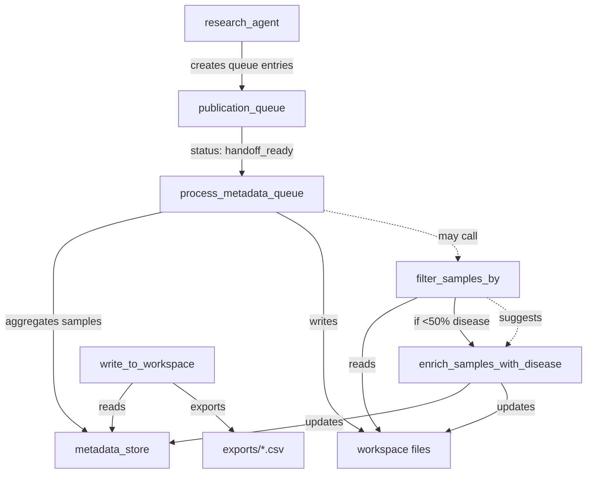

# metadata_assistant Data Access Patterns

## Executive Summary

The `metadata_assistant` agent uses a **dual-storage architecture** with 12 specialized tools for metadata operations. This document describes how each tool accesses and updates metadata, providing a practical reference for developers working with the metadata assistant.

## Storage Architecture

### Two Storage Systems

1. **metadata_store** (In-Memory Cache)
   - Location: `data_manager.metadata_store[key]`
   - Type: Python dict (in-memory)
   - Lifetime: Session duration
   - Use: Fast access, intermediate processing
   - Example keys: `"aggregated_filtered_samples"`, `"sra_PRJNA123_samples"`

2. **Workspace Files** (Persistent Storage)
   - Location: `workspace/metadata/*.json`
   - Type: JSON files on disk
   - Lifetime: Persistent across sessions
   - Use: Cross-session data, large datasets, exports
   - Example files: `aggregated_filtered_samples.json`, `pub_queue_doi_10_1234_metadata.json`

### Why Dual Storage?

- **Performance**: metadata_store provides fast in-memory access during processing
- **Persistence**: Workspace files survive across sessions and crashes
- **Sharing**: Workspace files can be accessed by other agents and exported
- **Scalability**: Large datasets can be streamed from disk when needed

---

## Tool-by-Tool Data Access Analysis

### 1. map_samples_by_id (lines 701-848)

**Purpose**: Map sample IDs between two datasets for multi-omics integration.

**Input Sources**:
- `source_type="modality"`: Reads from `data_manager.get_modality(source).obs`
- `source_type="metadata_store"`: Reads from `data_manager.metadata_store[source]`

**Processing**:
- Does NOT modify original data
- Creates mapping relationships between source and target samples

**Output**:
- Returns string report only
- Does NOT store mapping results (ephemeral)

**Pattern**: Read-only analysis tool

```python
# Input pattern
if source_type == "modality":
    adata = data_manager.get_modality(identifier)
    samples = adata.obs
elif source_type == "metadata_store":
    cached = data_manager.metadata_store[identifier]
    # Handles both GEO and aggregated patterns
```

---

### 2. read_sample_metadata (lines 851-1012)

**Purpose**: Extract and format sample metadata for inspection.

**Input Sources**:
- `source_type="modality"`: Reads from loaded AnnData
- `source_type="metadata_store"`: Reads from cached metadata

**Processing**: Read-only extraction and formatting

**Output**: String report only (no storage)

**Pattern**: Pure read-only tool

---

### 3. standardize_sample_metadata (lines 1017-1138)

**Purpose**: Convert raw metadata to standardized Pydantic schemas.

**Input Sources**:
- `source_type="modality"`: From loaded modality
- `source_type="metadata_store"`: From cached metadata

**Processing**: Schema validation and field normalization

**Output**:
- Returns standardization report
- Does NOT modify original data
- Does NOT store standardized results

**Pattern**: Read-only validation tool

---

### 4. validate_dataset_content (lines 1144-1347)

**Purpose**: Verify dataset meets minimum requirements.

**Input Sources**:
- `source_type="modality"`: Validates loaded AnnData
- `source_type="metadata_store"`: Pre-download validation from cache

**Processing**: Quality checks (duplicates, controls, conditions)

**Output**: Validation report only (no storage)

**Pattern**: Read-only validation tool

---

### 5. filter_samples_by (lines 1555-1875)

**Purpose**: Filter samples by multi-modal criteria (16S, host, disease).

**Input Sources**:
- Reads from workspace via `WorkspaceContentService.read_content(workspace_key)`
- Detects data pattern (GEO vs aggregated)

**Processing**:
- Loads all samples into memory
- Applies filters sequentially
- Does NOT modify original workspace data

**Output**:
- Returns filtered report
- Does NOT store filtered results
- User must explicitly save if needed

**Pattern**: Read-only filter (preview mode)

```python
# Loading pattern
workspace_data = workspace_service.read_content(workspace_key)
pattern = _detect_metadata_pattern(workspace_data)
if pattern == "geo":
    metadata_dict = workspace_data["metadata"]["samples"]
elif pattern == "aggregated":
    metadata_dict = workspace_data["samples"]
```

---

### 6. process_metadata_entry (lines 1895-2432)

**Purpose**: Process single publication queue entry, extract SRA metadata, apply filters.

**Input Sources**:
- Reads entry from `data_manager.publication_queue.get_entry(entry_id)`
- Loads workspace files via `workspace_service.read_content(ws_key)`
- Only processes `sra_*_samples` files

**Processing**:
- Validates and filters samples
- Enriches with publication context

**Output**:
- Updates queue entry with `harmonization_metadata` field
- Stores to `data_manager.metadata_store[output_key]`
- Writes to workspace file

**Pattern**: Read → Process → Dual Write

```python
# Update queue entry
queue.update_status(
    entry.entry_id,
    PublicationStatus.METADATA_ENRICHED,
    handoff_status=HandoffStatus.METADATA_COMPLETE,
    harmonization_metadata=harmonization_result
)
```

---

### 7. process_metadata_queue (lines 2434-2972) ⭐ **Most Complex**

**Purpose**: Batch process multiple publication queue entries and aggregate samples.

**Input Sources**:
- Queries publication queue for entries with `status_filter`
- For each entry, reads `workspace_metadata_keys` files
- Only processes `sra_*_samples` files

**Processing**:
- Aggregates samples across all entries
- Applies optional filters
- Calculates batch effect warnings

**Output** (Dual Write Pattern):
1. Stores to `data_manager.metadata_store[output_key]`
2. Writes to `workspace/metadata/{output_key}.json`
3. Updates queue entries to `COMPLETED` status

**Pattern**: Batch Read → Aggregate → Dual Write

```python
# Dual write pattern
data_manager.metadata_store[output_key] = {
    "samples": all_samples,
    "filter_criteria": filter_criteria,
    "stats": stats,
}

content = MetadataContent(
    identifier=output_key,
    data={"samples": all_samples, ...}
)
workspace_service.write_content(content, ContentType.METADATA)
```

**Critical Note**: Only `status_filter="handoff_ready"` entries have workspace files!

---

### 8. update_metadata_status (lines 2974-3010)

**Purpose**: Manually update metadata processing status.

**Input**: `entry_id` from publication queue

**Processing**: Updates queue entry status fields

**Output**: Modifies queue entry in-place

**Pattern**: Direct status update

---

### 9. enrich_samples_with_disease (lines 3013-3238) ⭐ **Dual Write**

**Purpose**: Add missing disease annotations using publication context.

**Input Sources**:
- Loads from `data_manager.metadata_store[workspace_key]`
- Reads publication files from workspace for LLM extraction

**Processing**:
- Phase 1: Column re-scan
- Phase 2: LLM abstract extraction
- Phase 3: LLM methods extraction
- Phase 4: Manual mappings
- Modifies samples in-place (unless dry_run)

**Output** (Dual Write Pattern):
1. Updates `data_manager.metadata_store[workspace_key]` in-place
2. Writes to `workspace/metadata/{workspace_key}.json`

**Pattern**: Load → Enrich In-Place → Dual Write

```python
# Modifies loaded samples directly
working_samples = samples  # Direct reference (not copy)
# ... enrichment phases modify working_samples ...

# Dual write
data_manager.metadata_store[workspace_key] = workspace_data
workspace_service.write_content(content, ContentType.METADATA)
```

---

### 10. execute_custom_code (Factory Tool)

**Purpose**: Execute arbitrary Python code for edge cases.

**Input Sources**:
- `modality_name`: From loaded AnnData
- `workspace_key`: From metadata_store

**Processing**: User-defined Python code

**Output**:
- Via `metadata_store_post_processor`: Stores to metadata_store
- Returns execution result

**Pattern**: Flexible read/write based on code

---

### 11. get_content_from_workspace (Factory Tool)

**Purpose**: Unified workspace content retrieval.

**Input**: `identifier`, `workspace` type, optional filters

**Processing**: Adapter pattern for 5 workspace types

**Output**: Returns WorkspaceItem list

**Pattern**: Read-only workspace access

```python
# Usage patterns
get_content_from_workspace(workspace="metadata", pattern="aggregated_*")
get_content_from_workspace(workspace="publication_queue", status_filter="handoff_ready")
```

---

### 12. write_to_workspace (Factory Tool)

**Purpose**: Export metadata to various formats.

**Input**: `identifier` from metadata_store

**Processing**: Format conversion (CSV, TSV, JSON)

**Output**: Writes to `workspace/exports/`

**Pattern**: Read from metadata_store → Export

---

## Common Access Patterns

### Pattern A: Load from metadata_store
```python
if workspace_key not in data_manager.metadata_store:
    return "❌ Key not found"
workspace_data = data_manager.metadata_store[workspace_key]
samples = workspace_data.get('samples', [])
```
**Used by**: filter_samples_by, enrich_samples_with_disease, write_to_workspace
**When to use**: Fast access to cached data, working within session

### Pattern B: Load from workspace file
```python
workspace_service = WorkspaceContentService(data_manager)
workspace_data = workspace_service.read_content(
    workspace_key,
    content_type=ContentType.METADATA
)
```
**Used by**: process_metadata_entry, process_metadata_queue
**When to use**: Loading persistent data, cross-session access

### Pattern C: Dual write (metadata_store + workspace)
```python
# Write to metadata_store (fast access)
data_manager.metadata_store[key] = data

# Also write to workspace (persistence)
content = MetadataContent(
    identifier=key,
    data=data,
    source="metadata_assistant"
)
workspace_service.write_content(content, ContentType.METADATA)
```
**Used by**: process_metadata_queue, enrich_samples_with_disease
**When to use**: Need both performance AND persistence

### Pattern D: Detect metadata structure
```python
def _detect_metadata_pattern(data):
    if "metadata" in data and "samples" in data["metadata"]:
        return "geo"  # GEO pattern
    elif "samples" in data and isinstance(data["samples"], list):
        return "aggregated"  # Aggregated pattern
    return "unknown"
```
**Used by**: Multiple tools for flexible data handling

### Pattern E: Queue entry processing
```python
queue = data_manager.publication_queue
entry = queue.get_entry(entry_id)
# Process workspace_metadata_keys
for ws_key in entry.workspace_metadata_keys:
    if ws_key.startswith("sra_") and ws_key.endswith("_samples"):
        # Process SRA samples
```
**Used by**: process_metadata_entry, process_metadata_queue

---

## Data Structure Conventions

### SRA Samples Structure
```python
{
    "samples": [
        {
            "run_accession": "SRR123456",
            "study_accession": "SRP001234",
            "organism": "Homo sapiens",
            "disease": "colorectal cancer",
            "disease_source": "abstract_llm",
            "disease_confidence": 0.85,
            "_quality_score": 75.0,
            "_quality_flags": ["missing_tissue"],
            "publication_entry_id": "pub_queue_doi_10_1234",
            # ... 70+ additional fields
        }
    ],
    "validation": {
        "total_samples": 100,
        "valid_samples": 95,
        "validation_rate": 95.0
    },
    "quality_stats": {
        "avg_completeness": 72.5,
        "unique_individuals": 45
    }
}
```

### Aggregated Samples Structure (post-processing)
```python
{
    "samples": [...],  # Combined from multiple publications
    "filter_criteria": "16S human fecal CRC",
    "stats": {
        "processed": 10,
        "total_extracted": 500,
        "total_valid": 495,
        "total_after_filter": 389,
        "filters_applied": ["sequencing", "host", "sample_type", "disease"]
    }
}
```

### Publication Metadata Structure
```python
{
    "content": "Abstract: This study investigates...",
    "summary": "Study of colorectal cancer microbiome...",
    "source": "PMID:12345678",
    "authors": ["Smith J", "Doe A"],
    "year": "2024",
    "journal": "Nature Microbiology",
    "extraction_type": "metadata"
}
```

---

## Tool Interdependencies



### Call Chain Examples

1. **Standard workflow**:
   ```
   research_agent → process_metadata_queue → filter_samples_by → write_to_workspace
   ```

2. **Enrichment workflow**:
   ```
   process_metadata_queue → filter_samples_by (fails) → enrich_samples_with_disease → filter_samples_by (retry)
   ```

3. **Validation workflow**:
   ```
   read_sample_metadata → validate_dataset_content → standardize_sample_metadata
   ```

---

## Common Confusion Points & Clarifications

### 1. "workspace_key" vs "workspace" parameter

- **workspace_key**: Identifier for data within metadata_store (e.g., `"aggregated_filtered_samples"`)
- **workspace**: Directory type parameter (e.g., `"metadata"`, `"literature"`, `"download_queue"`)

**Example**:
```python
# workspace_key identifies the data
enrich_samples_with_disease(workspace_key="aggregated_filtered_samples")

# workspace identifies the storage type
get_content_from_workspace(workspace="metadata", identifier="aggregated_filtered_samples")
```

### 2. metadata_store vs workspace/metadata/

- **metadata_store**: Fast in-memory cache for active session
- **workspace/metadata/**: Persistent JSON files for cross-session storage

**When to use which**:
- Use metadata_store for: Active processing, temporary data, fast access
- Use workspace files for: Persistence, sharing between agents, exports

### 3. Entry IDs vs Workspace Keys

- **entry_id**: Publication queue identifier (e.g., `"pub_queue_doi_10_1234"`)
- **workspace_key**: Metadata cache/file identifier (e.g., `"sra_PRJNA123_samples"`)

**Naming conventions**:
- Publication entries: `pub_queue_{type}_{identifier}`
- SRA samples: `sra_{accession}_samples`
- Aggregated data: `aggregated_filtered_samples` (or custom)

### 4. Status Filters in process_metadata_queue

**Critical**: Only use `status_filter="handoff_ready"` for processing!

- `handoff_ready`: Has workspace_metadata_keys with actual data files ✅
- `metadata_enriched`: No workspace files (0 samples extracted) ❌
- `completed`: Already processed (0 new samples) ❌

---

## Best Practices

### 1. Always Check Existence
```python
# For metadata_store
if workspace_key not in data_manager.metadata_store:
    return "❌ Key not found"

# For workspace files
workspace_data = workspace_service.read_content(key)
if not workspace_data:
    return "❌ File not found"
```

### 2. Use Dual Write for Important Data
```python
# Don't just update metadata_store
data_manager.metadata_store[key] = data  # Session only!

# Also persist to workspace
workspace_service.write_content(...)  # Survives restarts
```

### 3. Handle Both Data Patterns
```python
pattern = _detect_metadata_pattern(data)
if pattern == "geo":
    samples = data["metadata"]["samples"]
elif pattern == "aggregated":
    samples = data["samples"]
```

### 4. Respect Tool Boundaries

- **Read-only tools**: Don't expect side effects from validate/read/filter tools
- **Processing tools**: process_metadata_queue and enrich_samples_with_disease modify data
- **Export tools**: write_to_workspace creates new files, doesn't modify source

### 5. Use Appropriate Status Filters

```python
# Processing new entries
process_metadata_queue(status_filter="handoff_ready")

# Don't use these for processing!
# status_filter="completed"  # Already done
# status_filter="metadata_enriched"  # No files
```

---

## Performance Considerations

### Memory Usage

- **metadata_store**: Entire dataset in memory
  - Pro: Fast access
  - Con: Memory intensive for large datasets
  - Mitigation: Clean up old keys when done

### Disk I/O

- **Workspace files**: JSON serialization overhead
  - Pro: Persistence, sharing
  - Con: Slower than memory
  - Mitigation: Use metadata_store for hot data

### Batch Processing

- **process_metadata_queue**: Can process 100s of entries
  - Use `parallel_workers` parameter for speed
  - Monitor memory with large batches
  - Consider `max_entries` limit

---

## Troubleshooting Guide

### Problem: "0 Samples Extracted"

**Cause**: Wrong status_filter in process_metadata_queue
**Fix**: Use `status_filter="handoff_ready"`

### Problem: "Key not found in metadata_store"

**Cause**: Data not loaded or wrong key name
**Fix**: Check available keys with `execute_custom_code`

### Problem: Changes not persisting

**Cause**: Only updating metadata_store, not workspace
**Fix**: Use dual write pattern

### Problem: Disease validation keeps failing

**Cause**: Missing disease annotations
**Fix**: Use enrich_samples_with_disease before filtering

---

## Version History

- v2.7+: Unified tool factories (execute_custom_code, workspace tools)
- v2.6+: Adapter pattern for workspace access
- v2.5+: Publication queue processing with auto-handoff
- v2.4+: ModalityManagementService centralization
- v2.0+: Dual storage architecture

---

## Summary

The metadata_assistant uses a sophisticated dual-storage architecture to balance performance and persistence. Understanding when each tool reads from metadata_store vs workspace files, and which tools modify data vs read-only, is crucial for effective use of the agent.

**Key takeaways**:
1. metadata_store = fast but temporary
2. Workspace files = slow but persistent
3. Some tools read-only (validate, filter preview)
4. Some tools modify (enrich, process queues)
5. Critical: Use correct status filters
6. Best practice: Dual write for important data