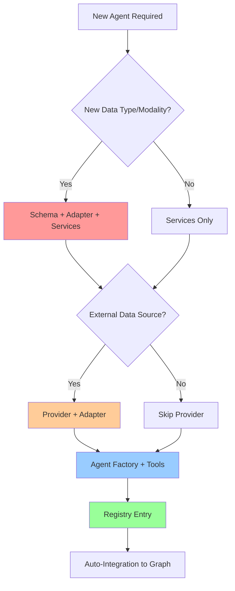

# Unified Agent Creation Template for Lobster AI

**Purpose**: AI-readable architectural guide for creating complex agents with new modalities, providers, and adapters.

**Scope**: Complete agent creation including new data types, external data sources, and analysis services.

---

## 1. COMPONENT DECISION TREE



### Component Requirements Matrix

| Scenario | Schema | Adapter | Provider | Services | Tools | Registry |
|----------|--------|---------|----------|----------|-------|----------|
| **New modality** | ✅ | ✅ | Optional | ✅ | ✅ | ✅ |
| **Existing modality + new analysis** | ❌ | ❌ | ❌ | ✅ | ✅ | ✅ |
| **New data source** | Optional | ✅ | ✅ | Optional | ✅ | ✅ |

---

## 2. EXECUTION ORDER

```
1. Schema Definition (if new modality)
   ↓
2. Adapter Implementation (if new format/modality)
   ↓
3. Provider Implementation (if external data source)
   ↓
4. Service Classes (analysis logic)
   ↓
5. Agent Factory Function
   ↓
6. Registry Entry
   ↓
7. Auto-Integration (no manual graph editing)
```

---

## 3. CODE TEMPLATES

### 3.1 Registry Entry

**File**: `lobster/config/agent_registry.py`

```python
# Add to AGENT_REGISTRY dictionary
AGENT_REGISTRY: Dict[str, AgentRegistryConfig] = {
    # ... existing agents ...

    "{{AGENT_NAME}}_expert_agent": AgentRegistryConfig(
        name="{{AGENT_NAME}}_expert_agent",
        display_name="{{DISPLAY_NAME}} Expert",
        description="""Expert in {{DOMAIN_DESCRIPTION}}.

        Capabilities:
        - {{CAPABILITY_1}}
        - {{CAPABILITY_2}}
        - {{CAPABILITY_3}}

        When to delegate:
        - {{USE_CASE_1}}
        - {{USE_CASE_2}}
        """,
        factory_function="lobster.agents.{{AGENT_MODULE}}.{{AGENT_FACTORY_FUNCTION}}",
        handoff_tool_name="handoff_to_{{AGENT_NAME}}_expert_agent",
        handoff_tool_description="""Delegate to {{DISPLAY_NAME}} Expert when:
        - {{HANDOFF_CONDITION_1}}
        - {{HANDOFF_CONDITION_2}}
        - {{HANDOFF_CONDITION_3}}
        """
    ),
}
```

**Example Values**:
```python
{{AGENT_NAME}} = "metabolomics"
{{DISPLAY_NAME}} = "Metabolomics"
{{DOMAIN_DESCRIPTION}} = "metabolomics data analysis, pathway enrichment, and metabolite identification"
{{CAPABILITY_1}} = "Load and normalize metabolomics data (targeted/untargeted)"
{{AGENT_MODULE}} = "metabolomics_expert"
{{AGENT_FACTORY_FUNCTION}} = "metabolomics_expert"
```

---

### 3.2 Agent Factory Function

**File**: `lobster/agents/{{AGENT_MODULE}}.py`

```python
"""{{DISPLAY_NAME}} Expert Agent for {{DOMAIN_DESCRIPTION}}."""

import logging
from typing import List, Optional
from langchain_core.tools import tool
from langgraph.prebuilt import create_react_agent

from lobster.config.settings import get_settings, create_llm
from lobster.core.data_manager_v2 import DataManagerV2
from lobster.core.exceptions import ModalityNotFoundError, ServiceError
from lobster.agents.state import AgentState
from lobster.tools.{{SERVICE_MODULE_1}} import {{SERVICE_CLASS_1}}
from lobster.tools.{{SERVICE_MODULE_2}} import {{SERVICE_CLASS_2}}

logger = logging.getLogger(__name__)


def {{AGENT_FACTORY_FUNCTION}}(
    data_manager: DataManagerV2,
    callback_handler=None,
    agent_name: str = "{{AGENT_NAME}}_expert_agent",
    handoff_tools: List = None,
):
    """
    Create {{DISPLAY_NAME}} expert agent.

    Args:
        data_manager: DataManagerV2 instance
        callback_handler: Optional callback handler
        agent_name: Agent identifier
        handoff_tools: Handoff tools (unused - supervisor-mediated flow)

    Returns:
        LangGraph agent configured for {{DOMAIN_DESCRIPTION}}
    """
    # Initialize LLM
    settings = get_settings()
    model_params = settings.get_agent_llm_params(agent_name)
    llm = create_llm(agent_name, model_params)

    # Normalize callbacks to a flat list (fix double-nesting bug)
    if callback_handler and hasattr(llm, "with_config"):
        callbacks = callback_handler if isinstance(callback_handler, list) else [callback_handler]
        llm = llm.with_config(callbacks=callbacks)

    # Initialize stateless services
    {{SERVICE_VAR_1}} = {{SERVICE_CLASS_1}}()
    {{SERVICE_VAR_2}} = {{SERVICE_CLASS_2}}()

    # ============================================================
    # TOOL DEFINITIONS
    # ============================================================

    @tool
    def {{TOOL_NAME_1}}(
        modality_name: str,
        {{PARAM_1}}: {{PARAM_1_TYPE}},
        {{PARAM_2}}: {{PARAM_2_TYPE}} = {{PARAM_2_DEFAULT}},
    ) -> str:
        """
        {{TOOL_DESCRIPTION_1}}.

        Args:
            modality_name: Name of the modality to analyze
            {{PARAM_1}}: {{PARAM_1_DESCRIPTION}}
            {{PARAM_2}}: {{PARAM_2_DESCRIPTION}} (default: {{PARAM_2_DEFAULT}})

        Returns:
            Formatted result string with analysis summary
        """
        try:
            # Validate modality exists
            if modality_name not in data_manager.list_modalities():
                available = ", ".join(data_manager.list_modalities())
                raise ModalityNotFoundError(
                    f"Modality '{modality_name}' not found. Available: {available}"
                )

            # Get modality data
            adata = data_manager.get_modality(modality_name)
            logger.info(f"{{TOOL_NAME_1}}: Processing {adata.n_obs} samples, {adata.n_vars} features")

            # Delegate to stateless service (3-tuple pattern)
            result_adata, stats, ir = {{SERVICE_VAR_1}}.{{SERVICE_METHOD_1}}(
                adata,
                {{PARAM_1}}={{PARAM_1}},
                {{PARAM_2}}={{PARAM_2}},
            )

            # Store result with descriptive naming
            new_modality_name = f"{modality_name}_{{SUFFIX_1}}"
            data_manager.modalities[new_modality_name] = result_adata
            logger.info(f"Stored result as '{new_modality_name}'")

            # Log tool usage with IR (MANDATORY)
            data_manager.log_tool_usage(
                tool_name="{{TOOL_NAME_1}}",
                parameters={
                    "modality_name": modality_name,
                    "{{PARAM_1}}": {{PARAM_1}},
                    "{{PARAM_2}}": {{PARAM_2}},
                },
                description=f"{{OPERATION_DESCRIPTION_1}} on {modality_name}",
                ir=ir  # IR is mandatory for reproducibility
            )

            # Format response
            return (
                f"{{OPERATION_DESCRIPTION_1}} complete.\n"
                f"Input: {modality_name} ({adata.n_obs} samples)\n"
                f"Output: {new_modality_name}\n"
                f"Stats: {stats}"
            )

        except ModalityNotFoundError as e:
            logger.error(f"{{TOOL_NAME_1}} error: {e}")
            return f"Error: {str(e)}"
        except ServiceError as e:
            logger.error(f"{{TOOL_NAME_1}} service error: {e}")
            return f"Analysis error: {str(e)}"
        except Exception as e:
            logger.error(f"{{TOOL_NAME_1}} unexpected error: {e}", exc_info=True)
            return f"Unexpected error: {str(e)}"

    @tool
    def {{TOOL_NAME_2}}(
        modality_name: str,
        {{PARAM_3}}: {{PARAM_3_TYPE}},
    ) -> str:
        """
        {{TOOL_DESCRIPTION_2}}.

        Args:
            modality_name: Name of the modality to analyze
            {{PARAM_3}}: {{PARAM_3_DESCRIPTION}}

        Returns:
            Formatted result string
        """
        try:
            if modality_name not in data_manager.list_modalities():
                available = ", ".join(data_manager.list_modalities())
                raise ModalityNotFoundError(
                    f"Modality '{modality_name}' not found. Available: {available}"
                )

            adata = data_manager.get_modality(modality_name)

            result_adata, stats, ir = {{SERVICE_VAR_2}}.{{SERVICE_METHOD_2}}(
                adata,
                {{PARAM_3}}={{PARAM_3}},
            )

            new_modality_name = f"{modality_name}_{{SUFFIX_2}}"
            data_manager.modalities[new_modality_name] = result_adata

            data_manager.log_tool_usage(
                tool_name="{{TOOL_NAME_2}}",
                parameters={
                    "modality_name": modality_name,
                    "{{PARAM_3}}": {{PARAM_3}},
                },
                description=f"{{OPERATION_DESCRIPTION_2}} on {modality_name}",
                ir=ir
            )

            return (
                f"{{OPERATION_DESCRIPTION_2}} complete.\n"
                f"Input: {modality_name}\n"
                f"Output: {new_modality_name}\n"
                f"Stats: {stats}"
            )

        except Exception as e:
            logger.error(f"{{TOOL_NAME_2}} error: {e}")
            return f"Error: {str(e)}"

    # Collect all tools
    tools = [
        {{TOOL_NAME_1}},
        {{TOOL_NAME_2}},
        # Add more tools as needed
    ]

    # System prompt
    system_prompt = """You are the {{DISPLAY_NAME}} Expert, specialized in {{DOMAIN_DESCRIPTION}}.

Your capabilities:
- {{CAPABILITY_1}}
- {{CAPABILITY_2}}
- {{CAPABILITY_3}}

Available tools:
{tool_names}

Guidelines:
1. Always validate modality existence before operations
2. Use descriptive naming for output modalities ({{AGENT_NAME}}_<suffix>)
3. Provide clear analysis summaries to users
4. Handle errors gracefully and suggest next steps
5. Follow scientific best practices for {{DOMAIN_TYPE}} data

When you complete your task, inform the user and suggest returning to the supervisor if needed.
"""

    # Create agent
    return create_react_agent(
        llm,
        tools=tools,
        state_schema=AgentState,
        state_modifier=system_prompt
    )
```

**Example Values**:
```python
{{SERVICE_MODULE_1}} = "metabolomics_preprocessing_service"
{{SERVICE_CLASS_1}} = "MetabolomicsPreprocessingService"
{{SERVICE_VAR_1}} = "preprocessing_service"
{{TOOL_NAME_1}} = "normalize_metabolomics_data"
{{PARAM_1}} = "method"
{{PARAM_1_TYPE}} = "str"
{{PARAM_2}} = "scaling"
{{PARAM_2_TYPE}} = "str"
{{PARAM_2_DEFAULT}} = "'pareto'"
{{SUFFIX_1}} = "normalized"
```

---

### 3.3 Service Class (3-Tuple Pattern)

**File**: `lobster/tools/{{SERVICE_MODULE}}.py`

```python
"""{{SERVICE_DESCRIPTION}}."""

import logging
from typing import Dict, Any, Tuple, Optional
import anndata
import numpy as np
import pandas as pd

from lobster.core.provenance import AnalysisStep, ParameterSpec
from lobster.core.exceptions import ServiceError

logger = logging.getLogger(__name__)


class {{SERVICE_CLASS}}:
    """Stateless service for {{SERVICE_PURPOSE}}."""

    def __init__(self):
        """Initialize stateless service."""
        logger.debug(f"Initializing {self.__class__.__name__}")

    def {{METHOD_NAME}}(
        self,
        adata: anndata.AnnData,
        {{PARAM_1}}: {{PARAM_1_TYPE}},
        {{PARAM_2}}: {{PARAM_2_TYPE}} = {{PARAM_2_DEFAULT}},
        {{PARAM_3}}: {{PARAM_3_TYPE}} = {{PARAM_3_DEFAULT}},
    ) -> Tuple[anndata.AnnData, Dict[str, Any], AnalysisStep]:
        """
        {{METHOD_DESCRIPTION}}.

        Args:
            adata: Input AnnData object
            {{PARAM_1}}: {{PARAM_1_DESCRIPTION}}
            {{PARAM_2}}: {{PARAM_2_DESCRIPTION}} (default: {{PARAM_2_DEFAULT}})
            {{PARAM_3}}: {{PARAM_3_DESCRIPTION}} (default: {{PARAM_3_DEFAULT}})

        Returns:
            Tuple containing:
            - processed_adata: Modified AnnData with results
            - stats: Human-readable summary dict
            - ir: AnalysisStep for provenance/notebook export

        Raises:
            ServiceError: If analysis fails
        """
        logger.info(f"{{METHOD_NAME}}: Processing {adata.n_obs} samples, {adata.n_vars} features")

        # Validate inputs
        if adata.n_obs == 0:
            raise ServiceError("Cannot process empty dataset (n_obs=0)")
        if adata.n_vars == 0:
            raise ServiceError("Cannot process dataset with no features (n_vars=0)")

        # Validate parameters
        if {{PARAM_1}} not in {{VALID_PARAM_1_VALUES}}:
            raise ServiceError(
                f"Invalid {{PARAM_1}}: {{{PARAM_1}}}. "
                f"Valid options: {{{VALID_PARAM_1_VALUES}}}"
            )

        # Create copy to avoid modifying input
        result = adata.copy()

        try:
            # ============================================================
            # ANALYSIS LOGIC
            # ============================================================

            # Step 1: {{STEP_1_DESCRIPTION}}
            {{STEP_1_CODE}}

            # Step 2: {{STEP_2_DESCRIPTION}}
            {{STEP_2_CODE}}

            # Step 3: {{STEP_3_DESCRIPTION}}
            {{STEP_3_CODE}}

            # Store results in AnnData
            result.{{RESULT_LOCATION_1}} = {{RESULT_VALUE_1}}
            result.{{RESULT_LOCATION_2}} = {{RESULT_VALUE_2}}

            # Add metadata to .uns
            result.uns['{{ANALYSIS_KEY}}'] = {
                '{{PARAM_1}}': {{PARAM_1}},
                '{{PARAM_2}}': {{PARAM_2}},
                '{{PARAM_3}}': {{PARAM_3}},
                'timestamp': pd.Timestamp.now().isoformat(),
            }

            # ============================================================
            # GENERATE STATS
            # ============================================================

            stats = {
                "operation": "{{OPERATION_NAME}}",
                "samples_processed": result.n_obs,
                "features_processed": result.n_vars,
                "{{PARAM_1}}": {{PARAM_1}},
                "{{PARAM_2}}": {{PARAM_2}},
                "{{METRIC_1}}": {{METRIC_1_VALUE}},
                "{{METRIC_2}}": {{METRIC_2_VALUE}},
            }

            logger.info(f"{{METHOD_NAME}} complete: {stats}")

            # ============================================================
            # CREATE IR (Intermediate Representation)
            # ============================================================

            ir = self._create_ir(
                {{PARAM_1}}={{PARAM_1}},
                {{PARAM_2}}={{PARAM_2}},
                {{PARAM_3}}={{PARAM_3}},
            )

            return result, stats, ir

        except Exception as e:
            logger.error(f"{{METHOD_NAME}} failed: {e}", exc_info=True)
            raise ServiceError(f"{{OPERATION_NAME}} failed: {str(e)}") from e

    def _create_ir(
        self,
        {{PARAM_1}}: {{PARAM_1_TYPE}},
        {{PARAM_2}}: {{PARAM_2_TYPE}},
        {{PARAM_3}}: {{PARAM_3_TYPE}},
    ) -> AnalysisStep:
        """
        Create Intermediate Representation for notebook export.

        Args:
            {{PARAM_1}}: {{PARAM_1_DESCRIPTION}}
            {{PARAM_2}}: {{PARAM_2_DESCRIPTION}}
            {{PARAM_3}}: {{PARAM_3_DESCRIPTION}}

        Returns:
            AnalysisStep with code template and parameter schema
        """
        # Parameter schema for Papermill injection
        parameter_schema = {
            "{{PARAM_1}}": ParameterSpec(
                param_type="{{PARAM_1_PYTHON_TYPE}}",
                papermill_injectable=True,
                default_value={{PARAM_1}},
                required={{PARAM_1_REQUIRED}},
                validation_rule="{{PARAM_1_VALIDATION}}",
                description="{{PARAM_1_DESCRIPTION}}"
            ),
            "{{PARAM_2}}": ParameterSpec(
                param_type="{{PARAM_2_PYTHON_TYPE}}",
                papermill_injectable=True,
                default_value={{PARAM_2}},
                required=False,
                validation_rule="{{PARAM_2_VALIDATION}}",
                description="{{PARAM_2_DESCRIPTION}}"
            ),
            "{{PARAM_3}}": ParameterSpec(
                param_type="{{PARAM_3_PYTHON_TYPE}}",
                papermill_injectable=True,
                default_value={{PARAM_3}},
                required=False,
                validation_rule=None,
                description="{{PARAM_3_DESCRIPTION}}"
            ),
        }

        # Jinja2 code template (ONLY STANDARD LIBRARIES)
        code_template = """# {{OPERATION_NAME}}
# {{METHOD_DESCRIPTION}}

import {{PRIMARY_LIBRARY}} as {{PRIMARY_LIBRARY_ALIAS}}
import numpy as np
import pandas as pd

# Parameters
{{PARAM_1}} = '{{ {{PARAM_1}} }}'
{{PARAM_2}} = '{{ {{PARAM_2}} }}'
{{PARAM_3}} = {{ {{PARAM_3}} }}

# Step 1: {{STEP_1_DESCRIPTION}}
{{STEP_1_TEMPLATE_CODE}}

# Step 2: {{STEP_2_DESCRIPTION}}
{{STEP_2_TEMPLATE_CODE}}

# Step 3: {{STEP_3_DESCRIPTION}}
{{STEP_3_TEMPLATE_CODE}}

# Store results
adata.{{RESULT_LOCATION_1}} = {{RESULT_VAR_1}}
adata.{{RESULT_LOCATION_2}} = {{RESULT_VAR_2}}

print(f"{{OPERATION_NAME}} complete: {adata.n_obs} samples, {adata.n_vars} features")
"""

        return AnalysisStep(
            operation="{{PRIMARY_LIBRARY}}.{{MODULE_PATH}}.{{FUNCTION_NAME}}",
            tool_name="{{METHOD_NAME}}",
            description="""## {{OPERATION_NAME}}

{{DETAILED_MARKDOWN_DESCRIPTION}}

**Parameters:**
- `{{PARAM_1}}`: {{PARAM_1_DESCRIPTION}}
- `{{PARAM_2}}`: {{PARAM_2_DESCRIPTION}}
- `{{PARAM_3}}`: {{PARAM_3_DESCRIPTION}}

**Expected Outputs:**
- {{OUTPUT_1}}
- {{OUTPUT_2}}
""",
            library="{{PRIMARY_LIBRARY}}",
            code_template=code_template,
            imports=[
                "import {{PRIMARY_LIBRARY}} as {{PRIMARY_LIBRARY_ALIAS}}",
                "import numpy as np",
                "import pandas as pd",
            ],
            parameters={
                "{{PARAM_1}}": {{PARAM_1}},
                "{{PARAM_2}}": {{PARAM_2}},
                "{{PARAM_3}}": {{PARAM_3}},
            },
            parameter_schema=parameter_schema,
            input_entities=["adata"],
            output_entities=["adata"],
            execution_context={
                "library_version": "{{PRIMARY_LIBRARY_VERSION}}",
                "method": "{{METHOD_NAME}}",
            },
            validates_on_export=True,
            exportable=True
        )
```

**Example Values**:
```python
{{SERVICE_CLASS}} = "MetabolomicsNormalizationService"
{{SERVICE_PURPOSE}} = "metabolomics data normalization and scaling"
{{METHOD_NAME}} = "normalize_and_scale"
{{METHOD_DESCRIPTION}} = "Normalize and scale metabolomics data"
{{PARAM_1}} = "method"
{{PARAM_1_TYPE}} = "str"
{{VALID_PARAM_1_VALUES}} = "['median', 'mean', 'total_sum']"
{{PRIMARY_LIBRARY}} = "sklearn.preprocessing"
{{PRIMARY_LIBRARY_ALIAS}} = "preprocessing"
```

---

### 3.4 Provider Class (External Data Source)

**File**: `lobster/tools/providers/{{PROVIDER_MODULE}}.py`

```python
"""{{PROVIDER_DESCRIPTION}}."""

import logging
from typing import Dict, Any, List, Optional
import requests
from requests.adapters import HTTPAdapter
from urllib3.util.retry import Retry

from lobster.tools.providers.base_provider import (
    BasePublicationProvider,
    PublicationSource,
    DatasetType,
    ProviderCapability,
)
from lobster.core.data_manager_v2 import DataManagerV2
from lobster.core.exceptions import ProviderError

logger = logging.getLogger(__name__)


class {{PROVIDER_CLASS}}(BasePublicationProvider):
    """
    Provider for {{DATA_SOURCE_NAME}}.

    Capabilities:
    - {{CAPABILITY_1}}
    - {{CAPABILITY_2}}
    - {{CAPABILITY_3}}
    """

    def __init__(
        self,
        data_manager: DataManagerV2,
        api_key: Optional[str] = None,
        base_url: str = "{{BASE_API_URL}}",
        rate_limit: int = {{RATE_LIMIT}},
    ):
        """
        Initialize {{PROVIDER_CLASS}}.

        Args:
            data_manager: DataManagerV2 instance
            api_key: Optional API key for authentication
            base_url: Base URL for API (default: {{BASE_API_URL}})
            rate_limit: Max requests per second (default: {{RATE_LIMIT}})
        """
        self.data_manager = data_manager
        self.api_key = api_key
        self.base_url = base_url.rstrip('/')
        self.rate_limit = rate_limit

        # Setup session with retry logic
        self.session = requests.Session()
        retries = Retry(
            total=3,
            backoff_factor=1,
            status_forcelist=[429, 500, 502, 503, 504]
        )
        self.session.mount('https://', HTTPAdapter(max_retries=retries))

        # Add API key to headers if provided
        if self.api_key:
            self.session.headers.update({
                "{{API_KEY_HEADER}}": self.api_key
            })

        logger.info(f"Initialized {self.__class__.__name__} (base_url={base_url})")

    @property
    def source(self) -> PublicationSource:
        """Return publication source identifier."""
        return PublicationSource.{{SOURCE_ENUM}}

    @property
    def supported_dataset_types(self) -> List[DatasetType]:
        """Return list of supported dataset types."""
        return [
            DatasetType.{{DATASET_TYPE_1}},
            DatasetType.{{DATASET_TYPE_2}},
        ]

    @property
    def priority(self) -> int:
        """
        Provider priority (lower = higher priority).

        Returns:
            10=high, 50=medium, 100=low
        """
        return {{PRIORITY_VALUE}}

    def get_supported_capabilities(self) -> Dict[str, bool]:
        """Return capability support mapping."""
        return {
            ProviderCapability.SEARCH_LITERATURE: {{SUPPORTS_SEARCH}},
            ProviderCapability.DISCOVER_DATASETS: {{SUPPORTS_DATASETS}},
            ProviderCapability.EXTRACT_METADATA: {{SUPPORTS_METADATA}},
            ProviderCapability.DOWNLOAD_FILES: {{SUPPORTS_DOWNLOAD}},
            ProviderCapability.PARSE_METHODS: {{SUPPORTS_METHODS}},
        }

    def search_publications(
        self,
        query: str,
        max_results: int = 5,
        filters: Optional[Dict] = None,
        **kwargs
    ) -> str:
        """
        Search for publications in {{DATA_SOURCE_NAME}}.

        Args:
            query: Search query
            max_results: Maximum results to return (default: 5)
            filters: Optional filters (e.g., date range, data type)
            **kwargs: Additional provider-specific parameters

        Returns:
            Formatted string with search results

        Raises:
            ProviderError: If search fails
        """
        logger.info(f"Searching {{DATA_SOURCE_NAME}}: query='{query}', max_results={max_results}")

        try:
            # Build API request
            params = {
                "{{QUERY_PARAM}}": query,
                "{{MAX_RESULTS_PARAM}}": max_results,
            }

            # Add filters
            if filters:
                params.update(self._build_filter_params(filters))

            # Make API request
            response = self.session.get(
                f"{self.base_url}/{{SEARCH_ENDPOINT}}",
                params=params,
                timeout=30
            )
            response.raise_for_status()

            data = response.json()

            # Parse results
            results = self._parse_search_results(data)

            # Format output
            output = f"Found {len(results)} results in {{DATA_SOURCE_NAME}}:\n\n"
            for i, result in enumerate(results, 1):
                output += f"{i}. {result['title']}\n"
                output += f"   ID: {result['id']}\n"
                output += f"   Type: {result['type']}\n"
                output += f"   URL: {result['url']}\n\n"

            return output

        except requests.exceptions.RequestException as e:
            logger.error(f"Search failed: {e}")
            raise ProviderError(f"{{DATA_SOURCE_NAME}} search failed: {str(e)}") from e

    def find_datasets_from_publication(
        self,
        identifier: str,
        dataset_types: Optional[List[DatasetType]] = None,
    ) -> str:
        """
        Find datasets linked to a publication.

        Args:
            identifier: Publication identifier (e.g., {{ID_EXAMPLE}})
            dataset_types: Optional filter for dataset types

        Returns:
            Formatted string with dataset information

        Raises:
            ProviderError: If dataset discovery fails
        """
        logger.info(f"Finding datasets for {identifier}")

        try:
            # Make API request
            response = self.session.get(
                f"{self.base_url}/{{DATASET_ENDPOINT}}/{identifier}",
                timeout=30
            )
            response.raise_for_status()

            data = response.json()
            datasets = self._parse_datasets(data, dataset_types)

            # Format output
            output = f"Found {len(datasets)} datasets for {identifier}:\n\n"
            for ds in datasets:
                output += f"- {ds['id']}: {ds['description']}\n"
                output += f"  Type: {ds['type']}\n"
                output += f"  Files: {ds['file_count']}\n"
                output += f"  Download: {ds['download_url']}\n\n"

            return output

        except requests.exceptions.RequestException as e:
            logger.error(f"Dataset discovery failed: {e}")
            raise ProviderError(f"Failed to find datasets: {str(e)}") from e

    def extract_publication_metadata(self, identifier: str) -> Dict[str, Any]:
        """
        Extract structured metadata from publication.

        Args:
            identifier: Publication identifier

        Returns:
            Dictionary with metadata

        Raises:
            ProviderError: If metadata extraction fails
        """
        logger.info(f"Extracting metadata for {identifier}")

        try:
            response = self.session.get(
                f"{self.base_url}/{{METADATA_ENDPOINT}}/{identifier}",
                timeout=30
            )
            response.raise_for_status()

            data = response.json()

            metadata = {
                "id": identifier,
                "title": data.get("{{TITLE_FIELD}}"),
                "authors": data.get("{{AUTHORS_FIELD}}", []),
                "abstract": data.get("{{ABSTRACT_FIELD}}"),
                "publication_date": data.get("{{DATE_FIELD}}"),
                "doi": data.get("{{DOI_FIELD}}"),
                "data_types": data.get("{{DATA_TYPES_FIELD}}", []),
                "organism": data.get("{{ORGANISM_FIELD}}"),
                "sample_count": data.get("{{SAMPLE_COUNT_FIELD}}"),
            }

            return metadata

        except requests.exceptions.RequestException as e:
            logger.error(f"Metadata extraction failed: {e}")
            raise ProviderError(f"Failed to extract metadata: {str(e)}") from e

    def _build_filter_params(self, filters: Dict) -> Dict:
        """Convert filters to API parameters."""
        params = {}

        if "date_range" in filters:
            params["{{DATE_START_PARAM}}"] = filters["date_range"].get("start")
            params["{{DATE_END_PARAM}}"] = filters["date_range"].get("end")

        if "data_type" in filters:
            params["{{DATA_TYPE_PARAM}}"] = filters["data_type"]

        return params

    def _parse_search_results(self, data: Dict) -> List[Dict]:
        """Parse API response into structured results."""
        results = []

        for item in data.get("{{RESULTS_KEY}}", []):
            results.append({
                "id": item["{{ID_KEY}}"],
                "title": item["{{TITLE_KEY}}"],
                "type": item["{{TYPE_KEY}}"],
                "url": item["{{URL_KEY}}"],
            })

        return results

    def _parse_datasets(
        self,
        data: Dict,
        dataset_types: Optional[List[DatasetType]] = None
    ) -> List[Dict]:
        """Parse dataset information from API response."""
        datasets = []

        for ds in data.get("{{DATASETS_KEY}}", []):
            ds_type = DatasetType(ds["{{TYPE_KEY}}"])

            # Filter by type if specified
            if dataset_types and ds_type not in dataset_types:
                continue

            datasets.append({
                "id": ds["{{ID_KEY}}"],
                "description": ds["{{DESC_KEY}}"],
                "type": ds_type,
                "file_count": ds["{{FILE_COUNT_KEY}}"],
                "download_url": ds["{{DOWNLOAD_URL_KEY}}"],
            })

        return datasets
```

**Example Values**:
```python
{{PROVIDER_CLASS}} = "MetabolomicsWorkbenchProvider"
{{DATA_SOURCE_NAME}} = "Metabolomics Workbench"
{{BASE_API_URL}} = "https://www.metabolomicsworkbench.org/rest"
{{RATE_LIMIT}} = 2
{{SOURCE_ENUM}} = "METABOLOMICS_WORKBENCH"
{{PRIORITY_VALUE}} = 50
{{API_KEY_HEADER}} = "X-API-Key"
```

---

### 3.5 Adapter Class (Format Loading)

**File**: `lobster/core/adapters/{{ADAPTER_MODULE}}.py`

```python
"""{{ADAPTER_DESCRIPTION}}."""

import logging
from pathlib import Path
from typing import Union, Dict, Any, List
import anndata
import pandas as pd
import numpy as np

from lobster.core.interfaces.modality_adapter import IModalityAdapter, ValidationResult
from lobster.core.adapters.base_adapter import BaseAdapter
from lobster.core.schemas.{{SCHEMA_MODULE}} import {{SCHEMA_CLASS}}
from lobster.core.exceptions import ValidationError

logger = logging.getLogger(__name__)


class {{ADAPTER_CLASS}}(BaseAdapter):
    """
    Adapter for {{MODALITY_TYPE}} data.

    Supports formats:
    - {{FORMAT_1}}
    - {{FORMAT_2}}
    - {{FORMAT_3}}
    """

    def __init__(
        self,
        data_type: str = "{{DEFAULT_DATA_TYPE}}",
        strict_validation: bool = False,
    ):
        """
        Initialize {{ADAPTER_CLASS}}.

        Args:
            data_type: Data subtype (e.g., {{DATA_TYPE_EXAMPLE_1}}, {{DATA_TYPE_EXAMPLE_2}})
            strict_validation: Enable strict schema validation
        """
        super().__init__(name="{{ADAPTER_CLASS}}")
        self.data_type = data_type
        self.strict_validation = strict_validation

        # Initialize validator
        self.validator = {{SCHEMA_CLASS}}.create_validator(
            schema_type=data_type,
            strict=strict_validation
        )

        logger.info(f"Initialized {self.__class__.__name__} (data_type={data_type})")

    def from_source(
        self,
        source: Union[str, Path, pd.DataFrame],
        **kwargs
    ) -> anndata.AnnData:
        """
        Load {{MODALITY_TYPE}} data from various sources.

        Args:
            source: File path, URL, or DataFrame
            **kwargs: Format-specific options
                - {{KWARG_1}}: {{KWARG_1_DESCRIPTION}}
                - {{KWARG_2}}: {{KWARG_2_DESCRIPTION}}

        Returns:
            AnnData object with validated schema

        Raises:
            ValidationError: If data cannot be loaded or validated
        """
        logger.info(f"Loading {{MODALITY_TYPE}} data from {source}")

        # Detect format and load
        if isinstance(source, pd.DataFrame):
            adata = self._from_dataframe(source, **kwargs)
        elif isinstance(source, (str, Path)):
            path = Path(source)

            if path.suffix == ".h5ad":
                adata = self._from_h5ad(path)
            elif path.suffix in [".csv", ".tsv", ".txt"]:
                adata = self._from_delimited(path, **kwargs)
            elif path.suffix in [".xlsx", ".xls"]:
                adata = self._from_excel(path, **kwargs)
            elif path.suffix == ".{{CUSTOM_FORMAT}}":
                adata = self._from_custom_format(path, **kwargs)
            else:
                raise ValidationError(f"Unsupported file format: {path.suffix}")
        else:
            raise ValidationError(f"Unsupported source type: {type(source)}")

        # Apply schema
        adata = self._apply_schema(adata, **kwargs)

        # Validate
        validation = self.validate(adata, strict=self.strict_validation)
        if not validation.is_valid and self.strict_validation:
            raise ValidationError(f"Validation failed: {validation.errors}")

        # Add provenance
        adata.uns["{{MODALITY_KEY}}_metadata"] = {
            "adapter": self.__class__.__name__,
            "data_type": self.data_type,
            "source": str(source),
            "shape": (adata.n_obs, adata.n_vars),
        }

        logger.info(f"Loaded {adata.n_obs} samples, {adata.n_vars} features")
        return adata

    def _from_h5ad(self, path: Path) -> anndata.AnnData:
        """Load from H5AD format."""
        return anndata.read_h5ad(path)

    def _from_delimited(self, path: Path, **kwargs) -> anndata.AnnData:
        """Load from CSV/TSV format."""
        # Determine separator
        sep = kwargs.get("sep", "\t" if path.suffix == ".tsv" else ",")

        # Load data
        df = pd.read_csv(path, sep=sep, index_col=0)

        # Create AnnData
        adata = anndata.AnnData(X=df.values)
        adata.obs_names = df.index
        adata.var_names = df.columns

        return adata

    def _from_excel(self, path: Path, **kwargs) -> anndata.AnnData:
        """Load from Excel format."""
        sheet_name = kwargs.get("sheet_name", 0)
        df = pd.read_excel(path, sheet_name=sheet_name, index_col=0)

        adata = anndata.AnnData(X=df.values)
        adata.obs_names = df.index
        adata.var_names = df.columns

        return adata

    def _from_dataframe(self, df: pd.DataFrame, **kwargs) -> anndata.AnnData:
        """Load from DataFrame."""
        adata = anndata.AnnData(X=df.values)
        adata.obs_names = df.index
        adata.var_names = df.columns

        return adata

    def _from_custom_format(self, path: Path, **kwargs) -> anndata.AnnData:
        """
        Load from {{CUSTOM_FORMAT}} format.

        Implement custom parsing logic here.
        """
        # Example: Parse custom format
        # data = parse_custom_format(path)
        # adata = anndata.AnnData(X=data['matrix'])
        # adata.obs = data['samples']
        # adata.var = data['features']
        raise NotImplementedError("Custom format parsing not implemented")

    def _apply_schema(self, adata: anndata.AnnData, **kwargs) -> anndata.AnnData:
        """Apply {{MODALITY_TYPE}} schema to AnnData."""
        # Add required metadata columns if missing
        if "sample_id" not in adata.obs.columns:
            adata.obs["sample_id"] = adata.obs_names

        if "feature_id" not in adata.var.columns:
            adata.var["feature_id"] = adata.var_names

        # Add modality type
        adata.uns["modality"] = "{{MODALITY_TYPE}}"
        adata.uns["data_type"] = self.data_type

        return adata

    def validate(
        self,
        adata: anndata.AnnData,
        strict: bool = False
    ) -> ValidationResult:
        """
        Validate AnnData against {{MODALITY_TYPE}} schema.

        Args:
            adata: AnnData to validate
            strict: Enable strict validation

        Returns:
            ValidationResult with errors/warnings
        """
        return self.validator.validate(adata, strict=strict)

    def get_schema(self) -> Dict[str, Any]:
        """Return expected schema definition."""
        return {{SCHEMA_CLASS}}.get_schema()

    def get_supported_formats(self) -> List[str]:
        """Return list of supported file formats."""
        return [".h5ad", ".csv", ".tsv", ".xlsx", ".{{CUSTOM_FORMAT}}"]
```

**Example Values**:
```python
{{ADAPTER_CLASS}} = "MetabolomicsAdapter"
{{MODALITY_TYPE}} = "metabolomics"
{{DEFAULT_DATA_TYPE}} = "untargeted"
{{DATA_TYPE_EXAMPLE_1}} = "targeted"
{{DATA_TYPE_EXAMPLE_2}} = "untargeted"
{{SCHEMA_MODULE}} = "metabolomics_schema"
{{SCHEMA_CLASS}} = "MetabolomicsSchema"
{{CUSTOM_FORMAT}} = "mzTab"
```

---

### 3.6 Schema Definition

**File**: `lobster/core/schemas/{{SCHEMA_MODULE}}.py`

```python
"""{{SCHEMA_DESCRIPTION}}."""

from typing import Dict, Any, List
from pydantic import BaseModel, Field


class {{SCHEMA_CLASS}}:
    """Schema definition for {{MODALITY_TYPE}} data."""

    @staticmethod
    def get_schema() -> Dict[str, Any]:
        """
        Get schema definition for {{MODALITY_TYPE}}.

        Returns:
            Dictionary with schema structure
        """
        return {
            "modality": "{{MODALITY_TYPE}}",
            "description": "{{MODALITY_DESCRIPTION}}",

            # Sample/observation metadata
            "obs": {
                "required": [],  # Usually flexible for obs
                "optional": [
                    "sample_id",
                    "{{OBS_FIELD_1}}",
                    "{{OBS_FIELD_2}}",
                    "{{OBS_FIELD_3}}",
                ],
                "types": {
                    "sample_id": "string",
                    "{{OBS_FIELD_1}}": "{{OBS_FIELD_1_TYPE}}",
                    "{{OBS_FIELD_2}}": "{{OBS_FIELD_2_TYPE}}",
                    "{{OBS_FIELD_3}}": "{{OBS_FIELD_3_TYPE}}",
                }
            },

            # Feature/variable metadata
            "var": {
                "required": [],
                "optional": [
                    "feature_id",
                    "{{VAR_FIELD_1}}",
                    "{{VAR_FIELD_2}}",
                    "{{VAR_FIELD_3}}",
                ],
                "types": {
                    "feature_id": "string",
                    "{{VAR_FIELD_1}}": "{{VAR_FIELD_1_TYPE}}",
                    "{{VAR_FIELD_2}}": "{{VAR_FIELD_2_TYPE}}",
                    "{{VAR_FIELD_3}}": "{{VAR_FIELD_3_TYPE}}",
                }
            },

            # Data layers
            "layers": {
                "optional": [
                    "raw",
                    "{{LAYER_1}}",
                    "{{LAYER_2}}",
                ]
            },

            # Multi-dimensional obs arrays
            "obsm": {
                "optional": [
                    "{{OBSM_1}}",
                    "{{OBSM_2}}",
                ]
            },

            # Multi-dimensional var arrays
            "varm": {
                "optional": [
                    "{{VARM_1}}",
                ]
            },

            # Unstructured metadata
            "uns": {
                "optional": [
                    "{{UNS_KEY_1}}",
                    "{{UNS_KEY_2}}",
                    "processing_steps",
                    "quality_metrics",
                ]
            }
        }

    @staticmethod
    def create_validator(schema_type: str = "default", strict: bool = False):
        """
        Create validator for {{MODALITY_TYPE}} data.

        Args:
            schema_type: Schema subtype
            strict: Enable strict validation

        Returns:
            Validator instance
        """
        from lobster.core.validators import SchemaValidator
        return SchemaValidator(
            schema={{SCHEMA_CLASS}}.get_schema(),
            strict=strict
        )


# Optional: Pydantic models for structured metadata
class {{METADATA_MODEL}}(BaseModel):
    """Metadata model for {{MODALITY_TYPE}}."""

    sample_id: str = Field(..., description="Unique sample identifier")
    {{OBS_FIELD_1}}: {{OBS_FIELD_1_PYTHON_TYPE}} = Field(None, description="{{OBS_FIELD_1_DESCRIPTION}}")
    {{OBS_FIELD_2}}: {{OBS_FIELD_2_PYTHON_TYPE}} = Field(None, description="{{OBS_FIELD_2_DESCRIPTION}}")
    {{OBS_FIELD_3}}: {{OBS_FIELD_3_PYTHON_TYPE}} = Field(None, description="{{OBS_FIELD_3_DESCRIPTION}}")


class {{FEATURE_MODEL}}(BaseModel):
    """Feature metadata model for {{MODALITY_TYPE}}."""

    feature_id: str = Field(..., description="Unique feature identifier")
    {{VAR_FIELD_1}}: {{VAR_FIELD_1_PYTHON_TYPE}} = Field(None, description="{{VAR_FIELD_1_DESCRIPTION}}")
    {{VAR_FIELD_2}}: {{VAR_FIELD_2_PYTHON_TYPE}} = Field(None, description="{{VAR_FIELD_2_DESCRIPTION}}")
```

**Example Values**:
```python
{{SCHEMA_CLASS}} = "MetabolomicsSchema"
{{MODALITY_TYPE}} = "metabolomics"
{{MODALITY_DESCRIPTION}} = "Metabolomics data (targeted/untargeted mass spectrometry)"
{{OBS_FIELD_1}} = "condition"
{{OBS_FIELD_1_TYPE}} = "categorical"
{{OBS_FIELD_2}} = "batch"
{{OBS_FIELD_2_TYPE}} = "string"
{{VAR_FIELD_1}} = "metabolite_name"
{{VAR_FIELD_1_TYPE}} = "string"
{{LAYER_1}} = "normalized"
{{LAYER_2}} = "scaled"
```

---

## 4. INTEGRATION CHECKLIST

### 4.1 DataManagerV2 Registration (Optional)

**When needed**: For new modality types requiring specific backends.

**File**: `lobster/core/data_manager_v2.py`

```python
# In DataManagerV2.__init__() or separate registration function
data_manager.register_modality_type(
    modality_name="{{MODALITY_TYPE}}",
    adapter={{ADAPTER_CLASS}}(data_type="{{DEFAULT_DATA_TYPE}}"),
    backend=H5ADBackend()  # or custom backend
)
```

### 4.2 Graph Integration

**No manual editing required** - handled automatically by registry.

Verify integration:
```python
from lobster.config.agent_registry import AGENT_REGISTRY
print(AGENT_REGISTRY.keys())  # Should include your agent
```

### 4.3 Settings Configuration

**File**: `lobster/config/settings.py`

Add agent-specific model parameters if needed:

```python
# In Settings class
AGENT_CONFIGS = {
    # ... existing agents ...
    "{{AGENT_NAME}}_expert_agent": {
        "model_id": "anthropic.claude-sonnet-3-5-v2:0",
        "temperature": 0.1,
        "max_tokens": 4096,
    }
}
```

---

## 5. CRITICAL RULES & ANTI-PATTERNS

### ✅ DO

1. **Return 3-tuple from services**: `(AnnData, Dict, AnalysisStep)`
2. **Always pass IR to `log_tool_usage()`**: `ir=ir` parameter is mandatory
3. **Use stateless services**: No `data_manager` in service `__init__`
4. **Validate modality existence** in tools before processing
5. **Use descriptive naming**: `{base_modality}_{operation_suffix}`
6. **Handle errors gracefully**: Catch specific exceptions, return error strings
7. **Log operations**: Use `logger` throughout
8. **Use standard libraries in IR templates**: scanpy, numpy, pandas only
9. **Document everything**: Docstrings, type hints, parameter descriptions
10. **Register agents in registry**: Single source of truth

### ❌ DON'T

1. **Don't edit `pyproject.toml`** without approval
2. **Don't manually edit `agents/graph.py`** - use registry
3. **Don't create stateful services** - services should be pure functions
4. **Don't skip IR creation** - breaks reproducibility
5. **Don't use non-standard libraries in templates** - breaks notebook export
6. **Don't modify input AnnData** - always `.copy()` first
7. **Don't create new files unnecessarily** - prefer editing existing
8. **Don't hardcode paths/credentials** - use environment variables
9. **Don't ignore validation errors** in strict mode
10. **Don't forget to add imports** to IR `imports` list

---

## 6. TESTING CHECKLIST

### Unit Tests

- [ ] Service methods return correct 3-tuple
- [ ] Service `_create_ir()` generates valid `AnalysisStep`
- [ ] IR `code_template` uses only standard libraries
- [ ] IR `parameter_schema` matches actual parameters
- [ ] Provider methods handle API errors gracefully
- [ ] Adapter loads all supported formats
- [ ] Schema validation catches invalid data
- [ ] Tools validate modality existence
- [ ] Error handling returns user-friendly messages

### Integration Tests

- [ ] Agent factory creates valid LangGraph agent
- [ ] Tools can access `data_manager` modalities
- [ ] Service calls update `data_manager` correctly
- [ ] `log_tool_usage()` records operations with IR
- [ ] Provider integrates with `DataManagerV2`
- [ ] Adapter validates against schema
- [ ] Registry entry loads agent correctly
- [ ] Graph compilation includes new agent

### End-to-End Tests

- [ ] User query routes to correct agent
- [ ] Agent calls tools successfully
- [ ] Tools invoke services and store results
- [ ] Provenance tracking captures all operations
- [ ] Notebook export generates valid Jupyter notebooks
- [ ] Exported notebooks execute without errors
- [ ] Papermill parameter injection works
- [ ] Cloud/local clients both work

### Quality Gates

- [ ] Code passes `make lint`
- [ ] Code passes `make type-check`
- [ ] Code passes `make format` (black + isort)
- [ ] Test coverage ≥85%
- [ ] Documentation complete
- [ ] CLAUDE.md updated if architectural changes
- [ ] No hardcoded credentials or paths
- [ ] Logging statements at appropriate levels
- [ ] Error messages are user-friendly

---

## 7. PLACEHOLDER REFERENCE

### Common Placeholders

```python
# Agent
{{AGENT_NAME}} = "metabolomics"
{{AGENT_MODULE}} = "metabolomics_expert"
{{AGENT_FACTORY_FUNCTION}} = "metabolomics_expert"
{{DISPLAY_NAME}} = "Metabolomics"
{{DOMAIN_DESCRIPTION}} = "metabolomics data analysis"

# Service
{{SERVICE_CLASS}} = "MetabolomicsNormalizationService"
{{SERVICE_MODULE}} = "metabolomics_normalization_service"
{{SERVICE_VAR}} = "normalization_service"
{{METHOD_NAME}} = "normalize_and_scale"
{{OPERATION_NAME}} = "Metabolomics Normalization"

# Tool
{{TOOL_NAME}} = "normalize_metabolomics_data"
{{TOOL_DESCRIPTION}} = "Normalize and scale metabolomics data"
{{SUFFIX}} = "normalized"

# Parameters
{{PARAM_1}} = "method"
{{PARAM_1_TYPE}} = "str"
{{PARAM_1_DESCRIPTION}} = "Normalization method (median, mean, total_sum)"
{{PARAM_1_DEFAULT}} = "'median'"

# Provider
{{PROVIDER_CLASS}} = "MetabolomicsWorkbenchProvider"
{{DATA_SOURCE_NAME}} = "Metabolomics Workbench"
{{BASE_API_URL}} = "https://api.example.com"

# Adapter
{{ADAPTER_CLASS}} = "MetabolomicsAdapter"
{{MODALITY_TYPE}} = "metabolomics"
{{CUSTOM_FORMAT}} = "mzTab"

# Schema
{{SCHEMA_CLASS}} = "MetabolomicsSchema"
{{SCHEMA_MODULE}} = "metabolomics_schema"
{{OBS_FIELD_1}} = "condition"
{{VAR_FIELD_1}} = "metabolite_name"

# Library
{{PRIMARY_LIBRARY}} = "sklearn.preprocessing"
{{PRIMARY_LIBRARY_ALIAS}} = "preprocessing"
```

---

## 8. EXAMPLE: COMPLETE METABOLOMICS AGENT

### 8.1 Registry Entry

```python
"metabolomics_expert_agent": AgentRegistryConfig(
    name="metabolomics_expert_agent",
    display_name="Metabolomics Expert",
    description="Expert in metabolomics data analysis",
    factory_function="lobster.agents.metabolomics_expert.metabolomics_expert",
    handoff_tool_name="handoff_to_metabolomics_expert_agent",
    handoff_tool_description="Delegate for metabolomics analysis"
),
```

### 8.2 Service Example

```python
class MetabolomicsNormalizationService:
    def normalize(self, adata, method='median') -> Tuple[AnnData, Dict, AnalysisStep]:
        result = adata.copy()

        if method == 'median':
            median = np.median(result.X, axis=0)
            result.X = result.X / median

        stats = {
            "operation": "normalization",
            "method": method,
            "samples": result.n_obs,
        }

        ir = self._create_ir(method=method)
        return result, stats, ir
```

### 8.3 Tool Example

```python
@tool
def normalize_metabolomics_data(modality_name: str, method: str = 'median') -> str:
    if modality_name not in data_manager.list_modalities():
        raise ModalityNotFoundError(f"Modality '{modality_name}' not found")

    adata = data_manager.get_modality(modality_name)
    result, stats, ir = normalization_service.normalize(adata, method=method)

    new_name = f"{modality_name}_normalized"
    data_manager.modalities[new_name] = result

    data_manager.log_tool_usage(
        tool_name="normalize_metabolomics_data",
        parameters={"modality_name": modality_name, "method": method},
        description=f"Normalized {modality_name}",
        ir=ir
    )

    return f"Normalization complete: {new_name}"
```

---

## 9. VERIFICATION COMMANDS

```bash
# After implementation
cd /Users/tyo/GITHUB/omics-os/lobster

# Check registry
python -c "from lobster.config.agent_registry import AGENT_REGISTRY; print(list(AGENT_REGISTRY.keys()))"

# Test agent import
python -c "from lobster.agents.{{AGENT_MODULE}} import {{AGENT_FACTORY_FUNCTION}}; print('Success')"

# Run tests
pytest tests/unit/agents/test_{{AGENT_MODULE}}.py -v
pytest tests/integration/test_{{AGENT_MODULE}}_integration.py -v

# Lint and format
make format
make lint
make type-check

# Full test suite
make test
```

---

## 10. ARCHITECTURAL PRINCIPLES SUMMARY

1. **Registry-Driven**: All agents registered centrally in `config/agent_registry.py`
2. **Stateless Services**: Analysis logic in pure functions, no state retention
3. **3-Tuple Pattern**: Services return `(AnnData, Dict, AnalysisStep)` always
4. **IR Mandatory**: Every operation emits `AnalysisStep` for reproducibility
5. **Supervisor-Mediated**: No direct agent handoffs, supervisor routes everything
6. **Tool Pattern**: Validate → Service → Store → Log → Return
7. **Standard Libraries**: IR templates use only scanpy/numpy/pandas
8. **Professional Naming**: Descriptive modality suffixes for clarity
9. **Schema Validation**: Optional but recommended for data quality
10. **Provenance Tracking**: W3C-PROV compliant logging throughout

---

## 11. QUICK START WORKFLOW

```bash
# 1. Create schema (if new modality)
touch lobster/core/schemas/{{SCHEMA_MODULE}}.py

# 2. Create adapter (if new modality)
touch lobster/core/adapters/{{ADAPTER_MODULE}}.py

# 3. Create provider (if external data source)
touch lobster/tools/providers/{{PROVIDER_MODULE}}.py

# 4. Create services
touch lobster/tools/{{SERVICE_MODULE_1}}.py
touch lobster/tools/{{SERVICE_MODULE_2}}.py

# 5. Create agent
touch lobster/agents/{{AGENT_MODULE}}.py

# 6. Update registry
# Edit: lobster/config/agent_registry.py

# 7. Create tests
touch tests/unit/agents/test_{{AGENT_MODULE}}.py
touch tests/integration/test_{{AGENT_MODULE}}_integration.py

# 8. Verify
python -c "from lobster.config.agent_registry import AGENT_REGISTRY; print('{{AGENT_NAME}}_expert_agent' in AGENT_REGISTRY)"

# 9. Test
pytest tests/unit/agents/test_{{AGENT_MODULE}}.py -v

# 10. Run agent
lobster chat
# User: "I need help with {{DOMAIN_DESCRIPTION}}"
```

---

**END OF TEMPLATE**

This document provides complete architectural patterns for creating complex agents with new modalities, providers, and adapters in the Lobster AI system. All components are pluggable through registries, and the 3-tuple + IR pattern ensures reproducibility across all operations.
