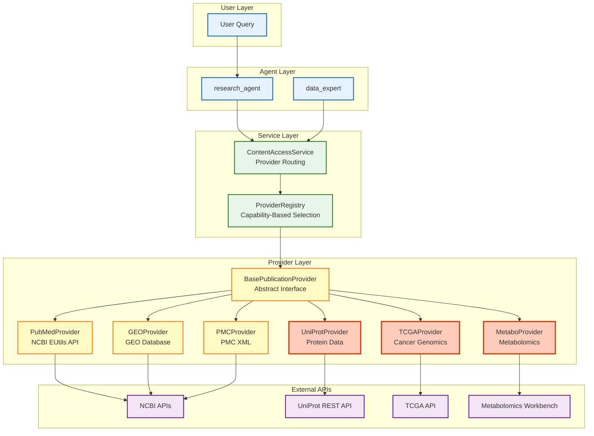

# 44. Custom Provider Development Guide

## Overview

**Custom Providers** enable Lobster AI to integrate with external data sources, APIs, and databases beyond the built-in PubMed, GEO, and PMC providers. This guide covers the complete provider development lifecycle from design to deployment.

### Why Create Custom Providers?

| Use Case | Example |
|----------|---------|
| **Proprietary Databases** | Internal company databases, lab information systems |
| **Specialized Repositories** | TCGA, ICGC, cBioPortal, Human Protein Atlas |
| **Commercial APIs** | Illumina BaseSpace, 10x Genomics Loupe, Benchling |
| **Metabolomics Data** | HMDB, MetaboLights, Metabolomics Workbench |
| **Protein Databases** | UniProt, PDB, STRING, BioGRID |
| **Spatial Omics** | 10x Visium, Nanostring GeoMx, Akoya CODEX |

### Provider Architecture



## BasePublicationProvider Architecture

### Core Interface

All providers must inherit from `BasePublicationProvider` and implement the required abstract methods:

```python
from abc import ABC, abstractmethod
from typing import List, Dict, Any, Optional
from pydantic import BaseModel

class BasePublicationProvider(ABC):
    """Abstract base class for publication providers."""

    @property
    @abstractmethod
    def source(self) -> PublicationSource:
        """Return the publication source this provider handles."""
        pass

    @property
    @abstractmethod
    def supported_dataset_types(self) -> List[DatasetType]:
        """Return list of dataset types this provider can discover."""
        pass

    @abstractmethod
    def search_publications(
        self,
        query: str,
        max_results: int = 5,
        filters: Optional[Dict[str, Any]] = None,
        **kwargs
    ) -> str:
        """Search for publications."""
        pass

    @abstractmethod
    def find_datasets_from_publication(
        self,
        identifier: str,
        dataset_types: Optional[List[DatasetType]] = None,
        **kwargs
    ) -> str:
        """Find datasets associated with a publication."""
        pass

    @abstractmethod
    def extract_publication_metadata(
        self,
        identifier: str,
        **kwargs
    ) -> PublicationMetadata:
        """Extract standardized metadata from a publication."""
        pass

    def get_supported_capabilities(self) -> Dict[str, bool]:
        """Return capabilities supported by this provider."""
        pass

    @property
    def priority(self) -> int:
        """Return provider priority for capability-based routing."""
        return 100  # Lower = higher priority
```

### Provider Capabilities

The `ProviderCapability` class defines standard operations:

```python
class ProviderCapability:
    """Standard capability identifiers."""

    SEARCH_LITERATURE = "search_literature"
    DISCOVER_DATASETS = "discover_datasets"
    FIND_LINKED_DATASETS = "find_linked_datasets"
    EXTRACT_METADATA = "extract_metadata"
    VALIDATE_METADATA = "validate_metadata"
    QUERY_CAPABILITIES = "query_capabilities"
    GET_ABSTRACT = "get_abstract"
    GET_FULL_CONTENT = "get_full_content"
    EXTRACT_METHODS = "extract_methods"
    EXTRACT_PDF = "extract_pdf"
    INTEGRATE_MULTI_OMICS = "integrate_multi_omics"
```

### Provider Priority System

Providers are selected by the `ProviderRegistry` based on capability and priority:

| Priority | Use Case | Examples |
|----------|----------|----------|
| **10** | High priority (fast, authoritative) | NCBI APIs, official databases |
| **50** | Medium priority (fallback) | Web scraping, secondary sources |
| **100** | Low priority (slow or last-resort) | PDF extraction, manual parsing |

## Step-by-Step Tutorial: Create UniProt Provider

### Step 1: Define Provider Class

Create a new file: `lobster/tools/providers/uniprot_provider.py`

```python
"""
UniProt Protein Database Provider.

This provider integrates with the UniProt REST API to fetch protein
information including sequences, functions, annotations, and structures.
"""

from typing import Any, Dict, List, Optional
import requests
import logging

from lobster.tools.providers.base_provider import (
    BasePublicationProvider,
    PublicationSource,
    DatasetType,
    PublicationMetadata,
    ProviderCapability
)

logger = logging.getLogger(__name__)


class UniProtProvider(BasePublicationProvider):
    """
    Provider for UniProt protein database.

    Capabilities:
    - Search proteins by name, gene, organism
    - Fetch protein sequences and annotations
    - Extract functional information
    - Find related protein-protein interactions
    """

    def __init__(self, api_key: Optional[str] = None, timeout: int = 30):
        """
        Initialize UniProt provider.

        Args:
            api_key: Optional API key (UniProt is public, no key required)
            timeout: Request timeout in seconds
        """
        self.base_url = "https://rest.uniprot.org"
        self.api_key = api_key
        self.timeout = timeout
        logger.info(f"Initialized UniProtProvider with base URL: {self.base_url}")

    @property
    def source(self) -> PublicationSource:
        """Return the publication source."""
        # Note: UniProt is not in default PublicationSource enum
        # For custom providers, you may need to extend the enum or use a string
        return "UniProt"  # Or extend PublicationSource enum

    @property
    def supported_dataset_types(self) -> List[DatasetType]:
        """Return supported dataset types."""
        # UniProt provides protein data, not traditional datasets
        return []

    @property
    def priority(self) -> int:
        """High priority for protein queries."""
        return 10  # Fast, authoritative source

    def get_supported_capabilities(self) -> Dict[str, bool]:
        """Return capabilities supported by this provider."""
        return {
            ProviderCapability.SEARCH_LITERATURE: True,
            ProviderCapability.DISCOVER_DATASETS: False,
            ProviderCapability.FIND_LINKED_DATASETS: True,
            ProviderCapability.EXTRACT_METADATA: True,
            ProviderCapability.VALIDATE_METADATA: False,
            ProviderCapability.QUERY_CAPABILITIES: True,
            ProviderCapability.GET_ABSTRACT: True,
            ProviderCapability.GET_FULL_CONTENT: True,
            ProviderCapability.EXTRACT_METHODS: False,
            ProviderCapability.EXTRACT_PDF: False,
            ProviderCapability.INTEGRATE_MULTI_OMICS: True,
        }

    def search_publications(
        self,
        query: str,
        max_results: int = 5,
        filters: Optional[Dict[str, Any]] = None,
        **kwargs
    ) -> str:
        """
        Search UniProt for proteins.

        Args:
            query: Search query (protein name, gene, or accession)
            max_results: Maximum number of results
            filters: Optional filters (organism, reviewed status)

        Returns:
            str: Formatted search results
        """
        try:
            # Build UniProt query
            params = {
                "query": query,
                "format": "json",
                "size": max_results
            }

            # Apply filters
            if filters:
                if "organism" in filters:
                    params["query"] += f" AND organism_id:{filters['organism']}"
                if "reviewed" in filters:
                    params["query"] += " AND reviewed:true"

            # Make API request
            response = requests.get(
                f"{self.base_url}/uniprotkb/search",
                params=params,
                timeout=self.timeout
            )
            response.raise_for_status()

            data = response.json()
            results = data.get("results", [])

            # Format results
            formatted = f"## UniProt Search Results\n\n"
            formatted += f"**Query**: {query}\n"
            formatted += f"**Results**: {len(results)} proteins found\n\n"

            for i, protein in enumerate(results, 1):
                accession = protein.get("primaryAccession", "N/A")
                name = protein.get("uniProtkbId", "N/A")
                organism = protein.get("organism", {}).get("scientificName", "N/A")
                gene = protein.get("genes", [{}])[0].get("geneName", {}).get("value", "N/A")

                formatted += f"### Result {i}/{len(results)}\n"
                formatted += f"**Accession**: [{accession}](https://www.uniprot.org/uniprot/{accession})\n"
                formatted += f"**Protein**: {name}\n"
                formatted += f"**Gene**: {gene}\n"
                formatted += f"**Organism**: {organism}\n"

                # Extract protein function
                comments = protein.get("comments", [])
                for comment in comments:
                    if comment.get("commentType") == "FUNCTION":
                        function_text = comment.get("texts", [{}])[0].get("value", "")
                        if function_text:
                            formatted += f"**Function**: {function_text[:200]}...\n"
                            break

                formatted += "\n---\n\n"

            logger.info(f"UniProt search returned {len(results)} results for query: {query}")
            return formatted

        except requests.exceptions.RequestException as e:
            logger.error(f"UniProt API request failed: {e}")
            return f"Error searching UniProt: {str(e)}"

    def find_datasets_from_publication(
        self,
        identifier: str,
        dataset_types: Optional[List[DatasetType]] = None,
        **kwargs
    ) -> str:
        """
        Find related proteins by accession or gene name.

        Args:
            identifier: Protein accession (e.g., P04637) or gene name
            dataset_types: Not used for UniProt

        Returns:
            str: Formatted related protein information
        """
        try:
            # Fetch protein entry
            response = requests.get(
                f"{self.base_url}/uniprotkb/{identifier}.json",
                timeout=self.timeout
            )
            response.raise_for_status()

            protein = response.json()

            # Extract protein-protein interactions
            formatted = f"## Related Proteins for {identifier}\n\n"

            # Check for interactions in comments
            comments = protein.get("comments", [])
            for comment in comments:
                if comment.get("commentType") == "INTERACTION":
                    interactions = comment.get("interactions", [])
                    formatted += f"**Protein-Protein Interactions**: {len(interactions)} found\n\n"

                    for interaction in interactions[:5]:  # Limit to 5
                        interactor = interaction.get("interactantOne", {})
                        interactor_id = interactor.get("uniProtKBAccession", "N/A")
                        interactor_gene = interactor.get("geneName", "N/A")

                        formatted += f"- **{interactor_gene}** ({interactor_id})\n"

            # Extract cross-references (links to other databases)
            xrefs = protein.get("uniProtKBCrossReferences", [])
            formatted += f"\n**Cross-References**: {len(xrefs)} database links\n\n"

            for xref in xrefs[:10]:  # Limit to 10
                db_name = xref.get("database", "N/A")
                db_id = xref.get("id", "N/A")
                formatted += f"- **{db_name}**: {db_id}\n"

            return formatted

        except requests.exceptions.RequestException as e:
            logger.error(f"UniProt fetch failed for {identifier}: {e}")
            return f"Error fetching UniProt entry: {str(e)}"

    def extract_publication_metadata(
        self,
        identifier: str,
        **kwargs
    ) -> PublicationMetadata:
        """
        Extract protein metadata.

        Args:
            identifier: Protein accession

        Returns:
            PublicationMetadata: Standardized metadata
        """
        try:
            response = requests.get(
                f"{self.base_url}/uniprotkb/{identifier}.json",
                timeout=self.timeout
            )
            response.raise_for_status()

            protein = response.json()

            # Build metadata
            accession = protein.get("primaryAccession", "")
            name = protein.get("uniProtkbId", "")
            gene = protein.get("genes", [{}])[0].get("geneName", {}).get("value", "")
            organism = protein.get("organism", {}).get("scientificName", "")

            # Extract function description
            function_text = ""
            for comment in protein.get("comments", []):
                if comment.get("commentType") == "FUNCTION":
                    function_text = comment.get("texts", [{}])[0].get("value", "")
                    break

            # Extract publication references
            references = protein.get("references", [])
            pmids = []
            for ref in references:
                citation = ref.get("citation", {})
                xrefs = citation.get("citationCrossReferences", [])
                for xref in xrefs:
                    if xref.get("database") == "PubMed":
                        pmids.append(xref.get("id"))

            metadata = PublicationMetadata(
                uid=accession,
                title=f"{name} ({gene}) - {organism}",
                journal="UniProt Database",
                published=None,
                doi=None,
                pmid=pmids[0] if pmids else None,
                abstract=function_text,
                authors=[],
                keywords=[gene, organism, "protein"]
            )

            logger.info(f"Extracted metadata for UniProt entry: {accession}")
            return metadata

        except requests.exceptions.RequestException as e:
            logger.error(f"Failed to extract metadata for {identifier}: {e}")
            raise ValueError(f"UniProt metadata extraction failed: {e}")

    def validate_identifier(self, identifier: str) -> bool:
        """
        Validate UniProt accession format.

        Args:
            identifier: Protein accession to validate

        Returns:
            bool: True if valid UniProt accession
        """
        # UniProt accessions: 6 or 10 alphanumeric characters
        # Examples: P04637, A0A024R1R8
        import re
        pattern = r'^[A-Z][0-9][A-Z0-9]{3}[0-9]$|^[A-Z][0-9][A-Z0-9]{3}[0-9][A-Z][A-Z0-9]{2}[0-9]$'
        return bool(re.match(pattern, identifier))
```

### Step 2: Register with ProviderRegistry

Create registration function in `lobster/tools/providers/__init__.py`:

```python
from lobster.tools.providers.provider_registry import ProviderRegistry
from lobster.tools.providers.uniprot_provider import UniProtProvider

def register_uniprot_provider(registry: ProviderRegistry):
    """Register UniProt provider with the registry."""
    provider = UniProtProvider()
    registry.register_provider(provider)
    print(f"✅ Registered UniProtProvider")
```

Update `lobster/tools/providers/provider_registry.py` to include the new provider:

```python
# In ProviderRegistry.__init__()
from lobster.tools.providers import register_uniprot_provider

# Register built-in providers
self._register_builtin_providers()

# Register custom providers
register_uniprot_provider(self)
```

### Step 3: Integration with research_agent

The `research_agent` automatically discovers registered providers via `ProviderRegistry`:

```python
# In research_agent.py
from lobster.tools.providers.provider_registry import ProviderRegistry

@tool
def search_protein_database(query: str, max_results: int = 5) -> str:
    """Search protein databases for information."""
    registry = ProviderRegistry()

    # Get providers that support literature search
    providers = registry.get_providers_by_capability(ProviderCapability.SEARCH_LITERATURE)

    # Filter for protein-specific providers
    protein_providers = [p for p in providers if "UniProt" in str(p.source)]

    if not protein_providers:
        return "No protein database providers available"

    # Use highest priority provider
    provider = protein_providers[0]
    return provider.search_publications(query, max_results=max_results)
```

### Step 4: Testing Custom Providers

Create comprehensive tests in `tests/unit/tools/providers/test_uniprot_provider.py`:

```python
"""Unit tests for UniProtProvider."""

import pytest
from unittest.mock import Mock, patch
import requests

from lobster.tools.providers.uniprot_provider import UniProtProvider
from lobster.tools.providers.base_provider import ProviderCapability


@pytest.fixture
def uniprot_provider():
    """Create UniProtProvider instance for testing."""
    return UniProtProvider(timeout=10)


@pytest.fixture
def mock_uniprot_response():
    """Mock UniProt API response."""
    return {
        "results": [
            {
                "primaryAccession": "P04637",
                "uniProtkbId": "P53_HUMAN",
                "organism": {"scientificName": "Homo sapiens"},
                "genes": [{"geneName": {"value": "TP53"}}],
                "comments": [
                    {
                        "commentType": "FUNCTION",
                        "texts": [{"value": "Tumor suppressor protein that regulates..."}]
                    }
                ]
            }
        ]
    }


def test_provider_initialization(uniprot_provider):
    """Test provider initialization."""
    assert uniprot_provider.base_url == "https://rest.uniprot.org"
    assert uniprot_provider.timeout == 10
    assert uniprot_provider.priority == 10


def test_supported_capabilities(uniprot_provider):
    """Test capability declaration."""
    capabilities = uniprot_provider.get_supported_capabilities()

    assert capabilities[ProviderCapability.SEARCH_LITERATURE] is True
    assert capabilities[ProviderCapability.DISCOVER_DATASETS] is False
    assert capabilities[ProviderCapability.EXTRACT_METADATA] is True


def test_search_publications_success(uniprot_provider, mock_uniprot_response):
    """Test successful protein search."""
    with patch('requests.get') as mock_get:
        mock_response = Mock()
        mock_response.json.return_value = mock_uniprot_response
        mock_response.raise_for_status = Mock()
        mock_get.return_value = mock_response

        result = uniprot_provider.search_publications("TP53", max_results=5)

        assert "UniProt Search Results" in result
        assert "P04637" in result
        assert "P53_HUMAN" in result
        assert "TP53" in result


def test_search_with_organism_filter(uniprot_provider, mock_uniprot_response):
    """Test search with organism filter."""
    with patch('requests.get') as mock_get:
        mock_response = Mock()
        mock_response.json.return_value = mock_uniprot_response
        mock_response.raise_for_status = Mock()
        mock_get.return_value = mock_response

        filters = {"organism": "9606"}  # Homo sapiens
        result = uniprot_provider.search_publications("kinase", filters=filters)

        # Verify filter was applied in query
        call_args = mock_get.call_args
        assert "organism_id:9606" in call_args[1]['params']['query']


def test_extract_metadata_success(uniprot_provider):
    """Test metadata extraction."""
    mock_protein = {
        "primaryAccession": "P04637",
        "uniProtkbId": "P53_HUMAN",
        "genes": [{"geneName": {"value": "TP53"}}],
        "organism": {"scientificName": "Homo sapiens"},
        "comments": [
            {
                "commentType": "FUNCTION",
                "texts": [{"value": "Tumor suppressor protein"}]
            }
        ],
        "references": [
            {
                "citation": {
                    "citationCrossReferences": [
                        {"database": "PubMed", "id": "12345678"}
                    ]
                }
            }
        ]
    }

    with patch('requests.get') as mock_get:
        mock_response = Mock()
        mock_response.json.return_value = mock_protein
        mock_response.raise_for_status = Mock()
        mock_get.return_value = mock_response

        metadata = uniprot_provider.extract_publication_metadata("P04637")

        assert metadata.uid == "P04637"
        assert "TP53" in metadata.title
        assert metadata.pmid == "12345678"
        assert "Tumor suppressor" in metadata.abstract


def test_validate_identifier_valid(uniprot_provider):
    """Test identifier validation with valid accessions."""
    assert uniprot_provider.validate_identifier("P04637") is True
    assert uniprot_provider.validate_identifier("A0A024R1R8") is True


def test_validate_identifier_invalid(uniprot_provider):
    """Test identifier validation with invalid accessions."""
    assert uniprot_provider.validate_identifier("invalid") is False
    assert uniprot_provider.validate_identifier("12345") is False
    assert uniprot_provider.validate_identifier("") is False


def test_api_timeout_handling(uniprot_provider):
    """Test timeout error handling."""
    with patch('requests.get') as mock_get:
        mock_get.side_effect = requests.exceptions.Timeout("Request timed out")

        result = uniprot_provider.search_publications("test")

        assert "Error searching UniProt" in result
        assert "timed out" in result


def test_api_connection_error(uniprot_provider):
    """Test connection error handling."""
    with patch('requests.get') as mock_get:
        mock_get.side_effect = requests.exceptions.ConnectionError("Connection failed")

        result = uniprot_provider.search_publications("test")

        assert "Error searching UniProt" in result


@pytest.mark.real_api
def test_real_uniprot_search():
    """Integration test with real UniProt API (requires network)."""
    provider = UniProtProvider()

    # Search for TP53 (should always return results)
    result = provider.search_publications("TP53", max_results=3)

    assert "UniProt Search Results" in result
    assert "TP53" in result or "P53" in result
```

### Step 5: Create Integration Tests

Create `tests/integration/test_uniprot_integration.py`:

```python
"""Integration tests for UniProtProvider with real API."""

import pytest
from lobster.tools.providers.uniprot_provider import UniProtProvider
from lobster.tools.providers.provider_registry import ProviderRegistry


@pytest.mark.real_api
class TestUniProtIntegration:
    """Integration tests requiring network access."""

    def test_search_cancer_protein(self):
        """Test searching for cancer-related protein."""
        provider = UniProtProvider()

        result = provider.search_publications("BRCA1 human", max_results=3)

        assert "UniProt Search Results" in result
        assert "BRCA1" in result
        assert len(result) > 100  # Should have substantial content

    def test_fetch_protein_by_accession(self):
        """Test fetching protein by known accession."""
        provider = UniProtProvider()

        result = provider.find_datasets_from_publication("P04637")  # TP53

        assert "Related Proteins" in result
        assert "P04637" in result

    def test_provider_registration(self):
        """Test provider registration with registry."""
        registry = ProviderRegistry()

        # Register provider
        provider = UniProtProvider()
        registry.register_provider(provider)

        # Verify registration
        assert len(registry._providers) > 0

        # Search via registry
        from lobster.tools.providers.base_provider import ProviderCapability
        search_providers = registry.get_providers_by_capability(
            ProviderCapability.SEARCH_LITERATURE
        )

        assert any("UniProt" in str(p.source) for p in search_providers)
```

## Real-World Examples

### Example 1: TCGA Cancer Genomics Provider

```python
"""TCGA (The Cancer Genome Atlas) Provider."""

from typing import Any, Dict, List, Optional
import requests

from lobster.tools.providers.base_provider import (
    BasePublicationProvider,
    DatasetType,
    DatasetMetadata,
    ProviderCapability
)


class TCGAProvider(BasePublicationProvider):
    """Provider for TCGA cancer genomics data."""

    def __init__(self):
        self.base_url = "https://api.gdc.cancer.gov"
        self.data_portal = "https://portal.gdc.cancer.gov"

    @property
    def source(self) -> str:
        return "TCGA"

    @property
    def supported_dataset_types(self) -> List[DatasetType]:
        return [DatasetType.GEO, DatasetType.BIOPROJECT]

    @property
    def priority(self) -> int:
        return 15  # High priority for cancer data

    def get_supported_capabilities(self) -> Dict[str, bool]:
        return {
            ProviderCapability.SEARCH_LITERATURE: True,
            ProviderCapability.DISCOVER_DATASETS: True,
            ProviderCapability.FIND_LINKED_DATASETS: True,
            ProviderCapability.EXTRACT_METADATA: True,
            ProviderCapability.VALIDATE_METADATA: True,
        }

    def search_publications(
        self,
        query: str,
        max_results: int = 5,
        filters: Optional[Dict[str, Any]] = None,
        **kwargs
    ) -> str:
        """Search TCGA for cancer datasets."""
        try:
            # Build GDC query
            payload = {
                "filters": {
                    "op": "and",
                    "content": [
                        {"op": "in", "content": {"field": "cases.project.project_id", "value": ["TCGA-*"]}}
                    ]
                },
                "size": max_results,
                "fields": "cases.project.project_id,cases.project.name,cases.case_id"
            }

            # Add disease filter if provided
            if filters and "disease" in filters:
                payload["filters"]["content"].append({
                    "op": "=",
                    "content": {
                        "field": "cases.project.disease_type",
                        "value": filters["disease"]
                    }
                })

            response = requests.post(
                f"{self.base_url}/cases",
                json=payload,
                headers={"Content-Type": "application/json"}
            )
            response.raise_for_status()

            data = response.json()
            hits = data.get("data", {}).get("hits", [])

            # Format results
            formatted = f"## TCGA Search Results\n\n"
            formatted += f"**Query**: {query}\n"
            formatted += f"**Results**: {len(hits)} cases found\n\n"

            for i, case in enumerate(hits, 1):
                project = case.get("project", {})
                project_id = project.get("project_id", "N/A")
                project_name = project.get("name", "N/A")
                case_id = case.get("case_id", "N/A")

                formatted += f"### Result {i}/{len(hits)}\n"
                formatted += f"**Project**: {project_name}\n"
                formatted += f"**Project ID**: {project_id}\n"
                formatted += f"**Case ID**: {case_id}\n"
                formatted += f"**Portal URL**: {self.data_portal}/cases/{case_id}\n\n"
                formatted += "---\n\n"

            return formatted

        except requests.exceptions.RequestException as e:
            return f"Error searching TCGA: {str(e)}"

    # Implement other required methods...
```

### Example 2: Metabolomics Workbench Provider

```python
"""Metabolomics Workbench Provider."""

import requests
from typing import Any, Dict, List, Optional

from lobster.tools.providers.base_provider import (
    BasePublicationProvider,
    DatasetMetadata,
    ProviderCapability
)


class MetabolomicsWorkbenchProvider(BasePublicationProvider):
    """Provider for Metabolomics Workbench data."""

    def __init__(self):
        self.base_url = "https://www.metabolomicsworkbench.org/rest"

    @property
    def source(self) -> str:
        return "MetabolomicsWorkbench"

    @property
    def supported_dataset_types(self) -> List[str]:
        return ["metabolomics"]

    @property
    def priority(self) -> int:
        return 10

    def get_supported_capabilities(self) -> Dict[str, bool]:
        return {
            ProviderCapability.SEARCH_LITERATURE: True,
            ProviderCapability.DISCOVER_DATASETS: True,
            ProviderCapability.EXTRACT_METADATA: True,
        }

    def search_publications(
        self,
        query: str,
        max_results: int = 5,
        filters: Optional[Dict[str, Any]] = None,
        **kwargs
    ) -> str:
        """Search Metabolomics Workbench for studies."""
        try:
            # Query API
            response = requests.get(
                f"{self.base_url}/study/study_id/txt",
                params={"search_term": query, "limit": max_results}
            )
            response.raise_for_status()

            # Parse response
            studies = response.text.strip().split('\n')

            formatted = f"## Metabolomics Workbench Search Results\n\n"
            formatted += f"**Query**: {query}\n"
            formatted += f"**Results**: {len(studies)} studies found\n\n"

            for i, study_id in enumerate(studies, 1):
                # Fetch study details
                detail_response = requests.get(
                    f"{self.base_url}/study/study_id/{study_id}/summary/txt"
                )

                if detail_response.status_code == 200:
                    summary = detail_response.text

                    formatted += f"### Result {i}/{len(studies)}\n"
                    formatted += f"**Study ID**: [{study_id}](https://www.metabolomicsworkbench.org/data/DRCCMetadata.php?Mode=Study&StudyID={study_id})\n"
                    formatted += f"**Summary**: {summary[:200]}...\n\n"
                    formatted += "---\n\n"

            return formatted

        except requests.exceptions.RequestException as e:
            return f"Error searching Metabolomics Workbench: {e}"

    # Implement other required methods...
```

### Example 3: Company Internal Database Provider

```python
"""Internal Company Database Provider (Example)."""

import requests
from typing import Any, Dict, List, Optional

from lobster.tools.providers.base_provider import (
    BasePublicationProvider,
    ProviderCapability
)


class CompanyInternalProvider(BasePublicationProvider):
    """Provider for internal company databases."""

    def __init__(self, api_url: str, api_token: str):
        """
        Initialize internal provider.

        Args:
            api_url: Company API base URL
            api_token: Authentication token
        """
        self.base_url = api_url
        self.headers = {
            "Authorization": f"Bearer {api_token}",
            "Content-Type": "application/json"
        }

    @property
    def source(self) -> str:
        return "CompanyInternal"

    @property
    def supported_dataset_types(self) -> List[str]:
        return ["internal_experiment", "lab_data"]

    @property
    def priority(self) -> int:
        return 5  # Highest priority for internal data

    def get_supported_capabilities(self) -> Dict[str, bool]:
        return {
            ProviderCapability.SEARCH_LITERATURE: True,
            ProviderCapability.DISCOVER_DATASETS: True,
            ProviderCapability.EXTRACT_METADATA: True,
            ProviderCapability.VALIDATE_METADATA: True,
        }

    def search_publications(
        self,
        query: str,
        max_results: int = 5,
        filters: Optional[Dict[str, Any]] = None,
        **kwargs
    ) -> str:
        """Search internal database."""
        try:
            payload = {
                "query": query,
                "limit": max_results,
                "filters": filters or {}
            }

            response = requests.post(
                f"{self.base_url}/api/experiments/search",
                json=payload,
                headers=self.headers
            )
            response.raise_for_status()

            data = response.json()
            experiments = data.get("experiments", [])

            formatted = f"## Internal Database Search Results\n\n"
            formatted += f"**Query**: {query}\n"
            formatted += f"**Results**: {len(experiments)} experiments found\n\n"

            for i, exp in enumerate(experiments, 1):
                exp_id = exp.get("experiment_id")
                title = exp.get("title")
                researcher = exp.get("researcher")
                date = exp.get("date")

                formatted += f"### Result {i}/{len(experiments)}\n"
                formatted += f"**Experiment ID**: {exp_id}\n"
                formatted += f"**Title**: {title}\n"
                formatted += f"**Researcher**: {researcher}\n"
                formatted += f"**Date**: {date}\n\n"
                formatted += "---\n\n"

            return formatted

        except requests.exceptions.RequestException as e:
            return f"Error searching internal database: {e}"

    # Implement other required methods...
```

## Best Practices

### 1. Rate Limiting

Always respect API rate limits to avoid being blocked:

```python
import time
from functools import wraps

def rate_limited(max_per_second: float):
    """Decorator to rate limit API calls."""
    min_interval = 1.0 / max_per_second

    def decorator(func):
        last_called = [0.0]

        @wraps(func)
        def wrapper(*args, **kwargs):
            elapsed = time.time() - last_called[0]
            left_to_wait = min_interval - elapsed

            if left_to_wait > 0:
                time.sleep(left_to_wait)

            result = func(*args, **kwargs)
            last_called[0] = time.time()
            return result

        return wrapper
    return decorator


class RateLimitedProvider(BasePublicationProvider):
    """Provider with rate limiting."""

    @rate_limited(max_per_second=3)  # Max 3 requests/second
    def search_publications(self, query: str, **kwargs) -> str:
        # API call here
        pass
```

### 2. Caching Responses

Cache API responses to reduce redundant calls:

```python
from functools import lru_cache
import hashlib
import json

class CachedProvider(BasePublicationProvider):
    """Provider with response caching."""

    @lru_cache(maxsize=128)
    def _cached_search(self, query_hash: str, max_results: int) -> str:
        """Internal cached search method."""
        # Actual API call
        pass

    def search_publications(self, query: str, max_results: int = 5, **kwargs) -> str:
        """Search with caching."""
        # Create cache key
        query_hash = hashlib.md5(query.encode()).hexdigest()

        # Use cached version
        return self._cached_search(query_hash, max_results)
```

### 3. Error Handling

Implement robust error handling:

```python
import logging
from requests.exceptions import HTTPError, Timeout, ConnectionError

logger = logging.getLogger(__name__)

class RobustProvider(BasePublicationProvider):
    """Provider with comprehensive error handling."""

    def search_publications(self, query: str, **kwargs) -> str:
        """Search with error handling."""
        try:
            response = requests.get(self.api_url, params={"q": query})
            response.raise_for_status()
            return self._format_results(response.json())

        except HTTPError as e:
            if e.response.status_code == 429:
                logger.warning("Rate limit exceeded, waiting...")
                time.sleep(60)
                return self.search_publications(query, **kwargs)
            elif e.response.status_code == 404:
                return "No results found"
            else:
                logger.error(f"HTTP error: {e}")
                return f"API error: {e.response.status_code}"

        except Timeout:
            logger.error("Request timed out")
            return "Request timed out - try again later"

        except ConnectionError as e:
            logger.error(f"Connection error: {e}")
            return "Could not connect to API"

        except Exception as e:
            logger.error(f"Unexpected error: {e}")
            return f"Unexpected error: {str(e)}"
```

### 4. Authentication Patterns

Handle various authentication methods:

```python
class AuthenticatedProvider(BasePublicationProvider):
    """Provider with flexible authentication."""

    def __init__(
        self,
        auth_method: str = "api_key",
        api_key: Optional[str] = None,
        username: Optional[str] = None,
        password: Optional[str] = None,
        oauth_token: Optional[str] = None
    ):
        """
        Initialize with authentication.

        Args:
            auth_method: "api_key", "basic", or "oauth"
            api_key: API key for api_key method
            username: Username for basic auth
            password: Password for basic auth
            oauth_token: OAuth bearer token
        """
        self.auth_method = auth_method

        if auth_method == "api_key":
            self.headers = {"X-API-Key": api_key}
        elif auth_method == "basic":
            from requests.auth import HTTPBasicAuth
            self.auth = HTTPBasicAuth(username, password)
        elif auth_method == "oauth":
            self.headers = {"Authorization": f"Bearer {oauth_token}"}

    def _make_request(self, url: str, **kwargs):
        """Make authenticated request."""
        if self.auth_method == "basic":
            return requests.get(url, auth=self.auth, **kwargs)
        else:
            return requests.get(url, headers=self.headers, **kwargs)
```

### 5. Logging for Debugging

Implement comprehensive logging:

```python
import logging

logger = logging.getLogger(__name__)

class LoggingProvider(BasePublicationProvider):
    """Provider with detailed logging."""

    def search_publications(self, query: str, **kwargs) -> str:
        """Search with logging."""
        logger.info(f"Searching for: {query}")
        logger.debug(f"Parameters: {kwargs}")

        start_time = time.time()

        try:
            response = requests.get(self.api_url, params={"q": query})
            response.raise_for_status()

            elapsed = time.time() - start_time
            logger.info(f"Search completed in {elapsed:.2f}s")

            results = response.json()
            logger.debug(f"Received {len(results)} results")

            return self._format_results(results)

        except Exception as e:
            logger.error(f"Search failed: {e}", exc_info=True)
            raise
```

## Deployment

### Package as Plugin

Create a separate package for your custom provider:

```
lobster-uniprot-provider/
├── setup.py
├── README.md
├── LICENSE
├── lobster_uniprot/
│   ├── __init__.py
│   ├── provider.py
│   └── tests/
│       ├── __init__.py
│       └── test_provider.py
└── requirements.txt
```

**setup.py:**
```python
from setuptools import setup, find_packages

setup(
    name="lobster-uniprot-provider",
    version="1.0.0",
    description="UniProt provider for Lobster AI",
    author="Your Name",
    author_email="your@email.com",
    packages=find_packages(),
    install_requires=[
        "lobster>=2.4.0",
        "requests>=2.28.0",
    ],
    entry_points={
        "lobster.providers": [
            "uniprot = lobster_uniprot.provider:UniProtProvider"
        ]
    },
    classifiers=[
        "Development Status :: 4 - Beta",
        "Intended Audience :: Science/Research",
        "Topic :: Scientific/Engineering :: Bio-Informatics",
    ]
)
```

**Install as Plugin:**
```bash
pip install lobster-uniprot-provider

# Provider is automatically discovered via entry points
```

## Related Documentation

- **[19. Agent System](19-agent-system.md)** - Multi-agent architecture
- **[37. Publication Intelligence Deep Dive](37-publication-intelligence-deep-dive.md)** - ContentAccessService and provider routing
- **[09. Creating Agents](09-creating-agents.md)** - Custom agent development
- **[10. Creating Services](10-creating-services.md)** - Service pattern guide
- **[12. Testing Guide](12-testing-guide.md)** - Testing strategies

## Summary

Custom providers enable Lobster AI to integrate with:

✅ **External Databases** - UniProt, TCGA, Metabolomics Workbench, PDB
✅ **Commercial APIs** - Illumina BaseSpace, 10x Genomics, Benchling
✅ **Internal Systems** - Company databases, LIMS, lab management systems
✅ **Specialized Repositories** - Domain-specific data sources

**Key Steps**:
1. Inherit from `BasePublicationProvider`
2. Implement required abstract methods
3. Declare capabilities via `get_supported_capabilities()`
4. Register with `ProviderRegistry`
5. Write comprehensive tests
6. Deploy as standalone package

**Best Practices**:
- Rate limiting and caching
- Robust error handling
- Comprehensive logging
- Multiple authentication methods
- Clear documentation and examples

Providers integrate seamlessly with Lobster's agent system, enabling natural language access to any data source.
