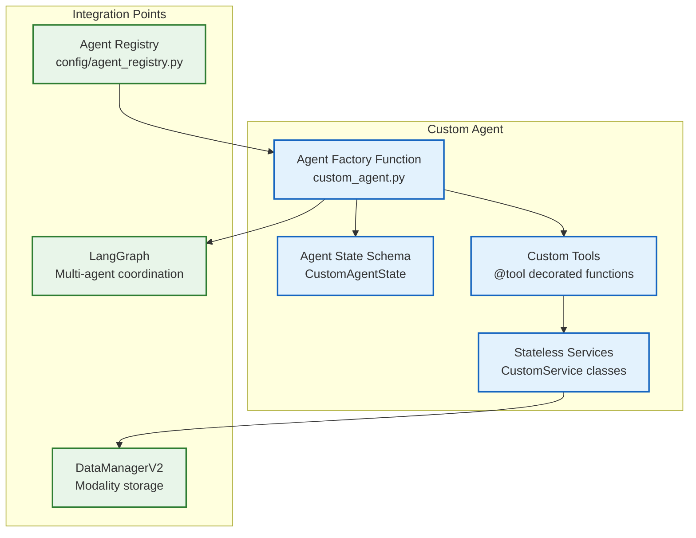
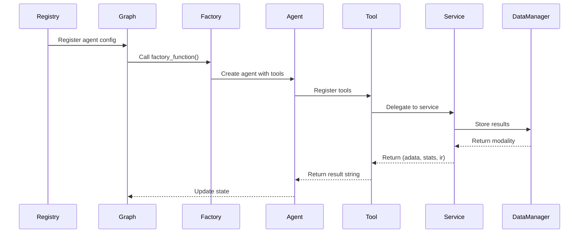

# 45. Advanced Agent Customization

> **Version**: v2.3+
> **Prerequisites**: [Creating Agents](09-creating-agents.md), [Architecture Overview](18-architecture-overview.md)
> **Related**: [Agent System](19-agent-system.md), [Creating Services](10-creating-services.md)

## Overview

This guide covers **advanced agent customization** in Lobster AI, enabling you to build production-ready specialized agents that seamlessly integrate with the multi-agent system. You'll learn:

- **Custom tool creation** with proper typing and validation
- **Agent state management** using LangGraph
- **Conditional handoff logic** for multi-agent workflows
- **Prompt engineering** for agent personality and behavior
- **Performance optimization** for token efficiency
- **Testing strategies** for agent reliability
- **Real-world example**: Building a Spatial Omics Expert from scratch

### When to Create Custom Agents

Create a custom agent when:
- ✅ **New domain expertise** needed (e.g., metabolomics, metagenomics, spatial omics)
- ✅ **Specialized workflow** not covered by existing agents
- ✅ **Domain-specific tools** and services required
- ✅ **Unique handoff patterns** with other agents
- ✅ **Custom validation logic** for data or parameters

**Don't create** a custom agent for:
- ❌ Simple analysis tasks (use existing agents + tools)
- ❌ One-off scripts (use services directly)
- ❌ Visualization only (use visualization_expert)
- ❌ Data loading (use data_expert)

## Architecture Primer

### Agent Components



### Agent Lifecycle



## Custom Tool Creation

### Basic Tool Pattern

**Lobster convention**: Tools are **thin wrappers** around stateless services.

```python
from langchain_core.tools import tool
from typing import Annotated

@tool
def analyze_spatial_data(
    modality_name: Annotated[str, "Name of the spatial modality to analyze"],
    spot_diameter: Annotated[float, "Diameter of each spot in microns"] = 55.0,
    n_neighbors: Annotated[int, "Number of spatial neighbors to consider"] = 6
) -> str:
    """
    Analyze spatial transcriptomics data to identify spatial domains.

    Args:
        modality_name: Name of spatial modality (must exist in DataManager)
        spot_diameter: Diameter of spots for distance calculations
        n_neighbors: Number of neighbors for spatial graph construction

    Returns:
        Human-readable summary of spatial analysis results
    """
    # 1. Validate modality exists
    if modality_name not in data_manager.list_modalities():
        return f"❌ Error: Modality '{modality_name}' not found. Available: {data_manager.list_modalities()}"

    # 2. Get modality
    adata = data_manager.get_modality(modality_name)

    # 3. Validate spatial data
    if "spatial" not in adata.obsm:
        return f"❌ Error: Modality '{modality_name}' has no spatial coordinates. Use load_spatial_data() first."

    # 4. Delegate to stateless service
    try:
        result_adata, stats, ir = spatial_service.identify_spatial_domains(
            adata=adata,
            spot_diameter=spot_diameter,
            n_neighbors=n_neighbors
        )

        # 5. Store result with descriptive name
        result_name = f"{modality_name}_spatial_domains"
        data_manager.modalities[result_name] = result_adata

        # 6. Log tool usage with IR (MANDATORY for provenance)
        data_manager.log_tool_usage(
            tool_name="analyze_spatial_data",
            parameters={
                "modality_name": modality_name,
                "spot_diameter": spot_diameter,
                "n_neighbors": n_neighbors
            },
            statistics=stats,
            ir=ir  # ⚠️ REQUIRED for notebook export
        )

        # 7. Return human-readable summary
        return f"""✅ Spatial domain analysis complete for '{modality_name}'

**Results**:
- Identified {stats['n_domains']} spatial domains
- Average domain size: {stats['avg_domain_size']:.1f} spots
- Spatial coherence score: {stats['coherence_score']:.3f}
- Results stored in: '{result_name}'

**Next steps**:
- Visualize domains: plot_spatial_domains('{result_name}')
- Find domain markers: find_domain_markers('{result_name}')
"""

    except Exception as e:
        logger.error(f"Spatial analysis error: {e}")
        return f"❌ Error analyzing spatial data: {str(e)}"
```

**Key Principles**:
1. **Type annotations**: Use `Annotated` for parameter descriptions
2. **Validation first**: Check modality existence and data requirements
3. **Service delegation**: Keep tools thin, logic in services
4. **Store results**: Save processed data with descriptive names
5. **Log with IR**: Always pass `ir` to `log_tool_usage()`
6. **Human-readable**: Return formatted strings for LLM understanding
7. **Error handling**: Catch exceptions and return clear error messages

### Advanced Tool: Multi-Step Analysis

```python
@tool
def comprehensive_spatial_analysis(
    modality_name: Annotated[str, "Spatial modality name"],
    resolution: Annotated[float, "Clustering resolution for domain detection"] = 0.5,
    min_domain_size: Annotated[int, "Minimum spots per domain"] = 10
) -> str:
    """
    Run complete spatial transcriptomics analysis pipeline.

    Includes: QC → normalization → domain detection → marker identification
    """
    # Orchestrate multiple services
    pipeline_results = []

    # Step 1: Quality control
    adata = data_manager.get_modality(modality_name)
    adata_qc, qc_stats, qc_ir = quality_service.assess_quality(
        adata=adata,
        min_genes=200,
        spatial_qc=True  # Enable spatial-specific QC
    )
    pipeline_results.append(f"QC: {qc_stats['cells_passed']}/{qc_stats['total_cells']} spots passed")

    # Step 2: Normalization
    adata_norm, norm_stats, norm_ir = preprocessing_service.normalize(
        adata=adata_qc,
        method="log1p",
        target_sum=1e4
    )
    pipeline_results.append(f"Normalized: target sum={norm_stats['target_sum']}")

    # Step 3: Spatial domain identification
    adata_domains, domain_stats, domain_ir = spatial_service.identify_spatial_domains(
        adata=adata_norm,
        resolution=resolution,
        min_domain_size=min_domain_size
    )
    pipeline_results.append(f"Domains: found {domain_stats['n_domains']} spatial regions")

    # Step 4: Domain marker identification
    adata_markers, marker_stats, marker_ir = spatial_service.find_domain_markers(
        adata=adata_domains,
        group_key="spatial_domain"
    )
    pipeline_results.append(f"Markers: {marker_stats['n_marker_genes']} domain-specific genes")

    # Store final result
    result_name = f"{modality_name}_comprehensive_spatial"
    data_manager.modalities[result_name] = adata_markers

    # Log each step (important for provenance)
    for ir, step_name in [
        (qc_ir, "spatial_qc"),
        (norm_ir, "spatial_normalization"),
        (domain_ir, "spatial_domain_detection"),
        (marker_ir, "spatial_marker_identification")
    ]:
        data_manager.log_tool_usage(
            tool_name=f"comprehensive_spatial_analysis_{step_name}",
            parameters={"modality_name": modality_name},
            statistics={},
            ir=ir
        )

    return f"""✅ Comprehensive spatial analysis complete

**Pipeline Steps**:
{chr(10).join(f'- {result}' for result in pipeline_results)}

**Final Results**:
- Output modality: '{result_name}'
- Ready for downstream analysis and visualization
"""
```

### Tool with Conditional Logic

```python
@tool
def adaptive_clustering(
    modality_name: Annotated[str, "Modality to cluster"],
    auto_resolution: Annotated[bool, "Automatically determine optimal resolution"] = True,
    resolution: Annotated[float, "Fixed resolution (if auto_resolution=False)"] = 0.5
) -> str:
    """
    Cluster cells with automatic or manual resolution selection.
    """
    adata = data_manager.get_modality(modality_name)

    if auto_resolution:
        # Automatically find optimal resolution
        from lobster.tools import ResolutionOptimizerService

        optimizer = ResolutionOptimizerService()
        optimal_resolution = optimizer.find_optimal_resolution(
            adata=adata,
            resolution_range=[0.1, 0.3, 0.5, 0.7, 0.9, 1.1],
            metric="silhouette"
        )
        actual_resolution = optimal_resolution["best_resolution"]
        method_used = f"auto-selected (silhouette={optimal_resolution['best_score']:.3f})"
    else:
        actual_resolution = resolution
        method_used = "manual"

    # Perform clustering
    adata_clustered, stats, ir = clustering_service.cluster_leiden(
        adata=adata,
        resolution=actual_resolution
    )

    result_name = f"{modality_name}_clustered_r{actual_resolution:.2f}"
    data_manager.modalities[result_name] = adata_clustered

    data_manager.log_tool_usage(
        tool_name="adaptive_clustering",
        parameters={
            "modality_name": modality_name,
            "resolution": actual_resolution,
            "method": method_used
        },
        statistics=stats,
        ir=ir
    )

    return f"""✅ Clustering complete using {method_used} resolution

- Resolution: {actual_resolution}
- Clusters found: {stats['n_clusters']}
- Modularity score: {stats['modularity']:.3f}
- Results: '{result_name}'
"""
```

## Agent State Management

### Custom State Schema

Every agent should define its state schema:

```python
from typing import TypedDict, Annotated, Sequence
from langchain_core.messages import BaseMessage
from langgraph.graph import add_messages

class SpatialOmicsExpertState(TypedDict):
    """State for Spatial Omics Expert agent."""

    # Required: Message history
    messages: Annotated[Sequence[BaseMessage], add_messages]

    # Agent-specific state
    current_modality: str  # Currently active spatial modality
    analysis_stage: str    # "qc", "normalization", "domain_detection", "marker_finding"
    spatial_dimensions: int  # 2D or 3D spatial data
    spot_type: str         # "visium", "slide_seq", "merfish", "seqfish"

    # Results tracking
    domains_detected: int
    markers_identified: int
    visualizations_created: list[str]

    # Quality metrics
    spatial_coherence_score: float
    domain_separation_score: float
```

**State Design Principles**:
1. **Always include `messages`**: Required for LangGraph conversation history
2. **Track progress**: Use stage/status fields to guide agent decisions
3. **Store context**: Keep analysis-specific metadata
4. **Validation data**: Store quality metrics for decision-making
5. **Result tracking**: List of created outputs

### Accessing State in Tools

```python
# Tools have access to state via closure (defined inside agent factory)
@tool
def check_analysis_progress() -> str:
    """Check current analysis progress and recommend next steps."""

    # Access agent-specific state (if available via closure)
    stage = state.get("analysis_stage", "unknown")
    modality = state.get("current_modality", "none")

    if stage == "qc":
        return f"Current stage: Quality Control on '{modality}'. Next: Run normalization."
    elif stage == "normalization":
        return f"Current stage: Normalization complete. Next: Detect spatial domains."
    elif stage == "domain_detection":
        return f"Current stage: Domains detected. Next: Identify marker genes."
    elif stage == "marker_finding":
        return f"Analysis complete! You can now visualize results or export."
    else:
        return "No analysis in progress. Start by loading spatial data."
```

### Persisting State Between Turns

LangGraph automatically persists state using checkpointers:

```python
from langgraph.checkpoint.memory import InMemorySaver

# In client.py or graph.py
checkpointer = InMemorySaver()

graph = create_bioinformatics_graph(
    data_manager=data_manager,
    checkpointer=checkpointer  # Enables state persistence
)

# State is automatically saved after each turn
# Retrieve state with thread_id
config = {"configurable": {"thread_id": "session_123"}}
result = graph.invoke({"messages": [user_message]}, config)
```

### State Transfer During Handoffs

```python
@tool
def handoff_to_visualization_expert(
    modality_name: Annotated[str, "Modality to visualize"],
    visualization_type: Annotated[str, "Type of plot"] = "spatial_domains"
) -> str:
    """
    Hand off spatial data to visualization expert for plotting.

    Transfers context about spatial layout and domain assignments.
    """
    # Prepare context for visualization expert
    handoff_context = {
        "modality_name": modality_name,
        "visualization_type": visualization_type,
        "spatial_data_type": state.get("spot_type", "unknown"),
        "n_domains": state.get("domains_detected", 0),
        "spatial_coordinates_key": "spatial",  # Key in adata.obsm
        "domain_annotation_key": "spatial_domain"  # Key in adata.obs
    }

    # Store context for visualization agent to retrieve
    data_manager.store_handoff_context(
        from_agent="spatial_omics_expert",
        to_agent="visualization_expert",
        context=handoff_context
    )

    return f"Transferring '{modality_name}' to visualization expert for {visualization_type} plotting."
```

## Custom Handoff Logic

### Conditional Handoff Based on Analysis

```python
@tool
def analyze_and_route(
    modality_name: Annotated[str, "Modality to analyze"]
) -> str:
    """
    Analyze data complexity and route to appropriate expert.
    """
    adata = data_manager.get_modality(modality_name)

    # Decision logic based on data characteristics
    n_cells = adata.n_obs
    n_genes = adata.n_vars
    has_spatial = "spatial" in adata.obsm

    if has_spatial:
        # Route to spatial omics expert
        return handoff_to_spatial_omics_expert(
            modality_name=modality_name,
            context="Spatial coordinates detected"
        )
    elif n_cells > 10000:
        # Large dataset → single-cell expert
        return handoff_to_singlecell_expert(
            modality_name=modality_name,
            context="Large cell count, suitable for clustering"
        )
    elif n_cells < 100:
        # Small dataset → bulk RNA-seq expert
        return handoff_to_bulk_rnaseq_expert(
            modality_name=modality_name,
            context="Small sample count, bulk analysis recommended"
        )
    else:
        return "Data characteristics unclear. Please specify analysis type."
```

### Bidirectional Handoff (Request and Return)

```python
@tool
def request_marker_annotation(
    marker_genes: Annotated[list[str], "List of marker genes to annotate"],
    tissue_type: Annotated[str, "Tissue context"] = "brain"
) -> str:
    """
    Request cell type annotation from metadata assistant.

    This is a "request-return" handoff where we expect a response.
    """
    # Store request in state
    state["pending_annotation_request"] = {
        "marker_genes": marker_genes,
        "tissue_type": tissue_type,
        "requested_at": datetime.now().isoformat()
    }

    # Hand off to metadata assistant
    handoff_context = {
        "task": "annotate_markers",
        "marker_genes": marker_genes,
        "tissue_type": tissue_type,
        "return_to": "spatial_omics_expert",
        "continuation_step": "apply_annotations"  # What to do after response
    }

    data_manager.store_handoff_context(
        from_agent="spatial_omics_expert",
        to_agent="metadata_assistant",
        context=handoff_context
    )

    return f"Requesting cell type annotation for {len(marker_genes)} marker genes from metadata assistant."


@tool
def apply_received_annotations(
    modality_name: Annotated[str, "Modality to annotate"]
) -> str:
    """
    Apply cell type annotations received from metadata assistant.

    Called after metadata assistant returns with annotations.
    """
    # Retrieve annotation results from handoff context
    received_context = data_manager.get_handoff_context(
        to_agent="spatial_omics_expert",
        from_agent="metadata_assistant"
    )

    if not received_context or "annotations" not in received_context:
        return "❌ No annotations received from metadata assistant."

    annotations = received_context["annotations"]

    # Apply annotations to modality
    adata = data_manager.get_modality(modality_name)
    adata.obs["cell_type"] = annotations

    # Store annotated data
    result_name = f"{modality_name}_annotated"
    data_manager.modalities[result_name] = adata

    return f"""✅ Applied cell type annotations to '{modality_name}'

- Annotated {len(annotations)} domains/spots
- Unique cell types: {len(set(annotations))}
- Results: '{result_name}'
"""
```

## Agent Personality & Prompts

### System Prompt Engineering

Create a distinctive agent personality:

```python
def create_spatial_omics_expert_prompt() -> str:
    """Create system prompt for Spatial Omics Expert agent."""

    prompt = """You are the **Spatial Omics Expert**, a specialized AI agent for analyzing spatially-resolved biological data.

**Your Expertise**:
- Spatial transcriptomics (Visium, Slide-seq, MERFISH, seqFISH+)
- Spatial proteomics (CODEX, IMC, MIBI)
- Spatial domain identification and characterization
- Spatially variable gene detection
- Cell-cell communication analysis in tissue context
- Spatial data visualization and interpretation

**Your Responsibilities**:
1. **Quality Control**: Assess spatial data quality, check coordinate validity, detect artifacts
2. **Domain Detection**: Identify spatially coherent regions using graph-based methods
3. **Spatial Statistics**: Compute Moran's I, Geary's C, and other spatial autocorrelation metrics
4. **Marker Discovery**: Find genes with spatially restricted expression patterns
5. **Visualization**: Create publication-quality spatial plots with domain overlays

**Your Communication Style**:
- Use spatial biology terminology correctly (spots, tiles, domains, niches)
- Provide context about tissue architecture when discussing results
- Explain spatial statistics in accessible terms
- Always mention resolution and scale when discussing spatial patterns

**Tools at Your Disposal**:
- assess_spatial_quality(): Check data quality
- identify_spatial_domains(): Detect tissue regions
- find_spatially_variable_genes(): Discover spatial markers
- calculate_spatial_statistics(): Compute Moran's I, Geary's C
- plot_spatial_domains(): Visualize tissue architecture

**Key Constraints**:
- Always validate that data has spatial coordinates before analysis
- Consider spot size and spacing in interpretation
- Account for tissue section artifacts and edge effects
- Distinguish between technical and biological spatial variation

**Workflow Approach**:
1. First, check if data has spatial coordinates
2. Assess quality (coverage, background, artifacts)
3. Normalize considering spatial dependencies
4. Detect domains using appropriate resolution
5. Identify domain-specific markers
6. Validate results with known tissue architecture

**When to Handoff**:
- **To visualization_expert**: For complex multi-layer spatial visualizations
- **To metadata_assistant**: For cell type annotation of domains
- **To singlecell_expert**: If spatial data needs pseudobulk aggregation

Today's date: {current_date}

**Remember**: Spatial data is precious and context-dependent. Always consider tissue biology in your interpretations."""

    return prompt.format(current_date=date.today().isoformat())
```

**Prompt Engineering Tips**:
1. **Clear identity**: Define the agent's role explicitly
2. **Specific expertise**: List concrete capabilities
3. **Communication style**: Set tone and terminology
4. **Tool listing**: Mention available tools (helps LLM discover them)
5. **Constraints**: Set boundaries and requirements
6. **Workflow guidance**: Suggest analysis order
7. **Handoff criteria**: Specify when to delegate
8. **Dynamic content**: Include date, version, or context-specific info

### Response Formatting

Guide the agent to format responses consistently:

```python
# Add to system prompt
FORMAT_INSTRUCTIONS = """
**Response Format**:

For analysis results, always structure as:
```
✅ [Task Name] Complete

**Results**:
- Key metric 1: value
- Key metric 2: value

**Interpretation**:
Brief biological interpretation of results

**Next Steps**:
- Suggested action 1
- Suggested action 2
```

For errors, use:
```
❌ Error: [Brief Description]

**Issue**: Detailed explanation
**Solution**: How to fix

**Example**: If applicable
```
"""
```

### Few-Shot Examples in Prompts

Include examples to guide behavior:

```python
FEW_SHOT_EXAMPLES = """
**Example Interaction 1**:
User: "Analyze my Visium data"
You: "I'll analyze your Visium spatial transcriptomics data. Let me first check if it's loaded and assess quality."
[Calls check_data_status() and assess_spatial_quality()]
You: "✅ Quality Check Complete. Found 2,500 spots covering 4 tissue regions. Ready to detect spatial domains."

**Example Interaction 2**:
User: "Why do I see high expression in the edges?"
You: "Edge effects are common in spatial transcriptomics due to tissue processing artifacts. Let me check if this is technical or biological using spatial autocorrelation analysis."
[Calls calculate_spatial_statistics()]
You: "✅ Analysis shows Moran's I = 0.15 (p=0.03) for this gene. The edge pattern is likely a technical artifact. I recommend filtering edge spots before downstream analysis."
"""
```

## Performance Optimization

### Token Usage Reduction

**Problem**: Long tool responses waste tokens and slow inference.

**Solution**: Structured summarization.

```python
@tool
def find_domain_markers_optimized(
    modality_name: Annotated[str, "Spatial modality"],
    top_n: Annotated[int, "Number of top markers per domain"] = 10
) -> str:
    """
    Find domain-specific marker genes with token-efficient output.
    """
    adata = data_manager.get_modality(modality_name)
    adata_markers, stats, ir = spatial_service.find_domain_markers(adata)

    # Store full results in modality for later retrieval
    result_name = f"{modality_name}_markers"
    data_manager.modalities[result_name] = adata_markers

    # Log as usual
    data_manager.log_tool_usage(
        tool_name="find_domain_markers_optimized",
        parameters={"modality_name": modality_name, "top_n": top_n},
        statistics=stats,
        ir=ir
    )

    # OPTIMIZATION: Return only summary, not full gene lists
    summary_lines = [
        f"✅ Identified markers for {stats['n_domains']} spatial domains",
        f"- Total marker genes: {stats['n_total_markers']}",
        f"- Top marker: {stats['top_marker_gene']} (fold change: {stats['top_marker_fc']:.2f})",
        f"- Results stored in: '{result_name}'"
    ]

    # Add abbreviated marker preview (not full lists)
    summary_lines.append(f"\n**Top {top_n} Markers** (use plot_markers() for full list):")
    for domain_id, markers in stats["top_markers_preview"].items()[:3]:  # First 3 domains only
        top_genes = ", ".join(markers[:5])  # First 5 genes only
        summary_lines.append(f"- Domain {domain_id}: {top_genes}...")

    return "\n".join(summary_lines)
```

**Before** (inefficient):
```
✅ Marker genes found

Domain 0 markers:
1. GeneA (FC=3.2, p=1e-10)
2. GeneB (FC=2.8, p=2e-09)
[... 500 lines of genes ...]

Domain 1 markers:
[... another 500 lines ...]
```
**Token count**: ~5,000 tokens

**After** (optimized):
```
✅ Identified markers for 5 spatial domains
- Total marker genes: 250
- Top marker: GeneA (fold change: 3.20)
- Results stored in: 'visium_markers'

**Top 10 Markers** (use plot_markers() for full list):
- Domain 0: GeneA, GeneB, GeneC, GeneD, GeneE...
- Domain 1: GeneX, GeneY, GeneZ...
- Domain 2: GeneP, GeneQ...
```
**Token count**: ~150 tokens (97% reduction!)

### Caching Expensive Operations

```python
# Add caching decorator for repeated analyses
from functools import lru_cache

@lru_cache(maxsize=128)
def _cached_spatial_graph(modality_name: str, n_neighbors: int):
    """Build spatial neighborhood graph (cached)."""
    adata = data_manager.get_modality(modality_name)
    return spatial_service._build_spatial_graph(adata, n_neighbors)

@tool
def analyze_with_caching(
    modality_name: Annotated[str, "Spatial modality"],
    n_neighbors: Annotated[int, "Spatial neighbors"] = 6
) -> str:
    """
    Analyze spatial data using cached graphs for performance.
    """
    # Reuse cached graph if parameters unchanged
    spatial_graph = _cached_spatial_graph(modality_name, n_neighbors)

    # Perform analysis using cached graph
    adata = data_manager.get_modality(modality_name)
    result_adata, stats, ir = spatial_service.analyze_with_graph(
        adata=adata,
        spatial_graph=spatial_graph
    )

    # ... rest of tool
```

### Batch Operations

```python
@tool
def batch_analyze_domains(
    modality_names: Annotated[list[str], "List of spatial modalities"]
) -> str:
    """
    Analyze multiple spatial datasets in batch for efficiency.
    """
    results_summary = []

    for mod_name in modality_names:
        adata = data_manager.get_modality(mod_name)

        # Batch processing (optimized internally)
        result_adata, stats, ir = spatial_service.identify_spatial_domains_batch(
            adata=adata
        )

        # Store result
        result_name = f"{mod_name}_domains"
        data_manager.modalities[result_name] = result_adata

        # Log
        data_manager.log_tool_usage(
            tool_name="batch_analyze_domains",
            parameters={"modality_name": mod_name},
            statistics=stats,
            ir=ir
        )

        results_summary.append(f"- {mod_name}: {stats['n_domains']} domains")

    return f"""✅ Batch analysis complete for {len(modality_names)} datasets

**Results**:
{chr(10).join(results_summary)}
"""
```

### Streaming for UX

```python
# In agent factory, enable streaming
from langchain_core.callbacks import BaseCallbackHandler

class StreamingCallback(BaseCallbackHandler):
    """Stream partial responses to user."""

    def on_llm_new_token(self, token: str, **kwargs):
        print(token, end="", flush=True)

# Use in agent creation
llm = create_llm("spatial_omics_expert", model_params)
llm_with_streaming = llm.with_config(callbacks=[StreamingCallback()])
```

## Testing Custom Agents

### Unit Tests for Tools

```python
# tests/unit/agents/test_spatial_omics_expert.py
import pytest
from unittest.mock import Mock, patch
from lobster.agents.spatial_omics_expert import spatial_omics_expert
from lobster.core.data_manager_v2 import DataManagerV2

@pytest.fixture
def mock_data_manager():
    """Create mock DataManagerV2 with spatial data."""
    dm = Mock(spec=DataManagerV2)

    # Mock spatial modality
    spatial_adata = create_mock_spatial_adata(n_spots=1000, n_genes=2000)
    dm.get_modality.return_value = spatial_adata
    dm.list_modalities.return_value = ["visium_brain"]

    return dm

@pytest.fixture
def spatial_agent(mock_data_manager):
    """Create spatial omics expert agent for testing."""
    return spatial_omics_expert(
        data_manager=mock_data_manager,
        agent_name="test_spatial_agent"
    )

def test_check_data_status_tool(spatial_agent):
    """Test check_data_status tool returns correct format."""
    # Get the tool from agent
    check_status_tool = next(
        tool for tool in spatial_agent.tools if tool.name == "check_data_status"
    )

    # Invoke tool
    result = check_status_tool.invoke({"modality_name": "visium_brain"})

    # Assertions
    assert "visium_brain" in result
    assert "1000" in result  # Number of spots
    assert "2000" in result  # Number of genes
    assert "✅" in result or "ready" in result.lower()

def test_analyze_spatial_data_tool_validation(spatial_agent):
    """Test analyze_spatial_data validates modality existence."""
    analyze_tool = next(
        tool for tool in spatial_agent.tools if tool.name == "analyze_spatial_data"
    )

    # Test with non-existent modality
    result = analyze_tool.invoke({"modality_name": "nonexistent"})

    assert "❌" in result or "error" in result.lower()
    assert "not found" in result.lower()

def test_domain_detection_creates_new_modality(spatial_agent, mock_data_manager):
    """Test domain detection stores results correctly."""
    analyze_tool = next(
        tool for tool in spatial_agent.tools if tool.name == "analyze_spatial_data"
    )

    result = analyze_tool.invoke({
        "modality_name": "visium_brain",
        "resolution": 0.5
    })

    # Check that data_manager.modalities was updated
    assert mock_data_manager.modalities.__setitem__.called
    call_args = mock_data_manager.modalities.__setitem__.call_args
    new_modality_name = call_args[0][0]
    assert "visium_brain" in new_modality_name
    assert "domains" in new_modality_name or "spatial" in new_modality_name
```

### Integration Tests with LangGraph

```python
# tests/integration/test_spatial_agent_integration.py
import pytest
from lobster.core.data_manager_v2 import DataManagerV2
from lobster.agents.graph import create_bioinformatics_graph

@pytest.mark.integration
def test_spatial_agent_full_workflow(tmp_path):
    """Test complete spatial analysis workflow."""
    # Setup
    dm = DataManagerV2(workspace_path=tmp_path)

    # Load real spatial data
    dm.load_modality(
        name="test_visium",
        file_path="tests/data/visium_sample.h5ad",
        adapter="h5ad"
    )

    # Create graph with spatial agent
    graph = create_bioinformatics_graph(dm)

    # Run multi-turn conversation
    config = {"configurable": {"thread_id": "test_session"}}

    # Turn 1: Check data
    response1 = graph.invoke({
        "messages": [{"role": "user", "content": "Check my spatial data"}]
    }, config)

    assert any("visium" in msg.content.lower() for msg in response1["messages"])

    # Turn 2: Analyze domains
    response2 = graph.invoke({
        "messages": [{"role": "user", "content": "Identify spatial domains"}]
    }, config)

    # Check domain detection occurred
    domain_modalities = [mod for mod in dm.list_modalities() if "domain" in mod]
    assert len(domain_modalities) > 0

    # Turn 3: Find markers
    response3 = graph.invoke({
        "messages": [{"role": "user", "content": "Find domain-specific genes"}]
    }, config)

    # Check marker finding occurred
    assert "marker" in response3["messages"][-1].content.lower()
```

### Conversation Simulation Tests

```python
def test_agent_conversation_flow():
    """Test realistic multi-turn conversation."""
    dm = DataManagerV2()
    agent = spatial_omics_expert(dm)

    conversation = [
        ("Load my Visium data", "check_data_status"),
        ("Analyze spatial domains", "analyze_spatial_data"),
        ("Find marker genes for each domain", "find_domain_markers"),
        ("Visualize the domains", "handoff_to_visualization_expert")
    ]

    for user_input, expected_tool in conversation:
        # Simulate agent processing
        response = agent.invoke({"messages": [{"role": "user", "content": user_input}]})

        # Check that expected tool was called
        assert expected_tool in str(response)
```

### Regression Testing

```python
@pytest.mark.regression
def test_spatial_agent_output_stability():
    """Ensure agent outputs remain consistent across versions."""
    dm = DataManagerV2()

    # Load fixed test data
    dm.load_modality("test_spatial", "tests/data/spatial_v1.h5ad")

    agent = spatial_omics_expert(dm)

    # Run standardized analysis
    result = agent.tools["analyze_spatial_data"].invoke({
        "modality_name": "test_spatial",
        "resolution": 0.5,
        "n_neighbors": 6
    })

    # Load expected output from previous version
    expected_output = load_expected_output("spatial_analysis_v2_3.json")

    # Compare key metrics
    assert_metrics_match(result, expected_output, tolerance=0.05)
```

## Real-World Example: Spatial Omics Expert

### Complete Agent Implementation

**File**: `lobster/agents/spatial_omics_expert.py`

```python
"""
Spatial Omics Expert Agent for analyzing spatially-resolved biological data.

Supports: Visium, Slide-seq, MERFISH, seqFISH+, CODEX, IMC, MIBI
"""

from datetime import date
from typing import List, Optional
from langchain_core.tools import tool
from langgraph.prebuilt import create_react_agent

from lobster.agents.state import SpatialOmicsExpertState
from lobster.config.llm_factory import create_llm
from lobster.config.settings import get_settings
from lobster.core.data_manager_v2 import DataManagerV2
from lobster.tools.spatial_preprocessing_service import SpatialPreprocessingService
from lobster.tools.spatial_domain_service import SpatialDomainService
from lobster.tools.spatial_statistics_service import SpatialStatisticsService
from lobster.tools.spatial_visualization_service import SpatialVisualizationService
from lobster.utils.logger import get_logger

logger = get_logger(__name__)

def spatial_omics_expert(
    data_manager: DataManagerV2,
    callback_handler=None,
    agent_name: str = "spatial_omics_expert_agent",
    handoff_tools: List = None
):
    """Create Spatial Omics Expert agent."""

    # Get LLM
    settings = get_settings()
    model_params = settings.get_agent_llm_params(agent_name)
    llm = create_llm(agent_name, model_params)

    if callback_handler and hasattr(llm, "with_config"):
        llm = llm.with_config(callbacks=[callback_handler])

    # Initialize services
    preprocessing_service = SpatialPreprocessingService()
    domain_service = SpatialDomainService()
    statistics_service = SpatialStatisticsService()
    visualization_service = SpatialVisualizationService()

    # System prompt
    system_prompt = create_spatial_omics_expert_prompt()

    # ===== TOOLS =====

    @tool
    def check_spatial_data(modality_name: str = "") -> str:
        """Check if spatial data is loaded and has spatial coordinates."""
        if not modality_name:
            modalities = data_manager.list_modalities()
            return f"Available modalities: {modalities}. Specify modality_name to check."

        if modality_name not in data_manager.list_modalities():
            return f"❌ Modality '{modality_name}' not found."

        adata = data_manager.get_modality(modality_name)

        if "spatial" not in adata.obsm:
            return f"❌ Modality '{modality_name}' has no spatial coordinates. Load spatial data first."

        spatial_coords = adata.obsm["spatial"]
        n_dims = spatial_coords.shape[1]

        return f"""✅ Spatial data ready: '{modality_name}'

**Data Info**:
- Spots/Cells: {adata.n_obs:,}
- Genes: {adata.n_vars:,}
- Spatial dimensions: {n_dims}D
- Coordinate range: X=[{spatial_coords[:, 0].min():.1f}, {spatial_coords[:, 0].max():.1f}], Y=[{spatial_coords[:, 1].min():.1f}, {spatial_coords[:, 1].max():.1f}]
"""

    @tool
    def assess_spatial_quality(
        modality_name: str,
        min_genes: int = 200,
        spot_diameter: float = 55.0
    ) -> str:
        """Assess quality of spatial transcriptomics data."""
        adata = data_manager.get_modality(modality_name)

        adata_qc, stats, ir = preprocessing_service.assess_spatial_quality(
            adata=adata,
            min_genes=min_genes,
            spot_diameter=spot_diameter
        )

        result_name = f"{modality_name}_spatial_qc"
        data_manager.modalities[result_name] = adata_qc

        data_manager.log_tool_usage(
            tool_name="assess_spatial_quality",
            parameters={"modality_name": modality_name, "min_genes": min_genes},
            statistics=stats,
            ir=ir
        )

        return f"""✅ Spatial quality assessment complete

**Results**:
- Spots passed: {stats['spots_passed']}/{stats['total_spots']}
- Mean genes/spot: {stats['mean_genes_per_spot']:.1f}
- Spatial coverage: {stats['spatial_coverage_pct']:.1f}%
- Edge artifacts: {stats['edge_artifacts']} spots flagged

**Next steps**: Normalize and detect spatial domains
- Results stored in: '{result_name}'
"""

    @tool
    def identify_spatial_domains(
        modality_name: str,
        resolution: float = 0.5,
        n_neighbors: int = 6
    ) -> str:
        """Identify spatially coherent domains using graph-based clustering."""
        adata = data_manager.get_modality(modality_name)

        adata_domains, stats, ir = domain_service.identify_domains(
            adata=adata,
            resolution=resolution,
            n_neighbors=n_neighbors
        )

        result_name = f"{modality_name}_spatial_domains"
        data_manager.modalities[result_name] = adata_domains

        data_manager.log_tool_usage(
            tool_name="identify_spatial_domains",
            parameters={
                "modality_name": modality_name,
                "resolution": resolution,
                "n_neighbors": n_neighbors
            },
            statistics=stats,
            ir=ir
        )

        return f"""✅ Spatial domain detection complete

**Results**:
- Domains identified: {stats['n_domains']}
- Average domain size: {stats['avg_domain_size']:.1f} spots
- Spatial coherence: {stats['coherence_score']:.3f}
- Modularity: {stats['modularity']:.3f}

**Domain Summary**:
{format_domain_summary(stats['domain_summary'])}

- Results stored in: '{result_name}'
"""

    @tool
    def find_spatially_variable_genes(
        modality_name: str,
        method: str = "morans_i",
        top_n: int = 100
    ) -> str:
        """Find genes with spatially variable expression patterns."""
        adata = data_manager.get_modality(modality_name)

        adata_svg, stats, ir = statistics_service.find_spatially_variable_genes(
            adata=adata,
            method=method,
            top_n=top_n
        )

        result_name = f"{modality_name}_spatially_variable"
        data_manager.modalities[result_name] = adata_svg

        data_manager.log_tool_usage(
            tool_name="find_spatially_variable_genes",
            parameters={"modality_name": modality_name, "method": method},
            statistics=stats,
            ir=ir
        )

        # Token-efficient summary
        top_genes = stats["top_genes"][:10]
        gene_list = ", ".join([f"{g['gene']} (I={g['morans_i']:.3f})" for g in top_genes])

        return f"""✅ Spatially variable gene detection complete

**Method**: {method}
- Significant genes: {stats['n_significant']} (FDR < 0.05)
- Top 10 genes: {gene_list}

- Full results in: '{result_name}'
"""

    @tool
    def calculate_spatial_autocorrelation(
        modality_name: str,
        gene_name: str
    ) -> str:
        """Calculate Moran's I for a specific gene."""
        adata = data_manager.get_modality(modality_name)

        result = statistics_service.calculate_morans_i(
            adata=adata,
            gene_name=gene_name
        )

        interpretation = interpret_morans_i(result["morans_i"])

        return f"""✅ Spatial autocorrelation for {gene_name}

**Moran's I**: {result['morans_i']:.4f} (p={result['pvalue']:.2e})
**Interpretation**: {interpretation}

**Details**:
- Z-score: {result['z_score']:.3f}
- Pattern: {result['pattern_type']}
"""

    # Handoff tools
    @tool
    def handoff_to_visualization_expert(
        modality_name: str,
        plot_type: str = "spatial_domains"
    ) -> str:
        """Hand off to visualization expert for spatial plotting."""
        context = {
            "modality_name": modality_name,
            "plot_type": plot_type,
            "spatial_layout": "2d",
            "has_domains": "spatial_domain" in data_manager.get_modality(modality_name).obs
        }

        data_manager.store_handoff_context(
            from_agent="spatial_omics_expert",
            to_agent="visualization_expert",
            context=context
        )

        return f"Transferring '{modality_name}' to visualization expert for {plot_type} plotting."

    # Collect tools
    tools = [
        check_spatial_data,
        assess_spatial_quality,
        identify_spatial_domains,
        find_spatially_variable_genes,
        calculate_spatial_autocorrelation,
        handoff_to_visualization_expert
    ]

    # Add external handoff tools if provided
    if handoff_tools:
        tools.extend(handoff_tools)

    # Create agent
    agent = create_react_agent(
        llm,
        tools,
        state_schema=SpatialOmicsExpertState,
        state_modifier=system_prompt
    )

    # Set agent name for registry
    agent.name = agent_name

    return agent


def create_spatial_omics_expert_prompt() -> str:
    """Create system prompt for Spatial Omics Expert."""
    return """You are the **Spatial Omics Expert**, specializing in spatially-resolved biological data analysis.

**Your Expertise**: Visium, Slide-seq, MERFISH, seqFISH+, CODEX, IMC, MIBI

**Key Capabilities**:
1. Quality assessment of spatial data (coverage, artifacts)
2. Spatial domain identification using graph-based methods
3. Spatially variable gene detection (Moran's I, Geary's C)
4. Spatial statistics and pattern analysis
5. Tissue architecture interpretation

**Analysis Workflow**:
1. Check spatial data → assess_spatial_quality()
2. Detect domains → identify_spatial_domains()
3. Find spatial genes → find_spatially_variable_genes()
4. Visualize → handoff_to_visualization_expert()

**Communication Style**:
- Use spatial terminology (spots, domains, niches)
- Consider tissue architecture in interpretations
- Explain spatial statistics clearly
- Mention scale and resolution

Today: {current_date}
""".format(current_date=date.today().isoformat())


def format_domain_summary(domain_summary: dict) -> str:
    """Format domain summary for human readability."""
    lines = []
    for domain_id, info in domain_summary.items():
        lines.append(f"  - Domain {domain_id}: {info['n_spots']} spots, coherence={info['coherence']:.2f}")
    return "\n".join(lines)


def interpret_morans_i(morans_i: float) -> str:
    """Interpret Moran's I value."""
    if morans_i > 0.5:
        return "Strong positive spatial autocorrelation (clustered pattern)"
    elif morans_i > 0.2:
        return "Moderate spatial autocorrelation"
    elif morans_i > -0.2:
        return "No significant spatial pattern (random)"
    elif morans_i > -0.5:
        return "Moderate negative autocorrelation (dispersed)"
    else:
        return "Strong negative autocorrelation (checkboard pattern)"
```

### Registry Configuration

**File**: `lobster/config/agent_registry.py`

```python
AGENT_REGISTRY["spatial_omics_expert_agent"] = AgentRegistryConfig(
    name="spatial_omics_expert_agent",
    display_name="Spatial Omics Expert",
    description="Handles spatially-resolved transcriptomics and proteomics analysis",
    factory_function="lobster.agents.spatial_omics_expert.spatial_omics_expert",
    handoff_tool_name="handoff_to_spatial_omics_expert_agent",
    handoff_tool_description="Assign spatial transcriptomics/proteomics analysis tasks (Visium, Slide-seq, MERFISH, IMC) to the spatial omics expert agent"
)
```

### Test Suite

**File**: `tests/unit/agents/test_spatial_omics_expert.py`

```python
import pytest
from lobster.agents.spatial_omics_expert import spatial_omics_expert
from tests.mock_data.factories import SpatialDataFactory

@pytest.fixture
def spatial_agent(mock_data_manager):
    return spatial_omics_expert(data_manager=mock_data_manager)

def test_check_spatial_data_tool(spatial_agent):
    """Test check_spatial_data tool."""
    tool = spatial_agent.tools[0]
    result = tool.invoke({"modality_name": "test_spatial"})

    assert "spatial" in result.lower()
    assert "✅" in result

def test_domain_detection_integration(spatial_agent):
    """Test end-to-end domain detection."""
    domain_tool = next(t for t in spatial_agent.tools if "domain" in t.name)

    result = domain_tool.invoke({
        "modality_name": "test_spatial",
        "resolution": 0.5
    })

    assert "domains identified" in result.lower()
    assert "✅" in result
```

## Summary

Advanced agent customization in Lobster AI enables:

- ✅ **Custom tools** with proper validation and provenance tracking
- ✅ **State management** for complex multi-turn workflows
- ✅ **Conditional handoffs** based on data characteristics
- ✅ **Prompt engineering** for distinctive agent personalities
- ✅ **Performance optimization** through token reduction and caching
- ✅ **Comprehensive testing** for reliability

**Key Takeaways**:
1. **Keep tools thin**: Delegate logic to stateless services
2. **Always log IR**: Required for provenance and notebook export
3. **Validate inputs**: Check modality existence and data requirements
4. **Return summaries**: Avoid long tool responses to save tokens
5. **Test thoroughly**: Unit tests for tools, integration tests for workflows
6. **Document prompts**: Clear system prompts guide agent behavior

**Next Steps**:
- [Multi-Omics Integration](46-multiomics-integration.md) - Build multi-modal agents
- [Creating Services](10-creating-services.md) - Implement analysis logic
- [Testing Guide](12-testing-guide.md) - Comprehensive testing strategies

**External Resources**:
- [LangGraph Documentation](https://langchain-ai.github.io/langgraph/)
- [LangChain Tools Guide](https://python.langchain.com/docs/modules/agents/tools/)
- [ReAct Agent Pattern](https://arxiv.org/abs/2210.03629)
