# 18. Architecture Overview

## Platform Architecture

Lobster AI is a **modular bioinformatics platform** with pluggable execution environments, LLM providers, and integrated data management. The platform architecture consists of seven layers that work together to provide flexible, scalable omics analysis.

### Architecture Diagram

<div align="center">

</div>

**Seven-Layer Architecture:**

1. **Client Layer** - CLI and Python SDK interfaces
2. **Execution Environment** - Local (your hardware) or Cloud (managed infrastructure)
3. **LLM Provider Layer** - ProviderRegistry with pluggable providers (Anthropic, Bedrock, Ollama + future: OpenAI, Nebius)
4. **Multi-Agent System** - Specialized agents for research, data engineering, analysis
5. **External Data Sources** - GEO, SRA, ENA, PRIDE, MassIVE, PubMed, PMC
6. **Data Management** - DataManagerV2 for multi-modal orchestration and provenance
7. **Output Layer** - Interactive visualizations, Jupyter notebooks, annotated data objects

### Component Matrix

| Layer | Component | Configuration | Use Case |
|-------|-----------|---------------|----------|
| **Execution** | Local | Default (no setup) | Privacy-first, offline, cost-sensitive |
| | Cloud | `LOBSTER_CLOUD_KEY` | Team collaboration, scaling, managed infrastructure |
| **LLM Provider** | Ollama | `lobster init` → provider_config.json | Local-only, unlimited usage, offline |
| | Anthropic | `lobster init` → provider_config.json + .env | Best quality, quick start, cloud/local |
| | AWS Bedrock | `lobster init` → provider_config.json + .env | Enterprise, compliance, high throughput |
| | Future (OpenAI, Nebius) | Pluggable via ILLMProvider interface | Easy extensibility (~150 lines/provider) |
| **Data Sources** | GEO/SRA/ENA | Auto-configured | Transcriptomics datasets |
| | PRIDE/MassIVE | Auto-configured | Proteomics datasets |
| | PubMed/PMC | `NCBI_API_KEY` (optional) | Literature mining, metadata extraction |
| **Data Management** | DataManagerV2 | Auto-configured | Multi-modal data orchestration, provenance tracking |

### Deployment Patterns

Lobster supports three deployment patterns optimized for different use cases. For detailed setup instructions and comparison, see the **[Deployment Patterns Guide](03-configuration.md#deployment-patterns)**.

| Pattern | Best For | Key Features |
|---------|----------|--------------|
| **Local + Ollama** | Privacy, learning, zero cost | Offline, unlimited usage, 100% local |
| **Local + Anthropic** | Quality, development | Best accuracy, quick setup, flexible |
| **Cloud + Bedrock** | Production, teams | Enterprise SLA, high limits, scalable |

**Configuration Resources:**
- 📖 [Deployment Patterns Guide](03-configuration.md#deployment-patterns) - Detailed setup for each pattern
- 🏗️ [Provider Architecture](03-configuration.md#provider-architecture) - Provider abstraction system (v0.4.0+)
- ⚙️ [Complete Configuration Guide](03-configuration.md) - All configuration options

---

## System Overview

Lobster AI is a professional **multi-agent bioinformatics analysis platform** that combines specialized AI agents with proven scientific tools to analyze complex multi-omics data. The platform features a modular, service-oriented architecture that enables natural language interaction with sophisticated bioinformatics workflows.

### Core Design Principles

1. **Agent-Based Architecture** - Specialist agents coordinated through centralized registry
2. **Service-Oriented Processing** - Stateless, testable analysis services
3. **Cloud/Local Hybrid** - Seamless switching between deployment modes
4. **Modular Design** - Extensible components with clean interfaces
5. **Natural Language Interface** - User describes analyses in plain English
6. **Publication-Quality Output** - Interactive visualizations with scientific rigor

## High-Level System Architecture

```mermaid
graph TB
    subgraph "User Interface Layer"
        CLI[🦞 Lobster CLI<br/>Interactive Terminal]
        API[🔌 FastAPI Server<br/>HTTP Endpoints]
    end

    subgraph "Client Detection & Routing"
        DETECT[Environment Detection<br/>LOBSTER_CLOUD_KEY?]
        ADAPTER[LobsterClientAdapter<br/>Unified Interface]
    end

    subgraph "☁️ Cloud Mode"
        CLOUD_CLIENT[CloudLobsterClient<br/>HTTP API Calls]
        CLOUD_API[Lobster Cloud API<br/>Managed Infrastructure]
    end

    subgraph "💻 Local Mode"
        LOCAL_CLIENT[AgentClient<br/>Local LangGraph]
        AGENT_GRAPH[Multi-Agent Graph<br/>LangGraph Coordination]
        DATA_MANAGER[DataManagerV2<br/>Modality Orchestration]
    end

    CLI --> DETECT
    WEB --> DETECT
    API --> DETECT

    DETECT --> ADAPTER
    ADAPTER --> |Cloud Key Present| CLOUD_CLIENT
    ADAPTER --> |Local/Fallback| LOCAL_CLIENT

    CLOUD_CLIENT --> CLOUD_API
    LOCAL_CLIENT --> AGENT_GRAPH
    AGENT_GRAPH --> DATA_MANAGER

    classDef interface fill:#e3f2fd,stroke:#0277bd,stroke-width:2px
    classDef detection fill:#fff3e0,stroke:#f57c00,stroke-width:2px
    classDef cloud fill:#e8f5e8,stroke:#2e7d32,stroke-width:2px
    classDef local fill:#f3e5f5,stroke:#4a148c,stroke-width:2px

    class CLI,WEB,API interface
    class DETECT,ADAPTER detection
    class CLOUD_CLIENT,CLOUD_API cloud
    class LOCAL_CLIENT,AGENT_GRAPH,DATA_MANAGER local
```



## Technology Stack

### Core Technologies

| Component | Technology | Purpose |
|-----------|------------|---------|
| **Agent Framework** | LangGraph | Multi-agent coordination and workflows |
| **AI Models** | AWS Bedrock | Large language models for agent intelligence |
| **Data Management** | AnnData, MuData | Biological data structures and storage |
| **Bioinformatics** | Scanpy, PyDESeq2 | Scientific analysis algorithms |
| **CLI Interface** | Typer, Rich | Terminal-based interaction |
| **Visualization** | Plotly | Interactive scientific plots |
| **Storage** | H5AD, HDF5 | Efficient biological data storage |

### Language and Dependencies

- **Python 3.12+** - Core language with modern features
- **Async/Await** - For responsive user interfaces
- **Type Hints** - Professional code quality and IDE support
- **Pydantic** - Data validation and configuration management

## Data Flow Architecture


## Data Expert Refactoring (Phase 2 - November 2024)

### Overview

Phase 2 refactored the data expert agent to eliminate redundancies and implement a queue-based download pattern. This refactoring improves multi-agent coordination, eliminates duplicate metadata fetches, and enables pre-download validation.

### Key Changes

**Tool Consolidation** (14 → 10 tools):
- ❌ Removed: `restore_workspace_datasets` - Cross-session restoration moved to CLI
- ❌ Removed: `read_cached_publication` - Replaced by `get_content_from_workspace(workspace="literature")`
- ❌ Removed: `restore_dataset`, `list_workspace_datasets` - Consolidated into workspace commands
- ❌ Removed: `list_downloaded_datasets` - Replaced by `get_modality_overview()`
- ✅ Unified: `get_data_summary` + `list_available_modalities` → `get_modality_overview()`

**Queue-Based Download Pattern**:
- research_agent validates metadata and adds to download_queue
- supervisor coordinates via workspace queries
- data_expert downloads from queue (no direct GEO fetches)

**Benefits**:
- 60% reduction in duplicate metadata fetches
- Pre-download validation via metadata_assistant
- Concurrent download prevention
- Full provenance tracking

### Layered Enrichment Pattern

The queue pattern implements a 4-layer enrichment strategy:


**Layer Details**:
- **Layer 1** (research_agent): Fetch basic GEO metadata via GEOProvider
- **Layer 2** (research_agent): Extract download URLs via `GEOProvider.get_download_urls()` and strategy config via DataExpertAssistant
- **Layer 3** (research_agent): Create `DownloadQueueEntry` with metadata + URLs + persisted strategy_config (v0.3.2.4)
- **Layer 4** (data_expert): Execute download using queue entry with strategy-aware processing

### Download Queue Workflow


### Performance Improvements

| Metric | Before (Synchronous) | After (Queue Pattern) | Improvement |
|--------|----------------------|------------------------|-------------|
| Metadata fetches | 2-3× per dataset | 1× per dataset | 60% reduction |
| Download coordination | None | Supervisor-mediated | Prevents duplicates |
| Error recovery | Manual retry | Queue status tracking | Automated |
| Pre-download validation | Not possible | Via metadata_store | New capability |

### Architecture Impact

**Updated Components**:
- `GEOProvider`: Added `get_download_urls()` method (214 lines)
- `research_agent`: Queue entry creation (85 lines)
- `data_expert`: Queue consumer pattern (163 lines)
- `download_queue`: New infrastructure (342 lines)

**Total Code Changes**: +462 net lines, -225 lines removed = **+237 lines** overall

See: [Download Queue System (Wiki 35)](./35-download-queue-system.md) for detailed documentation.

## Core System Components

### 1. Agent System

The heart of Lobster AI is its multi-agent architecture, where specialized AI agents handle different aspects of bioinformatics analysis:

- **Supervisor Agent** - Routes requests and coordinates workflows
- **Data Expert** - Data loading and quality assessment with 10 tools (Phase 2 queue-based downloads)
- **Transcriptomics Expert** - Unified agent handling both single-cell and bulk RNA-seq analysis
- **Proteomics Expert** - Unified agent handling both mass spectrometry and affinity proteomics analysis
- **Research Agent** - Discovery & content analysis with 10 tools, workspace caching, publication queue processing (Phase 1-4 complete)
- **Metadata Assistant** - Cross-dataset harmonization with 4 tools for sample mapping and validation, **publication queue filtering** with 3 tools for batch processing (Phase 3-4 complete)

#### Hierarchical Agent Delegation (Tool-Wrapping Pattern)

As of v2.5+, Lobster supports hierarchical agent delegation using the **tool-wrapping pattern** recommended by LangGraph. Sub-agents are wrapped as `@tool` functions rather than passed as supervisor child agents.

**Architecture:**
```
Main Supervisor
├─ research_agent (create_react_agent)
│   └─ tools include: delegate_to_metadata_assistant
├─ data_expert (create_react_agent)
│   └─ tools include: delegate_to_metadata_assistant
├─ metadata_assistant (shared leaf agent)
├─ transcriptomics_expert (unified leaf agent for single-cell and bulk RNA-seq)
└─ ...other leaf agents
```

**Key Features:**
- **Tool-based delegation**: Sub-agents wrapped as `@tool` functions, invoked via `agent.invoke()`
- **Single instance, multiple parents**: `metadata_assistant` is created once and shared by both `research_agent` and `data_expert`
- **Registry-based configuration**: Child relationships are defined in `agent_registry.py` via the `child_agents` field
- **Two-phase creation**: All agents created first, then parent agents re-created with delegation tools
- **Standard agents**: All agents use `create_react_agent` - parent agents get additional delegation tools

**Implementation** (in `graph.py`):
```python
def _create_delegation_tool(agent_name: str, agent, description: str):
    """Create a tool that delegates to a sub-agent."""
    @tool
    def delegate(request: str) -> str:
        result = agent.invoke({"messages": [{"role": "user", "content": request}]})
        return result["messages"][-1].content

    delegate.__name__ = f"delegate_to_{agent_name}"
    return delegate
```

**Configuration** (in `agent_registry.py`):
```python
AGENT_REGISTRY = {
    "research_agent": AgentRegistryConfig(
        ...
        child_agents=["metadata_assistant"],  # Creates delegate_to_metadata_assistant tool
    ),
    "metadata_assistant": AgentRegistryConfig(
        ...
        child_agents=None,  # Leaf agent - no delegation tools
    ),
}
```

**Benefits over create_supervisor pattern:**
- **Simpler**: No complex supervisor nesting
- **Standard**: Follows official LangGraph patterns
- **Explicit**: Clear control over what sub-agent sees
- **Debuggable**: Easier to trace tool calls in LangSmith

### 2. Service Layer

Stateless analysis services provide the computational backbone:

#### Transcriptomics Services
- **PreprocessingService** - Quality control, filtering, normalization
- **QualityService** - Multi-metric assessment and validation
- **ClusteringService** - Leiden clustering, UMAP, cell annotation
- **EnhancedSingleCellService** - Doublet detection, marker genes
- **BulkRNASeqService** - Differential expression with pyDESeq2
- **PseudobulkService** - Single-cell to bulk aggregation

#### Proteomics Services
- **ProteomicsPreprocessingService** - MS/affinity data filtering
- **ProteomicsQualityService** - Missing value analysis, CV assessment
- **ProteomicsAnalysisService** - Statistical testing, PCA
- **ProteomicsDifferentialService** - Linear models, FDR control

#### Data Access Services (Download Infrastructure)

The **DownloadOrchestrator** pattern provides unified, queue-based downloads from multiple biological databases with automatic service routing and retry logic:

**IDownloadService Interface:**
- Abstract base class for all download implementations
- Standardized 3-tuple return: `(adata, stats, ir)` for provenance tracking
- Strategy validation and execution separation
- Integration with DownloadQueue for multi-agent workflows

**Implemented Download Services:**

| Service | Databases | Status | Key Features |
|---------|-----------|--------|--------------|
| **GEODownloadService** | GEO | ✅ Production | H5AD, matrix, supplementary strategies. Refactored (Nov 2024) into modular `services/data_access/geo/` package ([v0.3.2.4](./40-geo-download-improvements-2024-11.md)) |
| **SRADownloadService** | SRA, ENA, DDBJ | ✅ Production (Dec 2024) | Multi-mirror failover, MD5 validation, nf-core-compliant error handling |
| **PRIDEDownloadService** | PRIDE, PXD | ✅ Production | mzML, mzTab, RAW formats |
| **MassIVEDownloadService** | MassIVE, MSV | ✅ Production | PROXI API integration |

**SRADownloadService Architecture (Dec 2024):**
- **Primary Source**: ENA filereport API with HTTPS download
- **Mirror Failover**: ENA → NCBI → DDBJ for high availability
- **Error Handling**: Production-grade retry logic from nf-core/fetchngs
  - HTTP 429: Retry-After header + exponential backoff
  - HTTP 500: 3 retries with backoff (5s→10s→20s)
  - HTTP 204: Permission issue detection
  - Network errors: Automatic retry with cleanup
- **Data Integrity**: MD5 checksum validation, atomic writes (.tmp → final)
- **Size Protection**: Soft warning at 100 GB (override: `LOBSTER_SKIP_SIZE_WARNING=true`)
- **Output**: Metadata-based AnnData with FASTQ file paths, ready for alignment/quantification
- **Compliance**: Verified against nf-core/fetchngs, pachterlab/ffq, pysradb

**Download Workflow:**
```
research_agent → validate metadata → create DownloadQueueEntry
    ↓
DownloadQueue (status: PENDING)
    ↓
supervisor → data_expert → execute_download_from_queue(entry_id)
    ↓
DownloadOrchestrator → routes to appropriate service (GEO/SRA/PRIDE/MassIVE)
    ↓
Service downloads → validates → creates AnnData → logs provenance
    ↓
DataManagerV2 stores modality + updates queue status: COMPLETED
```

#### Other Supporting Services
- **ContentAccessService** - Unified literature access with 5 providers (Phase 2 complete)
- **VisualizationService** - Interactive plot generation
- **ConcatenationService** - Memory-efficient sample merging
- **ProtocolExtractionService** - Extracts 16S microbiome technical protocol details from publication methods sections (primers, V-region, PCR conditions, sequencing parameters, reference databases, bioinformatics pipelines). Integrated with PMCProvider for automatic protocol extraction during full-text retrieval.

### 3. Data Management Layer

**DataManagerV2** orchestrates all data operations:

- **Modality Management** - Named biological datasets with metadata
- **Adapter System** - Format-specific data loading (transcriptomics, proteomics)
- **Storage Backends** - Flexible persistence (H5AD, MuData)
- **Schema Validation** - Data quality enforcement
- **Provenance Tracking** - Complete analysis history (W3C-PROV compliant)
- **Two-Tier Caching** - Fast in-memory session cache + durable workspace filesystem cache

See **[39. Two-Tier Caching Architecture](39-two-tier-caching-architecture.md)** for detailed caching system documentation.

### 4. Configuration & Registry

Centralized configuration management with **clean provider abstraction** (refactored v0.4.0):

- **Provider Registry** - Pluggable LLM provider system (ILLMProvider interface)
- **Agent Registry** - Single source of truth for all agents
- **Settings Management** - Environment-aware configuration (API keys, logging)
- **Model Configuration** - Profile-based model selection with runtime overrides
- **Adapter Registry** - Dynamic data format support

#### Provider Abstraction Architecture (v0.4.0+)

Lobster uses a **provider abstraction layer** enabling easy addition of new LLM providers (OpenAI, Nebius, etc.):


**Key Design Principles:**
- **Explicit Configuration** - No auto-detection, users must configure provider
- **Provider Interface** - All providers implement `ILLMProvider` (7 methods)
- **Security Separation** - Config in JSON (versioned), secrets in .env (gitignored)
- **Easy Extensibility** - New provider = implement interface + register (~150 lines)

#### Configuration Priority System (v0.4.0+)

Lobster uses a simplified **3-layer priority system** for provider and model selection:

**Priority Order** (highest to lowest):

```
1. Runtime CLI flags       --provider, --model (highest priority)
2. Workspace config        .lobster_workspace/provider_config.json
3. FAIL with clear error   No auto-detection, no silent defaults
```

**Configuration Model** (Security-First):

```
provider_config.json (versioned)        .env (gitignored, secrets)
────────────────────────────────        ──────────────────────────
{                                        ANTHROPIC_API_KEY=sk-ant-...
  "global_provider": "anthropic",        AWS_BEDROCK_ACCESS_KEY=...
  "anthropic_model": "claude-4",         AWS_BEDROCK_SECRET_ACCESS_KEY=...
  "profile": "production",               OLLAMA_BASE_URL=http://...
  "per_agent_models": {}
}

✅ Safe to commit                        ❌ Never commit (secrets)
```

**Configuration Files**:

| File | Scope | Priority | Created By | Use Case |
|------|-------|----------|------------|----------|
| `provider_config.json` | Workspace-specific preferences | Layer 2 | `lobster init` | Per-workspace provider/model |
| `.env` | API keys and secrets | N/A (auth only) | `lobster init` | Authentication credentials |

**Runtime Override Flags**:

```bash
# Override provider only
lobster query --provider ollama "your question"
lobster chat --provider anthropic

# Override model only (uses provider from config)
lobster query --model "gpt-oss:20b" "your question"
lobster chat --model "llama3:70b-instruct"

# Override both (highest priority - layer 1)
lobster query --provider ollama --model "mixtral:8x7b" "your question"
lobster chat --provider anthropic --model "claude-4-sonnet"
```

**Implementation Files**:
- `lobster/config/providers/base_provider.py` - ILLMProvider interface
- `lobster/config/providers/registry.py` - ProviderRegistry singleton
- `lobster/config/providers/anthropic_provider.py` - Anthropic implementation
- `lobster/config/providers/bedrock_provider.py` - AWS Bedrock implementation
- `lobster/config/providers/ollama_provider.py` - Ollama implementation
- `lobster/config/workspace_config.py` - Workspace-scoped configuration (Pydantic)
- `lobster/core/config_resolver.py` - 3-layer priority resolution logic
- `lobster/config/llm_factory.py` - Factory using ProviderRegistry

**Example: First-Time Setup**:

```bash
# User runs init wizard
$ lobster init

# Creates two files:
# 1. provider_config.json (explicit provider selection)
{
  "global_provider": "anthropic",
  "anthropic_model": "claude-sonnet-4-20250514",
  "profile": "production"
}

# 2. .env (API keys - not committed to git)
ANTHROPIC_API_KEY=sk-ant-api03-...
```

**Example: Runtime Override**:

```bash
# Workspace config says: "anthropic"
# Override at runtime:
$ lobster query --provider ollama "your question"

# Result: Uses Ollama (layer 1 beats layer 2)
```

**Model Selection**:

Model selection follows the same 3-layer priority:

```bash
# Layer 1: Runtime override (highest priority)
lobster query --model "mixtral:8x7b" "question"

# Layer 2: Workspace config
# provider_config.json: {"ollama_model": "llama3:70b-instruct"}

# Layer 3: Provider default
# OllamaProvider.get_default_model() chooses largest available model
```

### 5. Subscription Tiers & Plugin System (Phase 1, Dec 2024)

Lobster implements a three-tier subscription model that controls agent availability and feature access. This architecture enables the open-core business model with `lobster-ai` (free) and `lobster-premium` (paid) packages.

#### Tier Architecture

```mermaid
graph TB
    subgraph "Package Hierarchy"
        CORE[lobster-ai<br/>PyPI Public<br/>Open-Core]
        PREMIUM[lobster-premium<br/>Private Wheel<br/>Premium Features]
        CUSTOM[lobster-custom-*<br/>Private Wheel<br/>Customer-Specific]
    end

    subgraph "Tier Definitions"
        FREE[🆓 FREE Tier<br/>6 agents]
        PREM[⭐ PREMIUM Tier<br/>10 agents]
        ENT[🏢 ENTERPRISE Tier<br/>All agents + custom]
    end

    subgraph "Runtime Components"
        TIERS[subscription_tiers.py<br/>Tier Definitions]
        LOADER[plugin_loader.py<br/>Package Discovery]
        LICENSE[license_manager.py<br/>Entitlement Handling]
    end

    CORE --> FREE
    CORE --> PREMIUM --> PREM
    PREMIUM --> CUSTOM --> ENT

    TIERS --> LOADER
    LICENSE --> LOADER
    LOADER --> |"Merge at import"| REGISTRY[agent_registry.py]

    style FREE fill:#e8f5e9,stroke:#2e7d32
    style PREM fill:#fff3e0,stroke:#f57c00
    style ENT fill:#e3f2fd,stroke:#1565c0
```



#### Subscription Tiers

| Tier | Agents | Key Features | Target Users |
|------|--------|--------------|--------------|
| **FREE** | 6 core agents | Local-only, community support | Academic researchers |
| **PREMIUM** | 10 agents | Cloud compute, priority support | Seed-Series B biotech |
| **ENTERPRISE** | All + custom | SLA, custom development | Biopharma |

**FREE Tier Agents (6):**
- `research_agent` - Literature discovery and dataset identification
- `data_expert_agent` - Data loading and quality assessment
- `transcriptomics_expert` - Single-cell and bulk RNA-seq analysis
- `visualization_expert_agent` - Interactive plot generation
- `annotation_expert` - Cell type annotation (sub-agent)
- `de_analysis_expert` - Differential expression (sub-agent)

**PREMIUM Tier Additions (4):**
- `metadata_assistant` - Cross-dataset harmonization and sample mapping
- `proteomics_expert` - MS and affinity proteomics analysis
- `machine_learning_expert_agent` - ML-based predictions
- `protein_structure_visualization_expert_agent` - Structural analysis

#### Tier-Based Handoff Restrictions

The subscription tier controls not just which agents are available, but also which agent-to-agent handoffs are permitted:

```python
# FREE tier restriction example
SUBSCRIPTION_TIERS = {
    "free": {
        "agents": ["research_agent", "data_expert_agent", ...],
        "restricted_handoffs": {
            # FREE tier: research_agent cannot handoff to metadata_assistant
            "research_agent": ["metadata_assistant"],
        },
    },
    "premium": {
        "agents": [...],  # All 10 agents
        "restricted_handoffs": {},  # No restrictions
    },
}
```

This means in FREE tier:
- `research_agent` can discover datasets and extract metadata
- But cannot delegate to `metadata_assistant` for advanced harmonization
- Upgrade prompt shown: "Upgrade to Premium for cross-dataset sample mapping"

#### Plugin Discovery System

The `plugin_loader.py` discovers and merges agents from premium packages at import time:

```python
# Automatic discovery at module load
def _merge_plugin_agents():
    """Called when agent_registry.py is imported."""
    # 1. Try lobster-premium package
    try:
        from lobster_premium import PREMIUM_REGISTRY
        AGENT_REGISTRY.update(PREMIUM_REGISTRY)
    except ImportError:
        pass  # Premium not installed

    # 2. Discover lobster-custom-* packages from entitlement
    entitlement = load_entitlement()
    for pkg in entitlement.get("custom_packages", []):
        module = importlib.import_module(pkg.replace("-", "_"))
        AGENT_REGISTRY.update(module.CUSTOM_REGISTRY)
```

**Package Discovery Sources:**
1. **lobster-premium** - Shared premium features (PyPI private index)
2. **lobster-custom-*** - Customer-specific packages (per-customer private index)
3. **Entry Points** - Future-proof plugin system via `pyproject.toml`

#### License Management

Entitlements are stored in `~/.lobster/license.json` and control:
- Current subscription tier
- Authorized custom packages
- Feature flags
- Expiration date

```json
{
    "tier": "premium",
    "customer_id": "cust_abc123",
    "expires_at": "2025-12-01T00:00:00Z",
    "custom_packages": ["lobster-custom-databiomix"],
    "features": ["cloud_compute", "priority_support"]
}
```

**Tier Detection Priority:**
1. `LOBSTER_SUBSCRIPTION_TIER` environment variable (dev override)
2. `~/.lobster/license.json` file (production)
3. Default to FREE tier

#### CLI Status Command

The `lobster status` command displays current tier, packages, and agent availability:

```
$ lobster status

╭─────────────────────╮
│  🦞 Lobster Status  │
╰─────────────────────╯

Subscription Tier: 🆓 Free
Source: default

Installed Packages:
╭────────────┬─────────┬───────────╮
│ Package    │ Version │ Status    │
├────────────┼─────────┼───────────┤
│ lobster-ai │ 0.3.1   │ Installed │
╰────────────┴─────────┴───────────╯

Available Agents (6):
annotation_expert, data_expert_agent, de_analysis_expert,
research_agent, transcriptomics_expert, visualization_expert_agent

Premium Agents (4):
machine_learning_expert_agent, metadata_assistant,
protein_structure_visualization_expert_agent, proteomics_expert

╭────────────────────────────────────────────────────────────╮
│  ⭐ Upgrade to Premium to unlock 4 additional agents       │
│  Visit https://omics-os.com/pricing or run                 │
│  'lobster activate <code>'                                 │
╰────────────────────────────────────────────────────────────╯
```

#### Graph-Level Tier Enforcement

The `create_bioinformatics_graph()` function enforces tier restrictions:

```python
def create_bioinformatics_graph(
    data_manager: DataManagerV2,
    subscription_tier: str = None,  # Auto-detected if None
    agent_filter: callable = None,  # Custom filter function
):
    # Auto-detect tier from license
    if subscription_tier is None:
        subscription_tier = get_current_tier()

    # Create tier-based filter
    if agent_filter is None:
        agent_filter = lambda name, config: is_agent_available(name, subscription_tier)

    # Filter agents before graph creation
    worker_agents = get_worker_agents()
    filtered_agents = {
        name: config
        for name, config in worker_agents.items()
        if agent_filter(name, config)
    }

    # Pass tier to agent factories for handoff restrictions
    for agent_name, agent_config in filtered_agents.items():
        factory_kwargs["subscription_tier"] = subscription_tier
        agent = factory_function(**factory_kwargs)
```

#### Implementation Files

| File | Purpose |
|------|---------|
| `lobster/config/subscription_tiers.py` | Tier definitions, agent lists, handoff restrictions |
| `lobster/core/plugin_loader.py` | Package discovery, registry merging |
| `lobster/core/license_manager.py` | Entitlement file handling, tier detection |
| `lobster/config/agent_registry.py` | Plugin merging at import time |
| `lobster/agents/graph.py` | Tier-based agent filtering |
| `lobster/agents/research_agent.py` | Handoff restriction enforcement |
| `lobster/cli.py` | `lobster status` command |

### 6. Identifier Resolution System (P1, Dec 2024)

The **AccessionResolver** (`lobster/core/identifiers/accession_resolver.py`) provides centralized, thread-safe identifier resolution for all biobank accessions. This eliminates pattern duplication across providers and enables rapid addition of new database support.

#### Supported Databases (29 patterns)

| Category | Accession Types | Examples |
|----------|-----------------|----------|
| **GEO** | GSE, GSM, GPL, GDS | GSE194247, GSM1234567, GPL570 |
| **NCBI SRA** | SRP, SRX, SRR, SRS | SRP116709, SRR1234567 |
| **ENA** | ERP, ERX, ERR, ERS, PRJEB, SAMEA | ERP123456, PRJEB83385 |
| **DDBJ** | DRP, DRX, DRR, DRS, PRJDB, SAMD | DRP123456, PRJDB12345 |
| **BioProject/Sample** | PRJNA, SAMN | PRJNA123456, SAMN12345678 |
| **Proteomics** | PXD (PRIDE), MSV (MassIVE) | PXD012345, MSV000012345 |
| **Metabolomics** | MTBLS, ST | MTBLS1234, ST001234 |
| **Other** | ArrayExpress, MGnify, DOI | E-MTAB-12345, 10.1038/nature12345 |

#### Key Methods

```python
from lobster.core.identifiers import get_accession_resolver

resolver = get_accession_resolver()

# Detection: What database does this identifier belong to?
resolver.detect_database("GSE12345")  # → "NCBI Gene Expression Omnibus"
resolver.detect_database("PRJEB83385")  # → "ENA BioProject"

# Text extraction: Find all accessions in abstract/methods
resolver.extract_accessions_by_type("Data at GSE123 and PRIDE PXD012345")
# → {'GEO': ['GSE123'], 'PRIDE': ['PXD012345']}

# Validation: Is this a valid accession for a specific database?
resolver.validate("GSE12345", database="GEO")  # → True
resolver.validate("GSE12345", database="PRIDE")  # → False

# URL generation: Get database URL for accession
resolver.get_url("PXD012345")  # → "https://www.ebi.ac.uk/pride/archive/projects/PXD012345"

# Helper methods for common checks
resolver.is_geo_identifier("GSE12345")  # → True
resolver.is_sra_identifier("SRP123456")  # → True (includes ENA/DDBJ)
resolver.is_proteomics_identifier("PXD012345")  # → True
```

#### Architecture Benefits

- **Single Source of Truth**: All patterns defined in `DATABASE_ACCESSION_REGISTRY` (`database_mappings.py`)
- **Pre-compiled Patterns**: <1ms performance for validation/extraction
- **Case-insensitive**: Improved UX (gse12345 = GSE12345)
- **Thread-safe Singleton**: Safe for multi-agent concurrent access
- **Easy Extension**: Add new database in ~1 hour (vs ~1 week previously)

#### Provider Integration

All providers now delegate identifier validation to AccessionResolver:

| Provider | Before | After |
|----------|--------|-------|
| `pubmed_provider.py` | Hardcoded patterns | `resolver.extract_accessions_by_type()` |
| `geo_provider.py` | 4 regex patterns | `resolver.is_geo_identifier()` |
| `pride_provider.py` | 1 regex pattern | `resolver.validate(database="PRIDE")` |
| `massive_provider.py` | 1 regex pattern | `resolver.validate(database="MassIVE")` |
| `sra_provider.py` | 12 regex patterns | `resolver.is_sra_identifier()` |
| `geo_utils.py` | 8 regex patterns | `resolver.detect_field()` |

## Research & Literature Capabilities

### Research System Overview

The refactored research system (Phases 1-6) provides comprehensive literature discovery, dataset identification, and metadata harmonization capabilities through a two-agent architecture with provider-based content access.

#### Key Components

**Two-Agent Architecture:**
- **research_agent** - Discovery, content extraction, and workspace caching (10 tools)
- **metadata_assistant** - Cross-dataset metadata operations and harmonization (4 tools)

**Provider Infrastructure:**
- **ContentAccessService** - Unified publication access replacing legacy PublicationService/UnifiedContentService
- **5 Specialized Providers** - Capability-based routing for optimal performance
- **Three-Tier Cascade** - PMC XML → Webpage → PDF fallback strategy

**Key Features:**
- Capability-based provider routing for optimal source selection
- Multi-omics integration workflows with automated sample mapping
- Session caching with W3C-PROV provenance tracking
- Workspace persistence for handoff between agents

### Provider Architecture (Phase 1-2, v0.2.0+)

**ContentAccessService** (introduced Phase 2) provides unified publication and dataset access through a capability-based provider infrastructure. This replaces the legacy PublicationService and UnifiedContentService with a modular, extensible architecture.

#### Core Service: 10 Methods in 4 Categories

**Discovery Methods (3):**
- `search_literature()` - Multi-source literature search (PubMed, bioRxiv, medRxiv)
- `discover_datasets()` - Omics dataset discovery with automatic accession detection (GSM/GSE/GDS/GPL)
- `find_linked_datasets()` - Cross-database relationship discovery (publication ↔ datasets)

**Metadata Methods (2):**
- `extract_metadata()` - Structured publication/dataset metadata extraction
- `validate_metadata()` - Pre-download dataset completeness validation

**Content Methods (3):**
- `get_abstract()` - Fast abstract retrieval (Tier 1: 200-500ms)
- `get_full_content()` - Full-text with three-tier cascade (PMC → Webpage → PDF)
- `extract_methods()` - Software and parameter extraction from methods sections

**System Methods (1):**
- `query_capabilities()` - Available provider and capability matrix

#### Five Specialized Providers

The system orchestrates access through 5 registered providers with capability-based routing:

| Provider | Priority | Capabilities | Performance | Coverage |
|----------|----------|--------------|-------------|----------|
| **AbstractProvider** | 10 (high) | GET_ABSTRACT | 200-500ms | All PubMed |
| **PubMedProvider** | 10 (high) | SEARCH_LITERATURE, FIND_LINKED_DATASETS, EXTRACT_METADATA | 1-3s | PubMed indexed |
| **GEOProvider** | 10 (high) | DISCOVER_DATASETS, EXTRACT_METADATA, VALIDATE_METADATA | 2-5s | All GEO/SRA |
| **PMCProvider** | 10 (high) | GET_FULL_CONTENT (PMC XML API, 10x faster than HTML scraping), protocol extraction via ProtocolExtractionService | 500ms-2s | 30-40% biomedical lit |
| **WebpageProvider** | 50 (low) | GET_FULL_CONTENT (webpage + PDF via DoclingService composition) | 2-8s | Major publishers + PDFs |

**Key Design Features:**
- **Priority System**: Lower number = higher priority (10 = high, 50 = low fallback)
- **Automatic Routing**: ProviderRegistry selects optimal provider based on capabilities
- **DoclingService**: Internal composition within WebpageProvider (not a separate registered provider)
- **DataManager-First Caching**: Session cache + workspace persistence with W3C-PROV provenance

#### Three-Tier Content Cascade

For full-text retrieval, the system implements intelligent fallback with automatic tier progression:

```
User Request: "Get full text for PMID:35042229"
    ↓
Step 1: Check DataManager Cache (Tier 0)
  - Duration: <100ms
  - Success: 100% (if previously accessed)
  → CACHE HIT ✅ (return immediately)
    ↓ (cache miss)
Tier 1: PMC XML API (Priority 10)
  - Duration: 500ms-2s
  - Success Rate: 95%
  - Coverage: 30-40% of biomedical literature (NIH-funded + open access)
  → PMC AVAILABLE ✅ (return)
    ↓ (PMC unavailable)
Tier 2: Webpage Scraping (Priority 50)
  - Duration: 2-5s
  - Success Rate: 80%
  - Coverage: Major publishers (Nature, Science, Cell, etc.)
  → WEBPAGE EXTRACTED ✅ (return)
    ↓ (webpage failed)
Tier 3: PDF via Docling (Priority 50, internal to WebpageProvider)
  - Duration: 3-8s
  - Success Rate: 70%
  - Coverage: Open access PDFs, preprints (bioRxiv, medRxiv)
  → FINAL ATTEMPT
```

**Performance Characteristics:**

| Tier | Path | Duration | Success Rate | Typical Use Case |
|------|------|----------|--------------|------------------|
| **Cache** | DataManager lookup | <100ms | 100% (if cached) | Repeated access within session |
| **Tier 1** | PMC XML API | 500ms-2s | 95% | NIH-funded, open access papers |
| **Tier 2** | Webpage HTML | 2-5s | 80% | Publisher websites (Nature, Cell) |
| **Tier 3** | PDF Parsing | 3-8s | 70% | Preprints, open access PDFs |

#### Capability-Based Routing

Providers declare capabilities via `ProviderCapability` enum, enabling automatic optimal provider selection:

**Discovery & Search:**
- `SEARCH_LITERATURE` → PubMedProvider
- `DISCOVER_DATASETS` → GEOProvider
- `FIND_LINKED_DATASETS` → PubMedProvider

**Metadata & Validation:**
- `GET_ABSTRACT` → AbstractProvider (fast path)
- `EXTRACT_METADATA` → PubMedProvider, GEOProvider
- `VALIDATE_METADATA` → GEOProvider

**Content Retrieval:**
- `GET_FULL_CONTENT` → PMCProvider (priority 10), WebpageProvider (priority 50, fallback)
- `EXTRACT_METHODS` → ContentAccessService (post-processing)

**Routing Example:**
```python
# User request: "Get full text for PMID:35042229"
# 1. ContentAccessService receives request
# 2. ProviderRegistry routes to GET_FULL_CONTENT capability
# 3. Returns [PMCProvider (priority 10), WebpageProvider (priority 50)]
# 4. Tries PMCProvider first (fast path)
# 5. On PMCNotAvailableError, automatically falls back to WebpageProvider
# 6. Caches result in DataManager for future requests
```

#### Protocol Extraction (16S Microbiome)

The `ProtocolExtractionService` (`lobster/services/metadata/protocol_extraction_service.py`) automatically extracts technical protocol details from publication methods sections during full-text retrieval. This is integrated into PMCProvider's `_extract_parameters()` method.

**Extracted Fields:**

| Category | Fields | Examples |
|----------|--------|----------|
| **Primers** | Forward primer, reverse primer, sequences | 515F, 806R, 27F, 1492R (12 known primers) |
| **V-Region** | Target region | V3-V4, V4, V1-V2, V1-V9 |
| **PCR Conditions** | Annealing temperature, cycles | 55C, 30 cycles |
| **Sequencing** | Platform, read length, paired-end | Illumina MiSeq, 250bp, 2x250bp |
| **Reference Database** | Database name, version | SILVA v138, Greengenes, RDP, GTDB, UNITE |
| **Pipeline** | Software, version | QIIME2, DADA2, mothur, USEARCH, VSEARCH |
| **Clustering** | Method, threshold | ASV, OTU (97%), zOTU |

**Usage Pattern:**
```python
from lobster.services.metadata.protocol_extraction_service import (
    ProtocolExtractionService,
    ProtocolDetails,
)

service = ProtocolExtractionService()
text = """
    The V3-V4 region of 16S rRNA gene was amplified using
    primers 515F (GTGCCAGCMGCCGCGGTAA) and 806R. PCR was
    performed for 30 cycles with annealing at 55C.
    Sequencing was done on Illumina MiSeq (2x250 bp).
    Sequences were processed using DADA2 with SILVA v138.
"""
details, result = service.extract_protocol(text, source="methods")

# Access extracted fields
print(details.v_region)           # "V3-V4"
print(details.forward_primer)     # "515F"
print(details.pcr_cycles)         # 30
print(details.platform)           # "Illumina MiSeq"
print(details.pipeline)           # "DADA2"
print(details.reference_database) # "SILVA"
print(details.confidence)         # 0.58 (7/12 fields extracted)
```

**Performance Characteristics:**

| Metric | Value |
|--------|-------|
| Extraction Time | <50ms per publication |
| Confidence Score | 0.0-1.0 (fields extracted / 12 total) |
| Known Primers | 12 standard primers (515F, 806R, 27F, 1492R, etc.) |
| Supported Platforms | 8 (MiSeq, HiSeq, NovaSeq, NextSeq, Ion Torrent, PacBio, Nanopore, 454) |
| Supported Databases | 6 (SILVA, Greengenes, RDP, GTDB, NCBI 16S, UNITE) |
| Supported Pipelines | 9 (QIIME2, DADA2, mothur, USEARCH, VSEARCH, Deblur, PICRUSt, LEfSe, phyloseq) |

**Integration with PMCProvider:**

When PMCProvider extracts full text, it automatically invokes ProtocolExtractionService on the methods section:

```python
# In PMCProvider._extract_parameters()
service = ProtocolExtractionService()
details, result = service.extract_protocol(methods_text, source="pmc")

# Returned in PublicationContent.parameters dict
parameters = {
    "v_region": details.v_region,
    "forward_primer": details.forward_primer,
    "reverse_primer": details.reverse_primer,
    "platform": details.platform,
    "pipeline": details.pipeline,
    "reference_database": details.reference_database,
    # ... additional fields
}
```

### Agent Architecture (Phase 3-4)

#### research_agent - Discovery & Content Specialist

The research_agent provides 10 specialized tools organized into 4 categories:

**Discovery Tools (3):**
- `search_literature` - Multi-source literature search (PubMed, bioRxiv, medRxiv)
- `fast_dataset_search` - Direct omics database search (GEO, SRA, PRIDE)
- `find_related_entries` - Cross-database relationship discovery

**Content Tools (4):**
- `get_dataset_metadata` - Publication and dataset metadata extraction
- `fast_abstract_search` - Rapid abstract retrieval (200-500ms)
- `read_full_publication` - Full-text access with 3-tier cascade
- `extract_methods` - Software and parameter extraction from methods sections

**Workspace Tools (3):** (Shared factories in `tools/workspace_tool.py`, v2.5+)
- `write_to_workspace` - Cache content for persistence and handoffs with CSV/JSON export (schema-driven, v1.2.0)
- `get_content_from_workspace` - Retrieve cached content with detail levels
- `export_publication_queue_samples` - Batch export from multiple publications

**Schema-Driven Export System** (v1.2.0 - December 2024):
Professional CSV export with extensible multi-omics column ordering.

**Architecture** (`lobster/core/schemas/export_schemas.py`, 370 lines):
- `ExportPriority` enum: 6 priority levels (CORE_IDENTIFIERS=1 → OPTIONAL_FIELDS=99)
- `ExportSchemaRegistry`: 4 omics schemas (SRA/amplicon, proteomics, metabolomics, transcriptomics)
- `infer_data_type()`: Auto-detection from sample fields
- `get_ordered_export_columns()`: Returns priority-ordered column list

**Extensibility**: Add new omics layer in 15 minutes (vs days refactoring hardcode)
**Performance**: 24,158 samples/sec, 100% schema detection accuracy (validated on 46K samples)
**Integration**: workspace_tool.py lines 823-837, 1045-1059

**System Tools (1):**
- `validate_dataset_metadata` - Pre-download validation of dataset completeness

#### metadata_assistant - Metadata Harmonization Specialist (Phase 3-4)

The metadata_assistant provides 7 tools for cross-dataset operations and publication queue processing:

- `map_samples_by_id` - Sample ID mapping with 4 strategies:
  - Exact matching (case-insensitive)
  - Fuzzy matching (RapidFuzz token similarity)
  - Pattern matching (regex-based prefix/suffix removal)
  - Metadata-supported matching (using sample attributes)

- `read_sample_metadata` - Extract metadata in 3 formats:
  - Summary format (high-level overview)
  - Detailed format (complete JSON structure)
  - Schema format (DataFrame table)

- `standardize_sample_metadata` - Convert to Pydantic schemas:
  - TranscriptomicsMetadataSchema
  - ProteomicsMetadataSchema
  - Controlled vocabulary enforcement

- `validate_dataset_content` - 5-check validation:
  - Sample count verification
  - Required conditions check
  - Control sample detection
  - Duplicate ID identification
  - Platform consistency validation

**Publication Queue Processing Tools (Phase 4, v2.5+):**
- `process_metadata_entry` - Process single queue entry with filter criteria
- `process_metadata_queue` - Batch process HANDOFF_READY entries, aggregate samples
- `update_metadata_status` - Manual status updates for queue entries

**Shared Workspace Tools:**
- `get_content_from_workspace` - Read workspace content (shared with research_agent)
- `write_to_workspace` - Export to workspace with CSV/JSON formats (shared with research_agent)

#### Agent Handoff Patterns

The agents collaborate through structured handoffs:

```
research_agent discovers datasets
    ↓
Caches metadata to workspace
    ↓
Handoff to metadata_assistant for harmonization
    ↓
metadata_assistant validates and maps samples
    ↓
Returns standardization report
    ↓
research_agent reports to supervisor
    ↓
Supervisor hands off to data_expert for downloads
```

#### Publication Queue → Metadata Filtering Workflow (v2.5+)

**Use Case**: Process large publication collections (.ris files), extract dataset identifiers, filter sample metadata by criteria (e.g., "16S human fecal CRC"), export unified CSV.

**Workflow**:


**Key Features**:
- **Auto-Status Detection**: Entries automatically transition to `HANDOFF_READY` when conditions met
- **Batch Processing**: Process multiple publications in single operation
- **Filter Composition**: Microbiome-aware filtering (16S, host, sample type, disease)
- **Full Schema Export**: All SRA metadata fields preserved in CSV

### Research Input Flow

The following diagram illustrates how research requests flow through the system:


### Multi-Agent Workflows (Phase 5)

Three primary workflows demonstrate the research system capabilities:

#### Workflow 1: Multi-Omics Integration

**Scenario:** Integrating RNA-seq and proteomics data from the same publication.

**Step-by-Step Process:**

1. **Discovery Phase** (research_agent):
   ```python
   # Find datasets linked to publication
   find_related_entries("PMID:35042229", entry_type="dataset")
   # Result: GSE180759 (RNA-seq), PXD034567 (proteomics)
   ```

2. **Validation Phase** (research_agent):
   ```python
   # Validate metadata completeness
   validate_dataset_metadata("GSE180759", required_fields="sample_id,condition")
   # Result: ✅ Both datasets have required metadata
   ```

3. **Caching Phase** (research_agent):
   ```python
   # Cache for handoff
   write_to_workspace("geo_gse180759_metadata", workspace="metadata")
   write_to_workspace("pxd034567_metadata", workspace="metadata")
   ```

4. **Handoff to metadata_assistant**:
   ```python
   handoff_to_metadata_assistant(
       "Map samples between GSE180759 and PXD034567 using sample_id column"
   )
   ```

5. **Sample Mapping** (metadata_assistant):
   ```python
   map_samples_by_id("geo_gse180759", "pxd034567",
                     strategies="exact,fuzzy", min_confidence=0.8)
   # Result: 36/36 samples mapped (100% rate, avg confidence 0.96)
   ```

6. **Final Report**:
   - ✅ Complete sample-level mapping achieved
   - ✅ Ready for integrated multi-omics analysis
   - Handoff to data_expert for dataset downloads

#### Workflow 2: Meta-Analysis Preparation

**Scenario:** Combining multiple breast cancer RNA-seq datasets for meta-analysis.

**Step-by-Step Process:**

1. **Dataset Discovery** (research_agent):
   ```python
   fast_dataset_search("breast cancer RNA-seq",
                      filters='{"organism": "human", "samples": ">50"}')
   # Result: 10 candidate datasets
   ```

2. **Metadata Extraction** (research_agent):
   ```python
   # For each dataset
   get_dataset_metadata("GSE12345")  # Dataset 1
   get_dataset_metadata("GSE67890")  # Dataset 2
   get_dataset_metadata("GSE99999")  # Dataset 3
   ```

3. **Standardization** (metadata_assistant):
   ```python
   # Standardize each dataset's metadata
   standardize_sample_metadata("geo_gse12345", "transcriptomics")
   # Field coverage: 95%

   standardize_sample_metadata("geo_gse67890", "transcriptomics")
   # Field coverage: 85%

   standardize_sample_metadata("geo_gse99999", "transcriptomics")
   # Field coverage: 78%
   ```

4. **Harmonization Assessment**:
   - Dataset 1: ✅ Full integration possible (>90% coverage)
   - Dataset 2: ⚠️ Cohort-level integration (85% coverage)
   - Dataset 3: ⚠️ Cohort-level integration (78% coverage)

5. **Recommendation**:
   - Proceed with cohort-level meta-analysis
   - Apply batch correction during analysis
   - Consider imputation for missing metadata fields

#### Workflow 3: Control Sample Addition

**Scenario:** Adding public control samples to a private disease dataset.

**Step-by-Step Process:**

1. **Control Discovery** (research_agent):
   ```python
   fast_dataset_search("healthy control breast tissue",
                      filters='{"condition": "control", "platform": "RNA-seq"}')
   # Result: GSE111111 with 24 control samples
   ```

2. **Control Validation** (research_agent):
   ```python
   validate_dataset_metadata("GSE111111",
                           required_values='{"condition": ["control", "normal"]}')
   # Result: ✅ All samples are controls
   ```

3. **Metadata Matching** (metadata_assistant):
   ```python
   map_samples_by_id("user_disease_data", "geo_gse111111",
                    strategies="metadata", min_confidence=0.7)
   # Matching on: tissue_type, age_range(±5yr), sex
   # Result: 15/24 controls matched (62.5% rate)
   ```

4. **Compatibility Report**:
   - Platform compatibility: ✅ Both RNA-seq
   - Metadata overlap: ⚠️ 62.5% matching
   - Batch effect risk: High (different studies)
   - Recommendation: Cohort-level comparison only

### Performance Characteristics

#### Tool Performance Tiers

| Tier | Tools | Duration | Use Case |
|------|-------|----------|----------|
| **Fast** | `fast_abstract_search`, `get_content_from_workspace` | 200-500ms | Quick screening, cache retrieval |
| **Moderate** | `search_literature`, `find_related_entries`, `get_dataset_metadata` | 1-5s | Discovery, metadata extraction |
| **Slow** | `read_full_publication`, `extract_methods` | 2-8s | Deep content extraction |
| **Variable** | `fast_dataset_search`, `validate_dataset_metadata` | 2-5s | Database queries |

#### Provider Performance Metrics

| Provider | Avg Duration | Success Rate | Coverage |
|----------|--------------|--------------|----------|
| **PMCProvider** | 500ms | 95% | 30-40% of biomedical literature |
| **WebpageProvider** | 2-5s | 80% | Major publishers |
| **DoclingService** | 3-8s | 70% | Open access PDFs, preprints |
| **PubMedProvider** | 1-3s | 99% | All PubMed indexed |
| **GEOProvider** | 2-5s | 95% | All GEO datasets |

#### Optimization Strategies

- **Parallel Provider Queries** - Multiple providers queried simultaneously
- **Session Caching** - 60s cloud, 10s local cache duration
- **Workspace Persistence** - Avoid redundant API calls
- **Smart Routing** - Capability-based provider selection
- **Fallback Chains** - Graceful degradation on failures

### High-Throughput Processing & Rate Limiting (v0.3.0+)

For batch processing of large publication collections (100+ papers), the system implements multi-domain rate limiting and intelligent source selection to prevent IP bans while maximizing throughput.

#### Multi-Domain Rate Limiter

The `MultiDomainRateLimiter` (`lobster/tools/rate_limiter.py`) provides domain-specific rate limiting with Redis-based distributed coordination:

**Domain-Specific Rate Limits:**

| Domain | Requests/Second | Use Case |
|--------|-----------------|----------|
| `eutils.ncbi.nlm.nih.gov` | 10.0 | NCBI E-utilities (with API key) |
| `pmc.ncbi.nlm.nih.gov` | 3.0 | PMC Open Access |
| `europepmc.org` | 2.0 | Europe PMC |
| `frontiersin.org`, `mdpi.com`, `peerj.com` | 1.0 | Open Access Publishers |
| `nature.com`, `cell.com`, `elsevier.com` | 0.5 | Major Publishers |
| `default` | 0.3 | Unknown domains |

**Key Features:**
- **Exponential Backoff**: Retry delays increase (1s → 3s → 9s → 27s, max 30s)
- **Automatic Domain Detection**: URL parsing extracts domain for rate limit selection
- **Retry on HTTP Errors**: Automatic retry on 429 (Rate Limited), 502, 503
- **Redis-Based Coordination**: Distributed rate limiting across processes
- **Graceful Degradation**: Fail-open if Redis unavailable

**Usage:**
```python
from lobster.tools.rate_limiter import rate_limited_request, MultiDomainRateLimiter

# High-level wrapper with rate limiting + backoff + retry
response = rate_limited_request(
    "https://www.nature.com/articles/123",
    requests.get,
    timeout=30
)

# Direct rate limiter for custom logic
limiter = MultiDomainRateLimiter()
if limiter.wait_for_slot("https://pmc.ncbi.nlm.nih.gov/...", max_wait=30.0):
    # Safe to make request
    pass
```

#### PMC-First Source Selection

The `PublicationProcessingService` (`lobster/services/orchestration/publication_processing_service.py`) implements a priority-based source selection that maximizes open access content retrieval:

**Source Priority Order:**

| Priority | Source | Rationale |
|----------|--------|-----------|
| 1 | PMC ID | Guaranteed free open access (PMC12345) |
| 2 | PMID | Triggers automatic PMC lookup (PMID:12345) |
| 3 | PubMed URL | Extracts PMID for PMC resolution |
| 4 | DOI | Direct DOI resolution |
| 5 | Fulltext URL | May be paywalled |
| 6 | PDF URL | Direct PDF access |
| 7 | Metadata URL | Last resort |

**Benefits:**
- **Higher Success Rate**: PMC provides 95%+ success vs 70% for publisher URLs
- **Faster Extraction**: PMC XML parsing (500ms-2s) vs webpage scraping (2-8s)
- **Avoids Paywalls**: PMC content is guaranteed open access
- **Better Structure**: PMC XML has consistent, parseable structure

#### PMC ID Direct Resolution

The `PMCProvider` (`lobster/tools/providers/pmc_provider.py`) supports direct PMC ID input without requiring PMID/DOI lookup:

```python
from lobster.tools.providers.pmc_provider import PMCProvider

provider = PMCProvider()

# Direct PMC ID - no NCBI elink lookup needed
pmc_id = provider.get_pmc_id("PMC10425240")  # Returns: "10425240"

# Full text extraction with direct PMC ID
full_text = provider.extract_full_text("PMC10425240")
print(f"Methods: {len(full_text.methods_section)} chars")
print(f"Tables: {len(full_text.tables)}")
```

**Supported Input Formats:**
- `PMC10425240` → Direct use
- `PMID:35042229` → Lookup via NCBI elink
- `10.1038/s41467-024-51651-9` → DOI resolution to PMID, then PMC lookup

#### Batch Processing Performance

With rate limiting and PMC-first selection, typical batch processing achieves:

| Metric | Value |
|--------|-------|
| Throughput | 50-100 publications/hour |
| Success Rate | 95%+ (with PMC-first) |
| IP Ban Risk | Minimal (domain-aware limiting) |
| Content Quality | High (structured PMC XML) |

## Component Relationships

```mermaid
graph LR
    subgraph "Agent Layer"
        AGENTS[Specialized Agents<br/>🤖 Domain Experts]
    end

    subgraph "Service Layer"
        SERVICES[Analysis Services<br/>🔬 Stateless Processing]
    end

    subgraph "Data Layer"
        DM[DataManagerV2<br/>📊 Orchestration]
        QUEUE[DownloadQueue<br/>📥 Handoff Contract]
        ADAPTERS[Modality Adapters<br/>🔄 Format Support]
        BACKENDS[Storage Backends<br/>💾 Persistence]
    end

    subgraph "Infrastructure"
        CONFIG[Configuration<br/>⚙️ Settings & Registry]
        INTERFACES[Base Interfaces<br/>📋 Contracts]
    end

    AGENTS --> SERVICES
    AGENTS --> QUEUE
    SERVICES --> DM
    DM --> ADAPTERS
    DM --> BACKENDS

    AGENTS -.-> CONFIG
    SERVICES -.-> CONFIG
    DM -.-> CONFIG

    ADAPTERS -.-> INTERFACES
    BACKENDS -.-> INTERFACES

    classDef agent fill:#e1f5fe,stroke:#01579b,stroke-width:2px
    classDef service fill:#e8f5e8,stroke:#2e7d32,stroke-width:2px
    classDef data fill:#fff3e0,stroke:#f57c00,stroke-width:2px
    classDef infra fill:#f3e5f5,stroke:#4a148c,stroke-width:2px

    class AGENTS agent
    class SERVICES service
    class DM,QUEUE,ADAPTERS,BACKENDS data
    class CONFIG,INTERFACES infra
```



### Research Components Architecture

The following diagram shows detailed research system components and their relationships:


## Modality System

Lobster AI uses a modality-centric approach to handle different types of biological data:

### Supported Data Types

1. **Single-Cell RNA-seq** - 10X, H5AD, CSV formats
2. **Bulk RNA-seq** - Count matrices, TPM/FPKM data
3. **Mass Spectrometry Proteomics** - MaxQuant, Spectronaut outputs
4. **Affinity Proteomics** - Olink NPX, antibody array data
5. **Multi-Omics** - Integrated analysis with MuData

### Professional Naming Convention

```
geo_gse12345                          # Raw dataset
├── geo_gse12345_quality_assessed     # QC metrics added
├── geo_gse12345_filtered_normalized  # Preprocessed
├── geo_gse12345_doublets_detected    # Quality control
├── geo_gse12345_clustered           # Analysis results
├── geo_gse12345_markers             # Feature identification
└── geo_gse12345_annotated           # Final annotations
```

## Performance & Scalability

### Memory Management

- **Sparse Matrix Support** - Efficient single-cell data handling
- **Chunked Processing** - Large dataset memory optimization
- **Lazy Loading** - On-demand data access
- **Two-Tier Caching** - Fast in-memory session cache (Tier 1) + durable filesystem cache (Tier 2)
  - Tier 1: <0.001ms access, session-scoped, metadata_store
  - Tier 2: 1-10ms access, persistent, workspace JSON files
  - See **[39. Two-Tier Caching Architecture](39-two-tier-caching-architecture.md)** for details

### Computational Efficiency

- **Stateless Services** - Parallelizable processing units
- **Vectorized Operations** - NumPy/SciPy optimization
- **GPU Detection** - Automatic hardware utilization
- **Background Processing** - Non-blocking operations

## Quality & Standards

### Data Quality Compliance

- **60% Compliant** - Full publication-grade standards
- **26% Partially Compliant** - Advanced features with minor gaps
- **14% Not Compliant** - Basic functionality only

### Error Handling

- **Hierarchical Exceptions** - Specific error types for different failures
- **Graceful Degradation** - Fallback mechanisms for robustness
- **Comprehensive Logging** - Detailed operation tracking
- **User-Friendly Messages** - Clear error explanations with suggestions

## Extension Points

The architecture is designed for easy extension:

### Adding New Agents

1. Implement agent factory function
2. Add entry to Agent Registry
3. System automatically integrates handoff tools and callbacks

### Adding New Services

1. Implement stateless service class
2. Follow AnnData input/output pattern
3. Add comprehensive error handling and logging

### Adding New Data Formats

1. Implement modality adapter
2. Register with DataManagerV2
3. Add schema validation rules

### Adding New Storage Backends

1. Implement IDataBackend interface
2. Register with DataManagerV2
3. Add format-specific optimization

This modular architecture ensures that Lobster AI can evolve with the rapidly changing bioinformatics landscape while maintaining reliability and ease of use.