# 18. Architecture Overview

## System Overview

Lobster AI is a professional **multi-agent bioinformatics analysis platform** that combines specialized AI agents with proven scientific tools to analyze complex multi-omics data. The platform features a modular, service-oriented architecture that enables natural language interaction with sophisticated bioinformatics workflows.

### Core Design Principles

1. **Agent-Based Architecture** - Specialist agents coordinated through centralized registry
2. **Service-Oriented Processing** - Stateless, testable analysis services
3. **Cloud/Local Hybrid** - Seamless switching between deployment modes
4. **Modular Design** - Extensible components with clean interfaces
5. **Natural Language Interface** - User describes analyses in plain English
6. **Publication-Quality Output** - Interactive visualizations with scientific rigor

## High-Level System Architecture

```mermaid
graph TB
    subgraph "User Interface Layer"
        CLI[🦞 Lobster CLI<br/>Interactive Terminal]
        API[🔌 FastAPI Server<br/>HTTP Endpoints]
    end

    subgraph "Client Detection & Routing"
        DETECT[Environment Detection<br/>LOBSTER_CLOUD_KEY?]
        ADAPTER[LobsterClientAdapter<br/>Unified Interface]
    end

    subgraph "☁️ Cloud Mode"
        CLOUD_CLIENT[CloudLobsterClient<br/>HTTP API Calls]
        CLOUD_API[Lobster Cloud API<br/>Managed Infrastructure]
    end

    subgraph "💻 Local Mode"
        LOCAL_CLIENT[AgentClient<br/>Local LangGraph]
        AGENT_GRAPH[Multi-Agent Graph<br/>LangGraph Coordination]
        DATA_MANAGER[DataManagerV2<br/>Modality Orchestration]
    end

    CLI --> DETECT
    WEB --> DETECT
    API --> DETECT

    DETECT --> ADAPTER
    ADAPTER --> |Cloud Key Present| CLOUD_CLIENT
    ADAPTER --> |Local/Fallback| LOCAL_CLIENT

    CLOUD_CLIENT --> CLOUD_API
    LOCAL_CLIENT --> AGENT_GRAPH
    AGENT_GRAPH --> DATA_MANAGER

    classDef interface fill:#e3f2fd,stroke:#0277bd,stroke-width:2px
    classDef detection fill:#fff3e0,stroke:#f57c00,stroke-width:2px
    classDef cloud fill:#e8f5e8,stroke:#2e7d32,stroke-width:2px
    classDef local fill:#f3e5f5,stroke:#4a148c,stroke-width:2px

    class CLI,WEB,API interface
    class DETECT,ADAPTER detection
    class CLOUD_CLIENT,CLOUD_API cloud
    class LOCAL_CLIENT,AGENT_GRAPH,DATA_MANAGER local
```



## Technology Stack

### Core Technologies

| Component | Technology | Purpose |
|-----------|------------|---------|
| **Agent Framework** | LangGraph | Multi-agent coordination and workflows |
| **AI Models** | AWS Bedrock, OpenAI | Large language models for agent intelligence |
| **Data Management** | AnnData, MuData | Biological data structures and storage |
| **Bioinformatics** | Scanpy, PyDESeq2 | Scientific analysis algorithms |
| **CLI Interface** | Typer, Rich | Terminal-based interaction |
| **Visualization** | Plotly | Interactive scientific plots |
| **Storage** | H5AD, HDF5 | Efficient biological data storage |

### Language and Dependencies

- **Python 3.12+** - Core language with modern features
- **Async/Await** - For responsive user interfaces
- **Type Hints** - Professional code quality and IDE support
- **Pydantic** - Data validation and configuration management

## Data Flow Architecture


## Core System Components

### 1. Agent System

The heart of Lobster AI is its multi-agent architecture, where specialized AI agents handle different aspects of bioinformatics analysis:

- **Supervisor Agent** - Routes requests and coordinates workflows
- **Data Expert** - Handles data loading and quality assessment
- **Single-Cell Expert** - Specializes in scRNA-seq analysis
- **Bulk RNA-seq Expert** - Handles bulk transcriptomics
- **MS Proteomics Expert** - Mass spectrometry proteomics analysis
- **Affinity Proteomics Expert** - Targeted protein analysis
- **Research Agent** - Discovery & content analysis with 10 tools, workspace caching (Phase 1-4 complete)
- **Metadata Assistant** - Cross-dataset harmonization with 4 tools for sample mapping and validation (Phase 3)

### 2. Service Layer

Stateless analysis services provide the computational backbone:

#### Transcriptomics Services
- **PreprocessingService** - Quality control, filtering, normalization
- **QualityService** - Multi-metric assessment and validation
- **ClusteringService** - Leiden clustering, UMAP, cell annotation
- **EnhancedSingleCellService** - Doublet detection, marker genes
- **BulkRNASeqService** - Differential expression with pyDESeq2
- **PseudobulkService** - Single-cell to bulk aggregation

#### Proteomics Services
- **ProteomicsPreprocessingService** - MS/affinity data filtering
- **ProteomicsQualityService** - Missing value analysis, CV assessment
- **ProteomicsAnalysisService** - Statistical testing, PCA
- **ProteomicsDifferentialService** - Linear models, FDR control

#### Supporting Services
- **GEOService** - Dataset downloading and metadata extraction
- **ContentAccessService** - Unified literature access with 5 providers (Phase 2 complete)
- **VisualizationService** - Interactive plot generation
- **ConcatenationService** - Memory-efficient sample merging

### 3. Data Management Layer

**DataManagerV2** orchestrates all data operations:

- **Modality Management** - Named biological datasets with metadata
- **Adapter System** - Format-specific data loading (transcriptomics, proteomics)
- **Storage Backends** - Flexible persistence (H5AD, MuData)
- **Schema Validation** - Data quality enforcement
- **Provenance Tracking** - Complete analysis history (W3C-PROV compliant)

### 4. Configuration & Registry

Centralized configuration management:

- **Agent Registry** - Single source of truth for all agents
- **Settings Management** - Environment-aware configuration
- **Model Configuration** - LLM parameters and API keys
- **Adapter Registry** - Dynamic data format support

## Research & Literature Capabilities

### Research System Overview

The refactored research system (Phases 1-6) provides comprehensive literature discovery, dataset identification, and metadata harmonization capabilities through a two-agent architecture with provider-based content access.

#### Key Components

**Two-Agent Architecture:**
- **research_agent** - Discovery, content extraction, and workspace caching (10 tools)
- **metadata_assistant** - Cross-dataset metadata operations and harmonization (4 tools)

**Provider Infrastructure:**
- **ContentAccessService** - Unified publication access replacing legacy PublicationService/UnifiedContentService
- **5 Specialized Providers** - Capability-based routing for optimal performance
- **Three-Tier Cascade** - PMC XML → Webpage → PDF fallback strategy

**Key Features:**
- Capability-based provider routing for optimal source selection
- Multi-omics integration workflows with automated sample mapping
- Session caching with W3C-PROV provenance tracking
- Workspace persistence for handoff between agents

### Provider Architecture (Phase 1-2)

The ContentAccessService orchestrates access to literature and datasets through a modular provider system:

| Provider | Priority | Capabilities | Performance |
|----------|----------|--------------|-------------|
| **AbstractProvider** | 10 (high) | Fast abstract retrieval | 200-500ms |
| **PubMedProvider** | 10 (high) | Literature search, related papers, dataset linking | 1-3s |
| **GEOProvider** | 10 (high) | Dataset discovery, metadata validation | 2-5s |
| **PMCProvider** | 10 (high) | Full-text from PMC XML API (10x faster than HTML) | 500ms-2s |
| **WebpageProvider** | 50 (low) | Webpage scraping, PDF via Docling | 2-8s |

#### Three-Tier Content Cascade

For full-text retrieval, the system implements an intelligent fallback strategy:

```
User Request: "Get full text for PMID:35042229"
    ↓
Tier 1: PMC XML API
  - Duration: 500ms
  - Success Rate: 95%
  - Coverage: 30-40% of biomedical literature
  → SUCCESS ✅ (return immediately)
    ↓ (if failed)
Tier 2: Webpage Scraping
  - Duration: 2-5s
  - Success Rate: 80%
  - Coverage: Major publishers (Nature, Science, Cell)
  → SUCCESS ✅ (return)
    ↓ (if failed)
Tier 3: PDF via Docling
  - Duration: 3-8s
  - Success Rate: 70%
  - Coverage: Open access PDFs, preprints
  → FINAL ATTEMPT
```

#### Capability-Based Routing

Providers declare their capabilities, enabling intelligent routing:

- **Discovery Operations** → PubMedProvider, GEOProvider
- **Metadata Extraction** → AbstractProvider, PubMedProvider, GEOProvider
- **Full Content Access** → PMCProvider (priority), WebpageProvider (fallback)
- **Related Papers** → PubMedProvider
- **Dataset Linking** → PubMedProvider, GEOProvider

### Agent Architecture (Phase 3-4)

#### research_agent - Discovery & Content Specialist

The research_agent provides 10 specialized tools organized into 4 categories:

**Discovery Tools (3):**
- `search_literature` - Multi-source literature search (PubMed, bioRxiv, medRxiv)
- `fast_dataset_search` - Direct omics database search (GEO, SRA, PRIDE)
- `find_related_entries` - Cross-database relationship discovery

**Content Tools (4):**
- `get_dataset_metadata` - Publication and dataset metadata extraction
- `fast_abstract_search` - Rapid abstract retrieval (200-500ms)
- `read_full_publication` - Full-text access with 3-tier cascade
- `extract_methods` - Software and parameter extraction from methods sections

**Workspace Tools (2):**
- `write_to_workspace` - Cache content for persistence and handoffs
- `get_content_from_workspace` - Retrieve cached content with detail levels

**System Tools (1):**
- `validate_dataset_metadata` - Pre-download validation of dataset completeness

#### metadata_assistant - Metadata Harmonization Specialist (Phase 3)

The metadata_assistant provides 4 tools for cross-dataset operations:

- `map_samples_by_id` - Sample ID mapping with 4 strategies:
  - Exact matching (case-insensitive)
  - Fuzzy matching (RapidFuzz token similarity)
  - Pattern matching (regex-based prefix/suffix removal)
  - Metadata-supported matching (using sample attributes)

- `read_sample_metadata` - Extract metadata in 3 formats:
  - Summary format (high-level overview)
  - Detailed format (complete JSON structure)
  - Schema format (DataFrame table)

- `standardize_sample_metadata` - Convert to Pydantic schemas:
  - TranscriptomicsMetadataSchema
  - ProteomicsMetadataSchema
  - Controlled vocabulary enforcement

- `validate_dataset_content` - 5-check validation:
  - Sample count verification
  - Required conditions check
  - Control sample detection
  - Duplicate ID identification
  - Platform consistency validation

#### Agent Handoff Patterns

The agents collaborate through structured handoffs:

```
research_agent discovers datasets
    ↓
Caches metadata to workspace
    ↓
Handoff to metadata_assistant for harmonization
    ↓
metadata_assistant validates and maps samples
    ↓
Returns standardization report
    ↓
research_agent reports to supervisor
    ↓
Supervisor hands off to data_expert for downloads
```

### Research Input Flow

The following diagram illustrates how research requests flow through the system:

```mermaid
graph TD
    A[User: Find lung cancer datasets<br/>with smoking status] --> B[Supervisor]
    B --> C[research_agent]

    C --> D{Discovery Tools}
    D --> E[search_literature]
    D --> F[fast_dataset_search]
    D --> G[find_related_entries]

    E --> H[ContentAccessService]
    F --> H
    G --> H

    H --> I{Provider Routing}
    I --> J[PubMedProvider<br/>Literature Search]
    I --> K[GEOProvider<br/>Dataset Discovery]
    I --> L[PMCProvider<br/>Full-Text Access]

    C --> M[validate_dataset_metadata]
    M --> N{Required<br/>Metadata?}
    N -->|Yes| O[write_to_workspace]
    N -->|No| P[Skip Dataset]

    O --> Q[Handoff to<br/>metadata_assistant]
    Q --> R{Metadata Operations}
    R --> S[map_samples_by_id]
    R --> T[standardize_sample_metadata]
    R --> U[validate_dataset_content]

    U --> V{Validation<br/>Passed?}
    V -->|Yes| W[Return to<br/>research_agent]
    V -->|No| X[Report Issues]

    W --> Y[Report to Supervisor]
    Y --> Z[Handoff to data_expert]

    style A fill:#e3f2fd
    style Z fill:#c8e6c9
    style Q fill:#fff3e0
    style N fill:#ffebee
    style V fill:#ffebee
```



### Multi-Agent Workflows (Phase 5)

Three primary workflows demonstrate the research system capabilities:

#### Workflow 1: Multi-Omics Integration

**Scenario:** Integrating RNA-seq and proteomics data from the same publication.

**Step-by-Step Process:**

1. **Discovery Phase** (research_agent):
   ```python
   # Find datasets linked to publication
   find_related_entries("PMID:35042229", entry_type="dataset")
   # Result: GSE180759 (RNA-seq), PXD034567 (proteomics)
   ```

2. **Validation Phase** (research_agent):
   ```python
   # Validate metadata completeness
   validate_dataset_metadata("GSE180759", required_fields="sample_id,condition")
   # Result: ✅ Both datasets have required metadata
   ```

3. **Caching Phase** (research_agent):
   ```python
   # Cache for handoff
   write_to_workspace("geo_gse180759_metadata", workspace="metadata")
   write_to_workspace("pxd034567_metadata", workspace="metadata")
   ```

4. **Handoff to metadata_assistant**:
   ```python
   handoff_to_metadata_assistant(
       "Map samples between GSE180759 and PXD034567 using sample_id column"
   )
   ```

5. **Sample Mapping** (metadata_assistant):
   ```python
   map_samples_by_id("geo_gse180759", "pxd034567",
                     strategies="exact,fuzzy", min_confidence=0.8)
   # Result: 36/36 samples mapped (100% rate, avg confidence 0.96)
   ```

6. **Final Report**:
   - ✅ Complete sample-level mapping achieved
   - ✅ Ready for integrated multi-omics analysis
   - Handoff to data_expert for dataset downloads

#### Workflow 2: Meta-Analysis Preparation

**Scenario:** Combining multiple breast cancer RNA-seq datasets for meta-analysis.

**Step-by-Step Process:**

1. **Dataset Discovery** (research_agent):
   ```python
   fast_dataset_search("breast cancer RNA-seq",
                      filters='{"organism": "human", "samples": ">50"}')
   # Result: 10 candidate datasets
   ```

2. **Metadata Extraction** (research_agent):
   ```python
   # For each dataset
   get_dataset_metadata("GSE12345")  # Dataset 1
   get_dataset_metadata("GSE67890")  # Dataset 2
   get_dataset_metadata("GSE99999")  # Dataset 3
   ```

3. **Standardization** (metadata_assistant):
   ```python
   # Standardize each dataset's metadata
   standardize_sample_metadata("geo_gse12345", "transcriptomics")
   # Field coverage: 95%

   standardize_sample_metadata("geo_gse67890", "transcriptomics")
   # Field coverage: 85%

   standardize_sample_metadata("geo_gse99999", "transcriptomics")
   # Field coverage: 78%
   ```

4. **Harmonization Assessment**:
   - Dataset 1: ✅ Full integration possible (>90% coverage)
   - Dataset 2: ⚠️ Cohort-level integration (85% coverage)
   - Dataset 3: ⚠️ Cohort-level integration (78% coverage)

5. **Recommendation**:
   - Proceed with cohort-level meta-analysis
   - Apply batch correction during analysis
   - Consider imputation for missing metadata fields

#### Workflow 3: Control Sample Addition

**Scenario:** Adding public control samples to a private disease dataset.

**Step-by-Step Process:**

1. **Control Discovery** (research_agent):
   ```python
   fast_dataset_search("healthy control breast tissue",
                      filters='{"condition": "control", "platform": "RNA-seq"}')
   # Result: GSE111111 with 24 control samples
   ```

2. **Control Validation** (research_agent):
   ```python
   validate_dataset_metadata("GSE111111",
                           required_values='{"condition": ["control", "normal"]}')
   # Result: ✅ All samples are controls
   ```

3. **Metadata Matching** (metadata_assistant):
   ```python
   map_samples_by_id("user_disease_data", "geo_gse111111",
                    strategies="metadata", min_confidence=0.7)
   # Matching on: tissue_type, age_range(±5yr), sex
   # Result: 15/24 controls matched (62.5% rate)
   ```

4. **Compatibility Report**:
   - Platform compatibility: ✅ Both RNA-seq
   - Metadata overlap: ⚠️ 62.5% matching
   - Batch effect risk: High (different studies)
   - Recommendation: Cohort-level comparison only

### Performance Characteristics

#### Tool Performance Tiers

| Tier | Tools | Duration | Use Case |
|------|-------|----------|----------|
| **Fast** | `fast_abstract_search`, `get_content_from_workspace` | 200-500ms | Quick screening, cache retrieval |
| **Moderate** | `search_literature`, `find_related_entries`, `get_dataset_metadata` | 1-5s | Discovery, metadata extraction |
| **Slow** | `read_full_publication`, `extract_methods` | 2-8s | Deep content extraction |
| **Variable** | `fast_dataset_search`, `validate_dataset_metadata` | 2-5s | Database queries |

#### Provider Performance Metrics

| Provider | Avg Duration | Success Rate | Coverage |
|----------|--------------|--------------|----------|
| **PMCProvider** | 500ms | 95% | 30-40% of biomedical literature |
| **WebpageProvider** | 2-5s | 80% | Major publishers |
| **DoclingService** | 3-8s | 70% | Open access PDFs, preprints |
| **PubMedProvider** | 1-3s | 99% | All PubMed indexed |
| **GEOProvider** | 2-5s | 95% | All GEO datasets |

#### Optimization Strategies

- **Parallel Provider Queries** - Multiple providers queried simultaneously
- **Session Caching** - 60s cloud, 10s local cache duration
- **Workspace Persistence** - Avoid redundant API calls
- **Smart Routing** - Capability-based provider selection
- **Fallback Chains** - Graceful degradation on failures

## Component Relationships

```mermaid
graph LR
    subgraph "Agent Layer"
        AGENTS[Specialized Agents<br/>🤖 Domain Experts]
    end

    subgraph "Service Layer"
        SERVICES[Analysis Services<br/>🔬 Stateless Processing]
    end

    subgraph "Data Layer"
        DM[DataManagerV2<br/>📊 Orchestration]
        ADAPTERS[Modality Adapters<br/>🔄 Format Support]
        BACKENDS[Storage Backends<br/>💾 Persistence]
    end

    subgraph "Infrastructure"
        CONFIG[Configuration<br/>⚙️ Settings & Registry]
        INTERFACES[Base Interfaces<br/>📋 Contracts]
    end

    AGENTS --> SERVICES
    SERVICES --> DM
    DM --> ADAPTERS
    DM --> BACKENDS

    AGENTS -.-> CONFIG
    SERVICES -.-> CONFIG
    DM -.-> CONFIG

    ADAPTERS -.-> INTERFACES
    BACKENDS -.-> INTERFACES

    classDef agent fill:#e1f5fe,stroke:#01579b,stroke-width:2px
    classDef service fill:#e8f5e8,stroke:#2e7d32,stroke-width:2px
    classDef data fill:#fff3e0,stroke:#f57c00,stroke-width:2px
    classDef infra fill:#f3e5f5,stroke:#4a148c,stroke-width:2px

    class AGENTS agent
    class SERVICES service
    class DM,ADAPTERS,BACKENDS data
    class CONFIG,INTERFACES infra
```



### Research Components Architecture

The following diagram shows detailed research system components and their relationships:


## Modality System

Lobster AI uses a modality-centric approach to handle different types of biological data:

### Supported Data Types

1. **Single-Cell RNA-seq** - 10X, H5AD, CSV formats
2. **Bulk RNA-seq** - Count matrices, TPM/FPKM data
3. **Mass Spectrometry Proteomics** - MaxQuant, Spectronaut outputs
4. **Affinity Proteomics** - Olink NPX, antibody array data
5. **Multi-Omics** - Integrated analysis with MuData

### Professional Naming Convention

```
geo_gse12345                          # Raw dataset
├── geo_gse12345_quality_assessed     # QC metrics added
├── geo_gse12345_filtered_normalized  # Preprocessed
├── geo_gse12345_doublets_detected    # Quality control
├── geo_gse12345_clustered           # Analysis results
├── geo_gse12345_markers             # Feature identification
└── geo_gse12345_annotated           # Final annotations
```

## Performance & Scalability

### Memory Management

- **Sparse Matrix Support** - Efficient single-cell data handling
- **Chunked Processing** - Large dataset memory optimization
- **Lazy Loading** - On-demand data access
- **Smart Caching** - Intelligent cache management (60s cloud, 10s local)

### Computational Efficiency

- **Stateless Services** - Parallelizable processing units
- **Vectorized Operations** - NumPy/SciPy optimization
- **GPU Detection** - Automatic hardware utilization
- **Background Processing** - Non-blocking operations

## Quality & Standards

### Data Quality Compliance

- **60% Compliant** - Full publication-grade standards
- **26% Partially Compliant** - Advanced features with minor gaps
- **14% Not Compliant** - Basic functionality only

### Error Handling

- **Hierarchical Exceptions** - Specific error types for different failures
- **Graceful Degradation** - Fallback mechanisms for robustness
- **Comprehensive Logging** - Detailed operation tracking
- **User-Friendly Messages** - Clear error explanations with suggestions

## Extension Points

The architecture is designed for easy extension:

### Adding New Agents

1. Implement agent factory function
2. Add entry to Agent Registry
3. System automatically integrates handoff tools and callbacks

### Adding New Services

1. Implement stateless service class
2. Follow AnnData input/output pattern
3. Add comprehensive error handling and logging

### Adding New Data Formats

1. Implement modality adapter
2. Register with DataManagerV2
3. Add schema validation rules

### Adding New Storage Backends

1. Implement IDataBackend interface
2. Register with DataManagerV2
3. Add format-specific optimization

This modular architecture ensures that Lobster AI can evolve with the rapidly changing bioinformatics landscape while maintaining reliability and ease of use.