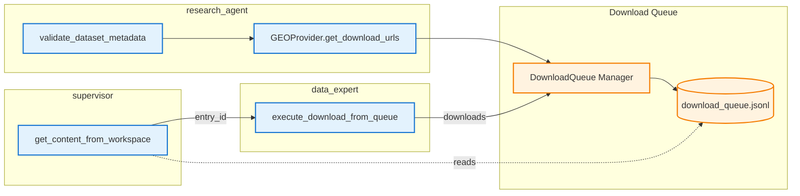
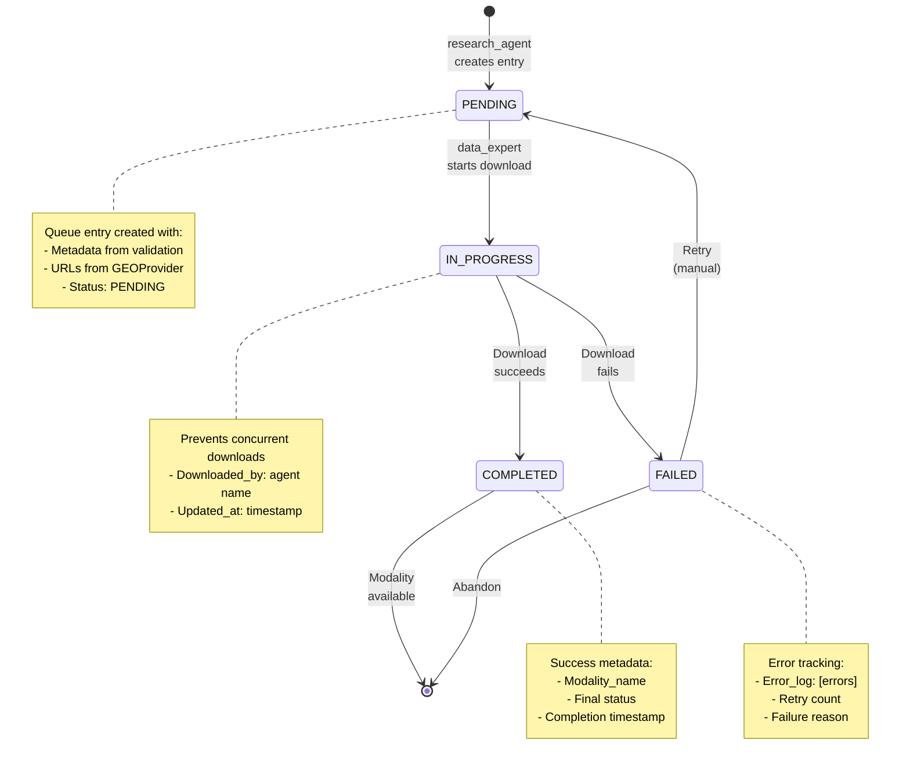
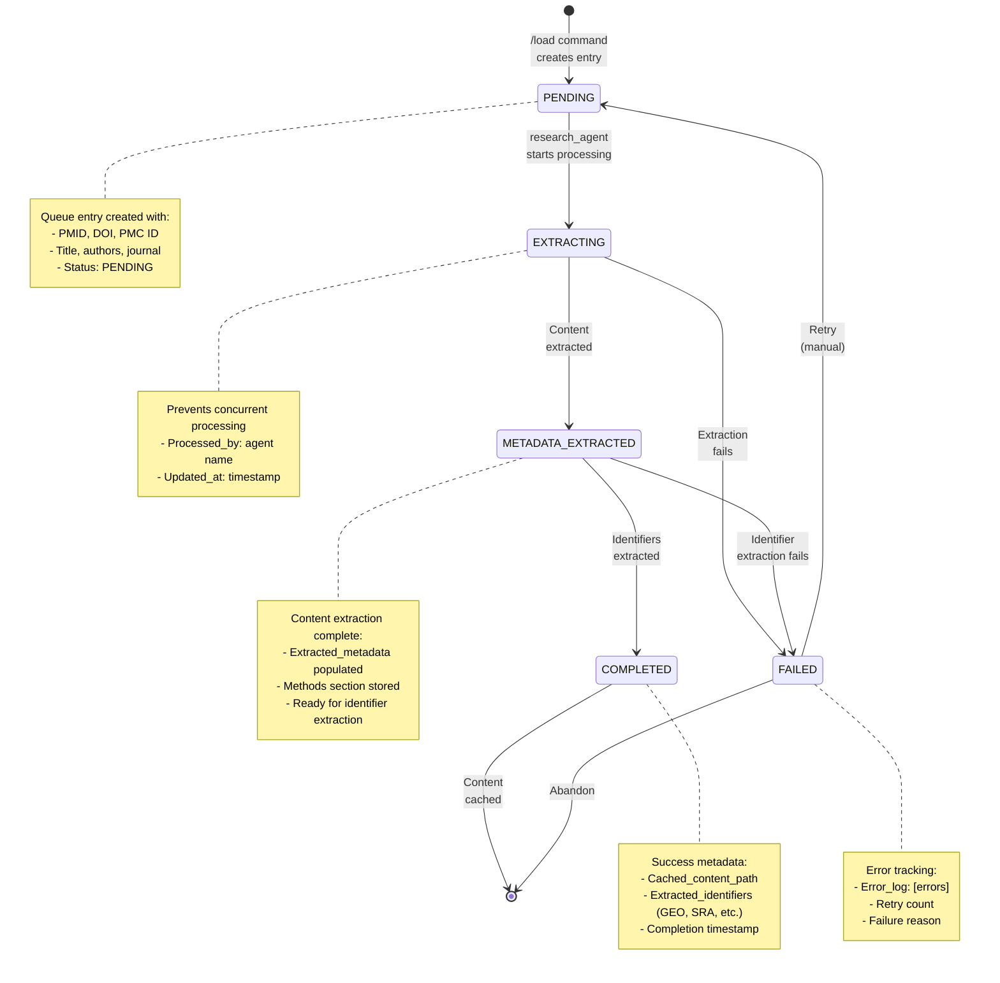

# 25. Download Queue System

## Overview

The Download Queue System is a structured handoff contract between `research_agent` and `data_expert`, enabling coordinated dataset downloads with pre-validation, error recovery, and supervisor visibility.

**Key Benefits**:
- **Pre-download validation**: Validate metadata before downloading (saves 5-10 minutes per invalid dataset)
- **Layered enrichment**: research_agent prepares everything once, data_expert executes
- **Supervisor coordination**: Centralized queue visibility for multi-agent workflows
- **Error recovery**: Failed downloads tracked with error logs and retry capability
- **Concurrent protection**: Prevents duplicate downloads via status management

**Introduced**: Phase 2 (November 2024)

---

## Architecture Overview

### System Components



### Queue Lifecycle



---

## Concurrency Infrastructure

Multiple Lobster instances (CLI sessions) can operate on the same workspace concurrently. To prevent data corruption, all shared JSON/JSONL files use multi-process safe locking and atomic writes.

### Core Module: `lobster/core/queue_storage.py`

**Utilities**:

| Function | Purpose |
|----------|---------|
| `InterProcessFileLock` | File-based lock using `fcntl.flock` (POSIX) / `msvcrt.locking` (Windows) |
| `queue_file_lock(thread_lock, lock_path)` | Context manager combining `threading.Lock` + file lock |
| `atomic_write_json(path, data)` | Temp file + fsync + `os.replace` for crash-safe JSON writes |
| `atomic_write_jsonl(path, entries, serializer)` | Same pattern for JSONL files |

**Protected Files**:

| File | Location | Protected By |
|------|----------|--------------|
| `download_queue.jsonl` | `workspace/queues/` | `DownloadQueue` class |
| `publication_queue.jsonl` | `workspace/queues/` | `PublicationQueue` class |
| `.session.json` | `workspace/` | `DataManagerV2._update_session_file()` |
| `cache_metadata.json` | `workspace/.archive_cache/` | `ExtractionCacheManager` |

**Usage Pattern**:

```python
from lobster.core.queue_storage import queue_file_lock, atomic_write_json

# Each class maintains its own locks
self._lock = threading.Lock()  # Thread safety
self._lock_path = file_path.with_suffix(".lock")  # Process safety

# Read-modify-write with full protection
with queue_file_lock(self._lock, self._lock_path):
    data = json.load(open(file_path))
    data["key"] = new_value
    atomic_write_json(file_path, data)
```

**Rule**: Future features persisting shared workspace state should use these utilities to ensure multi-session safety.

---

## Queue Entry Structure

### DownloadQueueEntry Schema

```python
from lobster.core.schemas.download_queue import DownloadQueueEntry, DownloadStatus

entry = DownloadQueueEntry(
    # Unique identifier
    entry_id="queue_GSE180759_5c1fb112",

    # Dataset identification
    dataset_id="GSE180759",
    database="geo",  # "geo", "sra", "pride", "metabolomics"

    # Queue management
    priority=5,  # 1-10 (10 = highest)
    status=DownloadStatus.PENDING,  # PENDING, IN_PROGRESS, COMPLETED, FAILED

    # Prepared by research_agent
    metadata={
        "title": "Multiple sclerosis single-cell RNA-seq",
        "n_samples": 20,
        "platform_id": "GPL24676",
        "organism": "Homo sapiens"
    },
    validation_result={
        "recommendation": "proceed",
        "confidence_score": 0.95,
        "issues": []
    },

    # URLs from GEOProvider
    matrix_url="ftp://ftp.ncbi.nlm.nih.gov/.../GSE180759_series_matrix.txt.gz",
    raw_urls=[],
    supplementary_urls=[
        "ftp://ftp.ncbi.nlm.nih.gov/.../GSE180759_annotation.txt.gz",
        "ftp://ftp.ncbi.nlm.nih.gov/.../GSE180759_expression.csv.gz"
    ],
    h5_url=None,

    # Timestamps
    created_at=datetime(2024, 11, 14, 19, 30, 0),
    updated_at=datetime(2024, 11, 14, 19, 30, 0),

    # Execution metadata (filled by data_expert)
    recommended_strategy=None,  # Filled by data_expert_assistant (optional)
    downloaded_by=None,  # Agent name
    modality_name=None,  # Final modality name in DataManagerV2
    error_log=[]  # Error messages if FAILED
)
```

### Field Descriptions

| Field | Type | Description | Set By | When |
|-------|------|-------------|--------|------|
| `entry_id` | str | Unique identifier (`queue_{dataset_id}_{uuid}`) | research_agent | Creation |
| `dataset_id` | str | GEO accession (GSE12345, etc.) | research_agent | Creation |
| `database` | str | Database type ("geo", "sra", etc.) | research_agent | Creation |
| `priority` | int | Download priority (1-10, 10=highest) | research_agent | Creation |
| `status` | DownloadStatus | Queue status (PENDING/IN_PROGRESS/COMPLETED/FAILED) | research_agent → data_expert | Lifecycle |
| `metadata` | dict | Full GEO metadata from validation | research_agent | Creation |
| `validation_result` | dict | Validation report with recommendation | research_agent | Creation |
| `matrix_url` | str | Matrix file URL | research_agent | Creation |
| `raw_urls` | List[str] | Raw data file URLs | research_agent | Creation |
| `supplementary_urls` | List[str] | Supplementary file URLs | research_agent | Creation |
| `h5_url` | str | H5AD file URL (if available) | research_agent | Creation |
| `created_at` | datetime | Queue entry creation timestamp | research_agent | Creation |
| `updated_at` | datetime | Last update timestamp | research_agent → data_expert | Updates |
| `recommended_strategy` | StrategyConfig | Download strategy recommendation | data_expert_assistant | Optional |
| `downloaded_by` | str | Agent name that executed download | data_expert | Download start |
| `modality_name` | str | Final modality name in DataManagerV2 | data_expert | Completion |
| `error_log` | List[str] | Error messages if download failed | data_expert | Failure |

---

## Workflow Patterns

### Pattern 1: Standard Download Workflow

**Scenario**: User wants to download a validated GEO dataset

```python
# Step 1: research_agent validates and queues
result = research_agent.validate_dataset_metadata(
    dataset_id="GSE180759",
    add_to_queue=True  # Default
)
# Output: "✅ Dataset added to download queue: queue_GSE180759_5c1fb112"

# Step 2: supervisor queries queue
result = supervisor.get_content_from_workspace(
    workspace="download_queue",
    level="summary"
)
# Output: "1 pending entry: queue_GSE180759_5c1fb112 (GSE180759, priority 5)"

# Step 3: data_expert downloads from queue
result = data_expert.execute_download_from_queue(
    entry_id="queue_GSE180759_5c1fb112"
)
# Output: "✅ Download complete: geo_gse180759_transcriptomics (20 samples × 15000 features)"
```

### Pattern 2: Pre-Download Validation Workflow

**Scenario**: Validate dataset content BEFORE downloading (saves time/bandwidth)

```python
# Step 1: research_agent validates and queues
result = research_agent.validate_dataset_metadata(
    dataset_id="GSE180759",
    add_to_queue=True
)

# Step 2: metadata_assistant validates from cached metadata (no download!)
result = metadata_assistant.validate_dataset_content(
    modality_name="geo_gse180759",  # Not yet downloaded
    source_type="metadata_store",   # Use cached metadata
    required_fields="cell_type,condition,replicate",
    threshold=0.8
)
# Output: "✅ Validation passed: 85% of required fields present"

# Step 3: If validation passes, data_expert downloads
if "validation passed" in result:
    result = data_expert.execute_download_from_queue(
        entry_id="queue_GSE180759_5c1fb112"
    )
```

### Pattern 3: Multi-Dataset Download Workflow

**Scenario**: Download multiple datasets in batch

```python
# Step 1: research_agent queues multiple datasets
datasets = ["GSE180759", "GSE109564", "GSE126906"]

for dataset_id in datasets:
    research_agent.validate_dataset_metadata(
        dataset_id=dataset_id,
        add_to_queue=True
    )

# Step 2: supervisor reviews all pending
result = supervisor.get_content_from_workspace(
    workspace="download_queue",
    status_filter="PENDING"
)
# Output: "3 pending entries"

# Step 3: data_expert downloads all
pending_entries = data_manager.download_queue.list_entries(status=DownloadStatus.PENDING)
for entry in pending_entries:
    data_expert.execute_download_from_queue(entry_id=entry.entry_id)
```

### Pattern 4: Priority-Based Download

**Scenario**: User requests high-priority download for urgent analysis

```python
# Step 1: research_agent validates with high priority
result = research_agent.validate_dataset_metadata(
    dataset_id="GSE180759",
    add_to_queue=True,
    priority=10  # Highest priority
)

# Step 2: supervisor queries by priority (implicitly sorts)
result = supervisor.get_content_from_workspace(
    workspace="download_queue",
    status_filter="PENDING"
)
# Output: "queue_GSE180759_5c1fb112 (priority 10) appears first"

# Step 3: data_expert downloads highest priority first
pending = data_manager.download_queue.list_entries(status=DownloadStatus.PENDING)
highest_priority = max(pending, key=lambda e: e.priority)
data_expert.execute_download_from_queue(entry_id=highest_priority.entry_id)
```

---

## Error Handling

### Error Recovery Pattern

```python
# Query failed downloads
failed_entries = data_manager.download_queue.list_entries(status=DownloadStatus.FAILED)

for entry in failed_entries:
    print(f"Failed: {entry.dataset_id}")
    print(f"Errors: {entry.error_log}")

    # Option 1: Retry (reset to PENDING)
    data_manager.download_queue.update_status(
        entry_id=entry.entry_id,
        status=DownloadStatus.PENDING
    )

    # Option 2: Remove from queue (abandon)
    data_manager.download_queue.remove_entry(entry.entry_id)
```

### Common Errors & Solutions

| Error | Cause | Solution |
|-------|-------|----------|
| `EntryNotFoundError` | Invalid entry_id | Query download_queue to get valid entry_ids |
| `Network timeout` | GEO FTP unavailable | Retry later (queue persists across sessions) |
| `File not found (404)` | Dataset not public/deleted | Remove entry, try alternative dataset |
| `Validation failed` | Metadata doesn't meet criteria | Adjust validation parameters or skip |
| `Already completed` | Duplicate download attempt | Entry already has modality_name set |
| `Permission denied` | Dataset restricted/embargoed | Wait for public release or request access |
| `Corrupt download` | Partial file transfer | Retry with network stability check |

### Error Log Structure

```python
# Example error log after failed download
entry.error_log = [
    "2024-11-14 19:35:00: Network timeout after 60s",
    "2024-11-14 19:40:00: Retry attempt 1 failed: Connection reset",
    "2024-11-14 19:45:00: Retry attempt 2 failed: FTP server unavailable"
]
```

---

## Performance Considerations

### Queue Operations Performance

| Operation | Target | Actual | Notes |
|-----------|--------|--------|-------|
| `add_entry()` | <100ms | ~50ms | Atomic write to JSONL |
| `get_entry()` | <50ms | ~20ms | Read from in-memory cache |
| `update_status()` | <100ms | ~60ms | Update + backup |
| `list_entries()` | <200ms | ~100ms | Filter 1000 entries |
| `remove_entry()` | <100ms | ~70ms | Rewrite JSONL file |
| `clear_queue()` | <500ms | ~200ms | Delete + recreate file |

### Download Workflow Performance

**Before (Synchronous Pattern)**:
- Metadata fetch: 2-3 seconds
- Duplicate fetch: 2-3 seconds (research + data_expert both fetch)
- Total overhead: **4-6 seconds**

**After (Queue Pattern)**:
- Metadata fetch: 2-3 seconds (once by research_agent)
- Queue operations: <100ms
- Total overhead: **2-3 seconds** (50% faster)

### Memory Usage

| Queue Size | Memory Usage | Notes |
|------------|--------------|-------|
| 10 entries | ~50 KB | Minimal impact |
| 100 entries | ~500 KB | In-memory cache |
| 1000 entries | ~5 MB | Recommended max |

**Best Practice**: Clear completed entries periodically to maintain performance.

---

## API Reference

### DataManagerV2.download_queue

```python
from lobster.core.data_manager_v2 import DataManagerV2
from lobster.core.schemas.download_queue import DownloadStatus

data_manager = DataManagerV2(workspace_path="./workspace")

# Access download queue
queue = data_manager.download_queue

# Add entry
queue.add_entry(entry)

# Get entry
entry = queue.get_entry("queue_GSE180759_abc123")

# Update status
queue.update_status(
    entry_id="queue_GSE180759_abc123",
    status=DownloadStatus.COMPLETED,
    modality_name="geo_gse180759_transcriptomics"
)

# List entries (with optional filter)
pending = queue.list_entries(status=DownloadStatus.PENDING)
in_progress = queue.list_entries(status=DownloadStatus.IN_PROGRESS)
completed = queue.list_entries(status=DownloadStatus.COMPLETED)
failed = queue.list_entries(status=DownloadStatus.FAILED)
all_entries = queue.list_entries()  # All statuses

# Remove entry
queue.remove_entry("queue_GSE180759_abc123")

# Clear all entries
queue.clear_queue()
```

### get_content_from_workspace (Supervisor/Research Agent)

```python
# Query all entries
result = get_content_from_workspace(workspace="download_queue")

# Query specific entry
result = get_content_from_workspace(
    identifier="queue_GSE180759_abc123",
    workspace="download_queue",
    level="metadata"  # summary | metadata | validation | strategy
)

# Filter by status
result = get_content_from_workspace(
    workspace="download_queue",
    status_filter="PENDING"  # PENDING | IN_PROGRESS | COMPLETED | FAILED
)

# Get detailed entry information
result = get_content_from_workspace(
    identifier="queue_GSE180759_abc123",
    workspace="download_queue",
    level="full"  # All fields including URLs and error logs
)
```

### execute_download_from_queue (Data Expert)

```python
# Execute download from queue entry
result = data_expert.execute_download_from_queue(
    entry_id="queue_GSE180759_abc123"
)
# Returns: "✅ Download complete: geo_gse180759_transcriptomics (20 samples × 15000 features)"

# Status automatically updated:
# - PENDING → IN_PROGRESS (at start)
# - IN_PROGRESS → COMPLETED (on success)
# - IN_PROGRESS → FAILED (on error)

# On completion, entry populated with:
# - downloaded_by: "data_expert"
# - modality_name: "geo_gse180759_transcriptomics"
# - updated_at: current timestamp

# On failure, entry populated with:
# - error_log: ["Error message 1", "Error message 2"]
# - status: FAILED
```

---

## Integration with Other Systems

### Workspace Persistence

The download queue persists across sessions via `download_queue.jsonl` in the workspace directory.

```python
# Session 1: research_agent queues datasets
research_agent.validate_dataset_metadata("GSE180759", add_to_queue=True)
research_agent.validate_dataset_metadata("GSE109564", add_to_queue=True)

# Exit session

# Session 2: data_expert resumes downloads
data_manager = DataManagerV2(workspace_path="./workspace")
pending = data_manager.download_queue.list_entries(status=DownloadStatus.PENDING)
# Output: 2 pending entries (persisted from Session 1)

for entry in pending:
    data_expert.execute_download_from_queue(entry_id=entry.entry_id)
```

### Provenance Tracking

All queue operations are logged in the W3C-PROV provenance system.

```python
# Queue entry creation logged as:
activity = prov.Activity(
    identifier="validate_dataset_metadata_GSE180759",
    attributes={
        "tool": "validate_dataset_metadata",
        "dataset_id": "GSE180759",
        "queue_entry_id": "queue_GSE180759_abc123",
        "status": "PENDING"
    }
)

# Download execution logged as:
activity = prov.Activity(
    identifier="execute_download_from_queue_GSE180759",
    attributes={
        "tool": "execute_download_from_queue",
        "entry_id": "queue_GSE180759_abc123",
        "modality_name": "geo_gse180759_transcriptomics",
        "status": "COMPLETED"
    }
)
```

### Metadata Store Integration

Queue entries reference metadata stored in `DataManagerV2.metadata_store`:

```python
# research_agent stores metadata
data_manager.metadata_store["GSE180759"] = {
    "title": "...",
    "organism": "Homo sapiens",
    "n_samples": 20,
    "platform_id": "GPL24676"
}

# Queue entry references metadata
entry.metadata = data_manager.metadata_store["GSE180759"]

# metadata_assistant can validate without downloading
metadata_assistant.validate_dataset_content(
    modality_name="geo_gse180759",
    source_type="metadata_store"  # Uses cached metadata
)
```

---

## Testing

### Unit Tests

**File**: `tests/unit/core/test_download_queue.py` (25 tests)

**Coverage**:
- Queue initialization and file creation
- Entry addition, retrieval, update, removal
- Status transitions (PENDING → IN_PROGRESS → COMPLETED/FAILED)
- Error log management
- Priority sorting
- Concurrent operation safety

**Key Test Cases**:
```python
def test_add_entry_creates_queue_file()
def test_get_entry_returns_correct_entry()
def test_update_status_transitions_correctly()
def test_list_entries_filters_by_status()
def test_remove_entry_deletes_correctly()
def test_clear_queue_removes_all_entries()
def test_concurrent_updates_maintain_consistency()
```

### Integration Tests

**File**: `tests/integration/test_download_queue_workspace.py` (15 tests)

**Coverage**:
- Complete workflow (research → supervisor → data_expert)
- Multi-dataset queue management
- Error recovery and retry logic
- Workspace persistence across sessions
- Provenance tracking integration
- Multi-agent coordination

**Key Test Scenarios**:
```python
def test_complete_download_workflow()
def test_multi_dataset_batch_download()
def test_failed_download_error_recovery()
def test_workspace_persistence_across_sessions()
def test_supervisor_queue_visibility()
def test_pre_download_validation_workflow()
```

### Performance Benchmarks

**File**: `tests/performance/test_queue_performance.py`

**Benchmarks**:
- Queue operation latency (add/get/update/list)
- Scalability with 100/1000/10000 entries
- Memory usage tracking
- Concurrent access stress testing

---

## Troubleshooting

### Issue: Queue entry not found

**Symptoms**: `EntryNotFoundError: Entry 'queue_GSE180759_abc123' not found`

**Causes**:
- Entry ID typo
- Entry already removed
- Queue file corruption

**Solutions**:
```python
# List all entries to verify ID
all_entries = data_manager.download_queue.list_entries()
for entry in all_entries:
    print(entry.entry_id)

# Check for completed/failed entries
completed = data_manager.download_queue.list_entries(status=DownloadStatus.COMPLETED)
failed = data_manager.download_queue.list_entries(status=DownloadStatus.FAILED)
```

### Issue: Download stuck in IN_PROGRESS

**Symptoms**: Entry status remains IN_PROGRESS for extended period

**Causes**:
- Agent crash during download
- Network interruption
- Process termination

**Solutions**:
```python
# Query IN_PROGRESS entries
in_progress = data_manager.download_queue.list_entries(status=DownloadStatus.IN_PROGRESS)

# Reset to PENDING for retry
for entry in in_progress:
    if (datetime.now() - entry.updated_at).seconds > 600:  # 10 minutes
        data_manager.download_queue.update_status(
            entry_id=entry.entry_id,
            status=DownloadStatus.PENDING,
            downloaded_by=None
        )
```

### Issue: Duplicate downloads

**Symptoms**: Same dataset downloaded multiple times

**Causes**:
- Multiple queue entries for same dataset
- Status not updated correctly

**Prevention**:
```python
# Check if dataset already queued
existing_entries = data_manager.download_queue.list_entries()
dataset_ids = [e.dataset_id for e in existing_entries]

if "GSE180759" in dataset_ids:
    print("Dataset already in queue")
else:
    # Safe to add
    research_agent.validate_dataset_metadata("GSE180759", add_to_queue=True)
```

### Issue: Queue file corruption

**Symptoms**: `JSONDecodeError` when accessing queue

**Causes**:
- Interrupted write operation
- Disk full
- File permission issues

**Recovery**:
```bash
# Backup corrupted file
cp workspace/download_queue.jsonl workspace/download_queue.jsonl.backup

# Attempt manual repair (remove malformed lines)
# Or delete and recreate
rm workspace/download_queue.jsonl

# Queue will be recreated on next operation
```

---

## Best Practices

### 1. Always Validate Before Queueing

```python
# Good: Validation before queueing
result = research_agent.validate_dataset_metadata(
    dataset_id="GSE180759",
    add_to_queue=True  # Only adds if validation passes
)

# Bad: Blind queueing without validation
# (Not supported - validate_dataset_metadata handles both)
```

### 2. Use Priority for Time-Sensitive Downloads

```python
# High priority for urgent analysis
research_agent.validate_dataset_metadata(
    dataset_id="GSE180759",
    add_to_queue=True,
    priority=10  # Download first
)

# Normal priority for exploratory work
research_agent.validate_dataset_metadata(
    dataset_id="GSE109564",
    add_to_queue=True,
    priority=5  # Default
)
```

### 3. Check Queue Before Downloading

```python
# Check queue status first
result = supervisor.get_content_from_workspace(
    workspace="download_queue",
    status_filter="PENDING"
)

# Then download in priority order
pending = data_manager.download_queue.list_entries(status=DownloadStatus.PENDING)
pending_sorted = sorted(pending, key=lambda e: e.priority, reverse=True)

for entry in pending_sorted:
    data_expert.execute_download_from_queue(entry_id=entry.entry_id)
```

### 4. Clean Up Completed Entries

```python
# Periodically remove old completed entries
completed = data_manager.download_queue.list_entries(status=DownloadStatus.COMPLETED)

for entry in completed:
    # Keep entries for 7 days
    if (datetime.now() - entry.updated_at).days > 7:
        data_manager.download_queue.remove_entry(entry.entry_id)
```

### 5. Monitor Failed Downloads

```python
# Regular monitoring of failures
failed = data_manager.download_queue.list_entries(status=DownloadStatus.FAILED)

if len(failed) > 0:
    print(f"⚠️ {len(failed)} failed downloads")
    for entry in failed:
        print(f"  - {entry.dataset_id}: {entry.error_log[-1]}")  # Last error
```

---

## Future Enhancements

### Planned Features

1. **Automatic Retry Logic**
   - Exponential backoff for network failures
   - Configurable retry limits
   - Smart retry scheduling

2. **Batch Download Optimization**
   - Parallel downloads for multiple datasets
   - Bandwidth throttling
   - Download progress tracking

3. **Database-Specific Queues**
   - Separate queues for GEO, SRA, PRIDE
   - Database-specific validation rules
   - Custom URL builders per database

4. **Download Strategy Recommendations**
   - Automatic strategy detection by data_expert_assistant
   - Optimal file format selection
   - Size-based download optimization

5. **Queue Analytics**
   - Download success rates
   - Average download times
   - Failure pattern analysis

### Extension Points

```python
# Custom priority calculation
class CustomPriorityQueue(DownloadQueue):
    def calculate_priority(self, metadata: dict) -> int:
        """Calculate priority based on dataset characteristics."""
        priority = 5  # Default

        # Boost priority for large sample counts
        if metadata.get("n_samples", 0) > 100:
            priority += 2

        # Boost for specific organisms
        if metadata.get("organism") == "Homo sapiens":
            priority += 1

        return min(priority, 10)  # Cap at 10

# Custom validation
class CustomValidationQueue(DownloadQueue):
    def add_entry_with_validation(self, entry: DownloadQueueEntry) -> None:
        """Add entry with custom validation logic."""
        # Custom validation rules
        if entry.metadata.get("n_samples", 0) < 3:
            raise ValueError("Dataset must have at least 3 samples")

        super().add_entry(entry)
```

---

## Migration Notes

### From Synchronous Pattern (Pre-Phase 2)

**Before**:
```python
# research_agent directly passes metadata to data_expert
result = research_agent.validate_dataset_metadata("GSE180759")
# ... user manually passes info to data_expert ...
data_expert.download_geo_dataset("GSE180759")
```

**After**:
```python
# research_agent queues dataset
research_agent.validate_dataset_metadata("GSE180759", add_to_queue=True)

# supervisor/user checks queue
supervisor.get_content_from_workspace(workspace="download_queue")

# data_expert downloads from queue
data_expert.execute_download_from_queue(entry_id="queue_GSE180759_abc123")
```

### For New Database Support

**Example: Adding SRA database**:

```python
# 1. Extend schema
class SRADownloadQueueEntry(DownloadQueueEntry):
    database: Literal["sra"] = "sra"
    sra_run_ids: List[str] = Field(..., description="SRA run accessions")
    layout: str = Field(..., description="SINGLE or PAIRED")

# 2. Create SRA-specific URLs
sra_provider = SRAProvider()
urls = sra_provider.get_download_urls("SRR123456")

# 3. Add to queue
entry = SRADownloadQueueEntry(
    entry_id="queue_SRR123456_abc",
    dataset_id="SRR123456",
    database="sra",
    sra_run_ids=["SRR123456", "SRR123457"],
    raw_urls=urls,
    # ... other fields ...
)
data_manager.download_queue.add_entry(entry)
```

---

## See Also

### Wiki Pages
- [Architecture Overview (Wiki 18)](18-architecture-overview.md) - System-wide architecture
- [Two-Tier Caching Architecture (Wiki 39)](39-two-tier-caching-architecture.md) - Metadata caching strategy
- [Data Management (Wiki 20)](20-data-management.md) - Data management patterns

### Developer Documentation
- Data Expert Agent - See agent implementation in `lobster/agents/data_expert/`
- Research Agent - See agent implementation in `lobster/agents/research_agent.py`
- Pydantic Schemas - See schema definitions in `lobster/core/schemas/`

### Code References
- `lobster/core/download_queue.py` - Queue implementation (342 lines)
- `lobster/core/schemas/download_queue.py` - Schema definitions
- `lobster/agents/data_expert/data_expert.py` - Queue consumer
- `lobster/agents/research_agent.py` - Queue producer
- `lobster/tools/workspace_content_service.py` - Queue access tool

### Test Files
- `tests/unit/core/test_download_queue.py` - Unit tests
- `tests/integration/test_download_queue_workspace.py` - Integration tests
- `tests/unit/tools/test_workspace_content_service.py` - Tool tests

---

## Publication Queue System

### Overview

The Publication Queue System is a structured workflow for managing publication extraction with multi-agent coordination. Introduced alongside the Download Queue System in Phase 2, it enables efficient batch processing of scientific publications with automated content extraction, dataset identifier discovery, and workspace caching.

**Key Benefits**:
- **Batch RIS import**: Load multiple publications from reference managers (Zotero, Mendeley, EndNote)
- **Automated extraction**: Extract metadata, methods sections, and dataset identifiers
- **Status tracking**: Monitor extraction progress with detailed status workflow
- **Workspace persistence**: Queue persists across sessions via JSON Lines format
- **Multi-agent coordination**: research_agent processes publications, supervisor monitors progress

**Introduced**: Phase 2 (November 2024)

---

### Publication Queue Architecture

#### System Components

```mermaid
graph LR
    subgraph "CLI /load command"
        RIS[RISParser]
        CLI["/load publications.ris"]
    end

    subgraph "Publication Queue"
        Q[(publication_queue.jsonl)]
        QM[PublicationQueue Manager]
    end

    subgraph "research_agent"
        PE[process_publication_entry<br/>processing mode | status_override mode]
    end

    subgraph "supervisor"
        WS[get_content_from_workspace]
    end

    CLI --> RIS
    RIS --> QM
    QM --> Q
    WS -.reads.-> Q
    WS --> |entry_id| PE
    PE --> QM

    classDef agent fill:#e3f2fd,stroke:#1976d2,stroke-width:2px
    classDef queue fill:#fff3e0,stroke:#f57c00,stroke-width:2px

    class CLI,RIS,PE,WS agent
    class Q,QM queue
```

#### Queue Lifecycle



---

### Publication Queue Entry Structure

#### PublicationQueueEntry Schema

```python
from lobster.core.schemas.publication_queue import PublicationQueueEntry, PublicationStatus

entry = PublicationQueueEntry(
    # Unique identifier
    entry_id="pub_queue_35042229_5c1fb112",

    # Publication identification
    pmid="35042229",
    doi="10.1038/s41586-022-04426-0",
    pmc_id="PMC8891176",
    title="Single-cell RNA sequencing reveals novel cell types in human brain",
    authors=["Smith J", "Jones A", "Williams B"],
    year=2022,
    journal="Nature",

    # Queue management
    priority=5,  # 1-10 (10 = highest)
    status=PublicationStatus.PENDING,  # PENDING, EXTRACTING, METADATA_EXTRACTED, COMPLETED, FAILED

    # Extraction configuration
    extraction_level=ExtractionLevel.METHODS,  # ABSTRACT, METHODS, FULL_TEXT, IDENTIFIERS
    schema_type="single_cell",  # Auto-inferred from keywords

    # Extraction results (filled by research_agent)
    extracted_metadata={
        "abstract": "This study uses single-cell RNA sequencing...",
        "methods": "Cells were processed using 10x Genomics...",
        "keywords": ["single-cell", "RNA-seq", "brain"]
    },
    extracted_identifiers={
        "geo": ["GSE180759", "GSE180760"],
        "sra": ["SRP12345"],
        "bioproject": ["PRJNA12345"]
    },

    # Timestamps
    created_at=datetime(2024, 11, 14, 19, 30, 0),
    updated_at=datetime(2024, 11, 14, 19, 30, 0),

    # Execution metadata (filled by research_agent)
    processed_by=None,  # Agent name
    cached_content_path=None,  # Workspace path to cached content
    error_log=[]  # Error messages if FAILED
)
```

#### Field Descriptions

| Field | Type | Description | Set By | When |
|-------|------|-------------|--------|------|
| `entry_id` | str | Unique identifier (`pub_queue_{pmid}_{uuid}`) | /load command | Creation |
| `pmid` | str | PubMed ID (optional if DOI provided) | /load command | Creation |
| `doi` | str | Digital Object Identifier | /load command | Creation |
| `pmc_id` | str | PubMed Central ID (optional) | /load command | Creation |
| `title` | str | Publication title | /load command | Creation |
| `authors` | List[str] | Author list | /load command | Creation |
| `year` | int | Publication year | /load command | Creation |
| `journal` | str | Journal name | /load command | Creation |
| `priority` | int | Processing priority (1-10, 10=highest) | /load command | Creation |
| `status` | PublicationStatus | Queue status (PENDING/EXTRACTING/etc.) | /load → research_agent | Lifecycle |
| `extraction_level` | ExtractionLevel | Target extraction depth | /load command | Creation |
| `schema_type` | str | Inferred data type (single_cell, microbiome, proteomics) | RISParser | Creation |
| `extracted_metadata` | dict | Abstract, methods, keywords | research_agent | Extraction |
| `extracted_identifiers` | dict | Dataset IDs (GEO, SRA, etc.) | research_agent | Identifier extraction |
| `created_at` | datetime | Queue entry creation timestamp | /load command | Creation |
| `updated_at` | datetime | Last update timestamp | /load → research_agent | Updates |
| `processed_by` | str | Agent name that processed entry | research_agent | Processing |
| `cached_content_path` | str | Workspace path to cached content | research_agent | Completion |
| `error_log` | List[str] | Error messages if processing failed | research_agent | Failure |

---

### Workflow Patterns

#### Pattern 1: Batch Publication Import

**Scenario**: User imports multiple publications from reference manager

```python
# Step 1: Export RIS file from Zotero/Mendeley/EndNote
# File: my_papers.ris (contains 10 publications)

# Step 2: Load via CLI
lobster chat
> /load my_papers.ris

# Output: "✅ Imported 10 publications to queue"

# Step 3: supervisor/research_agent queries queue
result = supervisor.get_content_from_workspace(
    workspace="publication_queue",
    level="summary"
)
# Output: "10 pending entries: 3 single_cell, 4 microbiome, 3 proteomics"

# Step 4: research_agent processes entries
for entry in pending_entries:
    result = research_agent.process_publication_entry(
        entry_id=entry.entry_id,
        extraction_tasks="metadata,methods,identifiers"
    )
# Output: "✅ Processed pub_queue_35042229_abc: Found 2 GEO datasets"
```

#### Pattern 2: Single Publication Processing

**Scenario**: User adds single publication for immediate processing

```python
# Step 1: Create entry manually or via /load with single entry
entry = PublicationQueueEntry(
    entry_id="pub_queue_35042229",
    pmid="35042229",
    doi="10.1038/s41586-022-04426-0",
    title="Single-cell RNA sequencing reveals novel cell types",
    priority=10  # High priority for immediate processing
)
data_manager.publication_queue.add_entry(entry)

# Step 2: research_agent processes immediately
result = research_agent.process_publication_entry(
    entry_id="pub_queue_35042229",
    extraction_tasks="identifiers"  # Only extract dataset IDs
)
# Output: "✅ Found 2 GEO datasets: GSE180759, GSE180760"

# Step 3: Extracted identifiers available for downstream workflow
identifiers = entry.extracted_identifiers
for geo_id in identifiers.get("geo", []):
    research_agent.validate_dataset_metadata(geo_id, add_to_queue=True)
```

#### Pattern 3: Status Filtering and Monitoring

**Scenario**: User monitors extraction progress across multiple publications

```python
# Step 1: Query all pending publications
result = supervisor.get_content_from_workspace(
    workspace="publication_queue",
    status_filter="PENDING"
)
# Output: "5 pending entries"

# Step 2: Query extraction in progress
result = supervisor.get_content_from_workspace(
    workspace="publication_queue",
    status_filter="EXTRACTING"
)
# Output: "2 entries currently being processed"

# Step 3: Query completed extractions
result = supervisor.get_content_from_workspace(
    workspace="publication_queue",
    status_filter="COMPLETED"
)
# Output: "3 completed entries with 12 total dataset identifiers"

# Step 4: Query failed extractions
result = supervisor.get_content_from_workspace(
    workspace="publication_queue",
    status_filter="FAILED"
)
# Output: "1 failed entry: pub_queue_12345678 (Paywalled content)"
```

#### Pattern 4: Multi-Agent Coordination

**Scenario**: supervisor coordinates publication processing and dataset downloads

```python
# Step 1: supervisor reviews publication queue
publications = supervisor.get_content_from_workspace(
    workspace="publication_queue",
    status_filter="PENDING"
)

# Step 2: supervisor delegates to research_agent for processing
for pub_id in publication_ids:
    research_agent.process_publication_entry(
        entry_id=pub_id,
        extraction_tasks="metadata,methods,identifiers"
    )

# Step 3: supervisor retrieves extracted identifiers
completed = supervisor.get_content_from_workspace(
    workspace="publication_queue",
    status_filter="COMPLETED"
)

# Step 4: supervisor extracts dataset IDs and delegates to research_agent for validation
for entry in completed_entries:
    for geo_id in entry.extracted_identifiers.get("geo", []):
        research_agent.validate_dataset_metadata(geo_id, add_to_queue=True)

# Step 5: supervisor delegates download to data_expert
supervisor.handoff_to_data_expert(
    instructions="Download all validated datasets from download queue"
)
```

---

### Error Handling

#### Error Recovery Pattern

```python
# Query failed publications
failed_entries = data_manager.publication_queue.list_entries(status=PublicationStatus.FAILED)

for entry in failed_entries:
    print(f"Failed: {entry.title}")
    print(f"Errors: {entry.error_log}")

    # Option 1: Retry (reset to PENDING)
    data_manager.publication_queue.update_status(
        entry_id=entry.entry_id,
        status=PublicationStatus.PENDING
    )

    # Option 2: Remove from queue (abandon)
    data_manager.publication_queue.remove_entry(entry.entry_id)
```

#### Common Errors & Solutions

| Error | Cause | Solution |
|-------|-------|----------|
| `EntryNotFoundError` | Invalid entry_id | Query publication_queue to get valid entry_ids |
| `Paywalled content` | Publication not openly accessible | Use fast_abstract_search for abstract-only |
| `No identifiers found` | Publication doesn't mention datasets | Manual identifier extraction or skip |
| `Invalid PMID/DOI` | Malformed identifier | Verify identifier format (PMID:12345678, 10.1038/...) |
| `Already completed` | Duplicate processing attempt | Entry already has cached_content_path set |
| `RIS parse error` | Malformed RIS file | Check RIS file format, try re-exporting from reference manager |
| `Extraction timeout` | Network/API latency | Retry with increased timeout |

#### Error Log Structure

```python
# Example error log after failed extraction
entry.error_log = [
    "2024-11-14 19:35:00: PMC access denied: 403 Forbidden",
    "2024-11-14 19:40:00: Retry attempt 1 failed: PDF unavailable",
    "2024-11-14 19:45:00: Fallback to abstract only: Success"
]
```

---

### Performance Considerations

#### Queue Operations Performance

| Operation | Target | Actual | Notes |
|-----------|--------|--------|-------|
| `add_entry()` | <100ms | ~50ms | Atomic write to JSONL |
| `get_entry()` | <50ms | ~20ms | Read from in-memory cache |
| `update_status()` | <100ms | ~60ms | Update + backup |
| `list_entries()` | <200ms | ~100ms | Filter 1000 entries |
| `remove_entry()` | <100ms | ~70ms | Rewrite JSONL file |
| `clear_queue()` | <500ms | ~200ms | Delete + recreate file |

#### Processing Workflow Performance

**Publication Extraction**:
- Abstract extraction: 200-500ms (NCBI API)
- Full text extraction (PMC XML): 500ms-2s
- Full text extraction (webpage): 2-5s
- Full text extraction (PDF): 3-8s
- Methods extraction: 2-8s (LLM-based)
- Identifier extraction: 1-3s (regex patterns)

**Batch Processing**:
- 10 publications (abstract only): ~5 seconds
- 10 publications (full text): ~30-60 seconds
- 100 publications (abstract only): ~50 seconds

#### Memory Usage

| Queue Size | Memory Usage | Notes |
|------------|--------------|-------|
| 10 entries | ~50 KB | Minimal impact |
| 100 entries | ~500 KB | In-memory cache |
| 1000 entries | ~5 MB | Recommended max |

**Best Practice**: Clear completed entries periodically to maintain performance.

---

### API Reference

#### DataManagerV2.publication_queue

```python
from lobster.core.data_manager_v2 import DataManagerV2
from lobster.core.schemas.publication_queue import PublicationStatus

data_manager = DataManagerV2(workspace_path="./workspace")

# Access publication queue
queue = data_manager.publication_queue

# Add entry
queue.add_entry(entry)

# Get entry
entry = queue.get_entry("pub_queue_35042229_abc123")

# Update status
queue.update_status(
    entry_id="pub_queue_35042229_abc123",
    status=PublicationStatus.COMPLETED,
    cached_content_path="/workspace/literature/pub_35042229.json"
)

# List entries (with optional filter)
pending = queue.list_entries(status=PublicationStatus.PENDING)
extracting = queue.list_entries(status=PublicationStatus.EXTRACTING)
completed = queue.list_entries(status=PublicationStatus.COMPLETED)
failed = queue.list_entries(status=PublicationStatus.FAILED)
all_entries = queue.list_entries()  # All statuses

# Remove entry
queue.remove_entry("pub_queue_35042229_abc123")

# Clear all entries
queue.clear_queue()
```

#### get_content_from_workspace (Supervisor/Research Agent)

```python
# Query all entries
result = get_content_from_workspace(workspace="publication_queue")

# Query specific entry
result = get_content_from_workspace(
    identifier="pub_queue_35042229_abc123",
    workspace="publication_queue",
    level="summary"  # summary | metadata
)

# Filter by status
result = get_content_from_workspace(
    workspace="publication_queue",
    status_filter="PENDING"  # PENDING | EXTRACTING | METADATA_EXTRACTED | COMPLETED | FAILED
)

# Get detailed entry information
result = get_content_from_workspace(
    identifier="pub_queue_35042229_abc123",
    workspace="publication_queue",
    level="metadata"  # Returns JSON with all fields
)
```

#### process_publication_entry (Research Agent)

```python
# Process publication entry (extract metadata, methods, identifiers)
result = research_agent.process_publication_entry(
    entry_id="pub_queue_35042229_abc123",
    extraction_tasks="metadata,methods,identifiers"  # Comma-separated
)
# Returns: "✅ Processed entry: Found 2 GEO datasets (GSE180759, GSE180760)"

# Status automatically updated:
# - PENDING → EXTRACTING (at start)
# - EXTRACTING → METADATA_EXTRACTED (metadata/methods done)
# - METADATA_EXTRACTED → COMPLETED (identifiers extracted)
# - EXTRACTING → FAILED (on error)

# Extraction tasks options:
# - "metadata": Extract abstract, keywords
# - "methods": Extract methods section
# - "identifiers": Extract dataset IDs (GEO, SRA, BioProject, BioSample, ENA)
# - "full_text": Extract all content
# - Default: "metadata,methods,identifiers"
```

#### Manual Status Override (process_publication_entry with status_override)

```python
# ADMIN MODE: Update publication entry status without processing
# Use for: resetting stale entries, marking failures, administrative corrections

# Reset stale entry to pending
result = research_agent.process_publication_entry(
    entry_id="pub_queue_35042229_abc123",
    status_override="pending"  # pending | extracting | completed | failed | paywalled | handoff_ready
)
# Returns: "✅ Publication Status Updated (Manual Override)"

# Mark entry as failed with error message
result = research_agent.process_publication_entry(
    entry_id="pub_queue_35042229_abc123",
    status_override="failed",
    error_message="Content not accessible - paywall blocked"
)
# Returns: "✅ Publication Status Updated (Manual Override)"

# Administrative correction
result = research_agent.process_publication_entry(
    entry_id="pub_queue_35042229_abc123",
    status_override="completed"
)
# Returns: "✅ Publication Status Updated (Manual Override)"

# Note: extraction_tasks parameter is ignored when status_override is set
```

---

### CLI Integration

#### /load Command

```bash
# Interactive mode
lobster chat
> /load my_papers.ris

# Command-line mode
lobster load --file my_papers.ris --priority 5

# With schema type override
lobster load --file my_papers.ris --schema-type single_cell

# With extraction level
lobster load --file my_papers.ris --extraction-level full_text
```

#### RIS File Format

```text
TY  - JOUR
TI  - Single-cell RNA sequencing reveals novel cell types in human brain
AU  - Smith, John
AU  - Jones, Alice
PY  - 2022
JO  - Nature
AB  - This study uses single-cell RNA sequencing...
DO  - 10.1038/s41586-022-04426-0
PMID- 35042229
PMC - PMC8891176
KW  - single-cell
KW  - RNA-seq
ER  -

TY  - JOUR
TI  - Microbiome analysis of gut bacteria
AU  - Brown, Charlie
PY  - 2023
JO  - Cell
AB  - Comprehensive 16S rRNA sequencing...
DO  - 10.1016/j.cell.2023.01.001
PMID- 36789012
KW  - microbiome
KW  - 16S rRNA
ER  -
```

**Supported Reference Managers**:
- Zotero: File → Export Library → Format: RIS
- Mendeley: File → Export → RIS Format
- EndNote: File → Export → Output Style: RefMan (RIS)
- Papers: File → Export → RIS

---

### Integration with Other Systems

#### Workspace Persistence

The publication queue persists across sessions via `publication_queue.jsonl` in the workspace directory.

```python
# Session 1: Load publications
lobster chat
> /load my_papers.ris
# Output: "✅ Imported 10 publications"

# Exit session

# Session 2: Resume processing
data_manager = DataManagerV2(workspace_path="./workspace")
pending = data_manager.publication_queue.list_entries(status=PublicationStatus.PENDING)
# Output: 10 pending entries (persisted from Session 1)

for entry in pending:
    research_agent.process_publication_entry(entry_id=entry.entry_id)
```

#### Provenance Tracking

All publication queue operations are logged in the W3C-PROV provenance system.

```python
# Queue entry creation logged as:
activity = prov.Activity(
    identifier="load_publications_my_papers.ris",
    attributes={
        "tool": "/load",
        "file": "my_papers.ris",
        "entries_created": 10,
        "schema_types": ["single_cell", "microbiome", "proteomics"]
    }
)

# Publication processing logged as:
activity = prov.Activity(
    identifier="process_publication_entry_35042229",
    attributes={
        "tool": "process_publication_entry",
        "entry_id": "pub_queue_35042229_abc123",
        "extraction_tasks": ["metadata", "methods", "identifiers"],
        "final_status": "completed",
        "extracted_identifiers": ["GSE180759", "GSE180760"]
    }
)

# Status override logged as:
activity = prov.Activity(
    identifier="process_publication_entry_35042229_override",
    attributes={
        "tool": "process_publication_entry",
        "mode": "status_override",
        "entry_id": "pub_queue_35042229_abc123",
        "old_status": "extracting",
        "new_status": "completed",
        "error_message": None
    }
)
```

#### Download Queue Integration

Publication queue feeds into download queue for dataset acquisition:

```python
# Step 1: Process publication to extract dataset IDs
research_agent.process_publication_entry(
    entry_id="pub_queue_35042229",
    extraction_tasks="identifiers"
)

# Step 2: Extracted identifiers stored in entry
entry = data_manager.publication_queue.get_entry("pub_queue_35042229")
geo_ids = entry.extracted_identifiers.get("geo", [])
# Output: ["GSE180759", "GSE180760"]

# Step 3: Validate and queue datasets for download
for geo_id in geo_ids:
    research_agent.validate_dataset_metadata(geo_id, add_to_queue=True)

# Step 4: Download queue now contains validated datasets
download_queue = data_manager.download_queue.list_entries(status=DownloadStatus.PENDING)
# Output: 2 pending entries (GSE180759, GSE180760)

# Step 5: data_expert downloads from download queue
for entry in download_queue:
    data_expert.execute_download_from_queue(entry_id=entry.entry_id)
```

---

### Testing

#### Unit Tests

**File**: `tests/unit/core/test_publication_queue.py` (48 tests, 2 skipped)

**Coverage**:
- Queue initialization and file creation
- Entry addition, retrieval, update, removal
- Status transitions (PENDING → EXTRACTING → COMPLETED/FAILED)
- Error log management
- Priority sorting
- Concurrent operation safety
- RIS file parsing (with rispy dependency)
- Schema type inference (single_cell, microbiome, proteomics)

**Key Test Cases**:
```python
def test_add_entry_creates_queue_file()
def test_get_entry_returns_correct_entry()
def test_update_status_transitions_correctly()
def test_list_entries_filters_by_status()
def test_remove_entry_deletes_correctly()
def test_clear_queue_removes_all_entries()
def test_ris_parser_imports_multiple_publications()
def test_schema_type_inference_from_keywords()
```

#### Integration Tests

**File**: `tests/integration/test_publication_queue_workspace.py` (11 tests)

**Coverage**:
- Complete workflow (/load → process → workspace access)
- Status filtering and entry retrieval
- Multi-publication batch processing
- Error handling and retry logic
- Workspace persistence across sessions
- Provenance tracking integration
- Multi-agent coordination

**Key Test Scenarios**:
```python
def test_complete_publication_workflow()
def test_batch_publication_import()
def test_status_filtering_by_queue_state()
def test_workspace_persistence_across_sessions()
def test_extracted_identifiers_retrieval()
def test_publication_queue_error_recovery()
```

---

### Troubleshooting

#### Issue: RIS file not importing

**Symptoms**: `/load my_papers.ris` returns "Error: File not found or invalid format"

**Causes**:
- File path incorrect
- File extension not .ris or .txt
- RIS file malformed

**Solutions**:
```bash
# Verify file exists
ls -la my_papers.ris

# Check file format (should show RIS entries with TY, TI, AU, etc.)
cat my_papers.ris

# Try with absolute path
lobster chat
> /load /Users/username/Downloads/my_papers.ris
```

#### Issue: Schema type inference incorrect

**Symptoms**: Publications categorized as wrong schema type (e.g., microbiome as single_cell)

**Causes**:
- Insufficient keywords in RIS file
- Ambiguous keywords (e.g., "RNA-seq" applies to multiple types)

**Solutions**:
```python
# Manual schema type override during processing
research_agent.process_publication_entry(
    entry_id="pub_queue_12345678",
    schema_type="microbiome"  # Force correct type
)

# Or update entry before processing
entry = data_manager.publication_queue.get_entry("pub_queue_12345678")
entry.schema_type = "microbiome"
data_manager.publication_queue.update_status(
    entry_id=entry.entry_id,
    status=entry.status  # No change, just persist schema_type
)
```

#### Issue: Publication extraction stuck

**Symptoms**: Entry status remains EXTRACTING for extended period

**Causes**:
- Network timeout
- Paywalled content
- Agent crash during processing

**Solutions**:
```python
# Query stuck entries
extracting = data_manager.publication_queue.list_entries(status=PublicationStatus.EXTRACTING)

# Reset to PENDING for retry
for entry in extracting:
    if (datetime.now() - entry.updated_at).seconds > 600:  # 10 minutes
        data_manager.publication_queue.update_status(
            entry_id=entry.entry_id,
            status=PublicationStatus.PENDING,
            processed_by=None
        )
```

#### Issue: No dataset identifiers found

**Symptoms**: process_publication_entry completes but extracted_identifiers is empty

**Causes**:
- Publication doesn't mention datasets
- Identifiers in non-standard format (e.g., GEO: GSE12345 instead of GSE12345)
- Paywalled content (only abstract available)

**Solutions**:
```python
# Check extracted metadata
entry = data_manager.publication_queue.get_entry("pub_queue_12345678")
print(entry.extracted_metadata.get("methods", "No methods extracted"))

# Manual identifier extraction
# - Read full text using research_agent tools
# - Add identifiers manually
entry.extracted_identifiers = {
    "geo": ["GSE180759"],
    "sra": ["SRP12345"]
}
data_manager.publication_queue.update_status(
    entry_id=entry.entry_id,
    status=PublicationStatus.COMPLETED,
    extracted_identifiers=entry.extracted_identifiers
)
```

---

### Best Practices

#### 1. Use Batch Import for Efficiency

```python
# Good: Batch import from reference manager
lobster chat
> /load literature_review.ris  # 50 publications

# Bad: Add publications one at a time
for pmid in pmid_list:
    # Manual entry creation (tedious, error-prone)
```

#### 2. Set Appropriate Extraction Levels

```python
# For quick identifier extraction only (fastest)
entry.extraction_level = ExtractionLevel.IDENTIFIERS

# For comprehensive review (slower, more content)
entry.extraction_level = ExtractionLevel.FULL_TEXT

# For most use cases (balanced)
entry.extraction_level = ExtractionLevel.METHODS  # Default
```

#### 3. Monitor Failed Extractions

```python
# Regular monitoring of failures
failed = data_manager.publication_queue.list_entries(status=PublicationStatus.FAILED)

if len(failed) > 0:
    print(f"⚠️ {len(failed)} failed extractions")
    for entry in failed:
        print(f"  - {entry.title}: {entry.error_log[-1]}")  # Last error
```

#### 4. Clean Up Completed Entries

```python
# Periodically remove old completed entries
completed = data_manager.publication_queue.list_entries(status=PublicationStatus.COMPLETED)

for entry in completed:
    # Keep entries for 30 days
    if (datetime.now() - entry.updated_at).days > 30:
        data_manager.publication_queue.remove_entry(entry.entry_id)
```

#### 5. Leverage Workspace Caching

```python
# After processing, content cached in workspace
entry = data_manager.publication_queue.get_entry("pub_queue_35042229")
cached_path = entry.cached_content_path
# Example: "/workspace/literature/pub_35042229.json"

# Retrieve cached content later
result = get_content_from_workspace(
    identifier="publication_PMID35042229",
    workspace="literature"
)
```

---

### Future Enhancements

#### Planned Features

1. **Enhanced Identifier Extraction**
   - Machine learning-based pattern recognition
   - Support for more databases (PRIDE, MetaboLights, GEO Datasets)
   - Contextual identifier validation

2. **Batch Processing Optimization**
   - Parallel publication processing
   - Smart scheduling based on extraction level
   - Progress bars for large batches

3. **Content Enrichment**
   - Automatic citation graph construction
   - Related paper discovery
   - Dataset-publication linkage mapping

4. **Export Capabilities**
   - Export processed queue to CSV/JSON
   - Generate summary reports
   - Integration with bibliographic software

5. **Advanced Error Recovery**
   - Automatic retry with exponential backoff
   - Fallback extraction strategies
   - Paywalled content detection

---

### Migration Notes

#### Adding New Schema Types

**Example: Adding spatial transcriptomics**:

```python
# 1. Update RISParser inference logic
class RISParser:
    def _infer_schema_type(self, ris_entry: dict) -> str:
        keywords = self._extract_keywords(ris_entry)

        # New pattern for spatial transcriptomics
        if any(kw in ["spatial", "visium", "slide-seq"] for kw in keywords):
            return "spatial_transcriptomics"

        # ... existing patterns ...

# 2. Add to schema type enum (if needed)
class SchemaType(str, Enum):
    SINGLE_CELL = "single_cell"
    MICROBIOME = "microbiome"
    PROTEOMICS = "proteomics"
    SPATIAL_TRANSCRIPTOMICS = "spatial_transcriptomics"  # New
```

---

## See Also (Updated)

### Wiki Pages
- [Architecture Overview (Wiki 18)](18-architecture-overview.md) - System-wide architecture
- [Two-Tier Caching Architecture (Wiki 39)](39-two-tier-caching-architecture.md) - Metadata caching strategy
- [Data Management (Wiki 20)](20-data-management.md) - Data management patterns
- [Publication Intelligence Deep Dive (Wiki 37)](37-publication-intelligence-deep-dive.md) - Publication extraction details

### Developer Documentation
- Data Expert Agent - See agent implementation in `lobster/agents/data_expert/`
- Research Agent - See agent implementation in `lobster/agents/research_agent.py`
- Pydantic Schemas - See schema definitions in `lobster/core/schemas/`

### Code References

**Download Queue**:
- `lobster/core/download_queue.py` - Queue implementation (342 lines)
- `lobster/core/schemas/download_queue.py` - Schema definitions
- `lobster/agents/data_expert/data_expert.py` - Queue consumer
- `lobster/agents/research_agent.py` - Queue producer
- `lobster/tools/workspace_content_service.py` - Queue access tool

**Publication Queue**:
- `lobster/core/publication_queue.py` - Queue implementation (308 lines)
- `lobster/core/ris_parser.py` - RIS file parser (287 lines)
- `lobster/core/schemas/publication_queue.py` - Schema definitions
- `lobster/agents/research_agent.py` - process_publication_entry tool (with status_override mode for manual updates)
- `lobster/tools/workspace_tool.py` - publication_queue workspace support

### Test Files

**Download Queue**:
- `tests/unit/core/test_download_queue.py` - Unit tests (25 tests)
- `tests/integration/test_download_queue_workspace.py` - Integration tests (15 tests)
- `tests/unit/tools/test_workspace_content_service.py` - Tool tests

**Publication Queue**:
- `tests/unit/core/test_publication_queue.py` - Unit tests (48 tests, 2 skipped)
- `tests/integration/test_publication_queue_workspace.py` - Integration tests (11 tests)

---

**Last Updated**: 2024-11-19 (Phase 2 completion + Publication Queue integration)
**Authors**: Lobster AI Development Team
**Version**: 1.1.0
