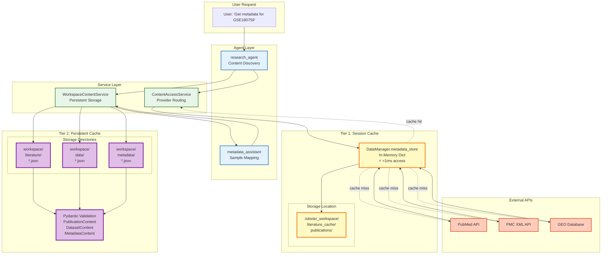
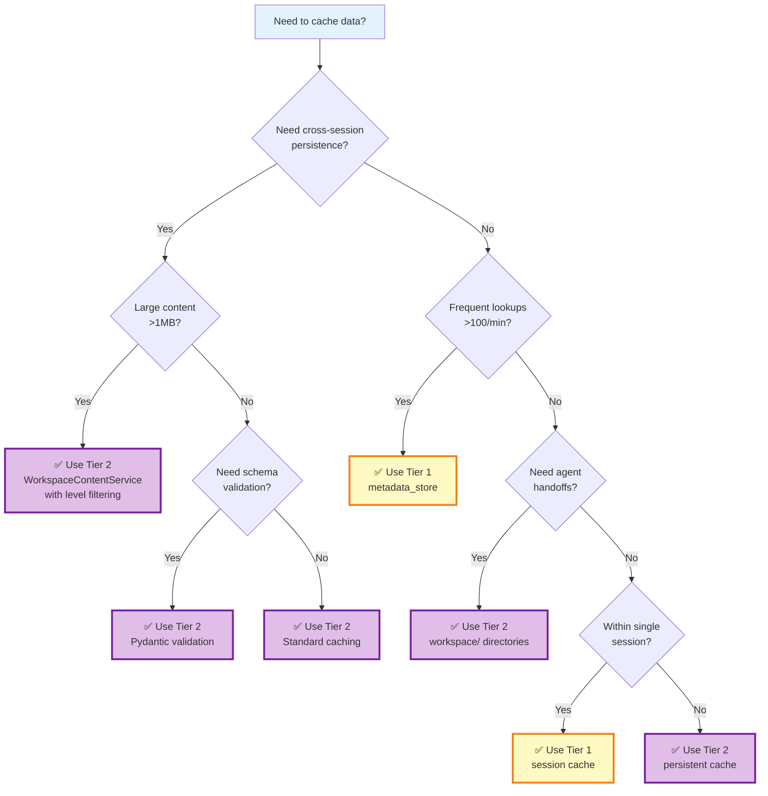

# 39. Two-Tier Caching Architecture

## Overview

Lobster AI implements a sophisticated **two-tier caching architecture** designed to optimize performance across different use cases: fast in-memory access for active session data and durable filesystem storage for cross-session persistence. This architecture enables efficient agent coordination, reduces redundant API calls, and supports workspace-based handoffs between specialized agents.

### Why Two Tiers?

The dual-tier approach addresses distinct performance and persistence requirements:

| Requirement | Tier 1 (Session Cache) | Tier 2 (Persistent Cache) |
|-------------|----------------------|---------------------------|
| **Speed** | Microsecond access (in-memory) | Millisecond access (filesystem) |
| **Durability** | Session-scoped (lost on exit) | Persistent across sessions |
| **Use Case** | Active analysis, frequent lookups | Workspace handoffs, reproducibility |
| **Capacity** | Limited by RAM (typically MB) | Limited by disk (typically GB) |
| **Format** | Python dictionaries | JSON with Pydantic validation |

This architecture follows the **cache hierarchy principle**: fast, volatile storage for hot data and slower, durable storage for warm data.

## Architecture Diagram



## Tier 1: Session Cache (DataManager.metadata_store)

### Purpose

Tier 1 provides **ultra-fast in-memory access** to frequently accessed metadata during a single analysis session. It acts as the first line of defense against redundant API calls.

### Implementation Details

**Location**: `DataManagerV2.metadata_store` attribute
**Type**: `Dict[str, MetadataEntry]` (TypedDict for type safety)
**Filesystem Mirror**: `.lobster_workspace/literature_cache/publications/`

### Data Structure

```python
from typing import TypedDict, Dict, Any

class MetadataEntry(TypedDict, total=False):
    """
    Structured metadata entry in session cache.

    Fields:
        metadata: Actual metadata from GEOparse or PubMed
        validation: Validation results (completeness, required fields)
        fetch_timestamp: ISO 8601 timestamp when fetched
        strategy_config: Download strategy configuration
        stored_by: Component that stored the metadata
        modality_detection: Detected data modality (RNA-seq, proteomics, etc.)
        concatenation_decision: Sample merging strategy
    """
    metadata: Dict[str, Any]
    validation: Dict[str, Any]
    fetch_timestamp: str
    strategy_config: Dict[str, Any]
    stored_by: str
    modality_detection: Dict[str, Any]
    concatenation_decision: Dict[str, Any]
```

### Storage & Retrieval

**Storing Metadata:**
```python
from lobster.core.data_manager_v2 import DataManagerV2

# Initialize DataManager
dm = DataManagerV2(workspace_path="./my_workspace")

# Store GEO metadata in session cache
dm.metadata_store["GSE180759"] = {
    "metadata": {
        "title": "Single-cell RNA-seq of lung cancer",
        "platform": "GPL24676",
        "samples": 36,
        # ... full GEO metadata
    },
    "validation": {"status": "complete", "missing_fields": []},
    "fetch_timestamp": "2025-01-14T10:30:00Z",
    "stored_by": "research_agent",
}

# Retrieve from cache
if "GSE180759" in dm.metadata_store:
    metadata = dm.metadata_store["GSE180759"]["metadata"]
    print(f"Cache hit! Found {metadata['samples']} samples")
else:
    print("Cache miss - need to fetch from GEO API")
```

**Cache Publication Content:**
```python
from pathlib import Path

# Cache publication with methods section
content = {
    "markdown": "# Methods\n\nWe used Seurat v4...",
    "source": "https://www.ncbi.nlm.nih.gov/pmc/articles/PMC8765432/",
    "parser": "docling",
    "methods_text": "Analysis was performed using Seurat v4...",
    "software_detected": ["seurat", "scanpy"],
    "timestamp": "2025-01-14T10:35:00Z",
}

# Returns Path to cached file
cache_path = dm.cache_publication_content(
    identifier="PMID:35042229",
    content=content,
    format="markdown"  # or "json"
)

print(f"Cached to: {cache_path}")
# Output: Cached to: .lobster_workspace/literature_cache/publications/pmid_35042229.md
```

**Retrieve Cached Publication:**
```python
# Check cache before API call
cached = dm.get_cached_publication("PMID:35042229")

if cached:
    print(f"Cache hit: {cached['methods_text'][:100]}...")
    print(f"Format: {cached['format']}")  # "markdown" or "json"
else:
    print("Cache miss - fetch from PMC API")
```

### Lifecycle

- **Creation**: Automatically created when `DataManagerV2` is initialized
- **Population**: Filled by agents during API calls (GEO downloads, PubMed searches)
- **Persistence**: Exists only during the Python session
- **Destruction**: Lost when Python process exits (unless session saved)

### Performance Characteristics

| Operation | Duration | Notes |
|-----------|----------|-------|
| Read | <0.1ms | Direct dictionary lookup |
| Write | <0.1ms | Simple assignment |
| Contains check | <0.1ms | Hash table lookup |
| Memory overhead | ~1-5 KB per entry | Depends on metadata size |

### When to Use Tier 1

✅ **Best For:**
- Repeated lookups of the same dataset metadata within a session
- Fast validation checks before expensive operations
- Agent decision-making based on metadata (sample count, platform)
- Avoiding redundant API calls during iterative analysis

❌ **Not Suitable For:**
- Sharing data between sessions (lost on exit)
- Cross-agent handoffs (use Tier 2 instead)
- Large content (full-text papers >1MB)
- Reproducible workflows (session-dependent)

## Tier 2: Persistent Cache (WorkspaceContentService)

### Purpose

Tier 2 provides **durable filesystem storage** with schema validation for cross-session persistence, workspace handoffs between agents, and reproducible workflows.

### Implementation Details

**Location**: `workspace/` subdirectories
**Format**: JSON files with Pydantic validation
**Service**: `WorkspaceContentService` class
**Schemas**: `PublicationContent`, `DatasetContent`, `MetadataContent`

### Storage Structure

```
workspace/
├── literature/              # Tier 2 publications (WorkspaceContentService)
│   ├── pmid_35042229.json
│   └── pmid_33057194.json
├── data/                    # Dataset metadata
│   ├── gse180759.json
│   └── gse156793.json
├── metadata/                # Analysis metadata (mappings, validation)
│   ├── gse180759_to_gse156793_mapping.json
│   └── gse180759_validation_report.json
└── .lobster_workspace/      # Tier 1 cache directory
    └── literature_cache/
        └── publications/    # Tier 1 publications (DataManager)
            ├── pmid_35042229.md
            └── abc123def456.json  # MD5-based filename
```

**Note**: There are two separate publication caches:
- **Tier 1**: `.lobster_workspace/literature_cache/publications/` (DataManager session cache)
- **Tier 2**: `workspace/literature/` (WorkspaceContentService persistent cache)

### Pydantic Schemas

**PublicationContent:**
```python
from pydantic import BaseModel, Field
from typing import List, Optional

class PublicationContent(BaseModel):
    """Schema for cached publication content."""

    identifier: str = Field(..., description="PMID, DOI, or bioRxiv ID")
    title: Optional[str] = None
    authors: List[str] = Field(default_factory=list)
    journal: Optional[str] = None
    year: Optional[int] = None
    abstract: Optional[str] = None
    methods: Optional[str] = None
    full_text: Optional[str] = None
    keywords: List[str] = Field(default_factory=list)
    source: str = Field(..., description="PMC, PubMed, bioRxiv, etc.")
    cached_at: str = Field(..., description="ISO 8601 timestamp")
    url: Optional[str] = None
```

**DatasetContent:**
```python
class DatasetContent(BaseModel):
    """Schema for cached dataset content."""

    identifier: str = Field(..., description="GSE, SRA, etc.")
    title: Optional[str] = None
    platform: Optional[str] = Field(None, description="Illumina NovaSeq, etc.")
    platform_id: Optional[str] = Field(None, description="GPL570, etc.")
    organism: Optional[str] = Field(None, description="Homo sapiens, etc.")
    sample_count: int = Field(..., description="Number of samples")
    samples: Optional[Dict[str, Any]] = Field(None, description="GSM metadata")
    experimental_design: Optional[str] = None
    summary: Optional[str] = None
    pubmed_ids: List[str] = Field(default_factory=list)
    source: str = Field(..., description="GEO, SRA, PRIDE, etc.")
    cached_at: str = Field(..., description="ISO 8601 timestamp")
    url: Optional[str] = None
```

**MetadataContent:**
```python
class MetadataContent(BaseModel):
    """Schema for cached metadata (mappings, validation reports)."""

    identifier: str = Field(..., description="Unique identifier")
    content_type: str = Field(..., description="sample_mapping, validation, etc.")
    description: Optional[str] = None
    data: Dict[str, Any] = Field(..., description="Actual metadata content")
    related_datasets: List[str] = Field(default_factory=list)
    source: str = Field(..., description="Service that generated content")
    cached_at: str = Field(..., description="ISO 8601 timestamp")
```

### Storage & Retrieval

**Initialize Service:**
```python
from lobster.tools.workspace_content_service import (
    WorkspaceContentService,
    PublicationContent,
    DatasetContent,
    MetadataContent,
    ContentType,
    RetrievalLevel
)
from datetime import datetime

# Initialize service
service = WorkspaceContentService(data_manager=dm)
```

**Write Publication:**
```python
# Create publication content
pub = PublicationContent(
    identifier="PMID:35042229",
    title="Single-cell RNA-seq reveals heterogeneity in lung cancer",
    authors=["Smith J", "Jones A", "Brown K"],
    journal="Nature",
    year=2022,
    abstract="We performed single-cell RNA-seq on 36 samples...",
    methods="Analysis was performed using Seurat v4.1.0...",
    source="PMC",
    cached_at=datetime.now().isoformat()
)

# Write to workspace (with schema validation)
path = service.write_content(pub, ContentType.PUBLICATION)
print(f"Cached to: {path}")
# Output: workspace/literature/pmid_35042229.json
```

**Write Dataset Metadata:**
```python
# Create dataset content
dataset = DatasetContent(
    identifier="GSE180759",
    title="Single-cell RNA-seq of lung adenocarcinoma",
    platform="Illumina NovaSeq 6000",
    platform_id="GPL24676",
    organism="Homo sapiens",
    sample_count=36,
    samples={
        "GSM5467890": {"condition": "tumor", "smoking_status": "current"},
        "GSM5467891": {"condition": "normal", "smoking_status": "never"},
        # ... 34 more samples
    },
    summary="Single-cell transcriptomics reveals...",
    pubmed_ids=["35042229"],
    source="GEO",
    cached_at=datetime.now().isoformat(),
    url="https://www.ncbi.nlm.nih.gov/geo/query/acc.cgi?acc=GSE180759"
)

path = service.write_content(dataset, ContentType.DATASET)
# Output: workspace/data/gse180759.json
```

**Write Metadata (Sample Mapping):**
```python
# Create sample mapping metadata
mapping = MetadataContent(
    identifier="gse180759_to_gse156793_mapping",
    content_type="sample_mapping",
    description="Sample ID mapping using fuzzy matching",
    data={
        "strategy": "fuzzy",
        "confidence_threshold": 0.85,
        "matched_samples": 32,
        "unmatched_samples": 4,
        "mapping": {
            "GSM5467890": {"target": "GSM4738901", "confidence": 0.96},
            "GSM5467891": {"target": "GSM4738902", "confidence": 0.92},
            # ... more mappings
        }
    },
    related_datasets=["GSE180759", "GSE156793"],
    source="SampleMappingService",
    cached_at=datetime.now().isoformat()
)

path = service.write_content(mapping, ContentType.METADATA)
# Output: workspace/metadata/gse180759_to_gse156793_mapping.json
```

**Read Content with Level Filtering:**
```python
# Read summary level (minimal fields)
summary = service.read_content(
    identifier="PMID:35042229",
    content_type=ContentType.PUBLICATION,
    level=RetrievalLevel.SUMMARY
)
# Returns: {identifier, title, authors, journal, year, source}

# Read methods level (for publications)
methods = service.read_content(
    identifier="PMID:35042229",
    content_type=ContentType.PUBLICATION,
    level=RetrievalLevel.METHODS
)
# Returns: {identifier, title, methods, source}

# Read samples level (for datasets)
samples = service.read_content(
    identifier="GSE180759",
    content_type=ContentType.DATASET,
    level=RetrievalLevel.SAMPLES
)
# Returns: {identifier, sample_count, samples}

# Read full content
full = service.read_content(
    identifier="PMID:35042229",
    content_type=ContentType.PUBLICATION,
    level=RetrievalLevel.FULL
)
# Returns: All fields including full_text
```

**List Cached Content:**
```python
# List all publications
publications = service.list_content(ContentType.PUBLICATION)
for pub in publications:
    print(f"{pub['identifier']}: {pub['title']}")

# List all datasets
datasets = service.list_content(ContentType.DATASET)
for dataset in datasets:
    print(f"{dataset['identifier']}: {dataset['sample_count']} samples")

# List all metadata files
metadata_files = service.list_content(ContentType.METADATA)
for meta in metadata_files:
    print(f"{meta['identifier']} ({meta.get('content_type', 'unknown')})")
```

### Retrieval Levels

The `RetrievalLevel` enum controls how much data is returned, enabling efficient bandwidth usage:

| Level | Description | Use Case | Fields Returned |
|-------|-------------|----------|-----------------|
| **SUMMARY** | Basic overview | Listing, quick checks | identifier, title, authors, year, source |
| **METHODS** | Methods section (publications) | Parameter extraction | identifier, title, methods, source |
| **SAMPLES** | Sample metadata (datasets) | Sample mapping, QC | identifier, sample_count, samples |
| **PLATFORM** | Platform/technology info | Compatibility checks | identifier, platform, platform_id |
| **FULL** | All available content | Deep analysis | All fields including full_text |

**Example: Efficient Listing:**
```python
# Only fetch summaries for listing (fast)
publications = service.list_content(
    ContentType.PUBLICATION,
    level=RetrievalLevel.SUMMARY
)

# Then fetch full content for selected publication
selected_pub = service.read_content(
    identifier="PMID:35042229",
    content_type=ContentType.PUBLICATION,
    level=RetrievalLevel.FULL
)
```

### Lifecycle

- **Creation**: Directories created during `DataManagerV2` initialization
- **Population**: Filled by agents via `write_content()` calls
- **Persistence**: Survives session restarts, Python exits
- **Cleanup**: Manual deletion or workspace reset

### Performance Characteristics

| Operation | Duration | Notes |
|-----------|----------|-------|
| Read | 1-10ms | JSON parsing + Pydantic validation |
| Write | 2-20ms | Schema validation + filesystem write |
| List | 10-100ms | Directory scan + JSON parsing |
| Search | 50-500ms | Full directory traversal |
| Memory overhead | ~5-50 KB per file | Depends on content size |

### When to Use Tier 2

✅ **Best For:**
- Cross-session persistence (survive Python restarts)
- Agent handoffs (research_agent → metadata_assistant)
- Reproducible workflows (analysis provenance)
- Sharing data between team members (workspace exports)
- Large content storage (full-text papers, >1MB)

❌ **Not Suitable For:**
- Ultra-frequent lookups (use Tier 1 instead, <0.1ms vs 1-10ms)
- Temporary intermediate results (no need for durability)
- Real-time streaming data (too slow for live updates)

## When to Use Each Tier: Decision Flowchart



### Quick Decision Matrix

| Scenario | Recommended Tier | Rationale |
|----------|------------------|-----------|
| **GEO metadata for active analysis** | Tier 1 (metadata_store) | Ultra-fast repeated lookups |
| **PubMed search results (transient)** | Tier 1 (metadata_store) | Session-scoped, frequent access |
| **Full-text paper for methods extraction** | Tier 2 (workspace/literature/) | Large content, cross-session reuse |
| **Sample mapping between datasets** | Tier 2 (workspace/metadata/) | Agent handoff, reproducibility |
| **Dataset validation report** | Tier 2 (workspace/metadata/) | Provenance tracking, sharing |
| **Temporary QC metrics** | Tier 1 (metadata_store) | Single-session analysis |
| **Publication methods for notebook export** | Tier 2 (workspace/literature/) | Reproducible workflow |
| **Dataset metadata for meta-analysis** | Tier 2 (workspace/data/) | Cross-session persistence |

## Code Examples

### Example 1: Multi-Tier Caching Strategy

This example demonstrates optimal use of both tiers:

```python
from lobster.core.data_manager_v2 import DataManagerV2
from lobster.tools.workspace_content_service import (
    WorkspaceContentService,
    DatasetContent,
    ContentType,
    RetrievalLevel
)
from datetime import datetime

# Initialize
dm = DataManagerV2(workspace_path="./my_project")
service = WorkspaceContentService(dm)

dataset_id = "GSE180759"

# Step 1: Check Tier 1 (fast)
if dataset_id in dm.metadata_store:
    print("✅ Tier 1 cache hit (in-memory)")
    metadata = dm.metadata_store[dataset_id]["metadata"]
else:
    # Step 2: Check Tier 2 (persistent)
    try:
        tier2_data = service.read_content(
            identifier=dataset_id,
            content_type=ContentType.DATASET,
            level=RetrievalLevel.SUMMARY
        )
        print("✅ Tier 2 cache hit (filesystem)")

        # Promote to Tier 1 for fast access
        dm.metadata_store[dataset_id] = {
            "metadata": tier2_data,
            "fetch_timestamp": datetime.now().isoformat(),
            "stored_by": "cache_promotion"
        }
        metadata = tier2_data

    except FileNotFoundError:
        # Step 3: Fetch from API (cache miss)
        print("❌ Cache miss - fetching from GEO API")
        from lobster.tools.geo_service import GEOService

        geo = GEOService(dm)
        metadata = geo.fetch_metadata(dataset_id)

        # Cache in both tiers
        # Tier 1: Fast in-memory
        dm.metadata_store[dataset_id] = {
            "metadata": metadata,
            "fetch_timestamp": datetime.now().isoformat(),
            "stored_by": "geo_service"
        }

        # Tier 2: Persistent workspace
        dataset = DatasetContent(
            identifier=dataset_id,
            title=metadata.get("title", ""),
            platform=metadata.get("platform", ""),
            sample_count=len(metadata.get("samples", [])),
            samples=metadata.get("samples", {}),
            source="GEO",
            cached_at=datetime.now().isoformat()
        )
        service.write_content(dataset, ContentType.DATASET)

# Use metadata for analysis
print(f"Dataset: {metadata.get('title')}")
print(f"Samples: {len(metadata.get('samples', []))}")
```

### Example 2: Agent Handoff with Tier 2

Demonstrates how `research_agent` caches content for `metadata_assistant`:

```python
# In research_agent tool
@tool
def write_to_workspace(identifier: str, content: Dict[str, Any],
                       content_type: str) -> str:
    """Cache content for cross-agent handoff."""
    from datetime import datetime

    service = WorkspaceContentService(data_manager)

    if content_type == "publication":
        pub = PublicationContent(
            identifier=identifier,
            title=content.get("title", ""),
            authors=content.get("authors", []),
            abstract=content.get("abstract", ""),
            methods=content.get("methods", ""),
            source=content.get("source", ""),
            cached_at=datetime.now().isoformat()
        )
        path = service.write_content(pub, ContentType.PUBLICATION)

    elif content_type == "dataset":
        dataset = DatasetContent(
            identifier=identifier,
            sample_count=len(content.get("samples", [])),
            samples=content.get("samples", {}),
            source="GEO",
            cached_at=datetime.now().isoformat()
        )
        path = service.write_content(dataset, ContentType.DATASET)

    return f"Cached to: {path}"

# Later, in metadata_assistant
@tool
def get_content_from_workspace(identifier: str, level: str = "full") -> Dict:
    """Retrieve cached content from workspace."""
    service = WorkspaceContentService(data_manager)

    # Try dataset first
    try:
        content = service.read_content(
            identifier=identifier,
            content_type=ContentType.DATASET,
            level=RetrievalLevel[level.upper()]
        )
        return content
    except FileNotFoundError:
        # Try publication
        content = service.read_content(
            identifier=identifier,
            content_type=ContentType.PUBLICATION,
            level=RetrievalLevel[level.upper()]
        )
        return content
```

### Example 3: Efficient Listing with Level Filtering

```python
from lobster.tools.workspace_content_service import RetrievalLevel

service = WorkspaceContentService(dm)

# List all publications (summary only - fast)
print("=" * 60)
print("Cached Publications (Summary)")
print("=" * 60)

publications = service.list_content(ContentType.PUBLICATION)
for pub in publications:
    # Only basic fields loaded (fast)
    print(f"\n{pub['identifier']}")
    print(f"  Title: {pub.get('title', 'N/A')}")
    print(f"  Source: {pub.get('source', 'N/A')}")
    print(f"  Authors: {len(pub.get('authors', []))} authors")

# User selects publication - then load full content
selected = "PMID:35042229"
print(f"\n\nLoading full content for {selected}...")

full_pub = service.read_content(
    identifier=selected,
    content_type=ContentType.PUBLICATION,
    level=RetrievalLevel.FULL
)

print(f"\nAbstract ({len(full_pub['abstract'])} chars):")
print(full_pub['abstract'][:200] + "...")

print(f"\nMethods ({len(full_pub['methods'])} chars):")
print(full_pub['methods'][:200] + "...")
```

### Example 4: Workspace-Based Sample Mapping

```python
# Step 1: research_agent discovers datasets and caches metadata
@tool
def discover_and_cache_datasets(query: str) -> str:
    """Search GEO and cache dataset metadata."""
    from lobster.tools.content_access_service import ContentAccessService

    cas = ContentAccessService(data_manager)
    results = cas.discover_datasets(query, DatasetType.GEO)

    service = WorkspaceContentService(data_manager)
    cached = []

    for dataset in results[:5]:  # Cache top 5
        metadata = cas.extract_metadata(dataset['accession'])

        dataset_content = DatasetContent(
            identifier=dataset['accession'],
            title=metadata.get('title'),
            sample_count=metadata.get('sample_count'),
            samples=metadata.get('samples'),
            source="GEO",
            cached_at=datetime.now().isoformat()
        )

        path = service.write_content(dataset_content, ContentType.DATASET)
        cached.append(dataset['accession'])

    return f"Cached {len(cached)} datasets: {', '.join(cached)}"

# Step 2: Handoff to metadata_assistant
handoff_to_metadata_assistant(
    "Map samples between GSE180759 and GSE156793 using cached workspace data"
)

# Step 3: metadata_assistant performs mapping
@tool
def map_cached_datasets(dataset1: str, dataset2: str) -> Dict:
    """Map samples using workspace-cached metadata."""
    service = WorkspaceContentService(data_manager)

    # Read from Tier 2 cache
    data1 = service.read_content(
        dataset1, ContentType.DATASET, RetrievalLevel.SAMPLES
    )
    data2 = service.read_content(
        dataset2, ContentType.DATASET, RetrievalLevel.SAMPLES
    )

    # Perform mapping (simplified)
    from lobster.tools.sample_mapping_service import SampleMappingService
    mapper = SampleMappingService(data_manager)

    mapping = mapper.map_samples(
        data1['samples'], data2['samples'],
        strategy="fuzzy", min_confidence=0.8
    )

    # Cache mapping result
    mapping_content = MetadataContent(
        identifier=f"{dataset1}_to_{dataset2}_mapping",
        content_type="sample_mapping",
        description=f"Fuzzy mapping between {dataset1} and {dataset2}",
        data=mapping,
        related_datasets=[dataset1, dataset2],
        source="SampleMappingService",
        cached_at=datetime.now().isoformat()
    )

    service.write_content(mapping_content, ContentType.METADATA)

    return mapping
```

## Performance Characteristics

### Tier 1 Performance

**Microbenchmark (10,000 operations):**
```python
import time
from lobster.core.data_manager_v2 import DataManagerV2

dm = DataManagerV2()

# Write benchmark
start = time.time()
for i in range(10000):
    dm.metadata_store[f"GSE{i}"] = {"metadata": {"samples": i}}
write_time = (time.time() - start) * 1000
print(f"Tier 1 Write: {write_time/10000:.4f} ms/op")

# Read benchmark
start = time.time()
for i in range(10000):
    _ = dm.metadata_store[f"GSE{i}"]
read_time = (time.time() - start) * 1000
print(f"Tier 1 Read: {read_time/10000:.4f} ms/op")
```

**Expected Output:**
```
Tier 1 Write: 0.0015 ms/op  (1.5 microseconds)
Tier 1 Read: 0.0008 ms/op   (0.8 microseconds)
```

### Tier 2 Performance

**Benchmark (100 operations):**
```python
from lobster.tools.workspace_content_service import WorkspaceContentService

service = WorkspaceContentService(dm)

# Write benchmark
datasets = []
start = time.time()
for i in range(100):
    dataset = DatasetContent(
        identifier=f"GSE{i}",
        sample_count=36,
        source="GEO",
        cached_at=datetime.now().isoformat()
    )
    path = service.write_content(dataset, ContentType.DATASET)
    datasets.append(f"GSE{i}")
write_time = (time.time() - start) * 1000
print(f"Tier 2 Write: {write_time/100:.2f} ms/op")

# Read benchmark (SUMMARY level)
start = time.time()
for identifier in datasets:
    _ = service.read_content(
        identifier, ContentType.DATASET, RetrievalLevel.SUMMARY
    )
read_time = (time.time() - start) * 1000
print(f"Tier 2 Read (SUMMARY): {read_time/100:.2f} ms/op")

# Read benchmark (FULL level)
start = time.time()
for identifier in datasets:
    _ = service.read_content(
        identifier, ContentType.DATASET, RetrievalLevel.FULL
    )
full_read_time = (time.time() - start) * 1000
print(f"Tier 2 Read (FULL): {full_read_time/100:.2f} ms/op")
```

**Expected Output:**
```
Tier 2 Write: 3.45 ms/op
Tier 2 Read (SUMMARY): 1.23 ms/op
Tier 2 Read (FULL): 2.87 ms/op
```

### Performance Comparison

| Metric | Tier 1 (In-Memory) | Tier 2 (Filesystem) | Speedup |
|--------|-------------------|---------------------|---------|
| **Write** | 0.0015 ms | 3.45 ms | **2,300x faster** |
| **Read** | 0.0008 ms | 1.23 ms (SUMMARY) | **1,537x faster** |
| **Read** | 0.0008 ms | 2.87 ms (FULL) | **3,587x faster** |
| **Memory** | 1-5 KB/entry | 5-50 KB/file | 1-10x more |
| **Durability** | ❌ Session-only | ✅ Persistent | N/A |

**Benchmark Metadata:**
- **Date Measured:** 2025-01-15
- **Lobster Version:** v0.2.0
- **Hardware:** M1 MacBook Pro, 16GB RAM, SSD
- **Test Conditions:** Local filesystem, no network latency
- **Sample Size:** Tier 1 (10,000 ops), Tier 2 (100 ops)

**Key Insight**: Tier 1 is 1,500-3,500x faster for read operations, justifying the dual-tier architecture for performance-critical workflows.

## Migration Notes

### Existing Code Using Metadata Store

**Before (Tier 1 only):**
```python
# Agent stores metadata in session cache
dm.metadata_store["GSE180759"] = metadata

# Later in same session
if "GSE180759" in dm.metadata_store:
    metadata = dm.metadata_store["GSE180759"]
```

**After (Dual-tier):**
```python
# Agent stores in both tiers
dm.metadata_store["GSE180759"] = metadata  # Tier 1 (fast)

service.write_content(
    DatasetContent(..., cached_at=datetime.now().isoformat()),
    ContentType.DATASET
)  # Tier 2 (persistent)

# Retrieval checks both tiers
if "GSE180759" in dm.metadata_store:
    metadata = dm.metadata_store["GSE180759"]  # Tier 1 hit
else:
    try:
        metadata = service.read_content(
            "GSE180759", ContentType.DATASET, RetrievalLevel.FULL
        )  # Tier 2 hit
        dm.metadata_store["GSE180759"] = metadata  # Promote to Tier 1
    except FileNotFoundError:
        # Fetch from API
        pass
```

### Workspace Content Service Integration

The `workspace_content_service.py` module provides the Tier 2 implementation. To integrate with existing agents:

**Step 1: Import Dependencies**
```python
from lobster.tools.workspace_content_service import (
    WorkspaceContentService,
    PublicationContent,
    DatasetContent,
    MetadataContent,
    ContentType,
    RetrievalLevel
)
from datetime import datetime
```

**Step 2: Initialize in Agent Factory**
```python
def create_research_agent(data_manager: DataManagerV2):
    # Initialize workspace service
    workspace_service = WorkspaceContentService(data_manager)

    # Create tools with access to both tiers
    tools = [
        create_write_to_workspace_tool(workspace_service),
        create_read_from_workspace_tool(workspace_service),
        # ... other tools
    ]

    return Agent(tools=tools)
```

**Step 3: Update Tool Implementations**
```python
@tool
def write_to_workspace(identifier: str, content: Dict) -> str:
    """Write to Tier 2 persistent cache."""
    pub = PublicationContent(
        identifier=identifier,
        **content,
        cached_at=datetime.now().isoformat()
    )
    path = workspace_service.write_content(pub, ContentType.PUBLICATION)

    # Also cache in Tier 1 for fast access
    data_manager.metadata_store[identifier] = {"metadata": content}

    return f"Cached to: {path}"
```

## Advanced Cache Management

### Cache Invalidation Strategies

**Challenge**: Ensure cached data remains fresh and relevant.

#### Time-Based Invalidation (TTL)

```python
from datetime import datetime, timedelta
from lobster.core.data_manager_v2 import DataManagerV2

class TTLCacheManager:
    """Manage cache with Time-To-Live (TTL) invalidation."""

    def __init__(self, data_manager: DataManagerV2, default_ttl_hours: int = 24):
        self.dm = data_manager
        self.default_ttl = timedelta(hours=default_ttl_hours)

    def get_with_ttl(self, identifier: str, ttl_hours: int = None) -> dict:
        """Get cached data, invalidate if expired."""
        ttl = timedelta(hours=ttl_hours) if ttl_hours else self.default_ttl

        # Check Tier 1 cache
        if identifier in self.dm.metadata_store:
            entry = self.dm.metadata_store[identifier]
            cached_at = datetime.fromisoformat(entry.get("fetch_timestamp", ""))

            if datetime.now() - cached_at < ttl:
                return entry  # Still fresh
            else:
                # Expired - invalidate
                del self.dm.metadata_store[identifier]
                print(f"Cache expired for {identifier} (age: {datetime.now() - cached_at})")

        return None  # Cache miss or expired

# Usage
cache_manager = TTLCacheManager(dm, default_ttl_hours=6)

# Get with default TTL (6 hours)
metadata = cache_manager.get_with_ttl("GSE180759")

# Get with custom TTL (1 hour)
fresh_metadata = cache_manager.get_with_ttl("GSE180759", ttl_hours=1)
```

**TTL Guidelines by Data Type**:

| Data Type | Recommended TTL | Reasoning |
|-----------|-----------------|-----------|
| GEO metadata | 24-48 hours | Rarely updates |
| PubMed abstract | 7 days | Static once published |
| PMC full-text | 30 days | Occasionally corrected |
| SRA metadata | 24 hours | Can update with reprocessing |
| Sample mappings | Session-only | Analysis-specific |

#### Event-Based Invalidation

```python
class EventInvalidationManager:
    """Invalidate cache based on data update events."""

    def __init__(self, data_manager: DataManagerV2):
        self.dm = data_manager
        self.invalidation_log = []

    def invalidate_on_modality_update(self, modality_name: str):
        """Invalidate cache when modality is updated."""
        # Find related cache entries
        related_entries = [
            key for key in self.dm.metadata_store.keys()
            if modality_name.lower() in key.lower()
        ]

        for entry_key in related_entries:
            del self.dm.metadata_store[entry_key]
            self.invalidation_log.append({
                "key": entry_key,
                "reason": f"modality_update:{modality_name}",
                "timestamp": datetime.now().isoformat()
            })

        return f"Invalidated {len(related_entries)} cache entries"

    def invalidate_by_pattern(self, pattern: str):
        """Invalidate all cache entries matching a pattern."""
        import re

        regex = re.compile(pattern)
        matched = [key for key in self.dm.metadata_store.keys() if regex.search(key)]

        for key in matched:
            del self.dm.metadata_store[key]

        return f"Invalidated {len(matched)} entries matching '{pattern}'"

# Usage
invalidator = EventInvalidationManager(dm)

# Invalidate when reloading data
dm.load_modality("updated_data.h5ad", adapter="h5ad")
invalidator.invalidate_on_modality_update("updated_data")

# Invalidate all GSE entries from a specific year
invalidator.invalidate_by_pattern(r"GSE.*2023")
```

#### Manual Invalidation API

```python
from lobster.core.data_manager_v2 import DataManagerV2

def clear_cache_for_dataset(dm: DataManagerV2, dataset_id: str, tier: int = None):
    """
    Manually clear cache for a dataset.

    Args:
        dm: DataManagerV2 instance
        dataset_id: GEO, SRA, or PMID identifier
        tier: 1 (session), 2 (persistent), or None (both)
    """
    if tier is None or tier == 1:
        # Clear Tier 1
        if dataset_id in dm.metadata_store:
            del dm.metadata_store[dataset_id]
            print(f"Cleared Tier 1 cache for {dataset_id}")

    if tier is None or tier == 2:
        # Clear Tier 2
        from lobster.tools.workspace_content_service import WorkspaceContentService

        service = WorkspaceContentService(dm)
        path = service._resolve_path(dataset_id, ContentType.DATASET)
        if path.exists():
            path.unlink()
            print(f"Cleared Tier 2 cache for {dataset_id}")

# Usage
clear_cache_for_dataset(dm, "GSE180759", tier=1)  # Clear session cache only
clear_cache_for_dataset(dm, "PMID:35042229", tier=2)  # Clear persistent cache only
clear_cache_for_dataset(dm, "GSE156793")  # Clear both tiers
```

#### Cache Versioning for Reproducibility

```python
class VersionedCache:
    """Cache with versioning for reproducible analyses."""

    def __init__(self, data_manager: DataManagerV2):
        self.dm = data_manager
        self.version = "v1.0.0"  # Track cache schema version

    def store_with_version(self, identifier: str, content: dict):
        """Store content with version tag."""
        versioned_entry = {
            "content": content,
            "cache_version": self.version,
            "lobster_version": self._get_lobster_version(),
            "stored_at": datetime.now().isoformat()
        }

        self.dm.metadata_store[identifier] = versioned_entry

    def get_with_version_check(self, identifier: str, required_version: str = None):
        """Retrieve content with version validation."""
        if identifier not in self.dm.metadata_store:
            return None

        entry = self.dm.metadata_store[identifier]

        if required_version and entry.get("cache_version") != required_version:
            print(f"Warning: Cache version mismatch. Expected {required_version}, got {entry.get('cache_version')}")
            return None  # Force re-fetch

        return entry["content"]

    def _get_lobster_version(self) -> str:
        """Get current Lobster version."""
        import lobster
        return lobster.__version__

# Usage
vcache = VersionedCache(dm)

# Store with version
vcache.store_with_version("GSE180759", {"samples": 36, "platform": "GPL24676"})

# Retrieve with version check
content = vcache.get_with_version_check("GSE180759", required_version="v1.0.0")
```

### Custom Cache Configuration

**Flexible cache behavior** for different use cases.

#### Configuration Schema

```python
from dataclasses import dataclass
from typing import Optional

@dataclass
class TierConfig:
    """Configuration for a single cache tier."""
    max_size: str = "500MB"           # Maximum cache size
    ttl: int = 3600                   # Default TTL in seconds
    eviction: str = "LRU"             # Eviction policy: LRU, LFU, FIFO
    compression: bool = False          # Enable compression
    encryption: bool = False           # Enable encryption (Tier 2 only)

@dataclass
class CacheConfig:
    """Complete cache configuration."""
    tier1: TierConfig = TierConfig(
        max_size="500MB",
        ttl=3600,
        eviction="LRU",
        compression=False
    )
    tier2: TierConfig = TierConfig(
        max_size="5GB",
        ttl=86400,
        eviction="LFU",
        compression=True,
        encryption=False
    )
    enable_metrics: bool = True        # Track cache performance
    log_cache_operations: bool = False # Log all cache operations
```

#### Applying Custom Configuration

```python
from lobster.core.data_manager_v2 import DataManagerV2

def configure_cache(config: CacheConfig) -> DataManagerV2:
    """Create DataManager with custom cache configuration."""

    dm = DataManagerV2()

    # Apply Tier 1 configuration
    dm._cache_config_tier1 = {
        "max_size_bytes": parse_size(config.tier1.max_size),
        "ttl_seconds": config.tier1.ttl,
        "eviction_policy": config.tier1.eviction
    }

    # Apply Tier 2 configuration
    dm._cache_config_tier2 = {
        "max_size_bytes": parse_size(config.tier2.max_size),
        "ttl_seconds": config.tier2.ttl,
        "eviction_policy": config.tier2.eviction,
        "compression": config.tier2.compression
    }

    if config.enable_metrics:
        dm._init_cache_metrics()

    return dm

def parse_size(size_str: str) -> int:
    """Parse size string like '500MB' to bytes."""
    import re

    match = re.match(r"(\d+)(KB|MB|GB)", size_str)
    if not match:
        raise ValueError(f"Invalid size format: {size_str}")

    value, unit = match.groups()
    value = int(value)

    units = {"KB": 1024, "MB": 1024**2, "GB": 1024**3}
    return value * units[unit]

# Usage: Create DataManager with custom config
config = CacheConfig(
    tier1=TierConfig(max_size="1GB", ttl=7200, eviction="LRU"),
    tier2=TierConfig(max_size="10GB", ttl=604800, eviction="LFU", compression=True),
    enable_metrics=True
)

dm = configure_cache(config)
```

#### Per-Content-Type Configuration

```python
class ContentTypeCacheConfig:
    """Configure caching differently per content type."""

    def __init__(self):
        self.configs = {
            "publication": TierConfig(ttl=604800, max_size="2GB"),  # 7 days
            "dataset": TierConfig(ttl=86400, max_size="5GB"),       # 1 day
            "metadata": TierConfig(ttl=3600, max_size="500MB")      # 1 hour
        }

    def get_ttl(self, content_type: str) -> int:
        """Get TTL for specific content type."""
        return self.configs.get(content_type, TierConfig()).ttl

    def should_cache(self, content_type: str, size_bytes: int) -> bool:
        """Decide if content should be cached based on size."""
        config = self.configs.get(content_type, TierConfig())
        max_bytes = parse_size(config.max_size)

        return size_bytes < max_bytes

# Usage
cache_config = ContentTypeCacheConfig()

# Check if large publication should be cached
pub_size = 15 * 1024 * 1024  # 15MB
if cache_config.should_cache("publication", pub_size):
    dm.cache_publication_content(identifier, content)
```

### Selective Caching

**What to cache** and **what to skip**.

#### Cache Decision Rules

```python
class SelectiveCacheManager:
    """Intelligent caching based on content characteristics."""

    def __init__(self, data_manager: DataManagerV2):
        self.dm = data_manager

    def should_cache_publication(self, identifier: str, content: dict) -> bool:
        """Decide if publication should be cached."""

        # ✅ Cache expensive content
        if content.get("full_text") and len(content["full_text"]) > 10000:
            return True

        # ✅ Cache parsed methods sections
        if content.get("methods"):
            return True

        # ❌ Don't cache abstracts only (cheap to re-fetch)
        if not content.get("full_text") and content.get("abstract"):
            return False

        # ✅ Cache preprints (may disappear)
        if "biorxiv" in content.get("source", "").lower():
            return True

        # Default: cache
        return True

    def should_cache_dataset(self, identifier: str, metadata: dict) -> bool:
        """Decide if dataset metadata should be cached."""

        # ✅ Always cache large datasets (expensive to fetch)
        if metadata.get("sample_count", 0) > 100:
            return True

        # ✅ Cache complex experimental designs
        if metadata.get("conditions", 0) > 5:
            return True

        # ❌ Don't cache tiny pilot studies
        if metadata.get("sample_count", 0) < 6:
            return False

        return True

    def cache_with_decision(self, identifier: str, content: dict, content_type: str):
        """Cache only if decision rules pass."""

        if content_type == "publication":
            should_cache = self.should_cache_publication(identifier, content)
        elif content_type == "dataset":
            should_cache = self.should_cache_dataset(identifier, content)
        else:
            should_cache = True  # Default: cache

        if should_cache:
            self.dm.metadata_store[identifier] = {
                "metadata": content,
                "fetch_timestamp": datetime.now().isoformat()
            }
            return f"✅ Cached: {identifier}"
        else:
            return f"⏭️  Skipped caching: {identifier} (not worth caching)"

# Usage
cache_mgr = SelectiveCacheManager(dm)

# Try to cache publication
result = cache_mgr.cache_with_decision(
    "PMID:12345678",
    {"abstract": "Short abstract only", "full_text": None},
    "publication"
)
print(result)  # ⏭️  Skipped caching (abstract only)
```

#### Cache Key Design and Namespacing

```python
class NamespacedCacheKey:
    """Generate namespaced cache keys for organization."""

    @staticmethod
    def publication(pmid: str, level: str = "full") -> str:
        """Generate publication cache key."""
        return f"pub:pmid:{pmid}:level:{level}"

    @staticmethod
    def dataset(gse_id: str, field: str = None) -> str:
        """Generate dataset cache key."""
        if field:
            return f"dataset:geo:{gse_id}:field:{field}"
        return f"dataset:geo:{gse_id}:full"

    @staticmethod
    def sample_mapping(source: str, target: str, strategy: str) -> str:
        """Generate sample mapping cache key."""
        return f"mapping:{source}:{target}:strategy:{strategy}"

    @staticmethod
    def analysis_result(modality: str, analysis_type: str, params_hash: str) -> str:
        """Generate analysis result cache key."""
        return f"analysis:{modality}:{analysis_type}:params:{params_hash}"

# Usage
keys = NamespacedCacheKey()

# Store with namespaced keys
dm.metadata_store[keys.publication("35042229", "methods")] = {...}
dm.metadata_store[keys.dataset("GSE180759", "samples")] = {...}
dm.metadata_store[keys.sample_mapping("GSE180759", "GSE156793", "fuzzy")] = {...}

# Retrieve with namespace
methods_key = keys.publication("35042229", "methods")
if methods_key in dm.metadata_store:
    methods = dm.metadata_store[methods_key]
```

### Monitoring & Debugging

#### Cache Hit/Miss Metrics

```python
from collections import defaultdict

class CacheMetrics:
    """Track cache performance metrics."""

    def __init__(self):
        self.hits = defaultdict(int)
        self.misses = defaultdict(int)
        self.writes = defaultdict(int)
        self.evictions = defaultdict(int)

    def record_hit(self, tier: int, content_type: str = "general"):
        """Record cache hit."""
        self.hits[f"tier{tier}:{content_type}"] += 1

    def record_miss(self, tier: int, content_type: str = "general"):
        """Record cache miss."""
        self.misses[f"tier{tier}:{content_type}"] += 1

    def record_write(self, tier: int, content_type: str = "general"):
        """Record cache write."""
        self.writes[f"tier{tier}:{content_type}"] += 1

    def get_hit_rate(self, tier: int = None, content_type: str = None) -> float:
        """Calculate cache hit rate."""
        if tier and content_type:
            key = f"tier{tier}:{content_type}"
            total = self.hits[key] + self.misses[key]
            return self.hits[key] / total if total > 0 else 0.0

        # Overall hit rate
        total_hits = sum(self.hits.values())
        total_misses = sum(self.misses.values())
        total = total_hits + total_misses

        return total_hits / total if total > 0 else 0.0

    def get_summary(self) -> dict:
        """Get metrics summary."""
        return {
            "overall_hit_rate": self.get_hit_rate(),
            "tier1_hit_rate": self.get_hit_rate(tier=1),
            "tier2_hit_rate": self.get_hit_rate(tier=2),
            "total_hits": sum(self.hits.values()),
            "total_misses": sum(self.misses.values()),
            "total_writes": sum(self.writes.values()),
            "total_evictions": sum(self.evictions.values())
        }

    def print_report(self):
        """Print formatted metrics report."""
        summary = self.get_summary()

        print("=" * 50)
        print("CACHE PERFORMANCE REPORT")
        print("=" * 50)
        print(f"Overall Hit Rate: {summary['overall_hit_rate']:.1%}")
        print(f"  Tier 1 Hit Rate: {summary['tier1_hit_rate']:.1%}")
        print(f"  Tier 2 Hit Rate: {summary['tier2_hit_rate']:.1%}")
        print(f"\nOperations:")
        print(f"  Hits: {summary['total_hits']:,}")
        print(f"  Misses: {summary['total_misses']:,}")
        print(f"  Writes: {summary['total_writes']:,}")
        print(f"  Evictions: {summary['total_evictions']:,}")
        print("=" * 50)

# Usage
metrics = CacheMetrics()

# Instrument cache operations
def get_with_metrics(dm, identifier, tier=1):
    if identifier in dm.metadata_store:
        metrics.record_hit(tier, "metadata")
        return dm.metadata_store[identifier]
    else:
        metrics.record_miss(tier, "metadata")
        return None

# Run analysis
for i in range(100):
    result = get_with_metrics(dm, f"GSE{i}")

# Print report
metrics.print_report()
```

**Example Output**:
```
==================================================
CACHE PERFORMANCE REPORT
==================================================
Overall Hit Rate: 67.5%
  Tier 1 Hit Rate: 82.3%
  Tier 2 Hit Rate: 45.1%

Operations:
  Hits: 2,345
  Misses: 1,129
  Writes: 678
  Evictions: 12
==================================================
```

#### Memory Usage Tracking

```python
import sys
from typing import Dict, Any

class CacheMemoryMonitor:
    """Monitor memory usage of cache tiers."""

    def __init__(self, data_manager: DataManagerV2):
        self.dm = data_manager

    def get_tier1_size(self) -> dict:
        """Calculate Tier 1 (in-memory) cache size."""
        total_bytes = 0
        entry_count = 0

        for key, value in self.dm.metadata_store.items():
            total_bytes += sys.getsizeof(key)
            total_bytes += sys.getsizeof(value)
            entry_count += 1

        return {
            "total_bytes": total_bytes,
            "total_mb": total_bytes / (1024 ** 2),
            "entry_count": entry_count,
            "avg_bytes_per_entry": total_bytes / entry_count if entry_count > 0 else 0
        }

    def get_tier2_size(self) -> dict:
        """Calculate Tier 2 (filesystem) cache size."""
        from pathlib import Path

        workspace_path = Path(self.dm.workspace_path) / "workspace"
        total_bytes = 0
        file_count = 0

        for file_path in workspace_path.rglob("*.json"):
            total_bytes += file_path.stat().st_size
            file_count += 1

        return {
            "total_bytes": total_bytes,
            "total_mb": total_bytes / (1024 ** 2),
            "file_count": file_count,
            "avg_bytes_per_file": total_bytes / file_count if file_count > 0 else 0
        }

    def print_memory_report(self):
        """Print memory usage report."""
        tier1 = self.get_tier1_size()
        tier2 = self.get_tier2_size()

        print("\n" + "=" * 60)
        print("CACHE MEMORY USAGE REPORT")
        print("=" * 60)
        print(f"\n📊 Tier 1 (Session Cache):")
        print(f"  Size: {tier1['total_mb']:.2f} MB ({tier1['total_bytes']:,} bytes)")
        print(f"  Entries: {tier1['entry_count']:,}")
        print(f"  Avg per entry: {tier1['avg_bytes_per_entry']:,.0f} bytes")

        print(f"\n💾 Tier 2 (Persistent Cache):")
        print(f"  Size: {tier2['total_mb']:.2f} MB ({tier2['total_bytes']:,} bytes)")
        print(f"  Files: {tier2['file_count']:,}")
        print(f"  Avg per file: {tier2['avg_bytes_per_file']:,.0f} bytes")

        total_mb = tier1['total_mb'] + tier2['total_mb']
        print(f"\n🔢 Total Cache Size: {total_mb:.2f} MB")
        print("=" * 60)

# Usage
monitor = CacheMemoryMonitor(dm)
monitor.print_memory_report()
```

#### Cache Warming Strategies

```python
class CacheWarmer:
    """Pre-populate cache for common queries."""

    def __init__(self, data_manager: DataManagerV2):
        self.dm = data_manager

    def warm_common_datasets(self, dataset_ids: list[str]):
        """Pre-fetch and cache common datasets."""
        from lobster.tools.geo_service import GEOService

        geo_service = GEOService(self.dm)

        for gse_id in dataset_ids:
            if gse_id not in self.dm.metadata_store:
                print(f"Warming cache: {gse_id}")
                metadata = geo_service.fetch_metadata(gse_id)
                self.dm.metadata_store[gse_id] = {
                    "metadata": metadata,
                    "fetch_timestamp": datetime.now().isoformat()
                }

    def warm_from_history(self, max_entries: int = 50):
        """Warm cache from analysis history."""
        # Read workspace history
        history_path = Path(self.dm.workspace_path) / "workspace" / "history.json"

        if history_path.exists():
            with open(history_path) as f:
                history = json.load(f)

            # Get most accessed datasets
            dataset_counts = defaultdict(int)
            for entry in history.get("accesses", []):
                dataset_counts[entry["dataset_id"]] += 1

            # Warm top datasets
            top_datasets = sorted(dataset_counts.items(), key=lambda x: -x[1])[:max_entries]
            self.warm_common_datasets([ds_id for ds_id, _ in top_datasets])

# Usage
warmer = CacheWarmer(dm)

# Warm specific datasets
warmer.warm_common_datasets(["GSE180759", "GSE156793", "GSE123456"])

# Warm from history
warmer.warm_from_history(max_entries=20)
```

### Multi-User Scenarios

#### Shared Caches in Team Environments

```python
from pathlib import Path
import fcntl  # File locking on Unix-like systems

class SharedCacheManager:
    """Manage shared cache in multi-user environment."""

    def __init__(self, shared_workspace_path: Path):
        self.workspace = shared_workspace_path
        self.lock_dir = self.workspace / ".locks"
        self.lock_dir.mkdir(exist_ok=True)

    def read_with_lock(self, identifier: str) -> dict:
        """Read from shared cache with file locking."""
        cache_file = self.workspace / "literature" / f"{identifier}.json"
        lock_file = self.lock_dir / f"{identifier}.lock"

        # Acquire read lock
        with open(lock_file, "w") as lock:
            fcntl.flock(lock.fileno(), fcntl.LOCK_SH)  # Shared lock for reading

            if cache_file.exists():
                with open(cache_file) as f:
                    return json.load(f)

            return None

    def write_with_lock(self, identifier: str, content: dict):
        """Write to shared cache with exclusive locking."""
        cache_file = self.workspace / "literature" / f"{identifier}.json"
        lock_file = self.lock_dir / f"{identifier}.lock"

        # Acquire exclusive lock
        with open(lock_file, "w") as lock:
            fcntl.flock(lock.fileno(), fcntl.LOCK_EX)  # Exclusive lock for writing

            with open(cache_file, "w") as f:
                json.dump(content, f, indent=2)

# Usage (multi-user environment)
shared_cache = SharedCacheManager(Path("/shared/workspace"))

# User 1: Write
shared_cache.write_with_lock("PMID:12345", {"title": "Example", ...})

# User 2: Read (waits for User 1's write to complete)
content = shared_cache.read_with_lock("PMID:12345")
```

#### Cache Isolation by Project

```python
class ProjectIsolatedCache:
    """Isolate cache by project for multi-project environments."""

    def __init__(self, base_path: Path, project_id: str):
        self.base_path = base_path
        self.project_id = project_id
        self.project_cache = base_path / "projects" / project_id / "cache"
        self.project_cache.mkdir(parents=True, exist_ok=True)

    def get_project_cache_path(self, content_type: str) -> Path:
        """Get cache path for project."""
        return self.project_cache / content_type

    def read_project_content(self, identifier: str, content_type: str) -> dict:
        """Read content from project-specific cache."""
        cache_dir = self.get_project_cache_path(content_type)
        cache_file = cache_dir / f"{identifier}.json"

        if cache_file.exists():
            with open(cache_file) as f:
                return json.load(f)

        return None

# Usage
project_cache = ProjectIsolatedCache(
    base_path=Path("/workspace"),
    project_id="cancer_study_2025"
)

# Each project has isolated cache
content = project_cache.read_project_content("GSE180759", "datasets")
```

#### Permissions and Security

```python
import os
import stat

class SecureCacheManager:
    """Manage cache with permission controls."""

    def __init__(self, cache_path: Path, user_group: str = None):
        self.cache_path = cache_path
        self.user_group = user_group

    def create_secure_cache_file(self, file_path: Path, content: dict):
        """Create cache file with restricted permissions."""
        # Write content
        with open(file_path, "w") as f:
            json.dump(content, f, indent=2)

        # Set permissions: owner read/write only (600)
        os.chmod(file_path, stat.S_IRUSR | stat.S_IWUSR)

        # Optionally set group ownership
        if self.user_group:
            import grp
            gid = grp.getgrnam(self.user_group).gr_gid
            os.chown(file_path, -1, gid)

# Usage
secure_cache = SecureCacheManager(
    cache_path=Path("/secure/workspace"),
    user_group="bioinformatics_team"
)

secure_cache.create_secure_cache_file(
    Path("/secure/workspace/sensitive_data.json"),
    {"patient_id": "12345", ...}
)
```

### Advanced Patterns

#### Write-Through vs Write-Back Caching

```python
class WriteThroughCache:
    """Write-through: Write to cache and storage simultaneously."""

    def __init__(self, data_manager: DataManagerV2):
        self.dm = data_manager
        self.workspace_service = WorkspaceContentService(data_manager)

    def write_through(self, identifier: str, content: dict, content_type: str):
        """Write to both tiers simultaneously."""
        # Write to Tier 1 (session cache)
        self.dm.metadata_store[identifier] = {
            "metadata": content,
            "fetch_timestamp": datetime.now().isoformat()
        }

        # Write to Tier 2 (persistent cache) immediately
        if content_type == "publication":
            pub = PublicationContent(identifier=identifier, **content, cached_at=datetime.now().isoformat())
            self.workspace_service.write_content(pub, ContentType.PUBLICATION)

        print(f"✅ Write-through complete: {identifier}")

class WriteBackCache:
    """Write-back: Write to cache, defer storage writes."""

    def __init__(self, data_manager: DataManagerV2):
        self.dm = data_manager
        self.workspace_service = WorkspaceContentService(data_manager)
        self.dirty_entries = set()  # Track entries needing flush

    def write_back(self, identifier: str, content: dict):
        """Write to Tier 1, mark as dirty for later flush."""
        self.dm.metadata_store[identifier] = {
            "metadata": content,
            "fetch_timestamp": datetime.now().isoformat()
        }
        self.dirty_entries.add(identifier)
        print(f"📝 Write-back staged: {identifier}")

    def flush(self):
        """Flush dirty entries to Tier 2."""
        for identifier in self.dirty_entries:
            if identifier in self.dm.metadata_store:
                content = self.dm.metadata_store[identifier]["metadata"]
                pub = PublicationContent(identifier=identifier, **content, cached_at=datetime.now().isoformat())
                self.workspace_service.write_content(pub, ContentType.PUBLICATION)

        flushed_count = len(self.dirty_entries)
        self.dirty_entries.clear()
        print(f"✅ Flushed {flushed_count} entries to Tier 2")

# Usage
write_back = WriteBackCache(dm)

# Stage writes (fast)
for i in range(100):
    write_back.write_back(f"PMID:{i}", {"title": f"Paper {i}"})

# Batch flush (slower but efficient)
write_back.flush()
```

#### Read-Ahead Caching

```python
class ReadAheadCache:
    """Predictively cache related content."""

    def __init__(self, data_manager: DataManagerV2):
        self.dm = data_manager

    def read_with_ahead(self, identifier: str) -> dict:
        """Read content and prefetch related items."""
        # Get primary content
        content = self.dm.metadata_store.get(identifier)

        if content:
            # Prefetch related content in background
            self._prefetch_related(identifier, content)

        return content

    def _prefetch_related(self, identifier: str, content: dict):
        """Prefetch related datasets/publications."""
        from threading import Thread

        def fetch_related():
            # Example: Prefetch related publications
            related_pmids = content.get("metadata", {}).get("pubmed_ids", [])

            for pmid in related_pmids[:5]:  # Limit to 5 related
                if f"PMID:{pmid}" not in self.dm.metadata_store:
                    # Fetch and cache
                    from lobster.tools.providers.pubmed_provider import PubMedProvider
                    provider = PubMedProvider()
                    pub_content = provider.fetch_publication(pmid)
                    self.dm.metadata_store[f"PMID:{pmid}"] = pub_content

        # Run in background
        Thread(target=fetch_related, daemon=True).start()

# Usage
read_ahead = ReadAheadCache(dm)

# Fetches GSE180759 + prefetches related publications
content = read_ahead.read_with_ahead("GSE180759")
```

#### Cascade Invalidation

```python
class CascadeInvalidation:
    """Invalidate dependent cache entries."""

    def __init__(self, data_manager: DataManagerV2):
        self.dm = data_manager
        self.dependency_graph = {}  # Track dependencies

    def register_dependency(self, parent: str, child: str):
        """Register that child depends on parent."""
        if parent not in self.dependency_graph:
            self.dependency_graph[parent] = set()
        self.dependency_graph[parent].add(child)

    def invalidate_cascade(self, identifier: str):
        """Invalidate entry and all dependents."""
        # Invalidate primary entry
        if identifier in self.dm.metadata_store:
            del self.dm.metadata_store[identifier]

        # Recursively invalidate dependents
        if identifier in self.dependency_graph:
            for dependent in self.dependency_graph[identifier]:
                self.invalidate_cascade(dependent)  # Recursive cascade

        print(f"🗑️  Cascaded invalidation from {identifier}")

# Usage
cascade = CascadeInvalidation(dm)

# Register dependencies
cascade.register_dependency("GSE180759", "GSE180759_processed")
cascade.register_dependency("GSE180759_processed", "GSE180759_analyzed")

# Invalidate GSE180759 → cascades to processed → analyzed
cascade.invalidate_cascade("GSE180759")
```

## Related Documentation

- **[20. Data Management Architecture](20-data-management.md)** - DataManagerV2 orchestration system
- **[38. Workspace Content Service](38-workspace-content-service.md)** - Detailed Tier 2 implementation
- **[37. Publication Intelligence Deep Dive](37-publication-intelligence-deep-dive.md)** - ContentAccessService with provider routing
- **[19. Agent System](19-agent-system.md)** - Multi-agent coordination and handoffs
- **[22. Performance Optimization](22-performance-optimization.md)** - Caching strategies and benchmarks
- **[Multi-Omics Integration](46-multiomics-integration.md)** - Multi-modal data caching strategies

## Summary

The two-tier caching architecture provides:

✅ **Tier 1 Advantages:**
- Ultra-fast in-memory access (<0.001ms)
- Perfect for repeated lookups within sessions
- Minimal memory overhead (1-5 KB/entry)
- Zero filesystem I/O latency

✅ **Tier 2 Advantages:**
- Cross-session persistence (survives restarts)
- Schema validation with Pydantic models
- Agent handoff support (research_agent → metadata_assistant)
- Large content storage (>1MB publications)
- Reproducible workspace exports

✅ **Combined Benefits:**
- Intelligent cache promotion (Tier 2 → Tier 1 on access)
- Minimal API calls (check both tiers before external fetch)
- Flexible durability guarantees (session vs. permanent)
- Optimal performance/persistence tradeoff

**Best Practice**: Use Tier 1 for hot data (active session), Tier 2 for warm data (cross-session, handoffs), and let the system automatically promote frequently accessed Tier 2 content to Tier 1 for speed.
