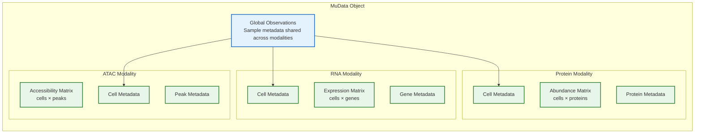
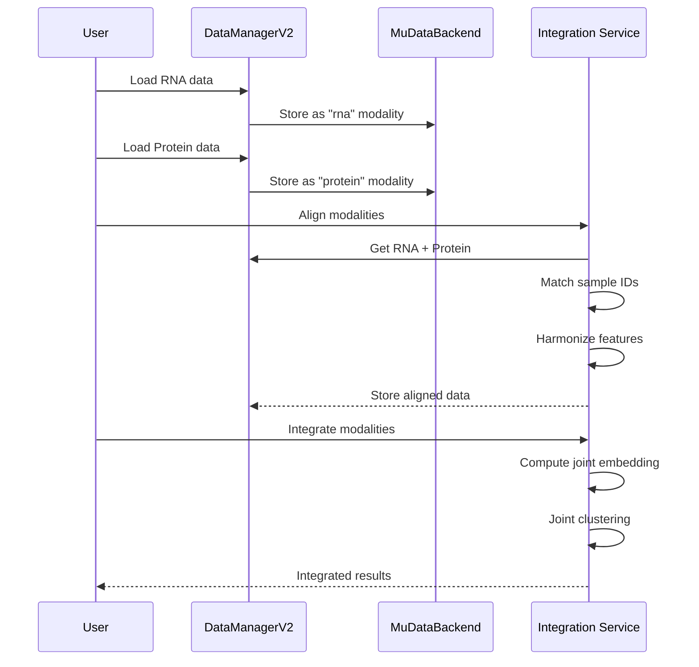

# 46. Multi-Omics Integration

> **Version**: v2.4+
> **Prerequisites**: [Data Analysis Workflows](06-data-analysis-workflows.md), [Data Management](20-data-management.md)
> **Related**: [Architecture Overview](18-architecture-overview.md), [Custom Providers Guide](44-custom-providers-guide.md)

## Overview

Multi-omics integration combines data from multiple biological measurement modalities (transcriptomics, proteomics, metabolomics, etc.) to gain comprehensive insights into biological systems. Lobster AI provides **MuData-based infrastructure** for seamless multi-omics analysis, enabling you to:

- **Align and integrate** datasets from different modalities
- **Discover cross-modality relationships** (e.g., RNA-protein correlation)
- **Perform joint clustering** using information from multiple modalities
- **Visualize multi-dimensional** biological patterns
- **Identify multi-omics biomarkers** with higher predictive power

### Why Multi-Omics Integration?

Single-modality analysis provides only a partial view of biological systems:

| Challenge | Multi-Omics Solution |
|-----------|---------------------|
| **RNA doesn't predict protein** | Correlate mRNA and protein abundance directly |
| **Post-translational regulation** | Compare protein modifications to gene expression |
| **Metabolic phenotypes** | Link enzyme expression to metabolite levels |
| **Cell state heterogeneity** | Integrate RNA + ATAC to understand regulatory logic |
| **Biomarker discovery** | Combine multiple layers for robust signatures |

Multi-omics integration provides a **systems-level understanding** that single modalities cannot achieve alone.

## Architecture

### MuData Framework

Lobster AI uses the **MuData (Multimodal Data)** framework for multi-omics data representation:



**Key Features**:
- **Unified container**: All modalities in a single object
- **Shared observations**: Common sample/cell metadata
- **Modality-specific data**: Each modality preserves its unique features
- **Efficient storage**: HDF5-based `.h5mu` format

### Integration Workflow



## Common Integration Scenarios

### Scenario 1: RNA-seq + Proteomics (Same Samples)

**Use Case**: Understand mRNA-protein relationships in the same biological samples.

**Example**: Cancer cell line treated with drug, measured by both RNA-seq and mass spectrometry.

#### Step-by-Step Workflow

**Step 1: Load Data**

```python
from lobster.core import DataManagerV2

# Initialize data manager
dm = DataManagerV2()

# Load RNA-seq data
dm.load_modality(
    name="rna_drug_treatment",
    file_path="rnaseq_counts.csv",
    adapter="csv",
    modality_type="transcriptomics"
)

# Load proteomics data
dm.load_modality(
    name="protein_drug_treatment",
    file_path="proteomics_abundance.csv",
    adapter="csv",
    modality_type="proteomics"
)
```

**Step 2: Inspect Sample Alignment**

```python
# Check sample overlap
rna_samples = dm.get_modality("rna_drug_treatment").obs_names
protein_samples = dm.get_modality("protein_drug_treatment").obs_names

common_samples = set(rna_samples) & set(protein_samples)
print(f"Shared samples: {len(common_samples)}")
print(f"RNA-only samples: {len(rna_samples) - len(common_samples)}")
print(f"Protein-only samples: {len(protein_samples) - len(common_samples)}")
```

**Expected Output**:
```
Shared samples: 24
RNA-only samples: 0
Protein-only samples: 0
```

**Step 3: Align Feature Names**

```python
from lobster.tools import FeatureAlignmentService

aligner = FeatureAlignmentService(dm)

# Map protein IDs to gene symbols
alignment_result = aligner.align_features(
    source_modality="protein_drug_treatment",
    target_modality="rna_drug_treatment",
    mapping_database="uniprot",  # UniProt ID to gene symbol
    keep_unmapped=True
)

print(f"Matched features: {alignment_result['n_matched']}")
print(f"Ambiguous mappings: {alignment_result['n_ambiguous']}")
```

**Step 4: Create MuData Object**

```python
from lobster.core.backends import MuDataBackend

backend = MuDataBackend()

# Create MuData from modalities
mdata = backend.create_mudata_from_dict({
    "rna": dm.get_modality("rna_drug_treatment"),
    "protein": dm.get_modality("protein_drug_treatment")
})

# Add global metadata
mdata.obs["treatment"] = ["control"] * 12 + ["drug_a"] * 12
mdata.obs["timepoint"] = (["0h"] * 6 + ["24h"] * 6) * 2

print(f"MuData shape: {mdata.shape}")
print(f"Modalities: {list(mdata.mod.keys())}")
```

**Expected Output**:
```
MuData shape: (24, 23847)
Modalities: ['rna', 'protein']
```

**Step 5: Correlation Analysis**

```python
import numpy as np
import pandas as pd
from scipy.stats import pearsonr

def calculate_rna_protein_correlation(mdata, gene_col="gene_symbol"):
    """Calculate correlation between matched RNA and protein."""

    rna = mdata.mod["rna"]
    protein = mdata.mod["protein"]

    # Find matched features
    rna_genes = set(rna.var[gene_col])
    protein_genes = set(protein.var[gene_col])
    matched = rna_genes & protein_genes

    correlations = []
    for gene in matched:
        rna_expr = rna[:, rna.var[gene_col] == gene].X.toarray().flatten()
        prot_expr = protein[:, protein.var[gene_col] == gene].X.toarray().flatten()

        r, p = pearsonr(rna_expr, prot_expr)
        correlations.append({
            "gene": gene,
            "correlation": r,
            "pvalue": p
        })

    return pd.DataFrame(correlations).sort_values("correlation", ascending=False)

# Calculate correlations
corr_df = calculate_rna_protein_correlation(mdata)
print(corr_df.head(10))
```

**Expected Output**:
```
         gene  correlation    pvalue
45      ACTB       0.8924  1.2e-08
123     GAPDH      0.8712  2.1e-08
89      MYC        0.8356  5.6e-07
...
```

**Step 6: Visualize Correlations**

```python
import plotly.express as px

# Create correlation heatmap
fig = px.scatter(
    corr_df.head(50),
    x="gene",
    y="correlation",
    color="pvalue",
    title="RNA-Protein Correlation (Top 50 Genes)",
    labels={"correlation": "Pearson r", "pvalue": "P-value"}
)

fig.update_xaxes(tickangle=45)
fig.write_html("rna_protein_correlation.html")
```

### Scenario 2: Single-Cell RNA + CITE-seq Protein

**Use Case**: Integrate transcriptomics and surface protein markers in single cells.

**Example**: Immune cell profiling with 30,000 cells, 20,000 genes, 200 antibodies.

#### Weighted Nearest Neighbor Integration

```python
from lobster.tools import MultiModalIntegrationService

integrator = MultiModalIntegrationService(dm)

# Load CITE-seq data (RNA already loaded)
dm.load_modality(
    name="cite_antibodies",
    file_path="cite_protein.h5ad",
    adapter="h5ad",
    modality_type="proteomics"
)

# Perform WNN integration
integration_result = integrator.integrate_wnn(
    modality_1="scrna_pbmc",
    modality_2="cite_antibodies",
    n_components=30,
    rna_weight=0.6,    # Higher weight for RNA (more features)
    protein_weight=0.4  # Lower weight for protein (fewer but targeted)
)

# Results are stored with suffix
integrated_name = integration_result["integrated_modality_name"]
print(f"Integrated modality: {integrated_name}")
```

**What WNN Does**:
1. **Independent PCA**: Compute embeddings for RNA and protein separately
2. **Weighted KNN**: Build k-nearest neighbor graphs for each modality
3. **Graph Fusion**: Combine graphs using learned weights per cell
4. **Shared Embedding**: Compute UMAP on the fused graph
5. **Joint Clustering**: Leiden clustering on integrated space

**Step 7: Joint Clustering**

```python
from lobster.tools import ClusteringService

clustering = ClusteringService(dm)

# Cluster using integrated embedding
cluster_result = clustering.cluster_leiden(
    modality_name=integrated_name,
    resolution=0.5,
    use_representation="X_integrated_wnn"  # Use WNN embedding
)

print(f"Found {cluster_result['n_clusters']} cell populations")
```

**Step 8: Multi-Modal Marker Analysis**

```python
def find_multimodal_markers(mdata, cluster_key="leiden"):
    """Find markers using both RNA and protein."""

    import scanpy as sc

    # RNA markers
    sc.tl.rank_genes_groups(
        mdata.mod["rna"],
        groupby=cluster_key,
        method="wilcoxon"
    )

    # Protein markers
    sc.tl.rank_genes_groups(
        mdata.mod["protein"],
        groupby=cluster_key,
        method="wilcoxon"
    )

    return {
        "rna_markers": mdata.mod["rna"].uns["rank_genes_groups"],
        "protein_markers": mdata.mod["protein"].uns["rank_genes_groups"]
    }

markers = find_multimodal_markers(mdata)
```

### Scenario 3: Spatial Transcriptomics + Spatial Proteomics

**Use Case**: Integrate spatially resolved RNA and protein measurements.

**Example**: Tumor microenvironment with 10X Visium (RNA) + IMC (protein).

#### Spatial Alignment

```python
from lobster.tools import SpatialAlignmentService

spatial_aligner = SpatialAlignmentService(dm)

# Align spatial coordinates
alignment = spatial_aligner.align_spatial_modalities(
    rna_modality="visium_tumor",
    protein_modality="imc_tumor",
    alignment_method="fiducial",  # Use tissue landmarks
    interpolation="nearest_neighbor"
)

# Create aligned MuData
aligned_mdata = spatial_aligner.create_aligned_mudata(
    alignment_result=alignment,
    pixel_resolution=10  # 10 microns per pixel
)
```

**Spatial Co-localization Analysis**

```python
from lobster.tools import ColocalizationService

coloc = ColocalizationService(dm)

# Find co-localized features
coloc_result = coloc.analyze_colocalization(
    mdata=aligned_mdata,
    rna_features=["CD3D", "CD8A", "CD4"],  # T cell markers
    protein_features=["CD3_protein", "CD8_protein", "CD4_protein"],
    neighborhood_radius=50,  # 50 micron radius
    method="morans_i"  # Spatial autocorrelation
)

print(f"High co-localization pairs: {len(coloc_result['significant_pairs'])}")
```

### Scenario 4: Temporal Multi-Omics

**Use Case**: Track RNA and protein changes over time course.

**Example**: Drug response at 0h, 6h, 12h, 24h, 48h timepoints.

#### Time-Series Integration

```python
from lobster.tools import TemporalIntegrationService

temporal = TemporalIntegrationService(dm)

# Load all timepoints
timepoints = ["0h", "6h", "12h", "24h", "48h"]
for tp in timepoints:
    dm.load_modality(f"rna_{tp}", f"rnaseq_{tp}.h5ad")
    dm.load_modality(f"protein_{tp}", f"proteomics_{tp}.csv")

# Integrate across time
temporal_result = temporal.integrate_timeseries(
    modality_pairs=[(f"rna_{tp}", f"protein_{tp}") for tp in timepoints],
    timepoints=timepoints,
    smooth_trajectories=True,
    interpolation_method="cubic_spline"
)

# Identify temporal patterns
patterns = temporal.identify_temporal_patterns(
    temporal_result,
    min_fold_change=2.0,
    pattern_types=["coordinated", "delayed", "oscillating"]
)
```

**Lagged Correlation Analysis**

```python
def calculate_lagged_correlation(mdata_list, timepoints, max_lag=2):
    """Find RNA-protein pairs with time-delayed correlation."""

    from scipy.stats import pearsonr
    import pandas as pd

    lagged_correlations = []

    for lag in range(0, max_lag + 1):
        for i in range(len(timepoints) - lag):
            rna_tp = timepoints[i]
            protein_tp = timepoints[i + lag]

            # Calculate correlation with lag
            rna_data = mdata_list[i].mod["rna"].X.toarray()
            protein_data = mdata_list[i + lag].mod["protein"].X.toarray()

            r, p = pearsonr(rna_data.mean(axis=0), protein_data.mean(axis=0))

            lagged_correlations.append({
                "rna_timepoint": rna_tp,
                "protein_timepoint": protein_tp,
                "lag": lag,
                "correlation": r,
                "pvalue": p
            })

    return pd.DataFrame(lagged_correlations)

lag_df = calculate_lagged_correlation(temporal_result["mdata_list"], timepoints)
best_lag = lag_df.loc[lag_df["correlation"].idxmax()]
print(f"Best lag: {best_lag['lag']} timepoints (r={best_lag['correlation']:.3f})")
```

## Data Alignment Strategies

### Sample ID Matching

**Challenge**: Different modalities may use different sample identifiers.

**Solution**: Use metadata-based alignment.

```python
from lobster.tools import SampleMappingService

mapper = SampleMappingService(dm)

# Map sample IDs between modalities
mapping_result = mapper.create_sample_mapping(
    source_modality="rna_batch1",
    target_modality="protein_batch1",
    mapping_columns={
        "source_col": "patient_id",
        "target_col": "sample_name"
    },
    mapping_file="sample_metadata.csv"  # External mapping table
)

# Apply mapping
aligned_rna = mapper.apply_sample_mapping(
    modality_name="rna_batch1",
    mapping=mapping_result
)
```

### Feature Harmonization

**Challenge**: Gene symbols vs UniProt IDs vs Ensembl IDs.

**Solution**: Use database mappings.

```python
from lobster.tools import FeatureHarmonizationService

harmonizer = FeatureHarmonizationService(dm)

# Convert all features to gene symbols
harmonization_result = harmonizer.harmonize_features(
    modalities=["rna_data", "protein_data", "metabolomics_data"],
    target_namespace="gene_symbol",
    database_mappings={
        "uniprot_to_gene": "uniprot_human.tsv",
        "metabolite_to_gene": "hmdb_gene_mapping.tsv"
    }
)

print(f"Harmonized features: {harmonization_result['n_harmonized']}")
print(f"Unmapped features: {harmonization_result['n_unmapped']}")
```

### Batch Effect Correction

**Challenge**: Different platforms introduce systematic biases.

**Solution**: Apply platform-aware normalization before integration.

```python
from lobster.tools import BatchCorrectionService

batch_corrector = BatchCorrectionService(dm)

# Correct batch effects within modalities first
for modality in ["rna_10x", "rna_smartseq", "protein_olink"]:
    corrected = batch_corrector.correct_batch_effects(
        modality_name=modality,
        batch_key="platform",
        method="combat",  # or "harmony", "mnn"
        preserve_biological_variance=True
    )
```

## Analysis Workflows

### Workflow 1: Integrated Dimensionality Reduction

**Goal**: Create a joint low-dimensional representation using multiple modalities.

```python
from lobster.tools import MultiModalDimensionalityReduction

dim_reducer = MultiModalDimensionalityReduction(dm)

# Multi-modal PCA
mmpca_result = dim_reducer.multimodal_pca(
    modalities=["rna", "protein", "atac"],
    n_components=50,
    modality_weights={
        "rna": 0.5,      # Most features, moderate weight
        "protein": 0.3,  # Targeted features, moderate weight
        "atac": 0.2      # Regulatory info, lower weight
    }
)

# Compute UMAP on integrated space
umap_result = dim_reducer.compute_umap(
    embedding=mmpca_result["integrated_embedding"],
    n_neighbors=30,
    min_dist=0.3
)

# Store results
dm.modalities["integrated"].obsm["X_mmpca"] = mmpca_result["integrated_embedding"]
dm.modalities["integrated"].obsm["X_umap"] = umap_result["embedding"]
```

### Workflow 2: Cross-Modality Feature Selection

**Goal**: Identify features that are informative across multiple modalities.

```python
from lobster.tools import CrossModalityFeatureSelection

feature_selector = CrossModalityFeatureSelection(dm)

# Select features with high cross-modality variance
selected_features = feature_selector.select_features(
    mdata=mdata,
    selection_criteria={
        "min_variance": 0.5,           # Minimum variance within modality
        "min_cross_correlation": 0.3,  # Minimum correlation across modalities
        "max_features_per_modality": 1000
    }
)

print(f"Selected features by modality:")
for modality, features in selected_features.items():
    print(f"  {modality}: {len(features)} features")
```

### Workflow 3: Multi-Omics Biomarker Discovery

**Goal**: Find feature combinations that predict phenotype across modalities.

```python
from lobster.tools import MultiOmicsBiomarkerDiscovery

biomarker_discovery = MultiOmicsBiomarkerDiscovery(dm)

# Train multi-omics classifier
biomarker_result = biomarker_discovery.discover_biomarkers(
    mdata=mdata,
    target_variable="disease_status",
    modalities=["rna", "protein", "metabolomics"],
    method="elastic_net",  # L1 + L2 regularization
    cross_validation_folds=5,
    feature_importance_threshold=0.01
)

# Extract top biomarkers
top_biomarkers = biomarker_result["top_features_by_modality"]
for modality, features in top_biomarkers.items():
    print(f"\n{modality.upper()} biomarkers:")
    for feat in features[:10]:
        print(f"  {feat['name']}: importance={feat['importance']:.3f}")
```

### Workflow 4: Network Integration

**Goal**: Build multi-layer networks connecting genes, proteins, and metabolites.

```python
from lobster.tools import MultiOmicsNetworkBuilder

network_builder = MultiOmicsNetworkBuilder(dm)

# Build integrated network
network = network_builder.build_network(
    mdata=mdata,
    correlation_threshold=0.5,
    include_known_interactions=True,
    databases=["string", "biogrid", "reactome"]
)

# Identify network modules
modules = network_builder.detect_modules(
    network=network,
    method="louvain",
    min_module_size=10
)

# Functional enrichment per module
for module_id, module_genes in modules.items():
    enrichment = network_builder.enrichment_analysis(
        genes=module_genes,
        databases=["go_bp", "kegg", "reactome"]
    )
    print(f"\nModule {module_id}: {enrichment['top_pathway']}")
```

## Visualization

### Multi-Modality UMAP

```python
import plotly.graph_objects as go

def plot_multimodal_umap(mdata, color_by="cell_type"):
    """Create UMAP plot colored by modality and cell type."""

    fig = go.Figure()

    for modality in mdata.mod.keys():
        adata = mdata.mod[modality]
        umap = adata.obsm["X_umap"]

        fig.add_trace(go.Scatter(
            x=umap[:, 0],
            y=umap[:, 1],
            mode="markers",
            name=modality,
            marker=dict(size=5, opacity=0.6),
            text=adata.obs[color_by],
            hovertemplate="<b>%{text}</b><br>UMAP1: %{x}<br>UMAP2: %{y}"
        ))

    fig.update_layout(
        title="Multi-Modality UMAP",
        xaxis_title="UMAP 1",
        yaxis_title="UMAP 2",
        hovermode="closest"
    )

    return fig

fig = plot_multimodal_umap(mdata)
fig.write_html("multimodal_umap.html")
```

### Correlation Heatmap

```python
import seaborn as sns
import matplotlib.pyplot as plt

def plot_rna_protein_correlation_heatmap(mdata, top_n=50):
    """Heatmap of RNA-protein correlations."""

    from scipy.stats import pearsonr
    import numpy as np

    rna = mdata.mod["rna"]
    protein = mdata.mod["protein"]

    # Get matched features
    matched_features = set(rna.var_names) & set(protein.var_names)
    matched_features = list(matched_features)[:top_n]

    # Calculate correlation matrix
    corr_matrix = np.zeros((len(matched_features), len(matched_features)))
    for i, gene1 in enumerate(matched_features):
        for j, gene2 in enumerate(matched_features):
            rna_expr = rna[:, gene1].X.toarray().flatten()
            prot_expr = protein[:, gene2].X.toarray().flatten()
            corr_matrix[i, j], _ = pearsonr(rna_expr, prot_expr)

    # Plot
    plt.figure(figsize=(12, 10))
    sns.heatmap(
        corr_matrix,
        xticklabels=matched_features,
        yticklabels=matched_features,
        cmap="RdBu_r",
        center=0,
        vmin=-1,
        vmax=1,
        cbar_kws={"label": "Pearson r"}
    )
    plt.title("RNA-Protein Correlation Heatmap (Top 50 Features)")
    plt.tight_layout()
    plt.savefig("rna_protein_heatmap.png", dpi=300)

plot_rna_protein_correlation_heatmap(mdata)
```

### Sankey Diagram (Feature Flow)

```python
import plotly.graph_objects as go

def plot_feature_flow_sankey(mdata, top_n=20):
    """Sankey diagram showing information flow between modalities."""

    # Calculate correlations
    rna_features = mdata.mod["rna"].var_names[:top_n]
    protein_features = mdata.mod["protein"].var_names[:top_n]

    # Build connections
    sources = []
    targets = []
    values = []

    for i, rna_feat in enumerate(rna_features):
        for j, prot_feat in enumerate(protein_features):
            if rna_feat in prot_feat or prot_feat in rna_feat:
                # Matched feature
                corr = np.abs(calculate_correlation(mdata, rna_feat, prot_feat))
                if corr > 0.3:
                    sources.append(i)
                    targets.append(len(rna_features) + j)
                    values.append(corr)

    # Create Sankey
    fig = go.Figure(data=[go.Sankey(
        node=dict(
            pad=15,
            thickness=20,
            label=list(rna_features) + list(protein_features),
            color=["blue"] * len(rna_features) + ["red"] * len(protein_features)
        ),
        link=dict(
            source=sources,
            target=targets,
            value=values
        )
    )])

    fig.update_layout(title="RNA-Protein Information Flow")
    fig.write_html("feature_flow_sankey.html")

plot_feature_flow_sankey(mdata)
```

## Best Practices

### 1. Normalization Strategy

**Recommendation**: Normalize each modality independently before integration.

```python
# ✅ CORRECT: Normalize each modality separately
from lobster.tools import PreprocessingService

preprocessor = PreprocessingService(dm)

# RNA: Library size + log1p
preprocessor.normalize(
    modality_name="rna_data",
    method="log1p",
    target_sum=1e4
)

# Protein: CLR (Centered Log-Ratio)
preprocessor.normalize(
    modality_name="protein_data",
    method="clr"
)

# Then integrate
integrator.integrate_wnn(
    modality_1="rna_data_normalized",
    modality_2="protein_data_normalized"
)
```

```python
# ❌ WRONG: Integrate first, then normalize
integrator.integrate_wnn(
    modality_1="rna_data_raw",        # Not normalized!
    modality_2="protein_data_raw"     # Not normalized!
)
```

**Why**: Different modalities have different scales and distributions. Normalizing first ensures fair weighting.

### 2. Feature Selection

**Recommendation**: Select informative features within each modality before integration.

```python
# ✅ CORRECT: Feature selection per modality
from lobster.tools import FeatureSelectionService

selector = FeatureSelectionService(dm)

# RNA: Top 2000 highly variable genes
selector.select_highly_variable(
    modality_name="rna_data",
    n_top_genes=2000,
    flavor="seurat_v3"
)

# Protein: All antibodies are pre-selected (targeted panel)
# No additional selection needed

# Then integrate using selected features
integrator.integrate_wnn(
    modality_1="rna_data",
    modality_2="protein_data",
    use_highly_variable=True  # Only use selected features
)
```

### 3. Batch Effect Correction

**Recommendation**: Correct batch effects BEFORE integration, within each modality.

```python
# ✅ CORRECT: Batch correction before integration
from lobster.tools import BatchCorrectionService

batch_corrector = BatchCorrectionService(dm)

# Correct RNA batches
batch_corrector.correct_batch_effects(
    modality_name="rna_data",
    batch_key="sequencing_batch",
    method="harmony"
)

# Correct protein batches
batch_corrector.correct_batch_effects(
    modality_name="protein_data",
    batch_key="ms_run_date",
    method="combat"
)

# Then integrate
integrator.integrate_wnn(...)
```

### 4. Statistical Power Considerations

**Recommendation**: Ensure sufficient sample size for multi-omics analysis.

| Analysis Type | Minimum Samples | Recommended Samples |
|---------------|-----------------|---------------------|
| Correlation analysis | 20 | 50+ |
| Differential analysis | 3 per group | 6+ per group |
| Biomarker discovery | 50 | 100+ |
| Network inference | 100 | 200+ |

```python
def check_statistical_power(mdata, analysis_type="correlation"):
    """Check if sample size is adequate."""

    n_samples = mdata.n_obs

    power_requirements = {
        "correlation": {"min": 20, "recommended": 50},
        "differential": {"min": 6, "recommended": 12},
        "biomarker": {"min": 50, "recommended": 100},
        "network": {"min": 100, "recommended": 200}
    }

    req = power_requirements[analysis_type]

    if n_samples < req["min"]:
        print(f"⚠️  WARNING: Only {n_samples} samples. Minimum {req['min']} required.")
        return False
    elif n_samples < req["recommended"]:
        print(f"⚡ CAUTION: {n_samples} samples. {req['recommended']} recommended.")
        return True
    else:
        print(f"✅ GOOD: {n_samples} samples. Adequate power.")
        return True

check_statistical_power(mdata, "correlation")
```

### 5. When Integration Adds Value vs Noise

**Use multi-omics integration when**:
- ✅ Modalities measure related biological processes
- ✅ Sample IDs can be reliably matched
- ✅ Sufficient samples (see table above)
- ✅ Batch effects are corrected
- ✅ Each modality is properly QC'd

**Avoid integration when**:
- ❌ Modalities are poorly correlated (r < 0.2)
- ❌ Sample matching is unreliable
- ❌ One modality is low quality
- ❌ Modalities measure unrelated processes
- ❌ Insufficient statistical power

```python
def assess_integration_feasibility(mdata):
    """Assess if multi-omics integration is appropriate."""

    checks = {
        "sample_overlap": False,
        "cross_correlation": False,
        "sample_size": False,
        "quality_passed": False
    }

    # Check sample overlap
    modality_samples = [set(mod.obs_names) for mod in mdata.mod.values()]
    overlap = set.intersection(*modality_samples)
    checks["sample_overlap"] = len(overlap) >= 20

    # Check cross-correlation
    avg_corr = calculate_average_cross_modality_correlation(mdata)
    checks["cross_correlation"] = avg_corr > 0.2

    # Check sample size
    checks["sample_size"] = mdata.n_obs >= 20

    # Check quality
    checks["quality_passed"] = all_modalities_passed_qc(mdata)

    # Report
    feasible = all(checks.values())
    print(f"Integration Feasibility Assessment:")
    for check, passed in checks.items():
        status = "✅" if passed else "❌"
        print(f"  {status} {check}")

    return feasible

feasibility = assess_integration_feasibility(mdata)
if not feasibility:
    print("\n⚠️  WARNING: Integration may not be reliable. Consider single-modality analysis.")
```

## Real-World Example

### Complete Workflow: PBMC Multi-Omics Analysis

**Dataset**: 10,000 PBMCs with RNA-seq + 200 surface proteins (CITE-seq).

**Goal**: Identify immune cell types using integrated analysis.

```python
from lobster.core import DataManagerV2
from lobster.tools import (
    PreprocessingService,
    QualityService,
    ClusteringService,
    MultiModalIntegrationService,
    VisualizationService
)

# Initialize
dm = DataManagerV2()
preprocessor = PreprocessingService(dm)
qc = QualityService(dm)
clustering = ClusteringService(dm)
integrator = MultiModalIntegrationService(dm)
viz = VisualizationService(dm)

# Step 1: Load data
dm.load_modality("pbmc_rna", "pbmc_rna.h5ad", adapter="h5ad")
dm.load_modality("pbmc_protein", "pbmc_protein.h5ad", adapter="h5ad")

# Step 2: Quality control
qc_rna = qc.assess_quality(
    modality_name="pbmc_rna",
    min_genes=200,
    max_mito_pct=20
)

qc_protein = qc.assess_quality(
    modality_name="pbmc_protein",
    min_features=50
)

# Step 3: Preprocess each modality
preprocessor.normalize(
    modality_name="pbmc_rna",
    method="log1p",
    target_sum=1e4
)

preprocessor.normalize(
    modality_name="pbmc_protein",
    method="clr"
)

# Step 4: Feature selection
preprocessor.select_highly_variable(
    modality_name="pbmc_rna",
    n_top_genes=2000
)

# Step 5: Integrate using WNN
integration_result = integrator.integrate_wnn(
    modality_1="pbmc_rna",
    modality_2="pbmc_protein",
    n_components=30,
    rna_weight=0.6,
    protein_weight=0.4
)

integrated_name = integration_result["integrated_modality_name"]

# Step 6: Clustering on integrated space
cluster_result = clustering.cluster_leiden(
    modality_name=integrated_name,
    resolution=0.5,
    use_representation="X_integrated_wnn"
)

# Step 7: Find multi-modal markers
rna_markers = clustering.find_markers(
    modality_name="pbmc_rna",
    group_key="leiden"
)

protein_markers = clustering.find_markers(
    modality_name="pbmc_protein",
    group_key="leiden"
)

# Step 8: Annotate cell types
annotations = {
    "0": "CD4+ T cells",      # High CD3D (RNA) + CD4 (protein)
    "1": "CD8+ T cells",       # High CD3D (RNA) + CD8 (protein)
    "2": "B cells",            # High CD19 (RNA) + CD19 (protein)
    "3": "NK cells",           # High NKG7 (RNA) + CD56 (protein)
    "4": "Monocytes",          # High CD14 (RNA) + CD14 (protein)
    "5": "Dendritic cells"     # High FCER1A (RNA) + CD1c (protein)
}

dm.modalities[integrated_name].obs["cell_type"] = dm.modalities[integrated_name].obs["leiden"].map(annotations)

# Step 9: Visualize
viz.plot_umap(
    modality_name=integrated_name,
    color_by="cell_type",
    title="PBMC Multi-Omics Integration (WNN)"
)

viz.plot_dotplot(
    modality_name="pbmc_rna",
    genes=["CD3D", "CD4", "CD8A", "CD19", "NKG7", "CD14", "FCER1A"],
    group_by="cell_type"
)

print("Multi-omics analysis complete!")
print(f"Identified {len(annotations)} cell populations")
print(f"Integration quality: {integration_result['integration_score']:.3f}")
```

## Troubleshooting

### Issue 1: Low Cross-Modality Correlation

**Symptom**: RNA-protein correlations are all < 0.3.

**Causes**:
1. **Biological**: RNA and protein measured at different time points
2. **Technical**: Poor sample matching
3. **Batch effects**: Systematic biases not corrected

**Solutions**:
```python
# Check temporal alignment
print("Sample collection times:")
print(mdata.obs[["rna_collection_time", "protein_collection_time"]])

# Check batch effects
from lobster.tools import BatchEffectDetection

detector = BatchEffectDetection(dm)
batch_results = detector.detect_batch_effects(
    mdata=mdata,
    batch_key="processing_batch"
)

if batch_results["significant_batch_effect"]:
    # Apply batch correction
    batch_corrector.correct_batch_effects(...)
```

### Issue 2: Integration Fails with Memory Error

**Symptom**: `MemoryError` during WNN integration.

**Solution**: Use subsetting or incremental integration.

```python
# Option 1: Subset to manageable size
from lobster.tools import SubsamplingService

subsampler = SubsamplingService(dm)
subset = subsampler.subsample_cells(
    modality_name="large_dataset",
    n_cells=10000,
    method="stratified",  # Preserve cell type proportions
    group_by="cell_type"
)

# Option 2: Use backed mode for large files
dm.load_modality(
    name="large_rna",
    file_path="large.h5ad",
    adapter="h5ad",
    backed=True  # Load on-demand
)
```

### Issue 3: Poor Cluster Separation After Integration

**Symptom**: Clusters are not well-separated in integrated UMAP.

**Causes**:
1. Inappropriate modality weights
2. Too few or too many components
3. Over-integration (losing biological signal)

**Solutions**:
```python
# Try different weight combinations
for rna_weight in [0.4, 0.5, 0.6, 0.7]:
    protein_weight = 1 - rna_weight

    result = integrator.integrate_wnn(
        modality_1="rna",
        modality_2="protein",
        rna_weight=rna_weight,
        protein_weight=protein_weight
    )

    # Evaluate silhouette score
    score = evaluate_clustering_quality(result)
    print(f"RNA weight {rna_weight}: silhouette={score:.3f}")

# Use the best-performing weights
```

## Summary

Multi-omics integration in Lobster AI enables:

- ✅ **MuData-based unified data structure** for multiple modalities
- ✅ **Flexible integration strategies** (WNN, CCA, concatenation)
- ✅ **Spatial and temporal multi-omics** support
- ✅ **Automated feature alignment** across modalities
- ✅ **Publication-quality visualizations**
- ✅ **Reproducible workflows** with provenance tracking

**Next Steps**:
- [Agent Customization Guide](45-agent-customization-advanced.md) - Build custom multi-omics agents
- [Caching Architecture](39-two-tier-caching-architecture.md) - Optimize multi-omics workflows
- [Workspace Management](06-data-analysis-workflows.md#advanced-workspace-management) - Manage large multi-omics projects

**External Resources**:
- [MuData Documentation](https://mudata.readthedocs.io/)
- [Multi-omics Factor Analysis (MOFA)](https://biofam.github.io/MOFA2/)
- [Seurat WNN Integration](https://satijalab.org/seurat/articles/weighted_nearest_neighbor_analysis.html)
