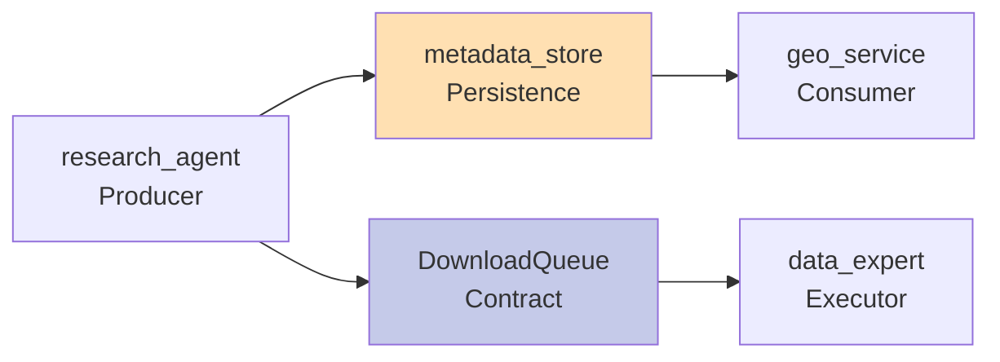

# 40. GEO Download System Improvements (November 2024)

## Overview

This document details critical improvements to the GEO download system implemented in November 2024 to address three major bugs identified by Kevin's testing. These fixes establish new architectural patterns that should be followed for all future GEO-related development.

## Key Architectural Changes

### 1. Strategy Config Persistence (Bug #2 Fix)

**Previous Issue**: Strategy configurations extracted by DataExpertAssistant were not persisted, causing downloads to fail when required files were missing.

**New Architecture**:
```python
# research_agent.py now persists strategy_config to metadata_store
strategy_config = assistant.extract_strategy_config(metadata, accession)
data_manager._store_geo_metadata(
    geo_id=accession,
    metadata=metadata,
    stored_by="research_agent_validate",
    strategy_config=strategy_config.model_dump()
)
```

**Key Files**:
- `research_agent.py` lines 849-896: Strategy persistence implementation
- `research_agent.py` lines 1908-2036: Data-type aware fallback strategies

### 2. Metadata-Based Adapter Selection (Bug #3 Fix)

**Previous Issue**: Flawed heuristic `if n_vars > 5000: use single_cell` incorrectly classified bulk RNA-seq datasets.

**New Architecture**: All 4 data processing paths now use LLM-based metadata detection:

```python
# geo_service.py - Replaced in all paths
from lobster.agents.data_expert_assistant import DataExpertAssistant
assistant = DataExpertAssistant()
modality_result = assistant.detect_modality(metadata, geo_id)

if modality_result and modality_result.modality == "bulk_rna":
    adapter_name = "transcriptomics_bulk"
    # Apply transpose for bulk RNA-seq SOFT format
    transpose = True
elif modality_result and modality_result.modality in ["scrna_10x", "scrna_smartseq"]:
    adapter_name = "transcriptomics_single_cell"
    transpose = False
```

### 3. Four Data Processing Paths

The GEO service processes data through 4 distinct paths, each now with proper metadata detection:

1. **SOFT Series Path** (`geo_service.py` lines 4916-5011)
   - Multi-sample SOFT file processing
   - Requires transpose for bulk RNA-seq (genes × samples → samples × genes)

2. **SOFT Single-Sample Path** (`geo_service.py` lines 5294-5391)
   - Individual GSM sample processing
   - Same transpose logic as series path

3. **Supplementary File Path** (`geo_service.py` lines 2150-2206)
   - Direct matrix/count file downloads
   - Usually correct orientation already

4. **TAR Archive Path** (`geo_service.py` lines 1219-1318)
   - Compressed archive processing
   - Typically contains correctly oriented data

### 4. HTTPS-First Download Strategy

**Confirmed Architecture**:
- Primary: HTTPS attempts for all GEO downloads
- Fallback: GEOparse library (uses FTP internally) only when HTTPS returns 404
- Future: Replace GEOparse with native SOFT parser to eliminate FTP dependency

**Evidence Pattern**:
```
WARNING  Pre-download failed: HTTP Error 404: Not Found. GEOparse will attempt download.
```

## Implementation Patterns

### Pattern 1: Producer-Consumer with Persistence



**Key Points**:
- research_agent persists all extracted metadata and strategy configs
- geo_service can access strategy details from metadata_store
- Eliminates race conditions and missing data issues

### Pattern 2: Fallback Strategy Hierarchy

```python
def _create_fallback_strategy(url_data: dict, metadata: dict) -> StrategyConfig:
    # 1. Check if single-cell based on metadata
    is_single_cell = _is_single_cell_dataset(metadata)

    # 2. URL-based strategy with data-type awareness
    if url_data.get("h5_url"):
        strategy_name = "H5_FIRST"
    elif is_single_cell and has_mtx_files:
        strategy_name = "RAW_FIRST"
    elif url_data.get("matrix_url"):
        strategy_name = "MATRIX_FIRST"
    else:
        strategy_name = "SAMPLES_FIRST"
```

### Pattern 3: Transpose Logic by Source

| Data Source | Format | Original Orientation | Needs Transpose | Final Orientation |
|------------|--------|---------------------|-----------------|-------------------|
| SOFT files | Text matrix | genes × samples | Yes (bulk only) | samples × genes |
| TAR archives | Various | samples × genes | No | samples × genes |
| Supplementary | CSV/TSV | Varies | Auto-detect | samples × genes |
| H5AD files | HDF5 | samples × genes | No | samples × genes |

## Quality Checklist for Future Development

When modifying GEO download functionality:

- [ ] **Strategy Persistence**: Ensure strategy_config is saved to metadata_store
- [ ] **Metadata Detection**: Use DataExpertAssistant.detect_modality() not heuristics
- [ ] **All Paths Covered**: Update all 4 processing paths if changing adapter logic
- [ ] **Transpose Handling**: Apply correct transpose based on source and data type
- [ ] **Import Statements**: Add necessary imports (e.g., DataExpertAssistant)
- [ ] **Fallback Strategies**: Implement graceful fallbacks when LLM detection fails
- [ ] **HTTPS First**: Always attempt HTTPS before falling back to FTP

## Known Issues and Future Work

### Immediate Priorities
1. ✅ Strategy persistence implemented
2. ✅ Metadata-based adapter selection deployed
3. ✅ HTTPS-first approach confirmed

### Short-term (1-2 weeks)
1. Add comprehensive unit tests for all 4 paths
2. Monitor production for edge cases
3. Document strategy selection in user-facing wiki

### Medium-term (1-2 months)
1. Replace GEOparse with native SOFT parser (~750 LOC)
2. Implement retry mechanism with exponential backoff
3. Add telemetry for adapter selection accuracy

### Long-term (3-6 months)
1. Machine learning model for adapter prediction
2. Parallel download strategies for large datasets
3. Automated orientation detection without metadata

## Testing Protocol

For any changes to GEO download system:

```bash
# Test single-cell with missing files (Bug #2)
lobster query "Download GSE182227 and verify strategy persistence"

# Test bulk RNA-seq orientation (Bug #3)
lobster query "Download GSE130970 and verify 78 samples × genes orientation"

# Test HTTPS-first (Bug #7)
lobster query "Download GSE130036 and check for HTTP 404 warnings"

# Test all 4 paths
lobster query "Test SOFT series: GSE130970"
lobster query "Test SOFT sample: GSM3730500"
lobster query "Test supplementary: GSE156063 with SUPPLEMENTARY_FIRST"
lobster query "Test TAR archive: GSE164073"
```

## References

- Original bug report: `/Users/tyo/GITHUB/omics-os/lobster/kevin_notes/bug_testing_report_20251126.md`
- Research agent changes: `research_agent.py` lines 849-896, 1908-2036
- GEO service changes: `geo_service.py` lines 1219-1318, 2150-2206, 4916-5011, 5294-5391
- Architecture overview: [Wiki 18](./18-architecture-overview.md)
- Download queue system: [Wiki 35](./35-download-queue-system.md)

## Version History

- **v0.3.2.4** (2024-11-26): Initial implementation of all fixes
- **Author**: Claude (Opus 4.1) with human guidance
- **Reviewer**: Pending