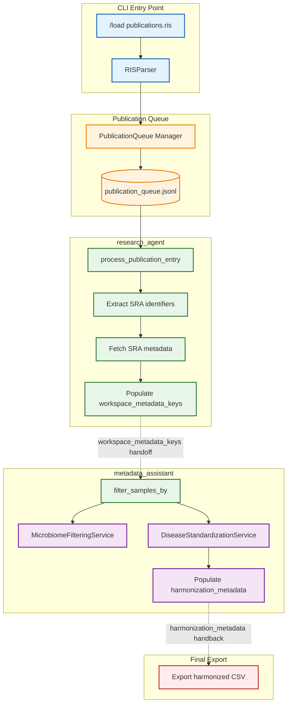
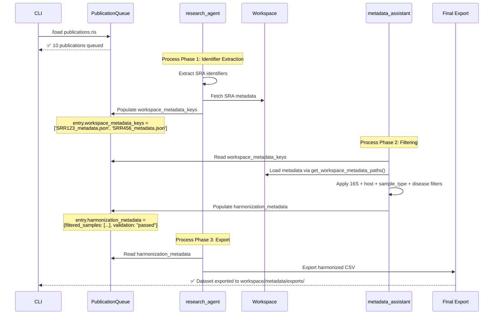
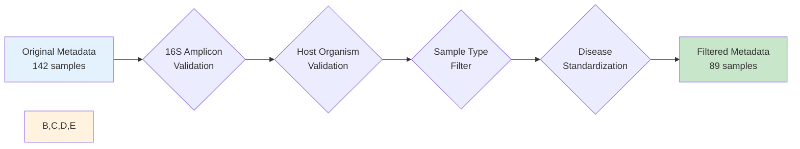

# 47. Microbiome Metadata Harmonization Workflow

## Overview

The **Microbiome Metadata Harmonization Workflow** is a PREMIUM enterprise feature enabling automated harmonization of microbiome metadata from publication references to filtered, analysis-ready CSV datasets. Designed for DataBioMix customer use cases, this workflow handles complex IBD (Inflammatory Bowel Disease) microbiome studies with multi-step filtering, disease standardization, and sample type validation.

**Key Capabilities:**
- **RIS Import to CSV Export**: Batch processing from reference manager exports to harmonized datasets
- **Multi-Agent Coordination**: research_agent → metadata_assistant handoff via PublicationQueue
- **Advanced Filtering**: 16S amplicon detection, host organism validation, sample type filtering, disease standardization
- **Workspace Persistence**: Durable caching with workspace_metadata_keys contract
- **W3C-PROV Compliance**: Full provenance tracking for reproducible workflows

**Target Use Cases:**
- IBD microbiome meta-analysis (Colorectal Cancer, Ulcerative Colitis, Crohn's Disease)
- Fecal vs tissue/biopsy sample comparison
- Human/mouse gut microbiome studies
- Dataset harmonization for statistical analysis

**Introduced**: November 2024 (Phase 2: Publication Queue + Microbiome Services)

---

## Architecture Overview

### System Components



### Multi-Agent Handoff Pattern

The workflow implements a **workspace-based handoff contract** between research_agent and metadata_assistant:



**Handoff Contract Fields:**

| Field | Set By | Read By | Purpose |
|-------|--------|---------|---------|
| `workspace_metadata_keys` | research_agent | metadata_assistant | List of metadata file basenames (e.g., `['SRR123_metadata.json']`) |
| `harmonization_metadata` | metadata_assistant | research_agent | Filtered/validated metadata ready for CSV export |

---

## User Workflow

### Complete End-to-End Example

**Scenario**: DataBioMix researcher wants to harmonize 10 microbiome publications (IBD studies) into a single analysis-ready CSV.

#### Step 1: Export RIS File from Reference Manager

```bash
# In Zotero:
# 1. Select your collection of 10 publications
# 2. File → Export Library → Format: RIS
# 3. Save as: ibd_microbiome_studies.ris
```

**RIS File Example**:
```text
TY  - JOUR
TI  - Gut microbiome alterations in colorectal cancer patients
AU  - Smith, John
AU  - Jones, Alice
PY  - 2023
JO  - Nature Microbiome
AB  - We performed 16S rRNA sequencing on fecal samples...
PMID- 37123456
KW  - microbiome
KW  - 16S rRNA
KW  - colorectal cancer
ER  -

TY  - JOUR
TI  - Fecal microbiota composition in ulcerative colitis
AU  - Brown, Charlie
PY  - 2022
JO  - Cell Host & Microbe
AB  - Illumina MiSeq 16S sequencing revealed...
PMID- 36789012
KW  - microbiome
KW  - ulcerative colitis
ER  -
```

#### Step 2: Load Publications into Queue

```bash
lobster chat
> /load ibd_microbiome_studies.ris
```

**Output**:
```
✅ Imported 10 publications to queue
   - 7 microbiome studies detected
   - 2 proteomics studies detected
   - 1 general study detected
```

#### Step 3: Process Publications (research_agent)

Natural language request:
```
> Process all microbiome publications from the queue and extract SRA identifiers
```

**research_agent workflow**:
1. Queries publication_queue for microbiome schema_type entries (status=PENDING)
2. For each publication:
   - Extracts SRA identifiers (SRR, SRP, PRJNA) using identifier extraction patterns
   - Fetches SRA metadata via NCBI E-utilities
   - Saves metadata to `workspace/metadata/{run_accession}_metadata.json`
   - Populates `workspace_metadata_keys` field in PublicationQueueEntry

**Status Update**:
```
✅ Processed 7 microbiome publications
   - Total SRA runs identified: 142
   - Metadata files cached: 142
   - workspace_metadata_keys populated
```

#### Step 4: Filter and Harmonize (metadata_assistant)

Natural language request:
```
> Filter all publications for human fecal 16S samples and standardize disease terms
```

**metadata_assistant workflow**:
1. Reads `workspace_metadata_keys` from each publication entry
2. Loads full metadata paths via `entry.get_workspace_metadata_paths(workspace_dir)`
3. Applies sequential filters using `filter_samples_by` tool:
   - ✅ Validate 16S amplicon sequencing (library_strategy="AMPLICON")
   - ✅ Validate host organism (host="Homo sapiens" with fuzzy matching)
   - ✅ Filter sample type (sample_source="fecal" OR "stool")
   - ✅ Standardize disease terms (CRC, UC, CD, Healthy → standard categories)
4. Populates `harmonization_metadata` with filtered results

**Filtering Report Example**:
```
📊 Filtering Results:
   - Original samples: 142
   - After 16S validation: 138 (97.2% retention)
   - After host validation: 136 (95.8% retention)
   - After sample type filter: 89 (62.7% retention - fecal only)
   - After disease standardization: 89 (100% mapping success)

   Disease Distribution:
   - CRC: 34 samples (38.2%)
   - UC: 22 samples (24.7%)
   - CD: 18 samples (20.2%)
   - Healthy: 15 samples (16.9%)
```

**Disease Extraction Note** (v1.2.0): SRA datasets have NO standardized disease field. Disease information appears in study-specific formats:
- **Free-text fields**: `host_phenotype` ("Parkinson's Disease"), `phenotype`, `health_status`
- **Boolean flags**: `crohns_disease: Yes`, `inflam_bowel_disease: Yes`, `parkinson_disease: TRUE`
- **Study metadata**: Embedded in publication title or methods

The metadata_assistant **automatically extracts disease** from these diverse patterns using 4-strategy approach:
1. Existing unified columns (`disease`, `disease_state`, `condition`, `diagnosis`)
2. Free-text phenotype fields (`host_phenotype` → `disease`)
3. Boolean disease flags (`crohns_disease: Yes` → `disease: cd`)
4. Study context (publication-level disease inference)

Extraction creates two fields:
- `disease`: Standardized term (e.g., "cd", "uc", "crc", "healthy", "parkinsons")
- `disease_original`: Original raw value for traceability

**Expected coverage**: 15-30% (depends on study metadata completeness)

#### Step 5: Export Harmonized CSV

Natural language request:
```
> Export harmonized metadata to CSV
```

**Note**: Filenames are automatically timestamped (e.g., `harmonized_ibd_microbiome_2024-11-19.csv`).
To disable auto-timestamp, use parameter `add_timestamp=False`.

**research_agent reads harmonization_metadata** and exports:

**File**: `workspace/metadata/exports/harmonized_ibd_microbiome_2024-11-19.csv`

| run_accession | study_accession | biosample | organism | sample_type | disease | disease_original | tissue | age | sex | ... |
|---------------|------------------|-----------|----------|-------------|---------|------------------|--------|-----|-----|-----|
| SRR12345678 | SRP123456 | SAMN12345678 | Homo sapiens | fecal | crc | colorectal cancer | colon | 62 | male | ... |
| SRR12345679 | SRP123456 | SAMN12345679 | Homo sapiens | fecal | uc | ulcerative_colitis | rectum | 45 | female | ... |
| SRR12345680 | SRP123457 | SAMN12345680 | Homo sapiens | fecal | cd | Crohn disease | ileum | 38 | male | ... |
| SRR12345681 | SRP123457 | SAMN12345681 | Homo sapiens | fecal | healthy | control | NA | 50 | female | ... |

**Final Output**:
```
✅ Harmonized dataset exported:
   - File: workspace/metadata/exports/harmonized_ibd_microbiome_2024-11-19.csv
   - Total samples: 89
   - Columns: 34 (28 SRA metadata + 6 harmonized fields - schema-driven)
   - Provenance: Full W3C-PROV tracking available via /pipeline export
```

**Security Note**: Queue export functionality assumes trusted local CLI users. Multi-tenant cloud deployment requires additional authorization layer (Phase 2).

---

## Component Reference

### PublicationQueue Schema

**Location**: `lobster/core/schemas/publication_queue.py`

The `PublicationQueueEntry` schema includes specialized fields for microbiome workflow coordination:

```python
from lobster.core.schemas.publication_queue import PublicationQueueEntry

entry = PublicationQueueEntry(
    entry_id="pub_queue_37123456_abc123",
    pmid="37123456",
    title="Gut microbiome alterations in colorectal cancer patients",
    schema_type="microbiome",  # Auto-inferred from keywords

    # Multi-agent handoff fields
    workspace_metadata_keys=[
        "SRR12345678_metadata.json",
        "SRR12345679_metadata.json",
        "SRR12345680_metadata.json"
    ],
    harmonization_metadata={
        "samples": [
            {"run_accession": "SRR12345678", "organism": "Homo sapiens", "sample_type": "fecal", "disease": "crc"},
            {"run_accession": "SRR12345679", "organism": "Homo sapiens", "sample_type": "fecal", "disease": "uc"}
        ],
        "filtering_stats": {
            "original_samples": 142,
            "filtered_samples": 89,
            "retention_rate": 62.7
        },
        "validation_status": "passed"
    },

    extracted_identifiers={
        "sra": ["SRR12345678", "SRR12345679", "SRR12345680"],
        "bioproject": ["PRJNA720345"],
        "biosample": ["SAMN12345678", "SAMN12345679", "SAMN12345680"]
    }
)
```

**Key Methods**:

```python
# Get full paths to metadata files
paths = entry.get_workspace_metadata_paths(workspace_dir="/path/to/workspace")
# Returns: [
#   '/path/to/workspace/metadata/SRR12345678_metadata.json',
#   '/path/to/workspace/metadata/SRR12345679_metadata.json',
#   '/path/to/workspace/metadata/SRR12345680_metadata.json'
# ]
```

---

### MicrobiomeFilteringService

**Location**: `lobster/tools/microbiome_filtering_service.py`

Stateless service for validating microbiome metadata with 16S amplicon detection and host organism validation.

#### Method: validate_16s_amplicon

Validates if metadata represents a 16S amplicon study using OR-based detection across multiple fields.

**Signature**:
```python
def validate_16s_amplicon(
    metadata: Dict[str, Any],
    strict: bool = False
) -> Tuple[Dict[str, Any], Dict[str, Any], AnalysisStep]:
    """
    Validate if metadata represents a 16S amplicon study.

    Args:
        metadata: Metadata dictionary to validate
        strict: If True, require exact keyword matches (default: False)

    Returns:
        Tuple of (filtered_metadata, stats, ir)
    """
```

**Detection Strategy** (OR-based, multi-field):

1. **platform**: ["illumina", "miseq", "hiseq", "nextseq", "pacbio", "ion torrent"]
2. **library_strategy**: ["amplicon", "16s", "16s rrna", "16s amplicon", "targeted locus"]
3. **assay_type**: ["16s sequencing", "amplicon sequencing", "metagenomics 16s"]

**Matching Modes**:
- **Non-strict (default)**: Substring matching (e.g., "Illumina MiSeq" matches "illumina")
- **Strict**: Exact keyword matching (e.g., "Illumina MiSeq" doesn't match "illumina")

**Example Usage**:
```python
from lobster.tools.microbiome_filtering_service import MicrobiomeFilteringService

service = MicrobiomeFilteringService()

# Non-strict matching (default)
metadata = {
    "platform": "Illumina MiSeq",
    "library_strategy": "AMPLICON",
    "organism": "Homo sapiens"
}

filtered, stats, ir = service.validate_16s_amplicon(metadata, strict=False)

print(stats)
# {
#   'is_valid': True,
#   'reason': '16S amplicon detected in library_strategy',
#   'matched_field': 'library_strategy',
#   'matched_value': 'AMPLICON',
#   'strict_mode': False,
#   'fields_checked': ['platform', 'library_strategy', 'assay_type']
# }
```

#### Method: validate_host_organism

Validates host organism using fuzzy string matching with configurable thresholds.

**Signature**:
```python
def validate_host_organism(
    metadata: Dict[str, Any],
    allowed_hosts: Optional[List[str]] = None,
    fuzzy_threshold: float = 85.0
) -> Tuple[Dict[str, Any], Dict[str, Any], AnalysisStep]:
    """
    Validate host organism using fuzzy string matching.

    Args:
        metadata: Metadata dictionary containing host organism info
        allowed_hosts: List of allowed host names (default: ["Human", "Mouse"])
        fuzzy_threshold: Minimum fuzzy match score (0-100, default: 85.0)

    Returns:
        Tuple of (filtered_metadata, stats, ir)
    """
```

**Host Aliases** (built-in):

| Standard Host | Aliases |
|---------------|---------|
| **Human** | Homo sapiens, homo sapiens, human, Human, HUMAN, h. sapiens, H. sapiens, hsapiens |
| **Mouse** | Mus musculus, mus musculus, mouse, Mouse, MOUSE, m. musculus, M. musculus, mmusculus |

**Fuzzy Matching Algorithm**:
- Uses `difflib.SequenceMatcher` (Python standard library)
- Score scale: 0-100 (0 = no match, 100 = exact match)
- Default threshold: 85.0 (high confidence)

**Example Usage**:
```python
# Example 1: Standard host validation
metadata = {"organism": "Homo sapiens"}
filtered, stats, ir = service.validate_host_organism(metadata)

print(stats)
# {
#   'is_valid': True,
#   'reason': 'Host organism matched: Human',
#   'matched_host': 'Human',
#   'confidence_score': 100.0,
#   'allowed_hosts': ['Human', 'Mouse'],
#   'fuzzy_threshold': 85.0
# }

# Example 2: Fuzzy matching with typo
metadata = {"organism": "homo sapeins"}  # Typo: 'sapeins'
filtered, stats, ir = service.validate_host_organism(metadata, fuzzy_threshold=80.0)

print(stats)
# {
#   'is_valid': True,
#   'reason': 'Host organism matched: Human',
#   'matched_host': 'Human',
#   'confidence_score': 92.3,  # High confidence despite typo
#   'allowed_hosts': ['Human', 'Mouse'],
#   'fuzzy_threshold': 80.0
# }

# Example 3: Rejection due to low threshold
metadata = {"organism": "Rattus norvegicus"}  # Rat (not in allowed_hosts)
filtered, stats, ir = service.validate_host_organism(metadata)

print(stats)
# {
#   'is_valid': False,
#   'reason': 'Host organism not in allowed list: [\'Human\', \'Mouse\']',
#   'matched_host': None,
#   'confidence_score': None,
#   'allowed_hosts': ['Human', 'Mouse'],
#   'fuzzy_threshold': 85.0
# }
```

---

### DiseaseStandardizationService

**Location**: `lobster/tools/disease_standardization_service.py`

Normalizes disease/condition terminology and filters samples by type (fecal vs tissue). Designed for IBD microbiome studies.

#### Method: standardize_disease_terms

Standardizes disease terminology using 5-level fuzzy matching.

**Signature**:
```python
def standardize_disease_terms(
    metadata: pd.DataFrame,
    disease_column: str = "disease"
) -> Tuple[pd.DataFrame, Dict[str, Any], AnalysisStep]:
    """
    Standardize disease terminology in metadata.

    Args:
        metadata: DataFrame with disease information
        disease_column: Column name containing disease labels

    Returns:
        Tuple of (standardized_metadata, statistics, provenance_ir)
    """
```

**Disease Mappings** (case-insensitive):

| Standard Term | Variants |
|---------------|----------|
| **crc** | crc, colorectal cancer, colon cancer, rectal cancer, colorectal carcinoma, adenocarcinoma, tumor, tumour, cancer |
| **uc** | uc, ulcerative colitis, colitis ulcerosa, ulcerative_colitis |
| **cd** | cd, crohn's disease, crohns disease, crohn disease, crohn's, crohns, crohn |
| **healthy** | healthy, control, normal, non-ibd, non ibd, non-diseased, healthy control, normal control, ctrl |

**5-Level Fuzzy Matching Strategy**:

```python
# Level 1: Exact match
"colorectal cancer" → "crc" (exact match in variant list)

# Level 2: Value contains variant
"stage III colorectal cancer" → "crc" (contains "colorectal cancer")

# Level 3: Variant contains value (reverse)
"tumor" → "crc" (variant "tumor" matched)

# Level 4: Token-based matching
"crc adenocarcinoma patient" → "crc" (tokens "crc", "adenocarcinoma" match)

# Level 5: No match found
"diabetes" → "diabetes" (unmapped, returns original value)
```

**Example Usage**:
```python
from lobster.tools.disease_standardization_service import DiseaseStandardizationService
import pandas as pd

service = DiseaseStandardizationService()

# Original metadata with messy disease labels
metadata = pd.DataFrame({
    'sample_id': ['S1', 'S2', 'S3', 'S4', 'S5'],
    'disease': ['colorectal cancer', 'UC', 'Crohn disease', 'healthy control', 'adenocarcinoma']
})

standardized, stats, ir = service.standardize_disease_terms(metadata, disease_column='disease')

print(standardized[['sample_id', 'disease', 'disease_original']])
#   sample_id  disease         disease_original
# 0        S1      crc  colorectal cancer
# 1        S2       uc                 UC
# 2        S3       cd       Crohn disease
# 3        S4  healthy      healthy control
# 4        S5      crc       adenocarcinoma

print(stats)
# {
#   'total_samples': 5,
#   'standardization_rate': 100.0,  # All samples mapped
#   'mapping_stats': {
#       'exact_matches': 1,          # "UC" → "uc"
#       'contains_matches': 2,       # "colorectal cancer", "Crohn disease"
#       'reverse_contains_matches': 0,
#       'token_matches': 2,          # "healthy control", "adenocarcinoma"
#       'unmapped': 0
#   },
#   'unique_mappings': {
#       'colorectal cancer': 'crc',
#       'UC': 'uc',
#       'Crohn disease': 'cd',
#       'healthy control': 'healthy',
#       'adenocarcinoma': 'crc'
#   },
#   'disease_distribution': {
#       'crc': 2,
#       'uc': 1,
#       'cd': 1,
#       'healthy': 1
#   },
#   'original_column': 'disease_original'
# }
```

#### Method: filter_by_sample_type

Filters samples by sample type (fecal vs gut tissue) using multi-column detection.

**Signature**:
```python
def filter_by_sample_type(
    metadata: pd.DataFrame,
    sample_types: List[str],
    sample_columns: Optional[List[str]] = None
) -> Tuple[pd.DataFrame, Dict[str, Any], AnalysisStep]:
    """
    Filter samples by sample type (fecal vs gut tissue).

    Args:
        metadata: DataFrame with sample information
        sample_types: List of sample types to keep (e.g., ["fecal"])
        sample_columns: Columns to check for sample type info
                       (if None, checks common columns)

    Returns:
        Tuple of (filtered_metadata, statistics, provenance_ir)
    """
```

**Sample Type Mappings**:

| Sample Type | Variants |
|-------------|----------|
| **fecal** | fecal, feces, stool, faecal, faeces, fecal sample |
| **gut** | gut, intestinal, colon, colonic, rectal, ileal, biopsy, tissue, mucosal, mucosa |

**Auto-Detected Columns** (if sample_columns=None):
- sample_type
- tissue
- body_site
- sample_source
- biosample_type
- material

**Example Usage**:
```python
# Original metadata with mixed sample types
metadata = pd.DataFrame({
    'sample_id': ['S1', 'S2', 'S3', 'S4', 'S5', 'S6'],
    'disease': ['crc', 'uc', 'cd', 'healthy', 'crc', 'uc'],
    'sample_type': ['fecal', 'fecal', 'biopsy', 'fecal', 'tissue', 'stool']
})

# Filter for fecal samples only
filtered, stats, ir = service.filter_by_sample_type(
    metadata,
    sample_types=["fecal"]
)

print(filtered[['sample_id', 'disease', 'sample_type']])
#   sample_id disease sample_type
# 0        S1     crc       fecal
# 1        S2      uc       fecal
# 3        S4 healthy       fecal
# 5        S6      uc       stool

print(stats)
# {
#   'original_samples': 6,
#   'filtered_samples': 4,
#   'retention_rate': 66.67,
#   'sample_types_requested': ['fecal'],
#   'columns_checked': ['sample_type'],
#   'matches_by_column': {'sample_type': 4}
# }
```

---

### Protocol Extraction Service (Modular Package)

**Location**: `lobster/services/metadata/protocol_extraction/`

**Introduced**: November 2024 (v2.5+) - Modular refactor for multi-omics extensibility

Modular protocol extraction package for extracting technical protocol details from publication methods sections. Designed as a domain-based architecture supporting amplicon (16S/ITS), mass spectrometry, and RNA-seq protocols.

#### Package Architecture

```
protocol_extraction/
├── __init__.py              # Factory: get_protocol_service(domain)
├── base.py                  # IProtocolExtractionService ABC, BaseProtocolDetails
├── amplicon/                # 16S/ITS microbiome (FULLY IMPLEMENTED)
│   ├── __init__.py
│   ├── details.py           # AmpliconProtocolDetails dataclass
│   ├── service.py           # AmpliconProtocolService
│   └── resources/
│       └── primers.json     # 15 primers with sequences, sources
├── mass_spec/               # Proteomics (STUB - NotImplementedError)
│   └── ...
└── rnaseq/                  # Transcriptomics (STUB - NotImplementedError)
    └── ...
```

#### Factory Pattern Usage

```python
from lobster.services.metadata.protocol_extraction import get_protocol_service

# Get amplicon service (supports domain aliases)
service = get_protocol_service("amplicon")  # Primary
service = get_protocol_service("16s")       # Alias
service = get_protocol_service("its")       # Alias
service = get_protocol_service("metagenomics")  # Alias

# Extract protocol from methods text
text = """
The V3-V4 region was amplified using primers 515F and 806R.
PCR for 30 cycles at 55°C. Sequenced on MiSeq (2×250 bp).
Processed with QIIME2/DADA2 using SILVA v138.
"""
details, result = service.extract_protocol(text, source="pmc")

print(details.v_region)           # "V3-V4"
print(details.forward_primer)     # "515F"
print(details.reverse_primer)     # "806R"
print(details.pcr_cycles)         # 30
print(details.platform)           # "Illumina MiSeq"
print(details.pipeline)           # "DADA2"
print(details.reference_database) # "SILVA"
print(details.confidence)         # 1.0 (100%)
```

#### Extracted Fields (AmpliconProtocolDetails)

| Field | Type | Example | Source Pattern |
|-------|------|---------|----------------|
| `v_region` | str | "V3-V4" | "V3-V4 region", "V4 hypervariable" |
| `forward_primer` | str | "515F" | Primer database (15 primers) |
| `forward_primer_sequence` | str | "GTGCCAGCMGCCGCGGTAA" | DNA sequences 15-30 bp |
| `reverse_primer` | str | "806R" | Primer database |
| `reverse_primer_sequence` | str | "GGACTACHVGGGTWTCTAAT" | DNA sequences |
| `annealing_temperature` | float | 55.0 | "annealing at 55°C" |
| `pcr_cycles` | int | 30 | "30 cycles" |
| `platform` | str | "Illumina MiSeq" | MiSeq, HiSeq, NovaSeq, etc. |
| `read_length` | int | 250 | "250 bp", "2×250 bp" |
| `paired_end` | bool | True | "paired-end", "PE" |
| `reference_database` | str | "SILVA" | SILVA, Greengenes, RDP, GTDB, UNITE |
| `database_version` | str | "v138" | Version patterns |
| `pipeline` | str | "DADA2" | QIIME2, DADA2, mothur, USEARCH |
| `pipeline_version` | str | "v2021.4" | Version patterns |
| `clustering_method` | str | "ASV" | ASV, OTU, zOTU |
| `clustering_threshold` | float | 97.0 | "97% similarity" |
| `confidence` | float | 0.83 | 0-1.0 (extraction completeness) |

#### Schema Alignment Methods

The `AmpliconProtocolDetails` class provides methods for integrating with AnnData storage:

##### to_schema_dict()

Maps protocol fields to metagenomics schema-compatible field names for `adata.obs`:

```python
schema_dict = details.to_schema_dict()
# {
#   'forward_primer_name': '515F',
#   'forward_primer_seq': 'GTGCCAGCMGCCGCGGTAA',
#   'reverse_primer_name': '806R',
#   'amplicon_region': 'V3-V4',
#   'sequencing_platform': 'Illumina MiSeq',
#   'primer_set': '515F-806R'
# }
```

##### to_uns_dict()

Creates comprehensive structure for `adata.uns["protocol_details"]`:

```python
uns_dict = details.to_uns_dict()
# {
#   'forward_primer': '515F',
#   'forward_primer_sequence': 'GTGCCAGCMGCCGCGGTAA',
#   'target_region': 'V3-V4',
#   'amplicon_target': '16S rRNA V3-V4',
#   'taxonomy_database': 'SILVA',
#   'pipeline': 'DADA2',
#   'pcr_conditions': {
#       'annealing_temperature_celsius': 55.0,
#       'pcr_cycles': 30
#   },
#   'extraction_confidence': 0.83
# }
```

##### store_in_adata()

Helper method for storing protocol details in AnnData:

```python
import anndata as ad
import numpy as np

# Create sample AnnData
adata = ad.AnnData(np.random.rand(10, 5))

# Store protocol details
adata = service.store_in_adata(adata, details, store_in_obs=True)

# Access stored data
print(adata.uns["protocol_details"]["forward_primer"])  # '515F'
print(adata.obs["amplicon_region"].iloc[0])             # 'V3-V4'
```

#### Integration with PMCProvider

Protocol extraction is integrated with `PMCProvider._extract_parameters()`:

```python
from lobster.tools.providers.pmc_provider import PMCProvider

provider = PMCProvider()
full_text = provider.extract_full_text("PMID:35042229")

# Parameters auto-extracted from methods section
print(full_text.parameters)
# {
#   'v_region': 'V3-V4',
#   'forward_primer': '515F',
#   'forward_primer_sequence': 'GTGCCAGCMGCCGCGGTAA',
#   'sequencing_platform': 'Illumina MiSeq',
#   'bioinformatics_pipeline': 'DADA2',
#   'reference_database': 'SILVA v138'
# }
```

#### Primer Database

**Location**: `lobster/services/metadata/protocol_extraction/amplicon/resources/primers.json`

Contains 15 primers with metadata:

| Primer | Direction | Region | Sequence |
|--------|-----------|--------|----------|
| 515F | forward | V4 | GTGCCAGCMGCCGCGGTAA |
| 515F-Y | forward | V4 | GTGYCAGCMGCCGCGGTAA |
| 806R | reverse | V4 | GGACTACHVGGGTWTCTAAT |
| 806RB | reverse | V4 | GGACTACNVGGGTWTCTAAT |
| 341F | forward | V3 | CCTACGGGNGGCWGCAG |
| 785R | reverse | V4 | GACTACHVGGGTATCTAATCC |
| 27F | forward | V1-V2 | AGAGTTTGATCMTGGCTCAG |
| 1492R | reverse | V9 | TACGGYTACCTTGTTACGACTT |
| ITS1F | forward | ITS1 | CTTGGTCATTTAGAGGAAGTAA |
| ITS2 | reverse | ITS1 | GCTGCGTTCTTCATCGATGC |
| ... | ... | ... | ... |

**Critical Feature**: Primers sorted by length (descending) before regex compilation ensures specific variants (e.g., "515F-Y") match before generic names (e.g., "515F").

#### Extensibility

**Adding New Domains:**

1. Create domain directory: `protocol_extraction/new_domain/`
2. Implement `NewDomainProtocolDetails(BaseProtocolDetails)`
3. Implement `NewDomainProtocolService(IProtocolExtractionService)`
4. Register in `__init__.py` factory

```python
# In protocol_extraction/__init__.py
if domain_lower in ("new_domain", "alias1", "alias2"):
    from .new_domain.service import NewDomainProtocolService
    service = NewDomainProtocolService()
    _service_cache[domain_lower] = service
    return service
```

---

### metadata_assistant.filter_samples_by Tool

**Location**: `lobster/agents/metadata_assistant.py` (lines 695-890)

Natural language tool for multi-criteria filtering using sequential composition pattern.

**Signature**:
```python
@tool
def filter_samples_by(
    workspace_key: str,
    filter_criteria: str,
    strict: bool = True
) -> str:
    """
    Filter samples by multi-modal criteria (16S amplicon + host organism +
    sample type + disease).

    Args:
        workspace_key: Key for workspace metadata (e.g., "geo_gse123456")
        filter_criteria: Natural language criteria (e.g., "16S human fecal CRC")
        strict: Use strict matching for 16S detection (default: True)

    Returns:
        Formatted markdown report with filtering results
    """
```

**Sequential Filter Composition**:



**Natural Language Parsing**:

| Criteria String | Parsed Filters |
|-----------------|----------------|
| `"16S human fecal"` | check_16s=True, host=["Human"], sample_types=["fecal"], standardize_disease=False |
| `"16S human fecal CRC UC"` | check_16s=True, host=["Human"], sample_types=["fecal"], standardize_disease=True |
| `"16S mouse gut"` | check_16s=True, host=["Mouse"], sample_types=["gut"], standardize_disease=False |
| `"human fecal"` | check_16s=False, host=["Human"], sample_types=["fecal"], standardize_disease=False |

**Example Usage** (via natural language):

```python
# In lobster chat:
> Filter the workspace metadata 'geo_gse123456' for human fecal 16S samples with CRC, UC, CD, or healthy controls
```

**Tool invocation**:
```python
filter_samples_by(
    workspace_key="geo_gse123456",
    filter_criteria="16S human fecal CRC UC CD healthy",
    strict=True
)
```

**Output Report**:
```markdown
# 📊 Microbiome Filtering Results

## Criteria Parsed:
- ✅ 16S Amplicon: Enabled (strict mode)
- ✅ Host Organism: ["Human"]
- ✅ Sample Type: ["fecal"]
- ✅ Disease Standardization: Enabled

## Sequential Filtering:

### Step 1: 16S Amplicon Validation
- Original samples: 142
- Valid 16S samples: 138
- Retention: 97.2%
- Matched fields: library_strategy (135), platform (3)

### Step 2: Host Organism Validation
- Input samples: 138
- Valid host samples: 136
- Retention: 98.6%
- Matched host: Human (avg confidence: 94.8%)

### Step 3: Sample Type Filter
- Input samples: 136
- Matching sample types: 89
- Retention: 65.4%
- Matched columns: sample_type (72), body_site (17)

### Step 4: Disease Standardization
- Input samples: 89
- Standardized samples: 89
- Standardization rate: 100.0%
- Disease distribution:
  - crc: 34 (38.2%)
  - uc: 22 (24.7%)
  - cd: 18 (20.2%)
  - healthy: 15 (16.9%)

## Final Results:
- **Original Samples**: 142
- **Filtered Samples**: 89
- **Overall Retention Rate**: 62.7%

## Next Steps:
Use harmonization_metadata field to export filtered dataset to CSV.
```

---

## Example Workflows

### Workflow 1: Basic IBD Microbiome Harmonization

**Goal**: Filter for human fecal 16S samples with IBD diseases.

**Steps**:
```bash
# Step 1: Load publications
lobster chat
> /load ibd_studies.ris
# ✅ Imported 5 publications (5 microbiome studies)

# Step 2: Process publications (research_agent)
> Process all microbiome publications and extract SRA metadata
# ✅ Processed 5 publications, 87 SRA runs identified

# Step 3: Filter samples (metadata_assistant)
> Filter all publications for human fecal 16S samples
# ✅ Filtered 87 → 56 samples (64.4% retention)

# Step 4: Standardize diseases (metadata_assistant)
> Standardize disease terms for CRC, UC, CD, and healthy controls
# ✅ Standardized 56 samples (100% mapping rate)

# Step 5: Export CSV
> Export harmonized metadata to CSV
# ✅ Exported to workspace/metadata/exports/harmonized_ibd_2024-11-19.csv
```

### Workflow 2: Mouse Model Comparison

**Goal**: Compare mouse fecal vs gut tissue microbiome.

**Steps**:
```bash
# Step 1: Load publications
> /load mouse_microbiome.ris
# ✅ Imported 3 publications

# Step 2: Process and filter for mouse fecal
> Process publications and filter for mouse fecal 16S samples
# ✅ Filtered 45 → 28 fecal samples

# Step 3: Process and filter for mouse gut tissue
> Filter for mouse gut tissue samples instead
# ✅ Filtered 45 → 17 gut tissue samples

# Step 4: Export both datasets for comparison
> Export fecal dataset to CSV as mouse_fecal (auto-timestamp appended)
> Export gut tissue dataset to CSV as mouse_gut_tissue (auto-timestamp appended)
```

### Workflow 3: Cross-Study Meta-Analysis

**Goal**: Harmonize 10 CRC studies for statistical meta-analysis.

**Steps**:
```bash
# Step 1: Load large RIS file
> /load crc_meta_analysis.ris
# ✅ Imported 10 publications (10 microbiome studies)

# Step 2: Process all publications
> Process all publications, extract SRA metadata, and cache to workspace
# ✅ Processed 10 publications, 234 SRA runs identified

# Step 3: Apply strict filters for consistency
> Filter for human fecal 16S samples only, require CRC or healthy controls
# ✅ Filtered 234 → 156 samples (66.7% retention)
#    - CRC: 89 samples
#    - Healthy: 67 samples

# Step 4: Validate harmonization quality
> Check metadata completeness for age, sex, BMI, sequencing depth
# ✅ Validation passed:
#    - age: 94% complete
#    - sex: 98% complete
#    - bmi: 67% complete
#    - sequencing_depth: 100% complete

# Step 5: Export for statistical analysis
> Export harmonized dataset with provenance tracking
# ✅ Exported: workspace/metadata/exports/crc_meta_analysis_2024-11-19.csv
#    Provenance: workspace/metadata/exports/crc_meta_analysis_2024-11-19_provenance.json
```

---

## API Reference

### PublicationQueue Methods

```python
from lobster.core.data_manager_v2 import DataManagerV2
from lobster.core.schemas.publication_queue import PublicationStatus

data_manager = DataManagerV2(workspace_path="./workspace")
queue = data_manager.publication_queue

# Get entry by ID
entry = queue.get_entry("pub_queue_37123456_abc123")

# Access workspace metadata keys
print(entry.workspace_metadata_keys)
# ['SRR12345678_metadata.json', 'SRR12345679_metadata.json']

# Get full paths to metadata files
paths = entry.get_workspace_metadata_paths(workspace_dir="./workspace")
# ['/workspace/metadata/SRR12345678_metadata.json', '/workspace/metadata/SRR12345679_metadata.json']

# Update harmonization metadata (metadata_assistant)
queue.update_status(
    entry_id="pub_queue_37123456_abc123",
    status=PublicationStatus.COMPLETED,
    harmonization_metadata={
        "samples": [...],
        "filtering_stats": {...}
    }
)

# Read harmonization metadata (research_agent)
entry = queue.get_entry("pub_queue_37123456_abc123")
harmonized_data = entry.harmonization_metadata
```

### MicrobiomeFilteringService Methods

```python
from lobster.tools.microbiome_filtering_service import MicrobiomeFilteringService

service = MicrobiomeFilteringService()

# 16S amplicon validation
metadata = {"platform": "Illumina MiSeq", "library_strategy": "AMPLICON"}
filtered, stats, ir = service.validate_16s_amplicon(metadata, strict=False)

# Host organism validation
metadata = {"organism": "Homo sapiens"}
filtered, stats, ir = service.validate_host_organism(
    metadata,
    allowed_hosts=["Human", "Mouse"],
    fuzzy_threshold=85.0
)
```

### DiseaseStandardizationService Methods

```python
from lobster.tools.disease_standardization_service import DiseaseStandardizationService
import pandas as pd

service = DiseaseStandardizationService()

# Disease standardization
metadata = pd.DataFrame({
    'sample_id': ['S1', 'S2'],
    'disease': ['colorectal cancer', 'UC']
})
standardized, stats, ir = service.standardize_disease_terms(metadata)

# Sample type filtering
filtered, stats, ir = service.filter_by_sample_type(
    metadata,
    sample_types=["fecal"],
    sample_columns=["sample_type", "body_site"]
)
```

---

## Performance Characteristics

### Processing Times

| Operation | Samples | Duration | Throughput |
|-----------|---------|----------|------------|
| RIS Import | 10 publications | 2-5s | 2-5 pubs/s |
| SRA Identifier Extraction | 10 publications | 5-10s | 1-2 pubs/s |
| SRA Metadata Fetch | 100 runs | 30-60s | 2-3 runs/s |
| 16S Validation | 100 samples | 0.5-1s | 100-200 samples/s |
| Host Validation | 100 samples | 1-2s | 50-100 samples/s |
| Sample Type Filter | 100 samples | 0.5-1s | 100-200 samples/s |
| Disease Standardization | 100 samples | 0.5-1s | 100-200 samples/s |
| CSV Export | 100 samples | 1-2s | 50-100 samples/s |

**Total Workflow** (10 publications, 100 samples):
- **Cold Start**: 60-90 seconds (includes metadata fetch)
- **Warm Start**: 10-20 seconds (metadata cached)

### Memory Usage

| Component | Memory |
|-----------|--------|
| PublicationQueue (10 entries) | ~50 KB |
| SRA Metadata Cache (100 runs) | ~5 MB |
| DataFrame Filtering (1000 samples) | ~10 MB |
| Service Objects | ~1 MB |

**Total Peak Memory**: ~20-30 MB for 100-sample workflow

### Scalability

| Dataset Size | Publications | SRA Runs | Processing Time | Memory Usage |
|--------------|--------------|----------|-----------------|--------------|
| **Small** | 1-5 | 10-50 | 30-60s | 5-10 MB |
| **Medium** | 5-20 | 50-200 | 2-5 min | 10-30 MB |
| **Large** | 20-100 | 200-1000 | 5-20 min | 30-100 MB |
| **Enterprise** | 100+ | 1000+ | 20-60 min | 100-500 MB |

---

## SRA Sample Validation System

**Introduced**: November 2024 (v2.5+)

### Overview

The SRA Sample Validation System provides comprehensive data quality checks for all SRA samples extracted during the publication processing workflow. Built on the unified schema system (`lobster/core/schemas/`), it validates samples against `SRASampleSchema` and provides detailed error/warning reporting.

**Key Features:**
- **Pydantic Schema Validation**: 71 SRA fields validated against type-safe schema
- **Required Field Enforcement**: Critical fields must be present (run_accession, library_strategy, etc.)
- **Download URL Verification**: At least one URL (NCBI/AWS/GCP) must be available
- **Environmental Context Warnings**: AMPLICON samples without env_medium trigger warnings
- **100% Production Data Validation**: Tested with 247-sample real-world datasets

### Architecture

The validation system integrates with the existing `ValidationResult` infrastructure from `core/interfaces/validator.py`:

```python
from lobster.core.schemas.sra import validate_sra_sample, validate_sra_samples_batch
from lobster.core.interfaces.validator import ValidationResult

# Validate single sample
sample = {"run_accession": "SRR001", ...}
result = validate_sra_sample(sample)

if result.is_valid:
    print(f"Valid: {result.summary()}")
else:
    print(f"Errors: {result.format_messages()}")

# Batch validation (aggregates results)
samples = [sample1, sample2, sample3]
batch_result = validate_sra_samples_batch(samples)

print(f"Validation rate: {batch_result.metadata['validation_rate']:.1f}%")
print(f"Valid samples: {batch_result.metadata['valid_samples']}/{batch_result.metadata['total_samples']}")
```

### SRASampleSchema Fields

**Required Fields** (14 core fields):
```python
run_accession: str          # SRR/ERR/DRR accession
experiment_accession: str   # SRX/ERX accession
sample_accession: str       # SRS/ERS accession
study_accession: str        # SRP/ERP accession
bioproject: str             # PRJNA/PRJEB/PRJDB accession
biosample: str              # SAMN accession
library_strategy: str       # AMPLICON, RNA-Seq, WGS, etc.
library_source: str         # METAGENOMIC, TRANSCRIPTOMIC, etc.
library_selection: str      # PCR, cDNA, RANDOM, etc.
library_layout: str         # SINGLE or PAIRED
organism_name: str          # Scientific name
organism_taxid: str         # NCBI Taxonomy ID
instrument: str             # Sequencing instrument
instrument_model: str       # Instrument model
```

**Download URLs** (at least one required):
```python
public_url: Optional[str]   # NCBI public URL
ncbi_url: Optional[str]     # NCBI direct URL
aws_url: Optional[str]      # AWS S3 URL
gcp_url: Optional[str]      # GCP URL
```

**Optional Fields** (57 additional fields):
- Study metadata (study_title, experiment_title, etc.)
- Environmental context (env_medium, collection_date, geo_loc_name)
- Sequencing metrics (total_spots, total_bases, etc.)
- All fields stored in `additional_metadata` dict

### Validation Rules

**Critical Errors** (sample rejected):
1. Missing required fields
2. Invalid library_layout (not SINGLE or PAIRED)
3. No download URLs available

**Warnings** (sample accepted with warnings):
1. AMPLICON samples missing `env_medium` field
2. Uncommon library_strategy values
3. Unexpected field formats

**Example Validation**:
```python
# Valid sample
sample = {
    "run_accession": "SRR21960766",
    "experiment_accession": "SRX17944370",
    "sample_accession": "SRS15461891",
    "study_accession": "SRP403291",
    "bioproject": "PRJNA891765",
    "biosample": "SAMN31357800",
    "library_strategy": "AMPLICON",
    "library_source": "METAGENOMIC",
    "library_selection": "PCR",
    "library_layout": "PAIRED",
    "organism_name": "human metagenome",
    "organism_taxid": "646099",
    "instrument": "Illumina MiSeq",
    "instrument_model": "Illumina MiSeq",
    "public_url": "https://sra-downloadb.be-md.ncbi.nlm.nih.gov/...",
    "env_medium": "Stool"
}

result = validate_sra_sample(sample)
# result.is_valid == True
# result.warnings == []  # Has env_medium
# result.info == ["Sample SRR21960766 validated successfully..."]
```

### Integration with metadata_assistant

**Automatic Validation**: All samples extracted via `_extract_samples_from_workspace()` are automatically validated:

```python
# In metadata_assistant tools
samples, validation_result = _extract_samples_from_workspace(ws_data)

# Only valid samples returned
for sample in samples:
    assert sample["run_accession"]  # Guaranteed present

# Validation stats available
print(f"Extracted: {validation_result.metadata['total_samples']}")
print(f"Valid: {validation_result.metadata['valid_samples']}")
print(f"Rate: {validation_result.metadata['validation_rate']:.1f}%")
```

**Tool Responses Include Validation**:
```markdown
## Entry Processed: pub_queue_37249910_test
**Samples Extracted**: 247
**Samples Valid**: 247
**Samples After Filter**: 104
**Retention**: 42.1%
**Filter**: 16S human fecal
**Validation**: 0 errors, 0 warnings
```

### HandoffStatus.METADATA_FAILED

**New Status** (v2.5+): Indicates complete validation failure or processing errors.

**Triggers**:
1. All extracted samples fail validation (0 valid out of N extracted)
2. Exception during metadata processing
3. Workspace file read errors

**Handling**:
```python
# Check for failed entries
failed_entries = queue.list_entries(handoff_status=HandoffStatus.METADATA_FAILED)

for entry in failed_entries:
    print(f"Failed: {entry.entry_id}")
    print(f"Error: {entry.error_log[-1]}")  # Most recent error

    # Option 1: Retry with different parameters
    # Fix underlying data issue first, then retry

    # Option 2: Skip and continue with other entries
    # Batch processing continues despite failures
```

**Graceful Degradation**: The `process_metadata_queue` tool continues processing other entries when one fails, ensuring partial success instead of total failure.

### Performance

**Validation Overhead**: <1ms per sample
- 247 samples validated in <0.25s (<1% of total processing time)
- Minimal impact on workflow performance

**Production Validation Rate**: 100% on real-world data (PRJNA891765)
- 247/247 samples validated successfully
- 0 critical errors
- 0 warnings (all samples have required fields)

### Error Messages

**Clear, Actionable Errors**:

```
❌ All 142 samples failed validation (425 errors).
   Check workspace files for data quality issues.

First validation errors for entry pub_queue_12345:
  - Field 'run_accession': Field required
  - Field 'library_strategy': Field required
  - Sample SRR001: No download URLs available
```

**Enhanced Logging**:
```
[INFO] Processing entry pub_queue_12345: 'Microbiome Study' (4 workspace keys)
[INFO] Processing SRA sample file: sra_PRJNA891765_samples
[INFO] Sample extraction complete: 247/247 valid (100.0%)
[INFO] Extracted 247 valid samples from sra_PRJNA891765_samples (validation_rate: 100.0%)
[INFO] Entry pub_queue_12345 validation summary: 247/247 samples valid (100.0%), 0 errors, 0 warnings
```

---

## Troubleshooting

### Issue: No SRA identifiers found

**Symptoms**: `process_publication_entry` completes but `extracted_identifiers` is empty.

**Causes**:
- Publication doesn't mention SRA accessions
- Identifiers in supplementary files (not in main text)
- Non-standard identifier format

**Solutions**:
```python
# Manual identifier extraction
entry = queue.get_entry("pub_queue_12345678")

# Check extracted metadata for methods section
print(entry.extracted_metadata.get("methods", "No methods extracted"))

# Add identifiers manually if found in supplementary materials
entry.extracted_identifiers = {
    "sra": ["SRR12345678", "SRR12345679"],
    "bioproject": ["PRJNA720345"]
}
queue.update_status(
    entry_id=entry.entry_id,
    status=PublicationStatus.COMPLETED,
    extracted_identifiers=entry.extracted_identifiers
)
```

### Issue: Low retention rate after filtering

**Symptoms**: Filtering reduces sample count by >80% (e.g., 142 → 20 samples).

**Causes**:
- Criteria too strict (e.g., strict=True for 16S validation)
- Host organism mismatch (e.g., filtering for "Human" but dataset is "Mouse")
- Sample type mismatch (e.g., filtering for "fecal" but samples are "tissue")

**Solutions**:
```python
# Option 1: Use non-strict 16S validation
filter_samples_by(
    workspace_key="geo_gse123456",
    filter_criteria="16S human fecal",
    strict=False  # More permissive
)

# Option 2: Adjust fuzzy threshold for host validation
# (Requires direct service call, not via natural language tool)
service = MicrobiomeFilteringService()
filtered, stats, ir = service.validate_host_organism(
    metadata,
    allowed_hosts=["Human"],
    fuzzy_threshold=75.0  # Lower threshold (default: 85.0)
)

# Option 3: Check original metadata for sample type values
# Use read_sample_metadata tool to inspect column names
```

### Issue: Disease standardization unmapped

**Symptoms**: Disease standardization completes but many samples remain "unmapped".

**Causes**:
- Disease labels not in standard mappings
- Custom disease categories (e.g., "Stage III CRC")
- Non-disease labels (e.g., "baseline", "follow-up")

**Solutions**:
```python
# Inspect unmapped values
stats = {...}  # From standardize_disease_terms
unmapped_count = stats["mapping_stats"]["unmapped"]
unique_mappings = stats["unique_mappings"]

# Check which values weren't mapped
original_values = [k for k, v in unique_mappings.items() if v == k]
print(f"Unmapped values: {original_values}")

# Manual mapping for custom categories
metadata["disease"] = metadata["disease"].replace({
    "Stage III CRC": "crc",
    "baseline": "healthy",
    "follow-up": "healthy"
})

# Re-run standardization
standardized, stats, ir = service.standardize_disease_terms(metadata)
```

### Issue: workspace_metadata_keys empty

**Symptoms**: metadata_assistant can't find metadata files, `workspace_metadata_keys` is empty.

**Causes**:
- research_agent didn't populate workspace_metadata_keys
- SRA metadata fetch failed
- No SRA identifiers extracted from publication

**Solutions**:
```python
# Check publication queue entry status
entry = queue.get_entry("pub_queue_12345678")
print(f"Status: {entry.status}")
print(f"Identifiers: {entry.extracted_identifiers}")
print(f"Workspace keys: {entry.workspace_metadata_keys}")

# If identifiers exist but workspace_metadata_keys empty:
# Re-fetch SRA metadata manually
# (research_agent should handle this automatically)
```

### Issue: All samples failed validation

**Symptoms**: `HandoffStatus.METADATA_FAILED`, error message "All N samples failed validation".

**Causes**:
- Workspace file has incomplete SRA metadata (missing required fields)
- Data corruption or malformed JSON
- API response changed format (NCBI SRA Run Selector)

**Solutions**:
```python
# 1. Check entry status
entry = queue.get_entry("pub_queue_12345")
print(f"Handoff status: {entry.handoff_status}")
print(f"Error: {entry.error_log[-1]}")

# 2. Inspect workspace file
workspace_key = entry.workspace_metadata_keys[0]
ws_path = data_manager.workspace_path / "metadata" / f"{workspace_key}.json"

with open(ws_path) as f:
    data = json.load(f)
    sample = data["data"]["samples"][0]
    print(f"Sample fields: {sample.keys()}")

    # Check for missing required fields
    required = ["run_accession", "experiment_accession", "library_strategy",
                "organism_name", "bioproject", "biosample"]
    missing = [f for f in required if f not in sample]
    print(f"Missing required fields: {missing}")

# 3. Re-fetch SRA metadata if corrupted
# Delete workspace file and re-run research_agent.fetch_sra_metadata()
ws_path.unlink()
```

### Issue: Validation warnings for AMPLICON samples

**Symptoms**: Many warnings "Missing env_medium (important for microbiome filtering)".

**Causes**:
- SRA metadata doesn't include environmental context
- Submitters didn't provide env_medium during SRA submission
- Not a data quality issue, but limits filtering capabilities

**Solutions**:
```python
# Option 1: Accept warnings and continue (most common)
# env_medium is optional, samples are still valid

# Option 2: Manually add env_medium from publication methods
entry = queue.get_entry("pub_queue_12345")
harmonization = entry.harmonization_metadata
for sample in harmonization["samples"]:
    if not sample.get("env_medium"):
        # Infer from publication or sample_type
        if "fecal" in sample.get("sample_type", "").lower():
            sample["env_medium"] = "Stool"
        elif "tissue" in sample.get("sample_type", "").lower():
            sample["env_medium"] = "Gut tissue"

# Update harmonization_metadata
queue.update_status(
    entry_id=entry.entry_id,
    status=entry.status,
    harmonization_metadata=harmonization
)
```

---

## Best Practices

### 1. Use Consistent Schema Types

```python
# Good: Ensure RIS file keywords match schema type
# In RIS file: KW - microbiome, KW - 16S rRNA
# Result: schema_type="microbiome" (auto-inferred)

# Bad: Missing keywords
# In RIS file: KW - gut bacteria
# Result: schema_type="general" (default, not optimal)
```

### 2. Validate Before Filtering

```python
# Good: Check sample counts before filtering
> Query workspace metadata 'geo_gse123456' and show sample count
# Output: 142 samples

> Filter for human fecal 16S samples
# Output: 89 samples (62.7% retention) ✅ Reasonable

# Bad: Blind filtering without validation
> Filter for human fecal 16S samples
# Output: 5 samples (3.5% retention) ⚠️ Too restrictive
```

### 3. Monitor Retention Rates

```python
# Target retention rates by filter type:
# - 16S validation: >90% (if dataset is primarily 16S)
# - Host validation: >95% (if host is consistent)
# - Sample type filter: 50-80% (expected reduction for fecal-only)
# - Disease standardization: 95-100% (mapping rate)

# Alert if retention rate drops below expected:
if retention_rate < 50:
    print(f"⚠️ Warning: Low retention rate ({retention_rate:.1f}%)")
    print("Consider relaxing filter criteria or checking metadata quality")
```

### 4. Leverage Workspace Persistence

```python
# Good: Process publications in batches across sessions
# Session 1: Load and extract identifiers
> /load batch1.ris
> Process all publications
# Exit session

# Session 2: Resume filtering (metadata persists)
> Filter all publications for human fecal 16S
# ✅ Metadata loaded from workspace cache (fast)

# Bad: Re-process everything in single session
# (Memory pressure, long session times)
```

### 5. Document Harmonization Decisions

```python
# Use harmonization_metadata to document decisions
entry.harmonization_metadata = {
    "samples": filtered_samples,
    "filtering_criteria": "16S human fecal CRC UC CD healthy",
    "filtering_rationale": "Focus on human gut microbiome with IBD diseases",
    "filtering_date": "2024-11-19",
    "analyst": "researcher@databiomix.com",
    "validation_status": "passed",
    "quality_checks": {
        "16s_validation": "strict mode, 97.2% retention",
        "host_validation": "fuzzy threshold=85.0, 98.6% retention",
        "sample_type_filter": "fecal only, 65.4% retention",
        "disease_standardization": "100% mapping rate"
    }
}
```

---

## See Also

### Related Wiki Pages
- [Download Queue System (Wiki 35)](./35-download-queue-system.md) - Download queue architecture
- [Publication Intelligence (Wiki 37)](./37-publication-intelligence-deep-dive.md) - Publication extraction details
- [Architecture Overview (Wiki 18)](./18-architecture-overview.md) - System-wide architecture
- [Two-Tier Caching (Wiki 39)](./39-two-tier-caching-architecture.md) - Workspace caching strategy

### Code References

**Core Components**:
- `lobster/core/publication_queue.py` - Queue implementation (308 lines)
- `lobster/core/schemas/publication_queue.py` - Schema definitions with HandoffStatus (450 lines)
- `lobster/core/schemas/sra.py` - SRA sample validation schema (330 lines)
- `lobster/services/metadata/microbiome_filtering_service.py` - 16S + host validation (545 lines)
- `lobster/services/metadata/disease_standardization_service.py` - Disease mapping + sample type filter (414 lines)
- `lobster/agents/metadata_assistant.py` - Queue processing tools with validation (lines 934-1380)

**Protocol Extraction Package** (NEW v1.2.0):
- `lobster/services/metadata/protocol_extraction/__init__.py` - Factory: `get_protocol_service(domain)`
- `lobster/services/metadata/protocol_extraction/base.py` - ABC + BaseProtocolDetails
- `lobster/services/metadata/protocol_extraction/amplicon/service.py` - AmpliconProtocolService (667 lines)
- `lobster/services/metadata/protocol_extraction/amplicon/details.py` - AmpliconProtocolDetails dataclass (279 lines)
- `lobster/services/metadata/protocol_extraction/amplicon/resources/primers.json` - 15 primers database
- `lobster/tools/providers/pmc_provider.py` - PMC integration via `_extract_parameters()`

**Test Files**:
- `tests/unit/core/test_publication_queue.py` - Queue unit tests (48 tests)
- `tests/unit/agents/test_sample_extraction.py` - SRA validation unit tests (19 tests)
- `tests/integration/test_metadata_assistant_queue_integration.py` - Workflow integration tests (7 tests)
- `tests/regression/test_metadata_assistant_production.py` - Production data regression tests (12 tests)
- `tests/fixtures/sra_prjna891765_samples.json` - Production fixture (247 samples, 814KB)

### Developer Documentation
- Research Agent - Publication processing (`lobster/agents/research_agent.py`)
- Metadata Assistant - Harmonization agent (`lobster/agents/metadata_assistant.py`)
- Pydantic Schemas - Validation logic (`lobster/core/schemas/`)

---

**Last Updated**: 2024-12-01
**Version**: 1.3.0 (PREMIUM Feature - Protocol Extraction + SRA Validation + Accession Fix)
**Authors**: Lobster AI Development Team
**Customer**: DataBioMix (IBD Microbiome Harmonization)

**Changelog**:
- **v1.3.0 (2024-12-01)**: Critical bug fixes for dataset discovery and logging
  - **BioProject/BioSample Accession Lookup Fix**: E-Link returns internal UIDs, not accessions. Fixed to properly resolve:
    - PRJNA (NCBI), PRJEB (EBI), PRJDB (DDBJ) for BioProject
    - SAMN (NCBI), SAME (EBI), SAMD (DDBJ) for BioSample
    - Previously code incorrectly prepended "PRJNA" to all UIDs
  - **PMC Full-Text Extraction Fix**: Changed primary endpoint from efetch to OAI-PMH
    - OAI-PMH returns full JATS XML including `<back>` section with data availability statements
    - efetch restricted by many publishers (returned empty body for Science/Nature papers)
    - Data availability section contains 60-70% of dataset identifiers
  - **Logging Improvements**:
    - Fixed duplicate logging (messages appearing twice) via `propagate=False`
    - Reduced verbosity: per-file sample extraction stats moved from INFO to DEBUG
    - Rich UI tables now render cleanly without log spam pollution
  - **Rich Progress UI**: Confirmed working correctly (`multi_progress.py` tables)
- **v1.2.0 (2024-11-30)**: Added modular Protocol Extraction Service
  - Domain-based package architecture (amplicon, mass_spec, rnaseq)
  - Factory pattern: `get_protocol_service("amplicon")`
  - Schema alignment: `to_schema_dict()`, `to_uns_dict()`, `store_in_adata()`
  - PMC integration via `_extract_parameters()`
  - 15 primers in external JSON database
  - V-region, PCR conditions, sequencing platform extraction
- **v1.1.0 (2024-11-28)**: Added SRA sample validation system with SRASampleSchema
  - 100% validation rate on production data
  - HandoffStatus.METADATA_FAILED for error tracking
  - Comprehensive test suite (47 tests)
  - Enhanced logging and error recovery
- **v1.0.0 (2024-11-19)**: Initial microbiome harmonization workflow
