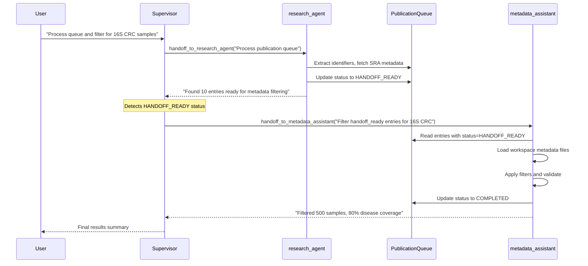
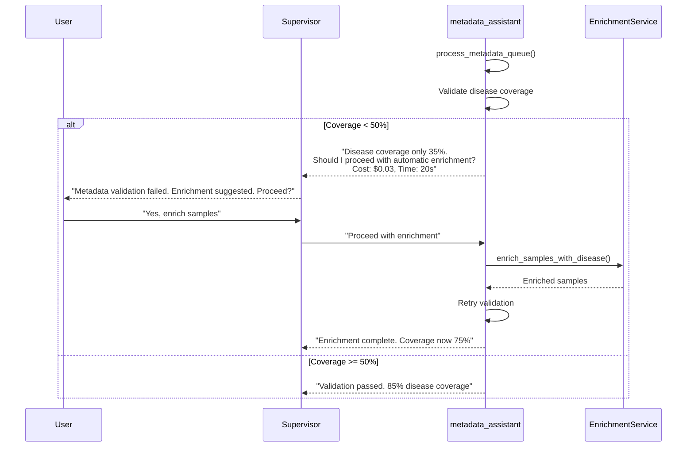
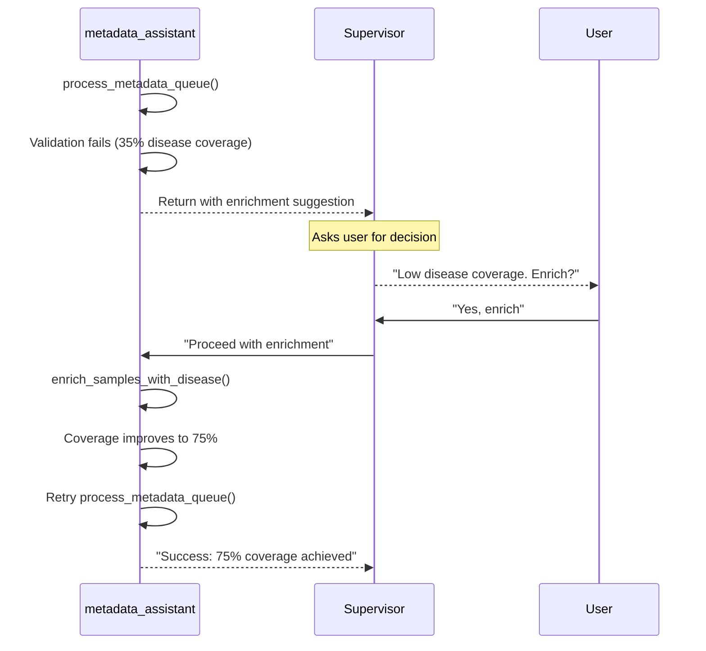
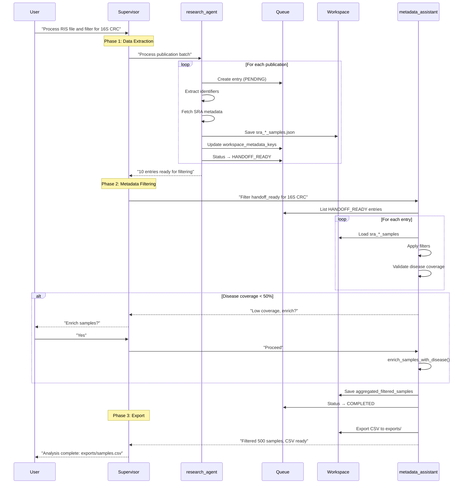

# Agent Coordination Patterns for Metadata Operations

This document describes how agents coordinate around metadata operations in the Lobster system, including handoff patterns, permission flows, and data sharing mechanisms.

## 1. Handoff Mechanism

### 1.1 Delegation Tool Pattern

The delegation pattern enables parent agents to invoke child agents as tools while maintaining centralized control through the supervisor.

```python
# In graph.py - Tool creation for delegation
def _create_agent_tool(agent_name: str, agent, tool_name: str, description: str):
    """Create a tool that invokes a sub-agent (Tool Calling pattern)."""

    @tool(tool_name, description=description)
    def invoke_agent(task_description: str) -> str:
        # Pass explicit agent name for proper callback attribution
        config = {
            "run_name": agent_name,
            "tags": [agent_name],
        }

        # Invoke the sub-agent with task as user message
        result = agent.invoke(
            {"messages": [{"role": "user", "content": task_description}]},
            config=config
        )

        # Extract and return final message content
        final_msg = result.get("messages", [])[-1]
        content = final_msg.content if hasattr(final_msg, "content") else str(final_msg)
        return content

    return invoke_agent
```

### 1.2 Handoff Flow: Research Agent → Metadata Assistant



### 1.3 Auto-Status Detection

The system automatically determines handoff readiness based on data completeness:

```python
# In publication_processing_service.py
is_ready_for_handoff = (
    bool(extracted_identifiers) and     # Has identifiers
    bool(dataset_ids) and               # Has dataset IDs
    bool(workspace_metadata_keys)       # Has workspace metadata files
)
# Status automatically transitions to HANDOFF_READY
```

## 2. Supervisor Permission Pattern

### 2.1 When Agents Request Permission

The metadata_assistant requests supervisor permission for expensive or irreversible operations:

```python
# Decision tree for permission requests
Agent Action → Decision:
├─ Fast, cheap, reversible (filter samples) → Auto-proceed
├─ Slow, expensive, irreversible (LLM enrichment) → Ask permission
├─ Ambiguous user intent (multiple strategies) → Ask clarification
└─ Clear failure (validation error) → Report + suggest recovery
```

### 2.2 Disease Enrichment Permission Flow

When disease validation fails (<50% coverage), metadata_assistant returns to supervisor with options:



### 2.3 Permission Request Format

Agents format permission requests with clear context and options:

```python
# Example permission request from metadata_assistant
permission_request = f"""
Disease validation failed: {disease_coverage*100:.1f}% coverage (required: 50%)

I can attempt automatic enrichment to extract disease from publication abstracts/methods.
- **Estimated time**: 20 seconds
- **Cost**: ~$0.03 in LLM tokens
- **Success rate**: 70-80% based on publication quality

Should I proceed with automatic enrichment?"""
```

### 2.4 Admin Superuser Override

For debugging, admin users can bypass all confirmations:

```python
# In supervisor.py
"""<Debugging>
**ADMIN SUPERUSER MODE**: If user identifies as 'ADMIN SUPERUSER',
bypass ALL confirmations and execute immediately:
- NO download confirmations needed
- NO metadata preview confirmations needed
- NO clarification questions
- Execute all operations immediately
"""
```

## 3. Data Sharing Between Agents

### 3.1 Pattern A: Workspace Files (Persistent)

**Mechanism**: File-based storage that survives session restarts
**Use Case**: Large datasets, cross-agent handoff

```python
# research_agent writes
workspace_service.write_content(
    MetadataContent(
        identifier="sra_PRJNA123_samples",
        data={"samples": sample_list},
        source="research_agent"
    ),
    ContentType.METADATA
)

# metadata_assistant reads
ws_data = workspace_service.read_content(
    "sra_PRJNA123_samples",
    content_type=ContentType.METADATA
)
samples = ws_data.data["samples"]
```

**File locations**:
- `workspace/metadata/sra_*_samples.json` - SRA sample metadata
- `workspace/metadata/pub_queue_*_metadata.json` - Publication metadata
- `workspace/exports/*.csv` - Final CSV exports

### 3.2 Pattern B: metadata_store (Session)

**Mechanism**: In-memory dictionary for fast within-session access
**Use Case**: Multiple tool calls within same agent session

```python
# metadata_assistant writes (in-memory)
data_manager.metadata_store["aggregated_filtered_samples"] = {
    "samples": all_samples,
    "filter_criteria": filter_criteria,
    "stats": stats
}

# metadata_assistant reads (later tool call)
if "aggregated_filtered_samples" in data_manager.metadata_store:
    cached = data_manager.metadata_store["aggregated_filtered_samples"]
    samples = cached["samples"]
```

**Characteristics**:
- Fast access (no disk I/O)
- Lost on session restart
- Good for intermediate results
- Shared across tools within same agent

### 3.3 Pattern C: Publication Queue (Stateful)

**Mechanism**: JSONL file with inter-process locking for concurrent safety
**Use Case**: Multi-agent workflow coordination

```python
# research_agent writes entry with status
queue.update_status(
    entry_id,
    PublicationStatus.HANDOFF_READY,
    handoff_status=HandoffStatus.READY_FOR_METADATA,
    workspace_metadata_keys=["sra_PRJNA123_samples"]
)

# metadata_assistant reads ready entries
entries = queue.list_entries(
    status=PublicationStatus.HANDOFF_READY
)

# metadata_assistant updates after processing
queue.update_status(
    entry_id,
    PublicationStatus.COMPLETED,
    handoff_status=HandoffStatus.METADATA_COMPLETE
)
```

**File locking for safety**:
```python
# In queue_storage.py
with queue_file_lock(thread_lock, lock_path):
    # Atomic write to prevent corruption
    atomic_write_jsonl(queue_path, entries, serializer)
```

### 3.4 Data Sharing Decision Matrix

| Pattern | Speed | Persistence | Size Limit | Use When |
|---------|-------|-------------|------------|----------|
| **Workspace Files** | Medium | ✓ Survives restart | Large (GB) | Cross-agent handoff, permanent storage |
| **metadata_store** | Fast | ✗ Session only | Medium (MB) | Within-agent caching, temporary results |
| **Publication Queue** | Medium | ✓ Survives restart | Small (KB) | Workflow state, status tracking |

## 4. Error Recovery Coordination

### 4.1 Scenario 1: Validation Failure with Recovery



### 4.2 Scenario 2: Missing Cached Files

```python
# Tier 1: Check in-memory cache
if workspace_key in data_manager.metadata_store:
    return data_manager.metadata_store[workspace_key]

# Tier 2: Check workspace files
try:
    ws_data = workspace_service.read_content(
        workspace_key,
        content_type=ContentType.METADATA
    )
    if ws_data:
        return ws_data.data
except FileNotFoundError:
    pass

# Tier 3: Return error with helpful suggestion
return f"""
❌ Key '{workspace_key}' not found in metadata store or workspace.

Did research_agent cache this data? Try:
1. Use get_content_from_workspace(workspace='metadata') to list available files
2. Check if research_agent completed processing
3. Verify the workspace_key is correct
"""
```

### 4.3 Scenario 3: Invalid Filter Criteria

```python
# Graceful degradation when filter parsing fails
parsed = metadata_filtering_service.parse_criteria(filter_criteria)

if not parsed or not any(parsed.values()):
    logger.warning(f"No valid filters detected in: {filter_criteria}")
    return f"""
⚠️ Warning: No valid filters detected in '{filter_criteria}'.
Proceeding without filtering - all samples will be included.

Valid filter examples:
- "16S human fecal" (amplicon + organism + source)
- "16S V4 CRC" (with region + disease)
- "shotgun mouse gut" (metagenomic + organism + source)
"""
```

## 5. Best Practices

### 5.1 Clear Handoff Messages

```python
# Good: Specific context and expectations
"Process handoff_ready entries and filter for 16S V4 human fecal CRC samples.
Expected: ~500 samples from 10 publications."

# Bad: Vague instruction
"Process the queue"
```

### 5.2 Error Reporting

```python
# Good: Actionable error with recovery options
f"""
❌ Disease validation failed: {coverage:.1f}% (required: 50%)

Options:
1. Automatic enrichment: enrich_samples_with_disease(workspace_key="{key}")
2. Manual mappings: Provide publication→disease mappings
3. Lower threshold: min_disease_coverage=0.3
4. Skip validation: min_disease_coverage=0.0
"""

# Bad: Generic error
"Validation failed"
```

### 5.3 Status Management

```python
# Always update queue status after processing
try:
    # Process entry
    result = process_entry(entry)

    # Success: Mark complete
    queue.update_status(
        entry.entry_id,
        PublicationStatus.COMPLETED,
        handoff_status=HandoffStatus.METADATA_COMPLETE
    )
except Exception as e:
    # Failure: Mark failed with reason
    queue.update_status(
        entry.entry_id,
        entry.status,
        handoff_status=HandoffStatus.METADATA_FAILED,
        error=str(e)
    )
```

### 5.4 Workspace Key Naming

```python
# Good: Descriptive, consistent naming
"sra_PRJNA123456_samples"       # SRA samples
"geo_GSE98765_samples"           # GEO samples
"aggregated_filtered_samples"   # Aggregated results
"pub_queue_pmid_12345_metadata" # Publication metadata

# Bad: Ambiguous names
"samples"
"data"
"results"
```

## 6. Complete Workflow Example

### Multi-Publication Metadata Processing



## 7. Summary

The agent coordination system provides:

1. **Clear handoff boundaries** via delegation tools and status transitions
2. **Permission control** for expensive operations through supervisor mediation
3. **Three-tier data sharing** (workspace files, memory cache, queue state)
4. **Graceful error recovery** with actionable suggestions
5. **Atomic operations** with file locking for concurrent safety

This architecture ensures reliable metadata processing across multiple agents while maintaining scientific rigor and user control over critical decisions.