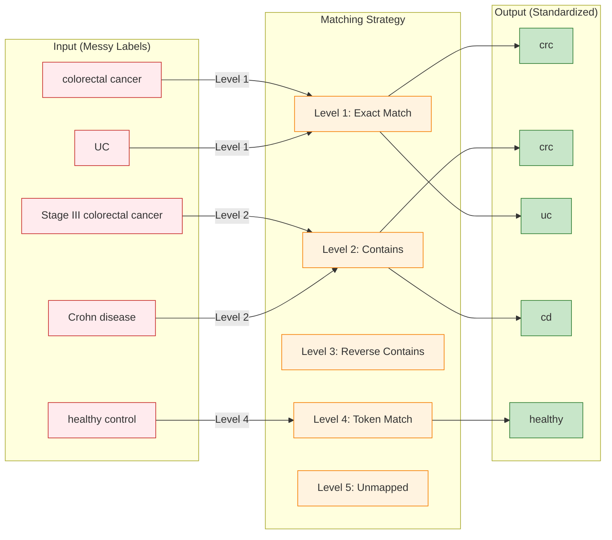

# Disease Standardization Tutorial Diagram

**Purpose**: Show 5-level fuzzy matching for tutorial video (Phase 4)

**Placement**: Tutorial video at ~5:30 timestamp (during disease standardization explanation)

---

## Diagram: 5-Level Disease Matching

---

## Alternative: Simpler Table View (Recommended for Video)

**If Mermaid is too complex, show as animated table:**

| Input (Messy) | Matching Level | Output (Standard) |
|---------------|----------------|-------------------|
| `"colorectal cancer"` | Level 1: Exact ✓ | **crc** |
| `"Stage III colorectal cancer"` | Level 2: Contains "colorectal cancer" ✓ | **crc** |
| `"UC"` | Level 1: Exact ✓ | **uc** |
| `"Crohn disease"` | Level 2: Contains "Crohn" ✓ | **cd** |
| `"healthy control"` | Level 4: Token "healthy" ✓ | **healthy** |

**Animation**: Reveal rows sequentially (1 per 2 seconds = 10 seconds total)

---

## Video Narration Script (for this diagram)

**Timing**: 5:30-5:50 (20 seconds)

> "The service uses 5-level fuzzy matching to standardize disease labels.
>
> Level 1 catches exact matches like 'UC' to 'uc'.
>
> Level 2 handles variations like 'Stage III colorectal cancer' by checking if the label contains known disease terms.
>
> This continues through 5 levels until all labels are standardized or marked unmapped.
>
> In our case, all 89 samples achieved 100% mapping success."

---

**Recommendation**: Use **table animation** instead of Mermaid for clearer video presentation.
