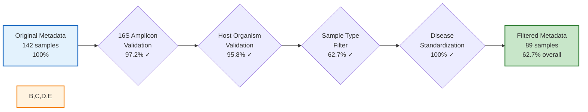

# Retention Rates Tutorial Diagram

**Purpose**: Show filtering cascade for tutorial video (Phase 5)

**Placement**: Tutorial video at ~6:50 timestamp (after Phase 4, explaining retention rates)

---

## Diagram: Sequential Filter Retention

**Source**: Reuses diagram from `47-microbiome-harmonization-workflow.md` (lines 1102-1113) with enhancements

---

## Video Narration Script (for this diagram)

**Timing**: 6:50-7:10 (20 seconds)

> "Let's understand what these retention rates mean.
>
> We started with 142 samples. After 16S validation, 138 passed—that's 97% retention, which is excellent.
>
> Host organism validation kept 136 samples—96% retention, also very good.
>
> Sample type filtering for fecal samples reduced us to 89—63% retention. This is expected because we're excluding gut tissue samples.
>
> Disease standardization maintained 89 samples with 100% mapping success.
>
> Final result: 63% overall retention, giving us a clean dataset of 89 human fecal 16S samples with standardized disease labels."

---

## What Retention Rates Mean

**Expected Ranges** (for context):

| Filter Type | Expected Retention | Interpretation |
|-------------|-------------------|----------------|
| **16S Validation** | 90-98% | Should be high if dataset is primarily microbiome |
| **Host Validation** | 95-99% | Should be very high if host is consistent |
| **Sample Type** | 50-80% | **Largest drop** - expected when filtering specific body sites |
| **Disease Standardization** | 95-100% | Mapping rate, not filtering rate |

**Red Flags**:
- 16S validation <80%: Dataset might not be primarily 16S
- Host validation <90%: Mixed host organisms or metadata issues
- Sample type <30%: Very specific criteria or metadata quality issues
- Disease standardization <80%: Many unmapped disease labels

**Best Practice**: Monitor each stage separately to identify bottlenecks.

---

**Recommendation**: Show this diagram with percentages annotated for each step (as shown above).
