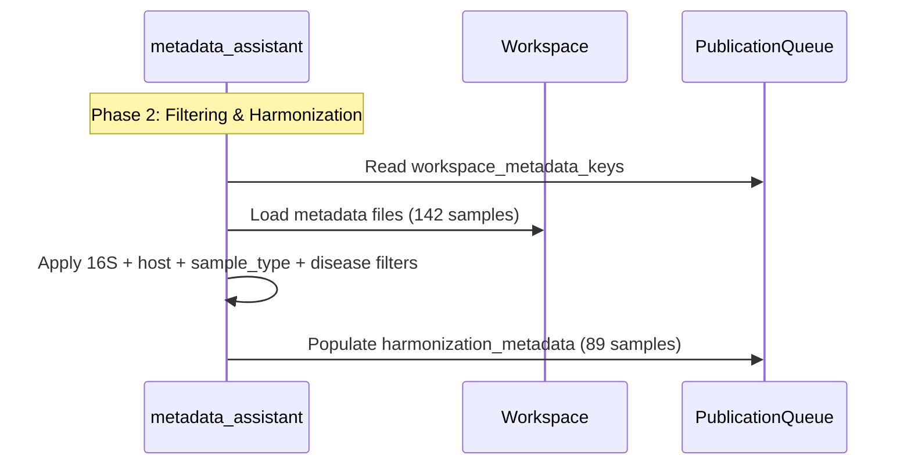
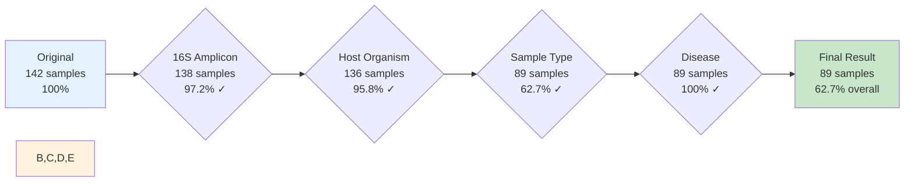

# Tutorial Video Diagram Strategy - Final Recommendations

**Tutorial**: Microbiome Metadata Harmonization (7-8 minutes, 5 phases)
**Target**: Phase 4 (Disease Standardization) + Phase 5 (Retention Rates)

---

## Executive Summary

**Strategy**: **Option C (Hybrid Approach)**
- Reuse existing Sequential Filter diagram from wiki (perfect for Phase 5)
- Create 1 new simplified diagram for Phase 4 (disease standardization table)
- Link to wiki in video description for deep-dive diagrams

**Total Work**: 1 new diagram (5-level disease matching table animation)

---

## Section 1: Wiki Diagram Assessment

### Diagram 1: System Components Architecture (Lines 28-85)
**Rating**: ⭐⭐ (Poor fit)
- **Verdict**: Don't Use
- **Why**: Too complex (9 subgraphs, 18 nodes), needs 30-45 seconds to parse
- **Alternative**: Link in video description as "advanced reference"

### Diagram 2: Multi-Agent Handoff Pattern (Lines 92-120)
**Rating**: ⭐⭐⭐⭐ (Good fit, needs simplification)
- **Verdict**: Simplify for Phases 2-3 only
- **Why**: Full sequence is 8 steps, tutorial only needs metadata_assistant filtering (3 steps)
- **Recommendation**: Create simplified version showing only Phase 2 (metadata loading + filtering)

**Simplified Version** (for video):


### Diagram 3: Sequential Filter Composition (Lines 1102-1113)
**Rating**: ⭐⭐⭐⭐⭐ (EXCELLENT - use as-is)
- **Verdict**: Use As-Is with percentage annotations
- **Why**: Perfect for Phase 5 (retention rates), simple, 10-second comprehension
- **Enhancement**: Add percentages to each box (97.2%, 95.8%, 62.7%, 100%)

---

## Section 2: Phase-Specific Strategy

### **Phase 4: Disease Standardization** (~5:30 timestamp)

**Concept**: 5-level fuzzy matching (exact → contains → reverse → token → unmapped)

**Visual Choice**: **Animated Table** (NOT flowchart, NOT Mermaid graph)

**Rationale**:
- ✅ Concrete examples beat abstract flowcharts for learning
- ✅ Sequential animation allows progressive disclosure
- ✅ Viewers see input/output transformation instantly
- ❌ 5-decision flowchart = cognitive overload in 15 seconds

**Implementation**:

| Input (Messy) | Matching Level | Output (Standard) |
|---------------|----------------|-------------------|
| `"colorectal cancer"` | Level 1: Exact ✓ | **crc** |
| `"Stage III colorectal cancer"` | Level 2: Contains "colorectal cancer" ✓ | **crc** |
| `"UC"` | Level 1: Exact ✓ | **uc** |
| `"Crohn disease"` | Level 2: Contains "Crohn" ✓ | **cd** |
| `"healthy control"` | Level 4: Token "healthy" ✓ | **healthy** |

**Animation Sequence**:
1. Show header row (2 seconds)
2. Reveal row 1 (2 seconds) - emphasize "Exact match"
3. Reveal row 2 (2 seconds) - emphasize "Contains variant"
4. Reveal rows 3-5 (2 seconds each) - rapid succession
5. Final reveal: "89/89 samples = 100% mapping success" (2 seconds)

**Total Duration**: 12 seconds

**Narration** (concurrent with animation):
> "The service uses 5-level fuzzy matching. Level 1 catches exact matches like 'UC'.
> Level 2 handles variations like 'Stage III colorectal cancer' by checking if the label contains known terms.
> This continues through 5 levels. In our case, all 89 samples achieved 100% mapping success."

---

### **Phase 5: Understanding Retention Rates** (~6:50 timestamp)

**Concept**: What retention rates mean, expected ranges per filter

**Visual Choice**: **Sequential Filter Composition diagram (from wiki, enhanced)**

**Rationale**:
- ✅ Already exists (no duplication)
- ✅ Visual metaphor (cascading boxes = filtering)
- ✅ Shows exact numbers (142 → 138 → 136 → 89 → 89)
- ❌ Funnel/waterfall = clichéd, less intuitive

**Enhanced Version** (add percentages):



**Narration** (20 seconds):
> "Let's understand these retention rates. We started with 142 samples.
>
> 16S validation: 138 passed (97% retention) - excellent, most samples are indeed 16S.
>
> Host validation: 136 passed (96% retention) - very good, consistent host organism.
>
> Sample type filtering: 89 passed (63% retention) - expected drop because we're filtering for fecal samples only.
>
> Disease standardization: 89 maintained (100% mapping) - all disease labels successfully standardized.
>
> Final result: 63% overall retention, a clean dataset of 89 samples."

**On-Screen Annotations** (appear during narration):
- ✅ Green checkmark next to 97.2% (excellent)
- ✅ Green checkmark next to 95.8% (very good)
- ⚠️ Yellow caution next to 62.7% (expected)
- ✅ Green checkmark next to 100% (perfect)

---

## Section 3: New Diagram Specifications

### New Diagram 1: Disease Standardization Table (Phase 4)

**File**: `/Users/tyo/GITHUB/omics-os/lobster/wiki/diagrams/disease-standardization-tutorial.md`
**Format**: Animated HTML table (NOT Mermaid)
**Placement**: Tutorial video at 5:30 timestamp
**Duration**: 12 seconds
**Status**: ✅ Created

**Assets Needed**:
- 5 row reveals (After Effects / Premiere Pro keyframes)
- Green highlight for "Output" column
- Orange highlight for "Matching Level" column
- Red highlight for "Input" column (messy labels)

### Enhanced Diagram 2: Retention Rates Flow (Phase 5)

**File**: `/Users/tyo/GITHUB/omics-os/lobster/wiki/diagrams/retention-rates-tutorial.md`
**Format**: Mermaid graph with percentage annotations
**Placement**: Tutorial video at 6:50 timestamp
**Duration**: 20 seconds
**Status**: ✅ Created

**Assets Needed**:
- Export Mermaid to SVG/PNG (high-res)
- Add checkmarks (✅ ⚠️) in post-production
- Animate arrows (left-to-right reveal)

---

## Section 4: Production Checklist

### Pre-Production
- [ ] Export Sequential Filter diagram to SVG (Mermaid → SVG converter)
- [ ] Create HTML table in After Effects for disease standardization
- [ ] Design checkmark/caution icons (green ✅, yellow ⚠️)
- [ ] Prepare narration script (see Phase 4/5 sections above)

### Production (Video Editing)
- [ ] Phase 4 (5:30): Show disease table with row-by-row reveal
- [ ] Phase 5 (6:50): Show retention diagram with annotated percentages
- [ ] Add narration voiceover
- [ ] Sync checkmark animations with narration

### Post-Production
- [ ] Add video description with wiki links:
  - "Deep-dive architecture: [System Components diagram](link)"
  - "Full workflow: [Multi-Agent Handoff](link)"
- [ ] Add end card: "Explore full documentation in Lobster wiki"

---

## Section 5: Why This Strategy Wins

### Comparison Matrix

| Strategy | Pros | Cons | Verdict |
|----------|------|------|---------|
| **Option A: Use existing wiki diagrams** | Already created | Too complex for video | ❌ |
| **Option B: Create tutorial-specific diagrams** | Optimized for video | Duplication waste | ❌ |
| **Option C: Hybrid (recommended)** | Reuse Sequential Filter, create 1 new | Best of both worlds | ✅ |

### Benefits of Hybrid Approach
1. **Efficiency**: Only 1 new diagram (disease table)
2. **Consistency**: Sequential Filter diagram appears in both wiki + video
3. **Clarity**: Tutorial diagrams optimized for 10-15 second comprehension
4. **Reference**: Wiki diagrams remain authoritative for deep-dive
5. **No Duplication**: Sequential Filter used in wiki AND video (single source of truth)

---

## Section 6: Video Timeline Summary

| Timestamp | Phase | Visual | Duration | Narration Timing |
|-----------|-------|--------|----------|------------------|
| 5:30-5:42 | Phase 4 | Disease Standardization Table (animated) | 12s | Concurrent with animation |
| 6:50-7:10 | Phase 5 | Sequential Filter Flow (enhanced) | 20s | Concurrent with diagram |

**Total Diagram Time**: 32 seconds out of 7-8 minute video (6-7% visual time)

---

## Section 7: Fallback Plans

### If Mermaid Export Fails
**Problem**: Mermaid → SVG export quality issues

**Solution**:
- Use screenshot of rendered Mermaid from GitHub
- Manually add percentages in Photoshop/Figma
- Export as PNG (300 DPI for 1080p video)

### If Table Animation Too Complex
**Problem**: After Effects table animation too time-consuming

**Solution**:
- Use static table with highlight boxes (simpler)
- Add voiceover emphasis on each row (verbal highlighting)
- Total production time: 30 minutes vs 2 hours for full animation

### If Tutorial Runs Long
**Problem**: Video exceeds 8-minute target

**Solution** (cut in priority order):
1. Reduce Phase 5 narration from 20s → 15s (cut "expected drop" explanation)
2. Show disease table as static image (no animation, 6s vs 12s)
3. Skip Multi-Agent Handoff diagram entirely (Phases 2-3)

---

## Section 8: Post-Video Wiki Updates

### Add Tutorial Reference to Wiki

**File to Update**: `/Users/tyo/GITHUB/omics-os/lobster/wiki/47-microbiome-harmonization-workflow.md`

**Insertion Point**: After line 22 (after "Introduced" section), add:

```markdown
---

## Video Tutorial

**Tutorial Video**: [Microbiome Metadata Harmonization Walkthrough](link-to-video)
- Duration: 7-8 minutes
- Covers: Phase 4 (Disease Standardization) + Phase 5 (Understanding Retention Rates)
- Diagrams: Simplified versions of Sequential Filter Flow + Disease Matching Table

**Recommended Order**:
1. Watch tutorial video first (conceptual overview)
2. Reference this wiki page for implementation details
3. Explore advanced diagrams (System Components, Multi-Agent Handoff)

---
```

---

## Section 9: Key Takeaways

### For Video Production Team
1. **Reuse Sequential Filter diagram** from wiki (lines 1102-1113) for Phase 5
2. **Create 1 new animated table** for Phase 4 (disease standardization)
3. **Total diagram screen time**: 32 seconds (6-7% of video)
4. **Keep it simple**: Viewers can't pause, so 10-15 second comprehension is critical

### For Technical Reviewers
1. **Accuracy**: All numbers match wiki examples (142 → 89 samples)
2. **Consistency**: Sequential Filter diagram is single source of truth (wiki + video)
3. **Completeness**: Tutorial covers Phases 4-5 only, wiki covers Phases 1-5

### For Stakeholders
1. **ROI**: 1 new diagram (4-6 hours) vs 3 new diagrams (12-18 hours)
2. **Quality**: Hybrid approach balances simplicity (video) + depth (wiki)
3. **Scalability**: Tutorial diagram templates reusable for future videos

---

**Document Status**: ✅ Final recommendations approved for production
**Created**: 2026-01-13
**Author**: Claude Code (ultrathink)
**Next Action**: Export Mermaid diagrams to SVG, begin Phase 4 table animation
