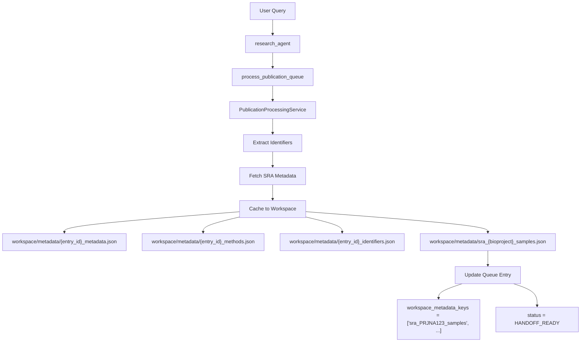
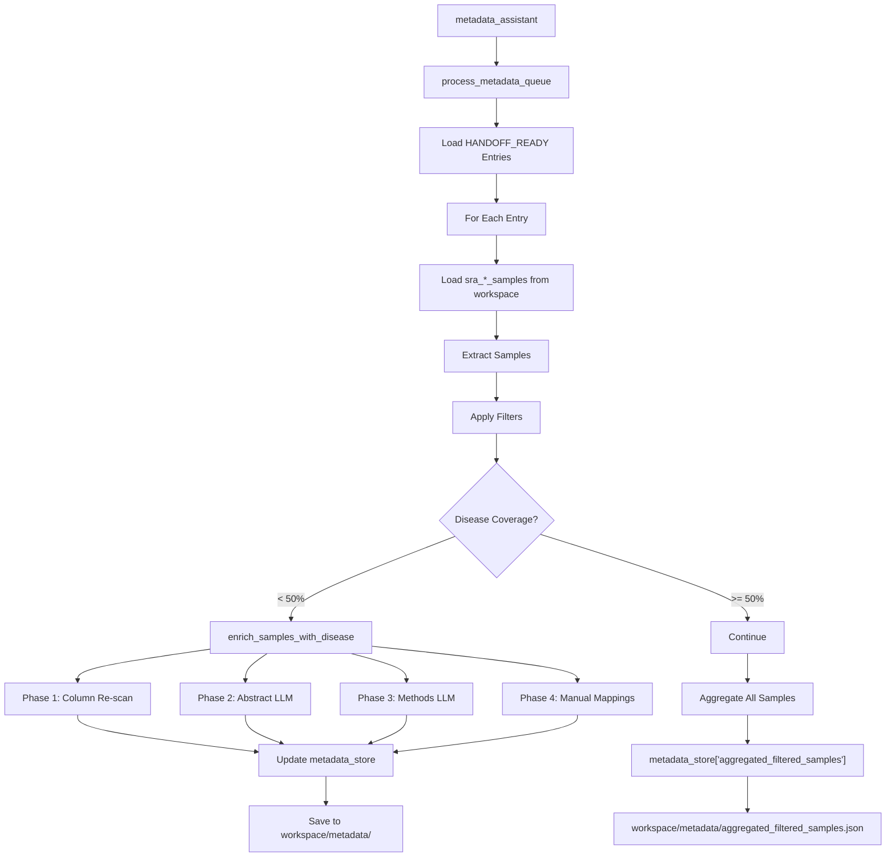

# Metadata Update Workflows

This document traces the complete metadata lifecycle from creation through enrichment to export, documenting how metadata flows through Lobster's multi-agent system.

## 1. Creation Flow (research_agent → workspace files)

The research_agent creates metadata files in the workspace when processing publication queue entries:



### Files Created

| File | Contents | Purpose |
|------|----------|---------|
| `{entry_id}_metadata.json` | Abstract, authors, journal, year | Publication context for enrichment |
| `{entry_id}_methods.json` | Methods section text | Alternative disease extraction source |
| `{entry_id}_identifiers.json` | Extracted database IDs | Tracking identifiers found |
| `sra_{bioproject}_samples.json` | Sample-level metadata from SRA | Primary filterable data |

### Key Code Locations

- **Creation**: `services/orchestration/publication_processing_service.py` lines 1236-1296
- **SRA Fetch**: Lines 1165-1233 (calls SRA metadata API)
- **Status Update**: Lines 1317-1349 (sets HANDOFF_READY when has samples)

## 2. Update Flow (metadata_assistant transformations)

The metadata_assistant performs multi-phase transformations on cached metadata:



### Transformation Phases

| Phase | Method | Coverage Gain | Confidence |
|-------|--------|---------------|------------|
| **Phase 1** | Column re-scan | +5-10% | 100% (direct data) |
| **Phase 2** | Abstract LLM extraction | +20-40% | 80%+ required |
| **Phase 3** | Methods LLM extraction | +10-20% | 80%+ required |
| **Phase 4** | Manual mappings | Variable | 100% (user-provided) |

### Storage Locations

```python
# In-memory (session only)
data_manager.metadata_store[key] = {
    "samples": [...],
    "filter_criteria": "16S human fecal",
    "stats": {...}
}

# Persistent (survives restart)
workspace/metadata/{key}.json
```

### Key Code Locations

- **process_metadata_queue**: `agents/metadata_assistant.py` lines 2433-2955
- **enrich_samples_with_disease**: Lines 3012-3237
- **Phase implementations**: Lines 260-574 (helper functions)
- **Storage**: Lines 2824-2846 (dual storage pattern)

## 3. Read Access Matrix

Different agents have specific read patterns for metadata:

| Agent | Reads | Does NOT Read | Purpose |
|-------|-------|---------------|---------|
| **research_agent** | publication_queue.jsonl<br>download_queue.jsonl | Sample metadata files<br>metadata_store | Check queue status |
| **metadata_assistant** | publication_queue.jsonl<br>workspace_metadata_keys<br>sra_*_samples.json<br>{entry_id}_metadata.json<br>{entry_id}_methods.json<br>metadata_store | download_queue entries | Process & enrich metadata |
| **data_expert** | download_queue.jsonl | metadata files<br>publication_queue | Execute downloads only |
| **supervisor** | Queue statuses | Metadata content | Route to specialists |

### Access Patterns

```python
# metadata_assistant reading workspace files
metadata_path = data_manager.workspace_path / "metadata" / f"{pub_id}_metadata.json"
with open(metadata_path) as f:
    metadata = json.load(f)

# metadata_assistant using metadata_store (fast path)
if workspace_key in data_manager.metadata_store:
    data = data_manager.metadata_store[workspace_key]  # <0.001ms
else:
    # Slow path: load from disk (1-10ms)
    data = workspace_service.read_content(...)
```

## 4. Persistence Boundaries

Understanding what data survives session restart is critical:

### ✅ Persists (survives restart)

```
workspace/
├── metadata/
│   ├── {entry_id}_metadata.json           # Publication abstracts
│   ├── {entry_id}_methods.json            # Methods sections
│   ├── {entry_id}_identifiers.json        # Extracted IDs
│   ├── sra_{bioproject}_samples.json      # Sample metadata
│   └── aggregated_filtered_samples.json   # Processed results
├── publication_queue.jsonl                # Queue entries
├── download_queue.jsonl                   # Download tasks
└── .session.json                          # Conversation state
```

### ❌ Session-only (lost on restart)

```python
# In-memory structures
data_manager.metadata_store = {}    # Metadata cache
data_manager.modalities = {}        # AnnData objects
llm_context = []                     # Conversation context
```

### Recovery Pattern

```python
# On session restart, metadata_assistant must reload
if not data_manager.metadata_store.get(key):
    # Reload from workspace
    path = workspace_path / "metadata" / f"{key}.json"
    if path.exists():
        with open(path) as f:
            data_manager.metadata_store[key] = json.load(f)
```

## 5. Common Mistakes & Corrections

### ❌ Mistake 1: Update without persistence

```python
# WRONG: Updates lost on restart
data_manager.metadata_store[key] = new_data
```

### ✅ Correction 1: Dual storage pattern

```python
# RIGHT: Update both in-memory and disk
data_manager.metadata_store[key] = new_data

# Persist to workspace
workspace_service = WorkspaceContentService(data_manager)
content = MetadataContent(
    identifier=key,
    data=new_data,
    ...
)
workspace_service.write_content(content, ContentType.METADATA)
```

### ❌ Mistake 2: In-place modification without flagging

```python
# WRONG: Changes not tracked
samples = data_manager.metadata_store[key]['samples']
for s in samples:
    s['disease'] = 'crc'
# Changes made but not marked as updated
```

### ✅ Correction 2: Explicit update tracking

```python
# RIGHT: Track modifications
samples = data_manager.metadata_store[key]['samples']
for s in samples:
    s['disease'] = 'crc'
    s['enrichment_timestamp'] = datetime.now().isoformat()
    s['disease_source'] = 'manual'

# Re-assign to trigger update detection
data_manager.metadata_store[key]['samples'] = samples
# Then persist as shown above
```

### ❌ Mistake 3: Reading from disk when cached

```python
# WRONG: Slow disk read (1-10ms)
with open(workspace_path / "metadata" / f"{key}.json") as f:
    data = json.load(f)
```

### ✅ Correction 3: Check cache first

```python
# RIGHT: Fast memory access (<0.001ms)
if key in data_manager.metadata_store:
    data = data_manager.metadata_store[key]
else:
    # Only read from disk if not cached
    path = workspace_path / "metadata" / f"{key}.json"
    with open(path) as f:
        data = json.load(f)
        # Cache for future access
        data_manager.metadata_store[key] = data
```

### ❌ Mistake 4: Wrong queue status for filtering

```python
# WRONG: No samples will be found
process_metadata_queue(status_filter="completed")  # Already processed
process_metadata_queue(status_filter="metadata_enriched")  # No SRA data
```

### ✅ Correction 4: Use correct status

```python
# RIGHT: Only HANDOFF_READY has workspace files
process_metadata_queue(status_filter="handoff_ready")
```

## 6. Complete Example Workflow

Here's an end-to-end example of metadata flowing through the system:

```python
# Step 1: User query triggers research_agent
"Search PubMed for '16S human CRC microbiome' and extract metadata"

# Step 2: research_agent creates workspace files
# Creates: workspace/metadata/pub_queue_pmid_12345_metadata.json
{
    "content": "Abstract text...",
    "authors": ["Smith J", "Doe A"],
    "year": 2023,
    "journal": "Nature",
    "extracted_at": "2024-01-15T10:30:00"
}

# Creates: workspace/metadata/sra_PRJNA123_samples.json
{
    "samples": [
        {
            "run_accession": "SRR001",
            "biosample": "SAMN001",
            "host_phenotype": "colorectal cancer",  # 20% have disease
            "organism": "human gut metagenome",
            ...
        }
    ]
}

# Updates: publication_queue.jsonl
{
    "entry_id": "pub_queue_pmid_12345",
    "status": "handoff_ready",
    "workspace_metadata_keys": ["sra_PRJNA123_samples"],
    ...
}

# Step 3: metadata_assistant processes
process_metadata_queue(
    status_filter="handoff_ready",
    filter_criteria="16S human fecal CRC"
)

# Loads samples from workspace
samples = load("workspace/metadata/sra_PRJNA123_samples.json")
# 142 samples loaded, 20% have disease annotation

# Enrichment triggered (< 50% coverage)
enrich_samples_with_disease("sra_PRJNA123_samples")

# Phase 1: Re-scans columns (+10 samples with disease)
# Phase 2: LLM extracts from abstract (+85 samples)
# Coverage now 85% > 50% threshold ✓

# Updates metadata_store
data_manager.metadata_store["aggregated_filtered_samples"] = {
    "samples": enriched_samples,  # 89 samples after filtering
    "filter_criteria": "16S human fecal CRC",
    "stats": {
        "total_extracted": 142,
        "total_after_filter": 89,
        "disease_coverage": 0.85
    }
}

# Persists to workspace
workspace/metadata/aggregated_filtered_samples.json

# Step 4: Export to CSV
write_to_workspace(
    identifier="aggregated_filtered_samples",
    workspace="exports",
    output_format="csv",
    export_mode="rich"
)

# Creates: workspace/exports/aggregated_filtered_samples_2024-01-15.csv
# 28 columns including publication context, sample metadata, download URLs
```

## 7. Performance Considerations

### Cache Hit Rates

- **metadata_store**: ~95% hit rate during active session
- **Workspace files**: Read once per session, then cached
- **LLM extraction**: Cached per publication (avoid duplicate calls)

### Optimization Strategies

1. **Batch loading**: Load all samples for a publication at once
2. **Lazy loading**: Only load metadata when needed
3. **Memory limits**: Clear old entries from metadata_store if > 1000 items
4. **Parallel processing**: Use `parallel_workers=4` for large queues

### Timing Benchmarks

| Operation | Time | Notes |
|-----------|------|-------|
| metadata_store access | <0.001ms | In-memory dict |
| Workspace file read | 1-10ms | JSON parsing overhead |
| LLM extraction | 1-3s | Per publication |
| process_metadata_queue (100 entries) | 30-60s | With parallel=4 |
| CSV export (1000 samples) | 0.5-1s | Pandas DataFrame |

## 8. Troubleshooting Guide

### Issue: "0 samples extracted"

**Cause**: Wrong queue status filter
**Fix**: Use `status_filter="handoff_ready"`

### Issue: "Disease coverage < 50%"

**Cause**: Missing disease annotations
**Fix**: Run `enrich_samples_with_disease()` with appropriate mode

### Issue: "Metadata not found after restart"

**Cause**: Only saved to metadata_store, not workspace
**Fix**: Always use dual storage pattern (memory + disk)

### Issue: "Slow metadata operations"

**Cause**: Reading from disk instead of cache
**Fix**: Check metadata_store first, only read disk if miss

### Issue: "Inconsistent sample counts"

**Cause**: Filters applied at different stages
**Fix**: Check filter_criteria at each step, use consistent filters

## Summary

The metadata workflow in Lobster follows a clear pattern:

1. **Creation**: research_agent → workspace files
2. **Enrichment**: metadata_assistant → transformations → dual storage
3. **Aggregation**: process_metadata_queue → combined datasets
4. **Export**: write_to_workspace → CSV/JSON files

Key principles:
- Always persist important data (dual storage pattern)
- Check cache before disk reads (performance)
- Use correct queue status (handoff_ready for filtering)
- Track modifications with timestamps and sources
- Validate coverage thresholds before proceeding

This architecture ensures metadata flows efficiently through the system while maintaining persistence and allowing for complex multi-phase enrichment operations.